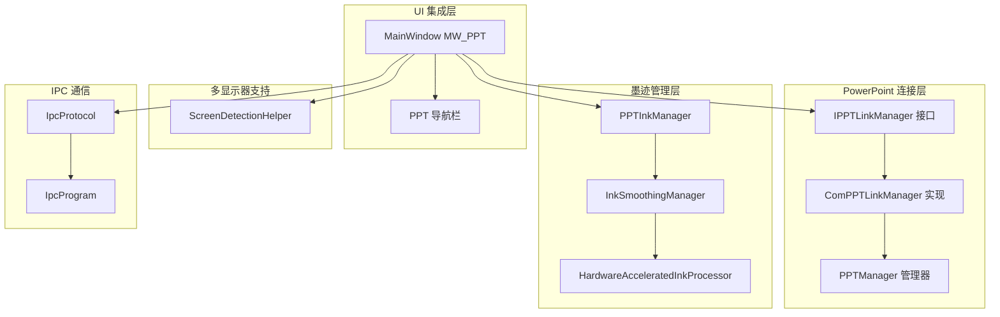
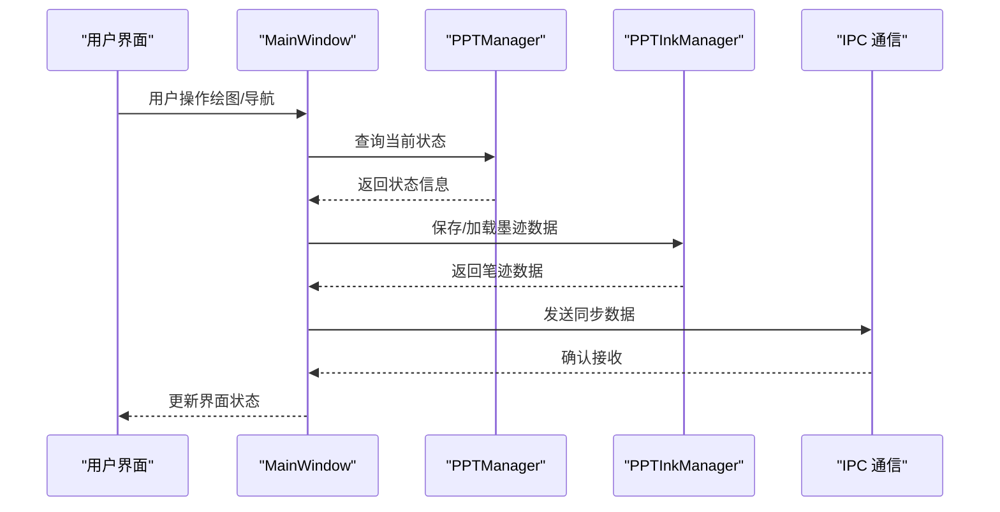
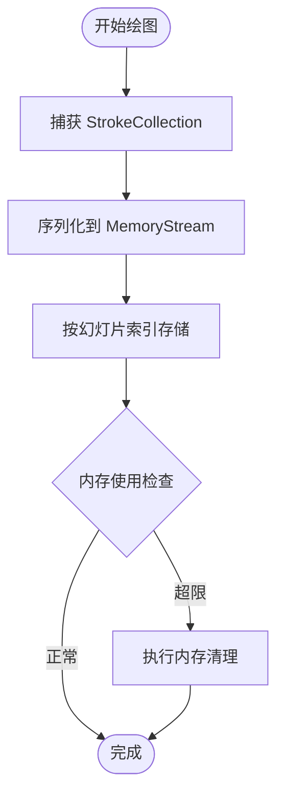
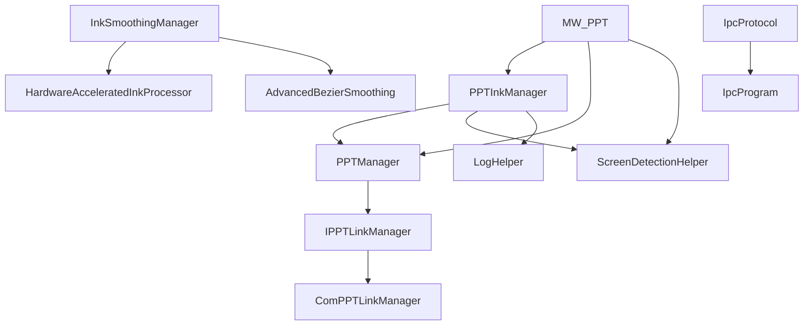

# 同步机制实现

## 简介
本文件详细阐述 PowerPoint 同步机制的实现，重点围绕 PPTInkManager 的工作机制，包括笔迹数据的捕获、转换和传输过程。文档还涵盖了实时同步的技术实现（笔迹数据的序列化、网络传输和接收端的数据还原）、幻灯片导航同步机制（当前幻灯片状态的获取、导航事件的监听和同步响应）、多显示器支持的实现方案（屏幕检测、坐标转换和显示区域映射），以及同步性能优化策略（数据压缩、批量传输和延迟补偿机制）。同时提供了同步延迟处理和数据一致性保障措施。

## 项目结构
该同步机制涉及多个层次的组件协作：
- PowerPoint 连接与事件管理：通过 PPTManager 和 IPPTLinkManager 接口实现，负责与 PowerPoint 的连接、事件监听和状态查询。
- 墨迹数据管理：PPTInkManager 负责按幻灯片保存/加载墨迹、自动保存与内存管理。
- 用户界面集成：MainWindow 中的 MW_PPT.cs 负责与 UI 的交互，包括导航栏、按钮和状态同步。
- 多显示器支持：ScreenDetectionHelper 提供屏幕检测和坐标转换能力。
- 性能优化：HardwareAcceleratedInkProcessor 和 InkSmoothingManager 提供硬件加速和平滑处理。
- IPC 协议：InkCanvas.IACoreHelper 提供跨进程通信协议，支持共享内存和管道通信。

## 核心组件
本节深入分析核心组件的工作原理和实现细节：

### PPTInkManager - 墨迹管理器
PPTInkManager 是同步机制的核心组件，负责：
- **笔迹数据的捕获与序列化**：将 StrokeCollection 序列化到 MemoryStream 中，支持按幻灯片维度的存储。
- **内存管理与自动保存**：维护内存流数组，实现内存清理和自动保存功能。
- **墨迹锁定机制**：防止翻页时的墨迹冲突，提供快速切换保护。
- **持久化存储**：支持将墨迹数据保存到磁盘文件，文件扩展名为 .icstk。

关键特性：
- 使用内存流数组按幻灯片索引存储墨迹数据
- 实现内存使用监控和自动清理机制
- 提供笔迹数据的加载、保存和强制保存功能
- 支持演示文稿级别的自动保存和加载

## 架构概览
同步机制采用分层架构设计，确保各组件职责清晰、耦合度低：

## 详细组件分析

### 笔迹数据捕获与序列化流程

## 依赖关系分析

## 性能考虑
同步机制在性能方面采用了多项优化策略：

### 内存管理优化
- **内存使用监控**：实时监控总内存使用量，超过阈值（100MB）时触发清理
- **智能清理策略**：仅清理非活跃幻灯片的墨迹数据，保留当前锁定和最近切换的页面
- **定期清理机制**：每5分钟检查一次内存使用情况

### 并发处理优化
- **异步处理**：使用 AsyncAdvancedBezierSmoothing 支持异步并发处理
- **信号量控制**：通过 SemaphoreSlim 控制最大并发任务数
- **硬件加速**：利用 GPU 进行曲线拟合和平滑处理

### 数据传输优化
- **批量传输**：支持批量保存和加载墨迹数据
- **增量更新**：仅在数据发生变化时进行传输
- **压缩机制**：通过高效的序列化减少数据体积

## 故障排除指南
### 常见问题及解决方案

#### PowerPoint 连接问题
- **症状**：无法连接到 PowerPoint
- **原因**：COM 对象不可用或权限不足
- **解决方案**：检查 PowerPoint 是否正在运行，确认 COM 组件注册

#### 墨迹数据丢失
- **症状**：切换幻灯片时墨迹消失
- **原因**：墨迹锁定机制导致的写入限制
- **解决方案**：检查 InkLockMilliseconds 设置，适当调整锁定时间

#### 内存溢出
- **症状**：应用内存使用持续增长
- **原因**：内存清理机制未及时触发
- **解决方案**：检查内存使用阈值设置，确认清理逻辑正常执行

## 结论
该 PowerPoint 同步机制实现了完整的笔迹数据管理、实时同步和多显示器支持。通过分层架构设计，系统具备良好的可维护性和扩展性。核心优势包括：

1. **可靠的墨迹管理**：PPTInkManager 提供了完善的笔迹数据捕获、序列化和持久化能力
2. **实时同步支持**：通过 IPC 协议实现高效的数据传输和接收
3. **智能内存管理**：自动监控和清理机制确保系统稳定性
4. **性能优化**：硬件加速和平滑处理提升用户体验
5. **多显示器兼容**：完善的屏幕检测和坐标转换支持

该实现为 PowerPoint 同步场景提供了完整的技术解决方案，具有良好的性能表现和可靠性保障。