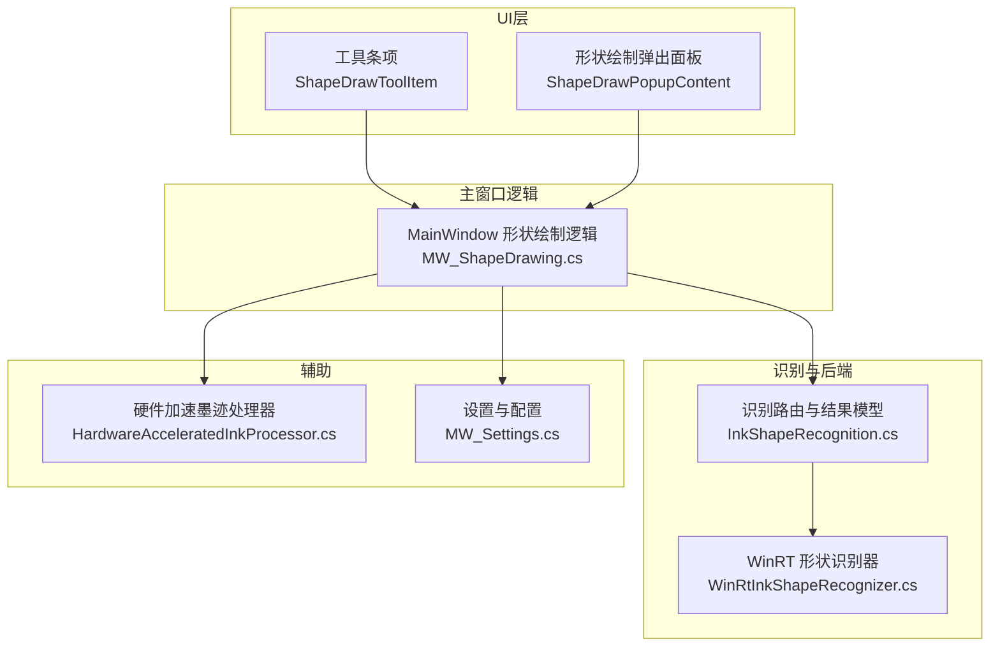
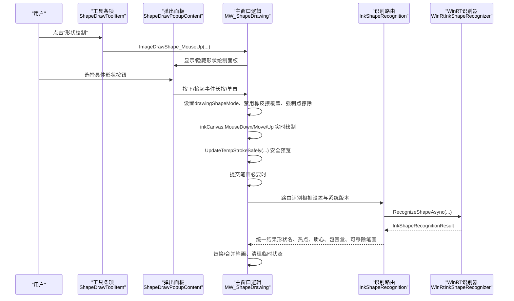
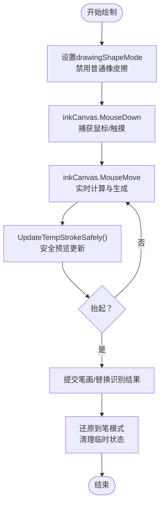
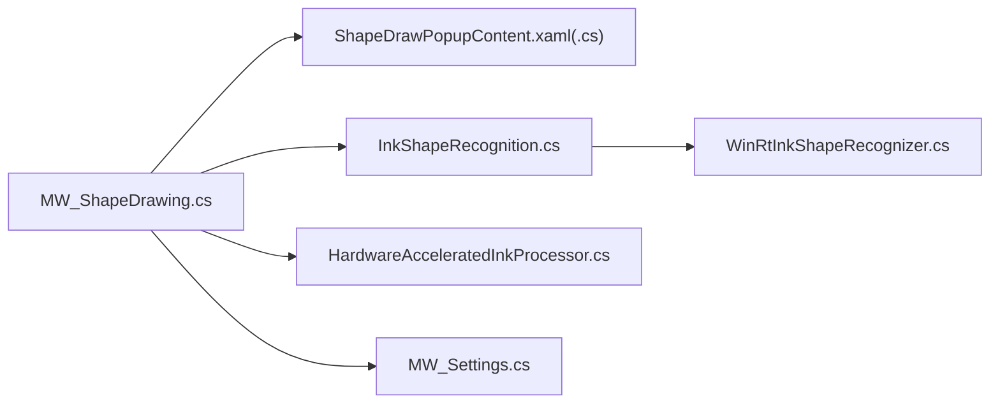

# 形状绘制功能

## 简介
本文件面向 InkCanvasForClass 的“形状绘制”功能，系统性阐述几何图形绘制的实现原理、形状识别技术的工作机制、WinRT 形状识别器的集成与配置、交互体验设计（实时预览、约束绘制、对齐辅助）、自定义形状扩展与图形库管理，以及性能优化与内存管理策略。读者无需深入底层即可理解整体工作流程。

## 项目结构
围绕形状绘制的关键代码分布在以下模块：
- 主窗口交互与绘制逻辑：MainWindow 的形状绘制相关方法
- 形状识别路由与结果模型：识别引擎模式选择与统一结果封装
- WinRT 形状识别器：基于 Windows.UI.Input.Inking.Analysis 的识别实现
- UI 弹出面板与工具条项：形状绘制按钮、弹出面板、工具条集成
- 硬件加速墨迹处理：GPU 加速的平滑与渲染优化
- 设置与配置：识别引擎模式、坐标单位标注等

## 核心组件
- 形状绘制模式与交互控制：通过按钮事件与长按触发，切换到“无编辑模式”，禁用普通橡皮擦覆盖，强制使用“点擦除”以实现形状绘制的遮挡与预览。
- 几何绘制算法：针对不同形状（直线、箭头、矩形、椭圆、圆形、平行线、坐标系、长方体等）采用参数化生成点列或分段笔画集合，结合实时预览与安全更新机制减少闪烁。
- 形状识别路由：根据系统版本与用户设置自动选择 WinRT 或 IACore 后端，统一输出识别结果模型，供后续纠正与替换。
- WinRT 形状识别器：封装 InkAnalyzer，将 WPF Stroke 转换为 WinRT InkStroke，执行分析并提取主绘图区域、热点点集、质心与包围盒，返回可移除的笔画集合。
- 硬件加速：利用 RenderTargetBitmap 与 DrawingVisual 进行 GPU 加速的曲线平滑与渲染，提升实时绘制与预览性能。
- 设置与配置：识别引擎模式、坐标单位标注、多点触控模式等影响绘制行为的全局设置。

## 架构总览
形状绘制从 UI 触发到识别与提交的端到端流程如下：

## 详细组件分析

### 几何绘制算法与交互体验
- 模式切换与长按触发：通过长按 500ms 标记“长按选中”，设置 drawingShapeMode 并强制点擦除模式，避免误擦除；单击按钮则即时进入对应形状模式。
- 实时预览与安全更新：使用节流（约 60fps）与 UI 线程调度，先添加新临时笔画再删除旧笔画，减少闪烁；支持临时笔画与临时笔画集合两类更新。
- 约束绘制与对齐辅助：
  - 直线/箭头/平行线：按角度阈值约束（如水平/垂直），并生成多条平行线段。
  - 矩形/正方形/平行四边形：按对角线生成四条线段，支持中心矩形与中心椭圆。
  - 椭圆/圆：参数化生成点列，支持上下半椭圆分别绘制；虚线椭圆拆分为多个短段。
  - 坐标系：按轴向生成单位刻度标记，支持三维 Z 轴。
  - 长方体：两阶段绘制（先正面矩形，再深度与侧面连线，含虚线体现透视）。
- 提交与还原：绘制完成后按模式还原到“笔模式”，清理临时状态，恢复多点触控与相关设置。

## 依赖关系分析
- 主窗口依赖 UI 事件与弹出面板，负责状态机与绘制算法。
- 识别路由依赖系统版本判断与用户设置，决定后端选择。
- WinRT 识别器依赖 WinRT API，需在 Windows 10+ 环境可用。
- 硬件加速处理器独立于识别链路，可与绘制流程并行使用。

## 性能考虑
- 实时预览节流：每约 16ms 更新一次临时笔画，降低 UI 线程压力，减少闪烁。
- 安全更新：先添加后删除，避免 UI 闪烁；异常时兜底清理状态，保证稳定性。
- 硬件加速：GPU 渲染与曲线平滑，显著提升流畅度与视觉质量。
- 识别预热：在 UI 线程中异步预热 WinRT 分析器，缩短首次识别延迟。
- 内存管理：识别器内部使用字典映射 Stroke 与 WinRT ID，分析前清空并重置，避免残留；结果为空时快速返回，减少无效开销。

## 故障排查指南
- WinRT 识别不可用：确认系统版本满足 Windows 10+，或切换到 IACore 模式。
- 识别结果为空：检查输入笔画集合是否为空、热点点集是否有效、形状名是否为“Drawing”。
- 预览闪烁或卡顿：检查节流与安全更新逻辑是否生效；确认未在主线程同步阻塞识别回调。
- 多点触控冲突：绘制形状时自动禁用多点触控模式，结束后恢复；若异常，检查状态标记与恢复逻辑。
- 坐标单位标注不显示：检查设置中“显示坐标单位标记”的开关。

## 结论
InkCanvasForClass 的形状绘制功能通过清晰的 UI 交互、稳健的绘制算法与灵活的识别路由，实现了从基础几何到复杂立体图形的绘制体验。借助 WinRT 形状识别器与硬件加速渲染，系统在准确度与性能之间取得良好平衡。通过模块化的扩展点与完善的配置体系，开发者可以便捷地添加自定义形状与图形库，并根据环境选择最优识别后端。

## 附录
- 形状识别引擎模式
  - Auto：Windows 10+ 使用 WinRT，否则使用 IACore
  - WinRT：强制使用 WinRT
  - IACore：强制使用 IACore
- 常用形状模式（drawingShapeMode）
  - 1: 直线；2: 箭头；3: 矩形；4: 椭圆；5: 圆形；8: 虚线；11-17: 坐标系系列；15: 平行线；18: 点线；19: 中心矩形；20-22: 抛物线系列；23: 带焦点的中心椭圆；24-25: 双曲线系列；9: 长方体
- 关键 API 与路径