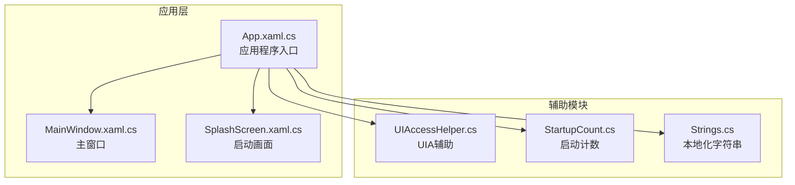
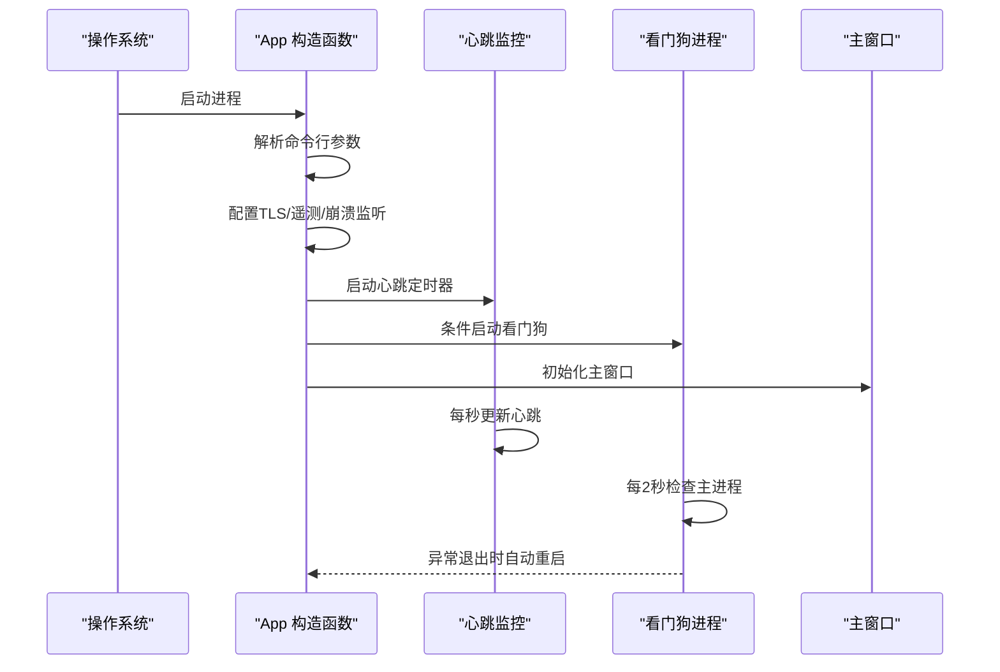
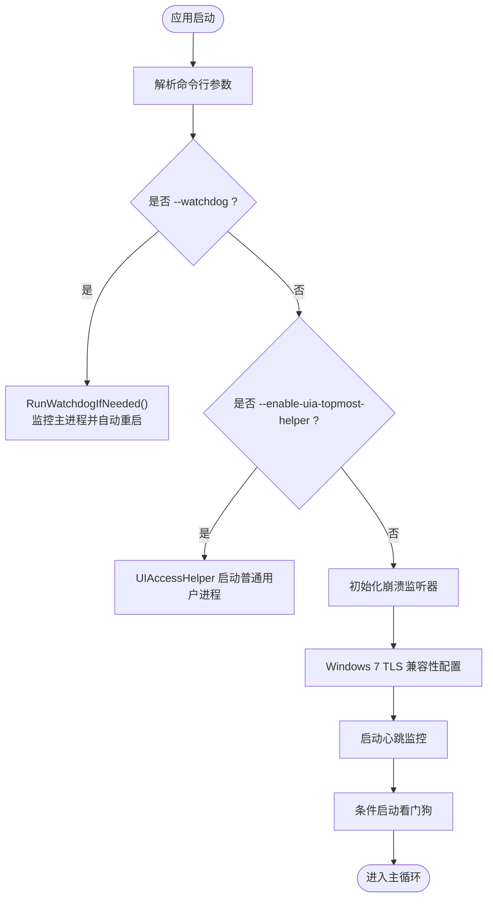
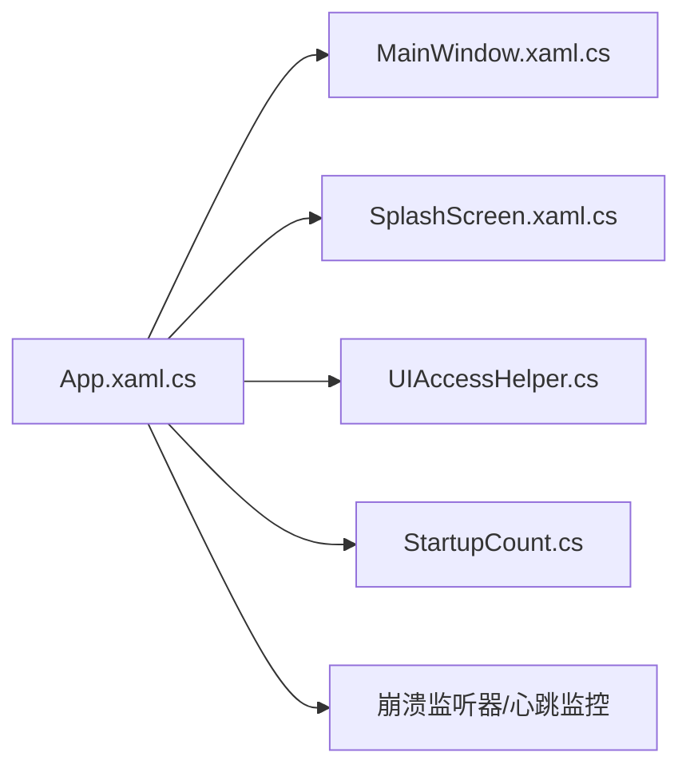

# 应用程序入口点

## 简介
本文件聚焦于应用程序入口点架构，深入解析 App.xaml.cs 中的应用启动流程，涵盖以下关键主题：
- 应用程序初始化与命令行参数处理
- 进程互斥体管理与单实例控制
- 看门狗进程的启动与监控机制
- 应用程序生命周期管理（启动阶段资源加载、配置同步、异常监听器初始化）
- 看门狗监控系统（进程监控、心跳检测、自动重启策略、崩溃恢复）
- 启动画面系统（Splash Screen）的架构设计与资源优化
- 入口点扩展点与自定义选项（启动参数、环境检测、兼容性处理）

## 项目结构
入口点位于 Ink Canvas 项目的 App.xaml.cs，负责：
- 应用程序构造函数中的初始化与参数解析
- 启动阶段的崩溃监听器与心跳监控
- 看门狗进程的启动与守护
- 启动画面的显示与进度更新
- 退出阶段的资源清理与看门狗协调

## 核心组件
- 应用程序类 App：负责启动流程、崩溃监听、心跳监控、看门狗管理、启动画面控制、命令行参数解析与环境兼容性处理。
- 主窗口 MainWindow：承载应用 UI，负责 OOBE 展示、资源加载与窗口生命周期管理。
- 启动画面 SplashScreen：提供进度条与消息更新，支持多种样式与自定义图片。
- UIA 辅助工具 UIAccessHelper：支持以提升权限方式启动，解决置顶与高 DPI 等场景。
- 启动计数器 StartupCount：记录连续重启次数，防止无限重启。

## 架构总览
应用程序入口点采用“构造函数初始化 + 启动阶段监控 + 看门狗守护”的三层架构：
- 构造函数初始化：解析命令行参数、配置 TLS、初始化崩溃监听器、启动心跳监控、按需启动看门狗。
- 启动阶段监控：通过心跳定时器与守护定时器检测启动假死与主线程无响应，必要时执行静默重启。
- 看门狗守护：独立子进程监控主进程生命周期，异常退出时根据配置自动重启或退出。

## 详细组件分析

### 应用程序启动流程与命令行参数处理
- 命令行参数解析：
  - --watchdog：看门狗子进程入口，接收主进程 PID 与退出信号文件路径，执行监控与自动重启。
  - --enable-uia-topmost-helper：通过 UIA 辅助工具以提升权限启动主进程。
  - --update-mode / --final-app：在更新模式或最终应用模式下禁用看门狗，避免干扰更新流程。
- 进程互斥体管理：
  - 应用启动时创建互斥体，确保单实例运行；重启时释放互斥体，避免阻塞。
- 环境兼容性：
  - Windows 7 下启用 TLS1.1/1.2 并优化 ServicePointManager 参数，保证网络通信稳定。

## 依赖关系分析
- App 对 MainWindow 的依赖：通过主窗口初始化与 OOBE 展示，间接影响启动画面与资源加载。
- App 对 SplashScreen 的依赖：通过静态方法控制启动画面显示与进度更新。
- App 对 UIAccessHelper 的依赖：在特定参数下启动提升权限进程。
- App 对 StartupCount 的依赖：记录连续重启次数，防止无限重启。
- App 对崩溃监听器与心跳监控的依赖：保障启动阶段与运行期稳定性。

## 性能考虑
- 心跳与守护定时器：
  - 心跳定时器每秒更新，守护定时器每 3 秒检查，开销极低。
  - 启动阶段超时阈值（≥2 分钟）与主线程无响应阈值（>10 秒）平衡了稳定性与性能。
- 启动画面动画：
  - 进度条宽度动画与缓动函数优化用户体验，避免频繁重绘。
- 看门狗轮询：
  - 每 2 秒轮询一次主进程，兼顾及时性与系统负载。

[本节为通用性能讨论，无需具体文件分析]

## 故障排除指南
- 启动假死与自动重启：
  - 现象：启动超过 2 分钟未完成或主线程长时间无响应。
  - 处理：根据 CrashAction 执行静默重启；超过重启阈值弹窗提示并退出。
- 用户主动退出：
  - 现象：用户退出时看门狗被误判为异常退出。
  - 处理：写入退出信号文件并杀死看门狗，避免误重启。
- 崩溃监听器初始化失败：
  - 现象：异常未被捕获或日志未记录。
  - 处理：检查初始化日志与异常堆栈，确保注册事件与监控钩子成功。
- Windows 7 兼容性问题：
  - 现象：TLS 连接失败或网络请求异常。
  - 处理：启用 TLS1.1/1.2 并优化 ServicePointManager 参数。

## 结论
应用程序入口点通过“构造函数初始化 + 启动阶段监控 + 看门狗守护”实现了稳健的启动与运行期保障。命令行参数解析、进程互斥体管理、崩溃监听器与心跳监控共同构成可靠的生命周期管理体系；看门狗提供进程级监控与自动重启能力；启动画面系统在保证体验的同时兼顾资源优化。通过扩展点与自定义选项，开发者可在不同环境下灵活配置启动行为与兼容性策略。