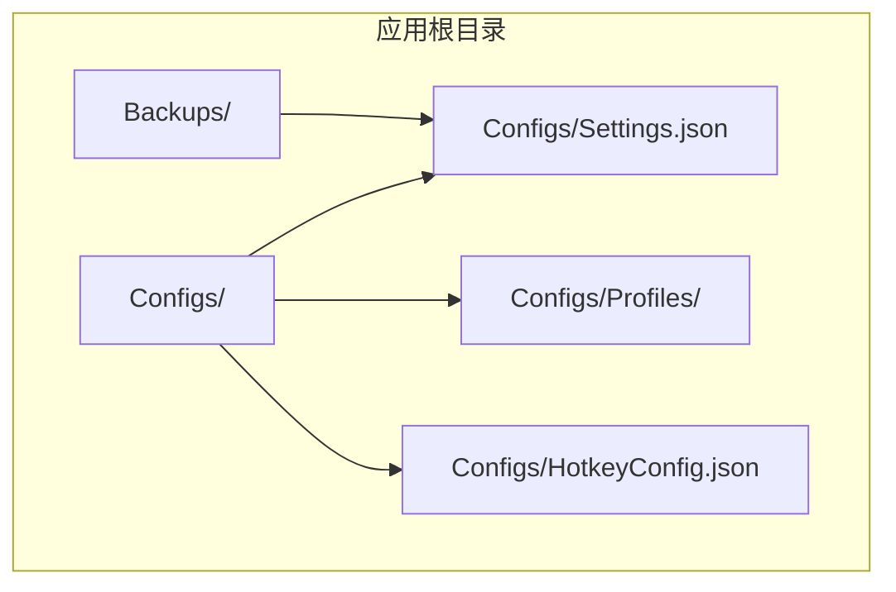
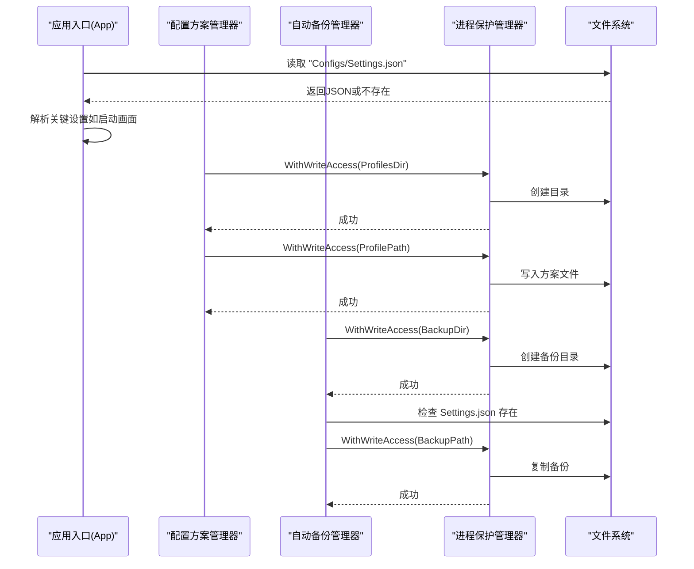
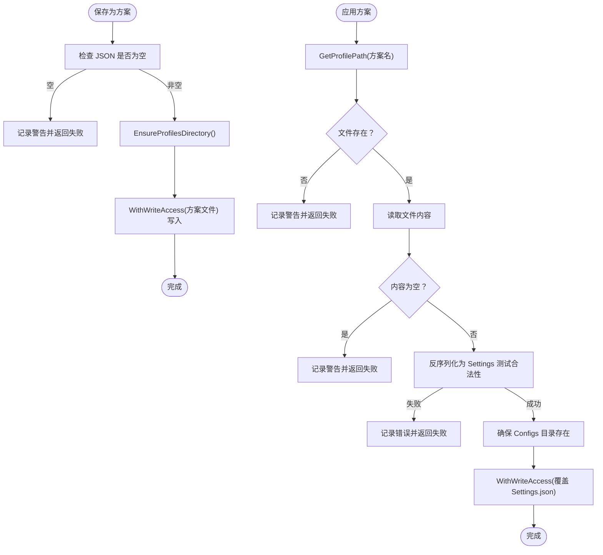
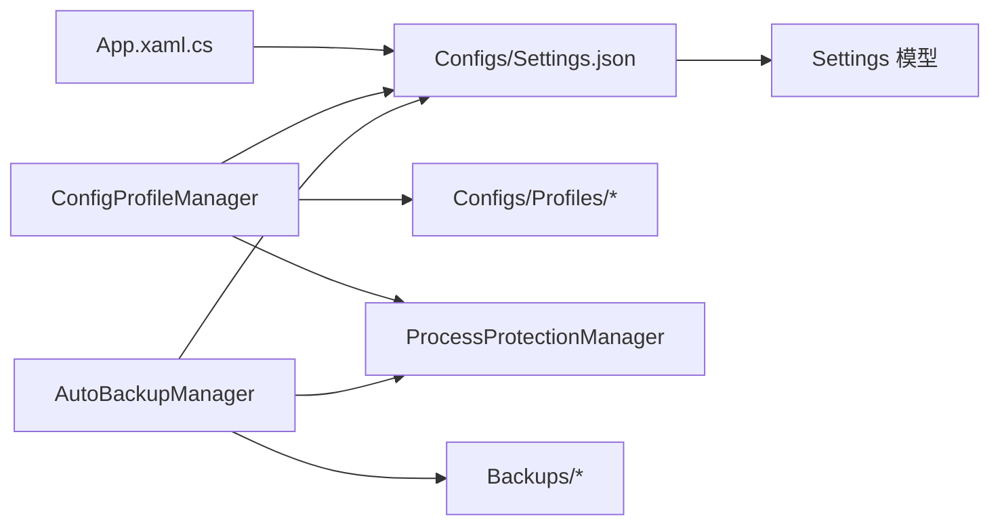

# 配置文件管理

## 简介
本文件面向 InkCanvasForClass 的配置文件管理体系，聚焦以下主题：
- 配置文件的结构设计与存储位置
- 文件格式与命名规范
- 加载流程（存在性检查、JSON 解析、异常处理）
- 备份策略（触发条件、备份格式、恢复流程）
- 版本控制与迁移（含向后兼容与升级策略）
- 手动编辑指南（合法配置项、数据类型验证、修复方法）
- 安全性与完整性保护

## 项目结构
InkCanvasForClass 的配置体系围绕“主配置文件 + 多配置方案 + 自动备份”展开：
- 主配置文件：Configs/Settings.json（当前生效配置）
- 配置方案：Configs/Profiles/*.json（多套方案，可热重载切换）
- 自动备份：Backups/（按时间戳命名的备份文件）
- 热键配置：Configs/HotkeyConfig.json（独立的热键配置文件）

## 核心组件
- 配置方案管理器：负责方案目录创建、方案列举、保存为方案、应用方案、删除方案等。
- 自动备份管理器：负责自动备份触发条件判断、备份执行、从备份恢复、过期备份清理。
- 设置模型：定义 Settings 及各子模块的结构，用于序列化/反序列化。
- 进程保护管理器：在写入配置文件时提供受保护的上下文，避免并发冲突与外部干扰。
- 应用入口：负责在启动阶段读取主配置文件并解析部分关键设置。

## 架构总览
配置文件管理的关键交互如下：
- 配置方案管理器与自动备份管理器均依赖“应用根路径 + Configs/Settings.json”的固定路径。
- 进程保护管理器在写入操作前后提供锁与句柄保护，降低并发风险。
- 应用入口在启动时对 Settings.json 进行轻量读取，用于决定部分行为（如启动画面）。

## 详细组件分析

### 配置方案管理器（ConfigProfileManager）
职责与行为：
- 确保配置方案目录存在（自动创建）
- 列举已保存的方案名称（按名称排序）
- 将当前内存中的设置序列化为 JSON 并保存为新方案
- 将指定方案应用到当前生效配置（覆盖 Settings.json）
- 删除指定方案

关键实现要点：
- 方案目录：应用根路径/Configs/Profiles
- 方案文件命名：方案名经“安全文件名”转换后追加“.json”
- 应用方案时进行 JSON 合法性校验（反序列化测试）
- 写入操作通过进程保护管理器包裹，确保并发安全

## 依赖关系分析
- 配置方案管理器依赖：
  - 应用根路径（用于拼接 Configs/Profiles 与 Settings.json）
  - 进程保护管理器（写入安全）
  - 日志记录（异常与警告）
- 自动备份管理器依赖：
  - Settings 模型（用于备份文件验证）
  - 进程保护管理器（写入安全）
  - 应用根路径（Backups 目录）
- 应用入口依赖：
  - 主配置文件（Settings.json）的存在性与内容解析

## 性能考量
- 写入安全：通过进程保护管理器的“写入门闩 + 降级释放锁”机制，避免长时间阻塞，同时降低并发写入风险。
- 目录扫描：自动备份清理仅扫描带前缀的自动备份文件，避免对其他文件的无谓处理。
- 最小化解析：应用入口对 Settings.json 的解析为轻量读取，仅提取必要字段，减少开销。

[本节为通用建议，无需列出具体文件来源]

## 故障排查指南
常见问题与处理建议：
- 配置文件无法保存/覆盖
  - 检查进程保护是否启用，确认写入门闩是否超时
  - 确认目标路径是否存在并具备写权限
- 应用方案失败
  - 确认方案文件存在且内容非空
  - 确认方案文件可被反序列化为 Settings
- 自动备份未执行
  - 检查设置项：是否启用、上次备份时间、备份间隔
  - 确认 Settings.json 存在
- 从备份恢复失败
  - 检查备份目录是否存在及备份文件数量
  - 验证备份文件可被反序列化为 Settings
  - 如当前配置存在，将被另存为“损坏备份”
- 启动画面未按预期显示
  - 检查 Settings.json 中 appearance.enableSplashScreen 字段

## 结论
InkCanvasForClass 的配置文件管理以“主配置 + 多方案 + 自动备份”为核心，结合进程保护机制保障写入安全与完整性。通过明确的存储位置、文件格式与命名规范，以及完善的加载、备份与恢复流程，系统实现了良好的可维护性与鲁棒性。建议在手动编辑配置时遵循数据类型与结构约束，并定期进行备份以降低风险。

[本节为总结性内容，无需列出具体文件来源]

## 附录

### 配置文件结构与命名规范
- 主配置文件：Configs/Settings.json（JSON）
- 配置方案：Configs/Profiles/*.json（JSON，文件名经“安全文件名”转换）
- 自动备份：Backups/Settings_AutoBackup_YYYYMMDD_HHmmss.json（JSON）
- 热键配置：Configs/HotkeyConfig.json（JSON）