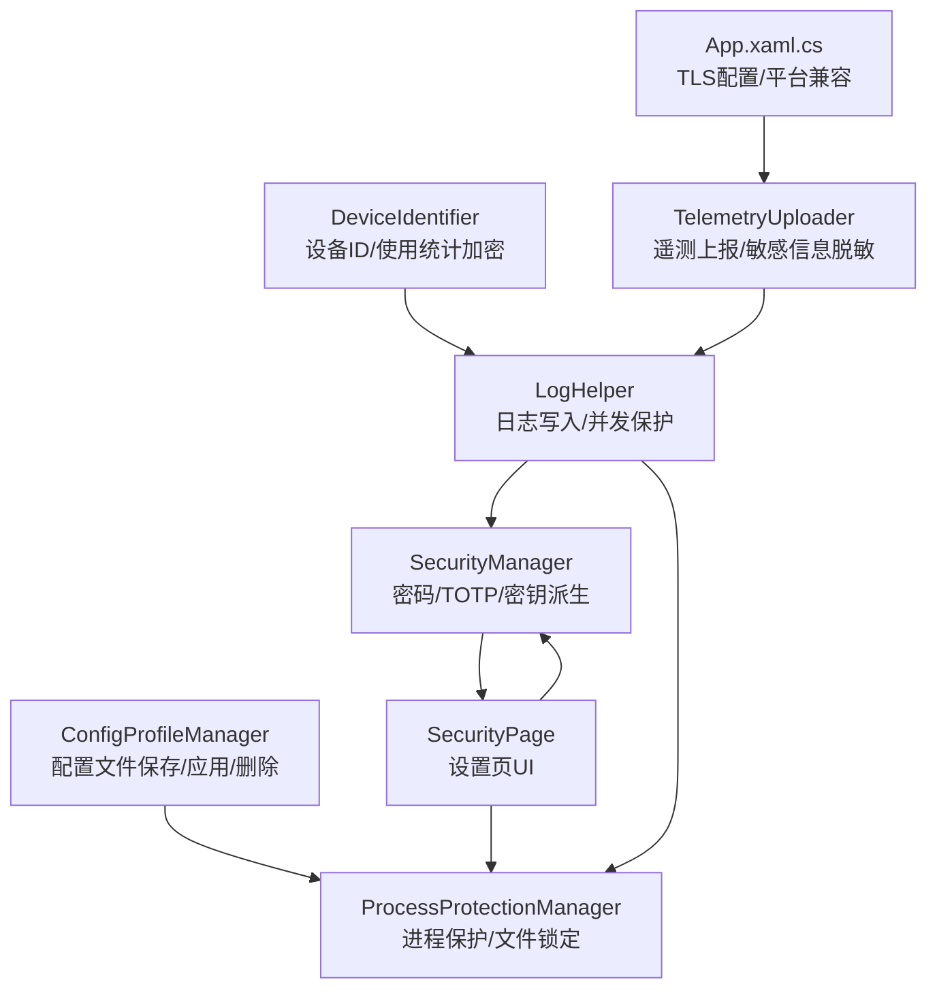
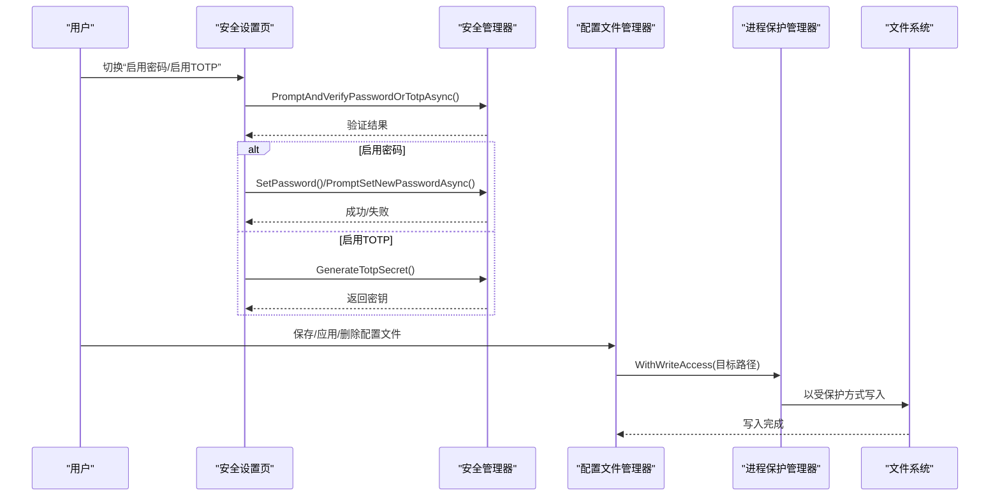
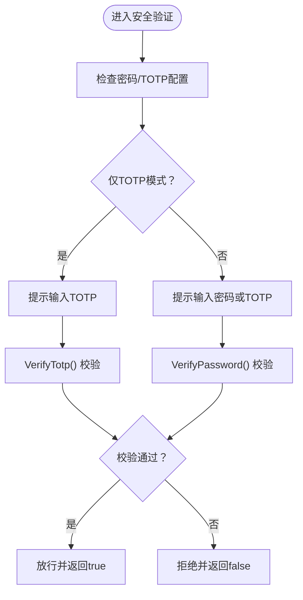
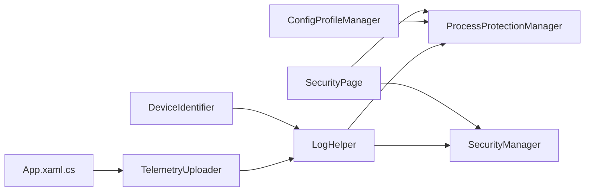

# 配置安全与权限

## 简介
本文件聚焦 InkCanvasForClass 配置系统的安全与权限管理，围绕以下主题展开：
- 敏感配置项保护机制与访问权限控制
- 配置文件的权限管理（文件系统权限、用户组访问控制、进程间隔离）
- 配置数据的加密与密钥管理（含解密流程）
- 审计与监控（访问日志、异常行为检测、安全事件响应）
- 防护措施（防篡改检测、完整性校验、恶意配置防护）
- 最佳实践（安全配置建议、风险评估方法、安全加固）

## 项目结构
与配置安全相关的关键模块分布如下：
- 安全管理器：负责密码与TOTP验证、密钥派生、固定时间比较、TOTP生成与校验
- 进程保护管理器：通过文件句柄与目录句柄实现进程间文件锁定与隔离
- 配置文件管理器：提供配置文件的保存、应用、删除与合法性校验
- 安全设置页：提供UI开关与交互，联动安全管理器与进程保护管理器
- 日志与遥测：统一日志写入与敏感信息脱敏，辅助审计与监控
- 设备标识与加密：设备ID生成与使用统计文件的加解密与完整性校验

## 核心组件
- 安全管理器（SecurityManager）
  - 密码功能启用判断、密码配置存在性判断、TOTP配置与仅TOTP模式判断
  - 密码验证（PBKDF2派生+固定时间比较）、TOTP生成与校验（基于时间步长）
  - 设置/变更密码、清除密码、生成TOTP密钥
- 进程保护管理器（ProcessProtectionManager）
  - 启用/禁用进程保护，递归锁定应用根路径下的关键文件与目录
  - 写入门闩机制与降级释放策略，避免死锁与长时间阻塞
  - 排除目录白名单（如 Logs、Configs、Saves、Backups、AutoUpdate）
- 配置文件管理器（ConfigProfileManager）
  - 配置文件目录确保、列出、保存、应用、删除
  - 应用前JSON合法性校验，结合进程保护进行安全写入
- 安全设置页（SecurityPage）
  - UI开关与交互：密码启用/禁用、TOTP启用/重置、各类场景的密码/验证码需求
  - 调用安全管理器进行验证与变更，联动进程保护开关
- 日志与遥测（LogHelper、TelemetryUploader）
  - 统一日志写入，带并发保护与日期分片
  - 遥测上报前对敏感信息进行正则脱敏
- 设备标识与加密（DeviceIdentifier）
  - 基于硬件指纹生成设备ID
  - 使用统计文件采用SHA256派生密钥与XOR异或加密，并带完整性校验

## 架构总览
配置安全与权限的整体架构围绕“认证与授权”“进程隔离与文件保护”“数据加密与完整性校验”“审计与监控”四个维度构建。

## 详细组件分析

### 安全管理器（密码与TOTP）
- 密码保护
  - PBKDF2-RFC2898 派生密钥，迭代次数、盐与哈希长度配置
  - 固定时间比较，防止时序侧信道攻击
  - 设置/变更/清除密码接口，配合UI进行交互
- TOTP保护
  - 基于时间步长（30秒）的6位动态口令
  - Base32编码密钥，支持±1步长容差
  - 仅TOTP模式与密码/TOTP混合模式的UI提示与逻辑分支
- 访问控制
  - 多场景强制验证：退出应用、进入设置、重置配置、修改/清空点名名单
  - 与设置页联动，根据功能启用状态动态启用/禁用UI开关

## 依赖关系分析
- 安全设置页依赖安全管理器与进程保护管理器
- 配置文件管理器依赖进程保护管理器进行安全写入
- 日志与遥测依赖进程保护管理器与安全管理器（用于敏感信息处理）
- 设备标识模块独立，但与日志/遥测共同构成审计与监控闭环

## 性能考量
- PBKDF2 迭代次数较高（约12万次），在验证与派生时会有一定CPU开销，建议在后台线程执行
- 进程保护的写入门闩与降级释放策略避免长时间阻塞，提升并发写入稳定性
- 日志写入采用并发保护与日期分片，降低IO争用与单文件过大问题
- TOTP校验引入±1步长容差，兼顾用户体验与安全性

[本节为通用指导，无需具体文件分析]

## 故障排查指南
- 密码/验证码验证失败
  - 检查是否处于仅TOTP模式或密码/TOTP混合模式
  - 确认输入长度与格式（TOTP为6位数字）
- 配置文件保存/应用失败
  - 查看日志中“保存配置文件失败/应用配置文件失败/配置文件格式无效”等记录
  - 确认目标路径是否存在，是否被进程保护锁定
- 进程保护导致写入超时
  - 观察日志中“获取写入门闩超时，将降级释放目标路径锁后执行写入”的提示
  - 检查是否存在长时间占用文件句柄的进程
- 遥测上报异常
  - 检查脱敏规则是否覆盖到目标敏感字段
  - 确认网络与Sentry服务可用性

## 结论
InkCanvasForClass 的配置安全体系通过“强认证（密码/TOTP）+ 进程隔离（文件锁定）+ 数据加密（PBKDF2/SHA256/XOR）+ 审计监控（日志/脱敏/遥测）”形成闭环。结合合理的权限控制与防护策略，有效降低了配置被篡改、泄露与滥用的风险。

[本节为总结，无需具体文件分析]

## 附录

### 配置安全最佳实践
- 密码与TOTP
  - 启用密码/TOTP至少其一；建议同时启用并开启“仅TOTP模式”以简化用户输入
  - 对退出应用、进入设置、重置配置、修改/清空点名名单等高风险操作强制要求二次验证
- 文件系统与进程隔离
  - 保持进程保护开启；定期检查日志中关于写入门闩超时的告警
  - 合理规划目录结构，避免将敏感配置置于排除白名单目录
- 数据加密与完整性
  - 对使用统计等敏感文件采用SHA256派生密钥与校验和机制
  - 配置文件应用前进行JSON合法性校验
- 审计与监控
  - 启用日志记录并开启按日期分片；对异常写入与验证失败进行告警
  - 遥测上报前严格脱敏，避免敏感信息外泄
- TLS与平台兼容
  - 在旧版Windows环境下适当放宽TLS协议以保障通信，同时关注安全基线

[本节为通用指导，无需具体文件分析]