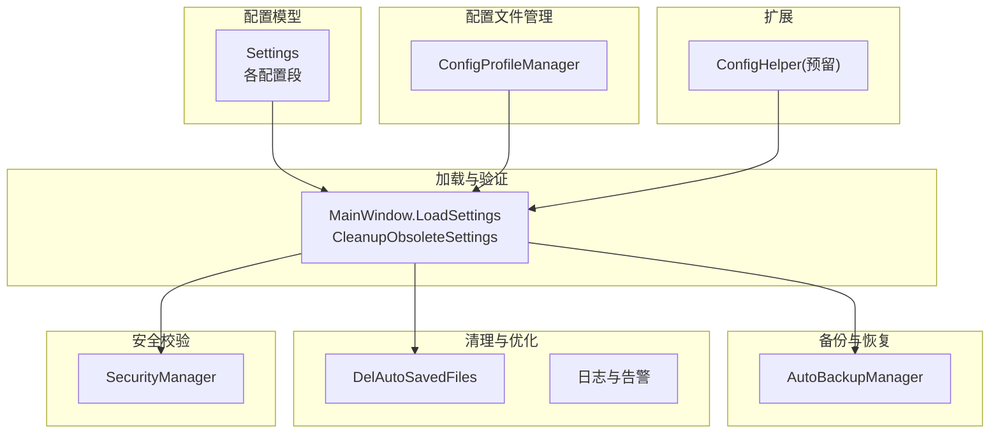
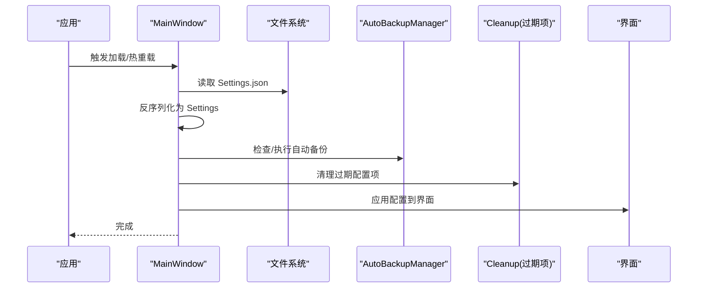
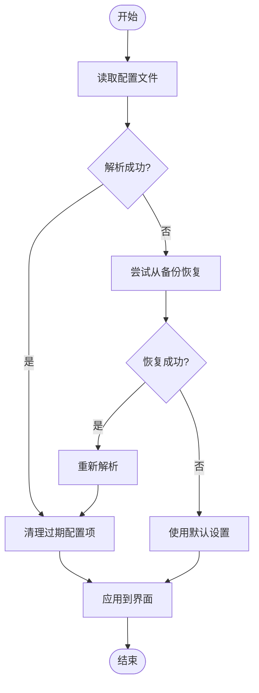
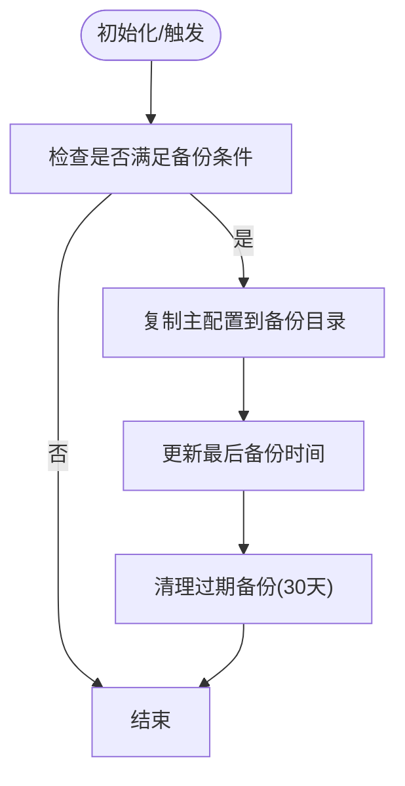
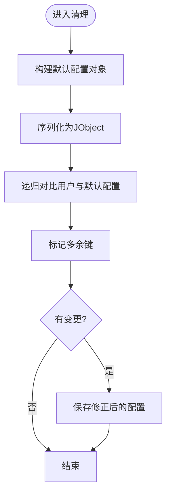
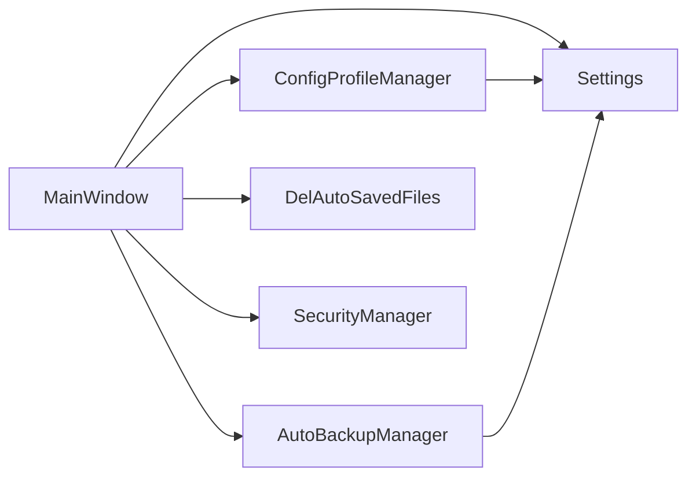

# 配置验证与迁移

## 简介
本文件系统性梳理 InkCanvasForClass 中“配置验证与迁移”机制，围绕以下目标展开：
- 配置验证：合法性检查、数据类型验证、业务规则验证
- 配置迁移：版本兼容、配置项增删改策略、向后兼容
- 配置清理：过期配置识别、冗余数据清理、配置优化
- 错误处理：验证失败响应、错误提示、自动修复
- 版本管理：版本号跟踪、迁移脚本管理、回滚机制
- 扩展指南：自定义验证器、迁移策略、配置模板

## 项目结构
配置相关能力主要分布在以下模块：
- 配置模型与默认值：Settings 类及其各子配置段
- 配置加载与验证：MainWindow 加载流程与清理逻辑
- 自动备份与恢复：AutoBackupManager
- 配置文件存档与切换：ConfigProfileManager
- 辅助清理：DelAutoSavedFiles
- 安全相关配置校验：SecurityManager
- 预留扩展：ConfigHelper

## 核心组件
- 配置模型 Settings：集中定义所有配置项的默认值、字段注解与分组，为验证与迁移提供“权威schema”
- 加载与清理：MainWindow.LoadSettings 负责加载、验证、回退与清理；CleanupObsoleteSettings 递归清理过期键
- 自动备份：AutoBackupManager 提供备份、恢复、过期清理与初始化
- 配置文件管理：ConfigProfileManager 支持多配置文件保存、切换与应用
- 安全校验：SecurityManager 提供密码/TOTP 等安全配置的判定
- 辅助清理：DelAutoSavedFiles 清理历史自动保存文件
- 预留扩展：ConfigHelper 为未来扩展配置相关辅助方法预留

## 架构总览
配置生命周期的关键流程：
- 启动/热重载：MainWindow 读取配置 -> 反序列化为 Settings -> 验证与回退 -> 应用到UI -> 清理过期项
- 备份与恢复：AutoBackupManager 在合适时机备份 -> 出错时从备份恢复 -> 清理过期备份
- 配置切换：ConfigProfileManager 保存/应用/删除配置文件 -> MainWindow 热重载
- 安全与清理：SecurityManager 判定安全配置 -> DelAutoSavedFiles 清理历史文件

## 详细组件分析

### 配置验证与清理（MainWindow 加载链路）
- 解析与回退：优先尝试解析配置；失败时尝试从备份恢复；仍失败则使用默认设置
- 过期项清理：以默认 Settings 为权威schema，递归对比用户配置，删除多余键，必要时保存修正后的配置
- 范围与类型约束：部分配置在应用阶段进行范围限制与类型约束（如缩放范围、阈值等）

### 配置模型与默认值（Settings）
- 分层结构：Settings 包含 Advanced、Appearance、Automation、Canvas、Gesture、InkToShape、Startup、RandSettings、ModeSettings、Camera、Dlass、Upload、Security、Notification、Toolbar 等
- 默认值：每个配置段在构造时提供合理默认值，为验证与清理提供权威schema
- 注解：JsonProperty/JsonIgnore 等用于序列化控制与兼容

### 自动备份与恢复（AutoBackupManager）
- 条件判断：根据设置决定是否执行备份（启用开关、上次备份时间、间隔）
- 执行备份：复制主配置到备份目录，更新最后备份时间
- 恢复策略：查找最新备份，验证有效性，备份当前损坏配置，覆盖主配置
- 过期清理：删除30天前的自动备份文件

### 配置文件存档与切换（ConfigProfileManager）
- 多配置文件：Configs/Profiles 下保存多个配置文件，当前生效仍为 Configs/Settings.json
- 功能：保存为配置文件、应用配置文件（覆盖 Settings.json）、删除配置文件、列举配置文件
- 校验：应用配置前进行 Settings JSON 合法性校验

### 安全配置校验（SecurityManager）
- 密码/TOTP 配置判定：HasPasswordConfigured、HasTotpConfigured、IsTotpOnlyMode、IsSecurityFeatureEnabled、IsSecurityConfigured
- 用途：在加载/应用配置时进行安全策略判定

### 历史文件清理（DelAutoSavedFiles）
- 目标：清理自动保存的历史文件（.icstk/.png 等）及空目录
- 策略：基于创建时间与扩展名阈值删除

### 配置清理算法（递归对比与删除）
- 算法思路：以默认 Settings 为权威schema，递归比较用户配置与默认配置，删除用户配置中不存在的键
- 数组处理：对数组元素为对象的情况，比较首个元素的属性结构，逐项清理
- 变更标记：仅在实际删除键时才保存并记录

## 依赖关系分析
- MainWindow 依赖 Settings 作为 schema；依赖 AutoBackupManager 进行备份/恢复；依赖 ConfigProfileManager 进行配置切换
- ConfigProfileManager 依赖 Settings 进行合法性校验
- DelAutoSavedFiles 与 Settings 的自动化保存路径配合工作
- SecurityManager 与 Settings.Security 协作进行安全策略判定

## 性能考量
- 反序列化与序列化：清理与备份涉及多次 JObject 操作，建议在批量变更后统一保存，减少IO次数
- 备份频率：通过间隔天数控制备份频率，避免频繁IO
- 清理范围：仅在发现变更时保存，避免无谓写入
- UI应用：范围与类型约束在应用阶段完成，避免后续运行期反复校验

## 故障排查指南
- 配置解析失败
  - 现象：日志出现解析失败，尝试从备份恢复
  - 排查：确认备份目录是否存在、备份文件是否可反序列化
  - 处理：若恢复失败，使用默认设置
- 备份失败
  - 现象：备份目录不存在或复制失败
  - 排查：检查权限与磁盘空间
  - 处理：修复权限后重试
- 过期配置清理未生效
  - 现象：旧键未删除
  - 排查：确认清理逻辑是否执行、是否有变更标记
  - 处理：检查默认schema是否包含忽略的空键

## 结论
本项目通过“权威schema + 加载时验证 + 自动备份 + 过期清理”的组合，实现了稳健的配置验证与迁移能力。Settings 作为唯一真相源，确保了验证与清理的一致性；AutoBackupManager 提供可靠的回退保障；ConfigProfileManager 支持多配置文件管理与切换。整体设计兼顾了向后兼容、易维护与用户体验。

## 附录

### 配置验证清单（实现要点）
- 合法性检查：反序列化后判空，失败时回退
- 数据类型验证：利用强类型模型与范围约束
- 业务规则验证：在应用阶段进行范围与互斥规则处理
- 自动修复：清理过期键并保存修正后的配置

### 配置迁移与版本兼容
- 设计理念：以 Settings 为权威schema，新增字段默认值保证向后兼容；删除字段通过清理逻辑移除
- 增删改策略：新增字段不破坏旧配置；删除字段通过清理逻辑移除；修改字段通过默认值与范围约束保证兼容
- 向后兼容：清理逻辑确保用户配置与当前schema一致

### 配置清理机制
- 过期配置识别：以默认 Settings 为基准，递归对比
- 冗余数据清理：删除多余键，必要时保存修正配置
- 配置优化：范围限制与默认值填充

### 错误处理与自动修复
- 验证失败响应：解析失败 -> 尝试备份恢复 -> 仍失败 -> 使用默认设置
- 错误提示：日志记录详细错误信息
- 自动修复：清理过期键并保存

### 版本管理与回滚
- 版本号跟踪：当前实现未显式版本号字段，建议在 Settings 中引入版本字段
- 迁移脚本管理：可通过升级流程在加载时执行迁移脚本（预留点）
- 回滚机制：依赖 AutoBackupManager 的备份与恢复

### 扩展指南
- 自定义验证器开发：可在加载流程中插入自定义校验逻辑（如范围、互斥、依赖关系）
- 迁移策略定制：在升级流程中添加迁移脚本，结合版本字段执行
- 配置模板管理：通过 ConfigProfileManager 管理多套模板，结合默认schema进行校验与应用

章节来源
