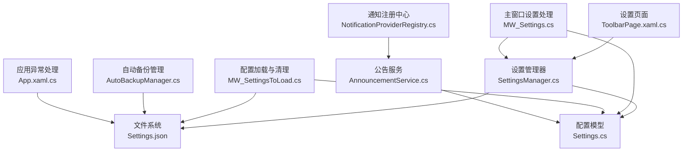
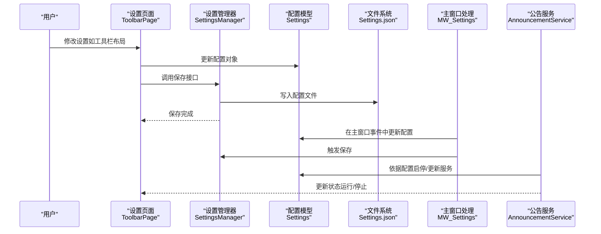
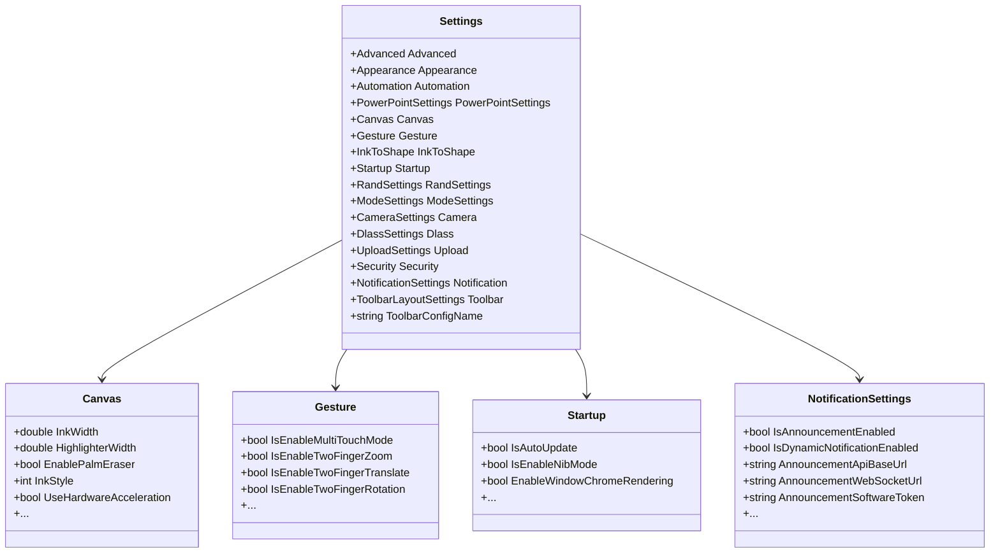
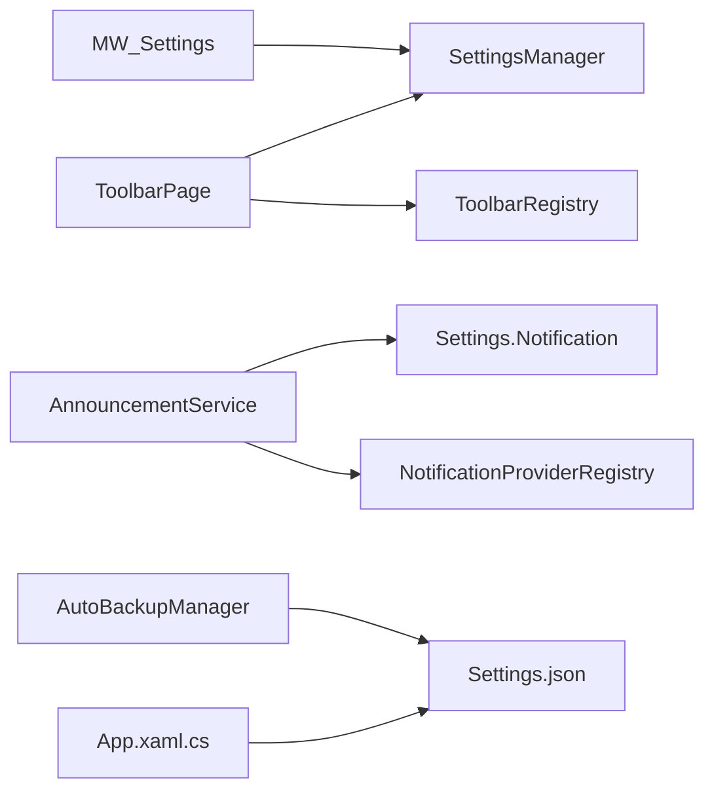

# 动态配置更新

## 简介
本文件围绕 InkCanvasForClass 的“动态配置更新”机制进行系统化说明，重点覆盖以下方面：
- 配置变更检测：如何感知用户界面操作、外部配置文件变更以及程序内部状态变更引发的配置变化。
- 热重载机制：配置更新后如何在运行时生效，避免重启或丢失状态。
- 状态同步策略：配置在 UI 层、设置管理器、持久化层之间的同步与一致性保障。
- 触发方式：用户交互、外部文件变更、内部状态变更三类场景的触发路径。
- 传播机制：事件通知、依赖关系处理与一致性保证。
- 性能优化：增量更新、批量处理与内存管理策略。
- 回滚机制：事务性更新、错误恢复与状态撤销。
- 调试与监控：配置变更日志、更新进度跟踪与冲突解决策略。

## 项目结构
围绕配置更新的关键目录与文件如下：
- 配置模型与分组：Ink Canvas\Resources\Settings.cs 提供 Settings 及其子模块（Canvas、Gesture、Startup、Notification 等）的完整结构定义。
- 主窗口设置处理：Ink Canvas\MainWindow_cs\MW_Settings.cs 包含大量 UI 事件处理器，负责将用户交互映射到 Settings 并持久化。
- 配置加载与清理：Ink Canvas\MainWindow_cs\MW_SettingsToLoad.cs 提供配置文件清理逻辑，确保旧字段被移除，保持配置结构稳定。
- 设置管理器：Ink Canvas\Windows\SettingsViews\Helpers\SettingsManager.cs 负责 Settings 的序列化/反序列化与磁盘持久化。
- 工具栏配置页：Ink Canvas\Windows\SettingsViews\Pages\ToolbarPage.xaml.cs 展示了配置文件的增删改查与应用流程。
- 热键配置：Ink Canvas\HotkeyConfig.json 提供热键配置样例，体现外部配置对行为的影响。
- 通知与注册：Ink Canvas\Helpers\NotificationProviderRegistry.cs 与 AnnouncementService.cs 展示了基于配置的动态服务启停与状态更新。
- 自动备份与回滚：Ink Canvas\Helpers\AutoBackupManager.cs 提供配置损坏时的恢复能力。
- 应用级异常处理：Ink Canvas\App.xaml.cs 提供全局异常捕获与崩溃日志记录，便于定位配置更新导致的问题。

## 核心组件
- 配置模型（Settings）：以强类型对象承载全部配置项，按功能域拆分为 Advanced、Appearance、Automation、Canvas、Gesture、InkToShape、Startup、RandSettings、ModeSettings、Camera、Dlass、Upload、Security、Notification、Toolbar 等。
- 设置管理器（SettingsManager）：提供配置的读取、序列化、持久化与部分字段的快速读取（如窗口渲染开关）。
- 主窗口设置处理（MW_Settings）：将 UI 事件转换为配置更新，并调用持久化接口。
- 配置加载与清理（MW_SettingsToLoad）：在加载阶段清理过期字段，确保配置结构与默认值一致。
- 工具栏配置页（ToolbarPage）：展示配置文件的增删改查与应用流程，体现“热重载”的实际落地。
- 通知注册中心与公告服务：根据配置动态启停服务，体现配置驱动的服务生命周期。
- 自动备份与回滚（AutoBackupManager）：在配置损坏时进行恢复，提供回滚能力。
- 应用异常处理（App.xaml.cs）：统一捕获异常，便于定位配置更新问题。

## 架构总览
动态配置更新的整体流程由“触发—检测—应用—同步—持久化—回滚/监控”构成。下图展示了关键组件间的交互：

## 详细组件分析

### 配置模型与分组（Settings）
- 分层结构：Settings 下包含多个子模块，每个模块对应一类配置（如 Canvas、Gesture、Startup、Notification 等），便于按需更新与隔离影响范围。
- 字段注解：通过 JsonProperty/JsonIgnore 等特性控制序列化行为，确保配置文件与内存对象的一致性。
- 默认值：多数字段提供合理默认值，减少首次加载时的缺失风险。

## 依赖分析
- 组件耦合：
  - MW_Settings 依赖 SettingsManager 进行持久化。
  - ToolbarPage 依赖 ToolbarRegistry 与 SettingsManager 协作完成配置文件的增删改查与应用。
  - AnnouncementService 依赖 Settings.Notification 与 NotificationProviderRegistry。
  - AutoBackupManager 依赖 Settings 文件路径与备份目录。
- 外部依赖：
  - JSON 序列化（Newtonsoft.Json）用于配置的读写。
  - 文件系统写入受进程保护封装（ProcessProtectionManager）保障权限与并发安全。
- 循环依赖：
  - 未发现直接循环依赖；各模块职责清晰，通过 SettingsManager 作为桥接。

## 性能考虑
- 增量更新：
  - UI 事件处理器在更新 Settings 后立即保存，避免批量写入导致的延迟累积。
  - 对于高频滑块事件（如笔宽、透明度），通过内部标志位避免重复更新与闪烁。
- 批量处理：
  - 工具栏配置页在保存前先同步 UI 状态，减少多次写入。
- 内存管理：
  - SettingsManager 在读取特定字段时使用快速读取，避免全量反序列化带来的内存压力。
  - 通知服务在停止时释放资源，避免长期占用。

## 故障排查指南
- 配置变更日志：
  - 通过 SettingsManager 的保存与读取日志定位写入失败或权限问题。
  - 通知服务通过注册中心记录运行状态，便于判断服务启停是否符合预期。
- 更新进度跟踪：
  - 工具栏配置页在加载/保存时记录日志，便于追踪配置应用进度。
- 冲突解决策略：
  - 使用 MW_SettingsToLoad 的清理逻辑，自动移除过期字段，避免版本升级后的兼容性问题。
  - AutoBackupManager 在配置损坏时自动恢复，减少人工干预。
- 异常定位：
  - App.xaml.cs 的全局异常捕获有助于定位配置更新过程中的异常点。

## 结论
InkCanvasForClass 的动态配置更新机制以 Settings 为核心，结合 SettingsManager 的持久化能力与 MW_Settings 的即时应用策略，实现了“用户交互—配置更新—持久化—服务响应”的闭环。通过配置清理、通知服务注册、自动备份与全局异常处理，系统在保证一致性的同时提供了良好的容错与可观测性。建议在高频更新场景中进一步引入节流/去抖与批量写入策略，以进一步提升性能与稳定性。

## 附录
- 外部配置示例：HotkeyConfig.json 展示了热键配置的结构，体现外部配置对行为的影响路径。
- 配置文件位置：Settings.json 默认位于应用根目录的 Configs 子目录中。