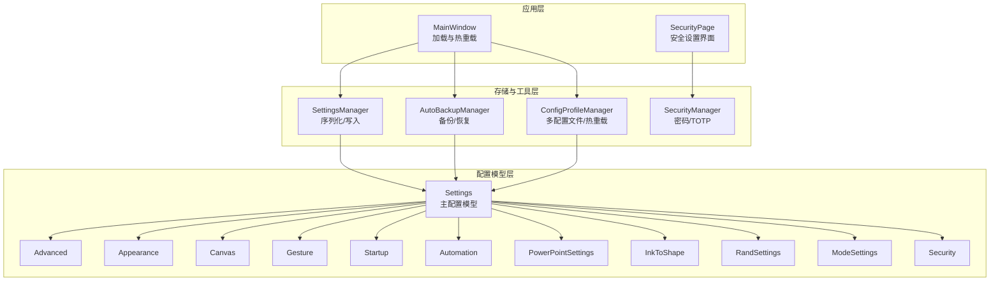
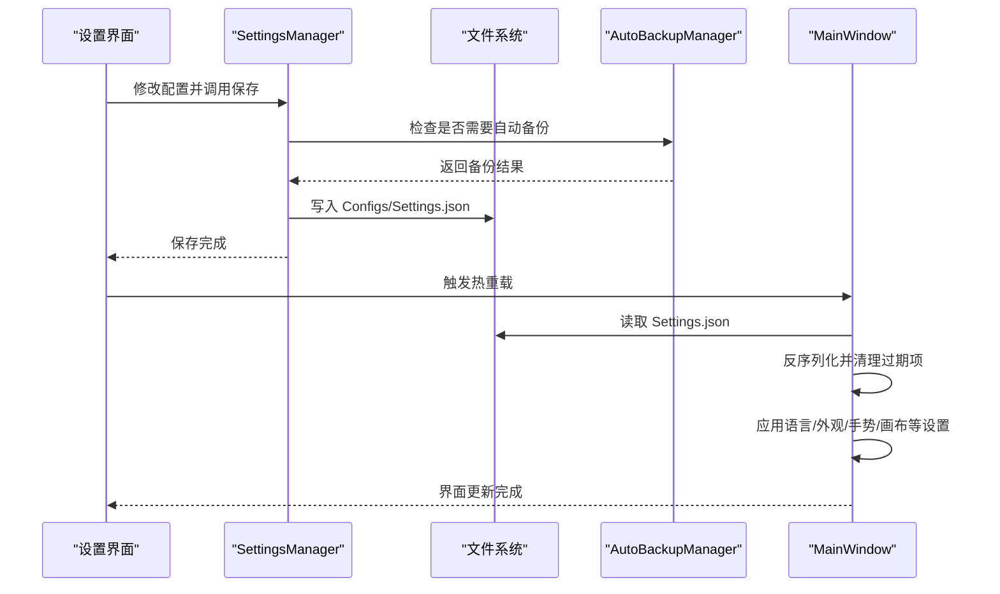
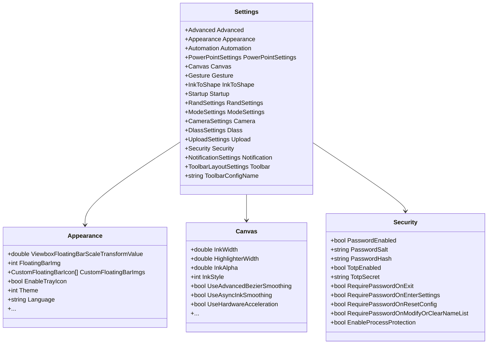
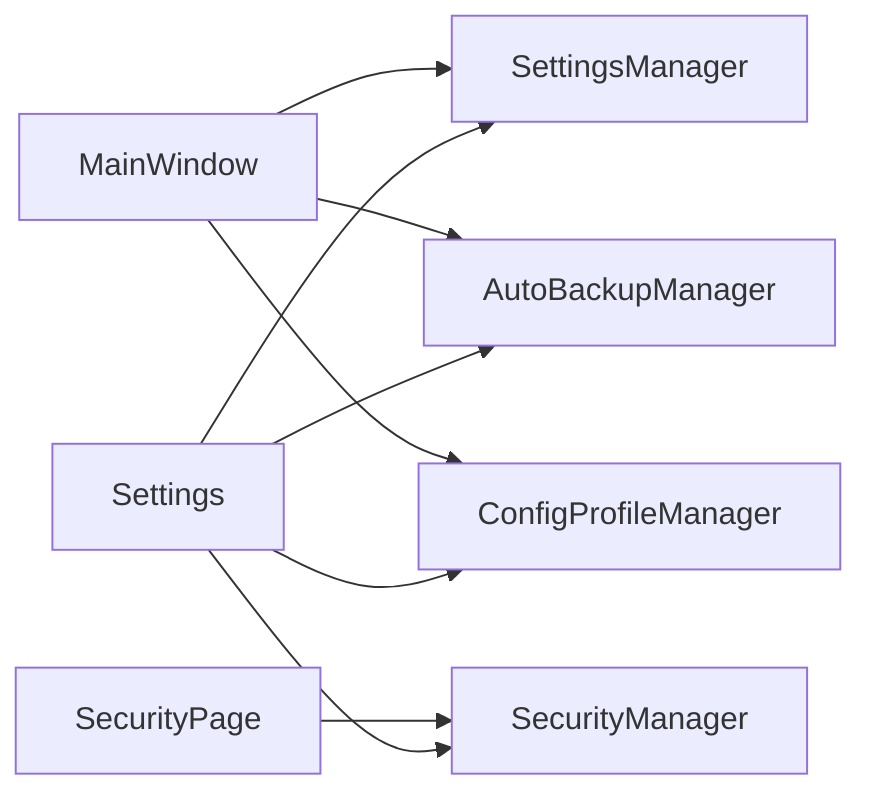

# 配置管理系统

## 简介
本文件面向 InkCanvasForClass 项目的配置管理系统，系统性梳理配置文件结构、配置层次与加载机制，解释 JSON 解析、默认值处理与配置迁移策略，阐述动态配置更新的监听、热重载与一致性保障，描述配置存储的安全设计（敏感信息加密、权限控制、备份恢复），解释版本管理与兼容性处理（升级、降级与回滚），并提供扩展指南与调试排障建议。

## 项目结构
配置系统围绕 Settings 主模型展开，采用分层设计：
- 数据模型层：Settings 及其子模块（Advanced、Appearance、Canvas、Gesture、Startup、Automation 等）
- 存储与加载层：SettingsManager 负责序列化/反序列化与文件写入；AutoBackupManager 负责备份与恢复
- 应用与热重载层：MainWindow 的加载与热重载逻辑；ConfigProfileManager 支持多配置文件与热重载
- 安全层：SecurityManager 提供密码与 TOTP 验证，配合 Security 页面实现权限控制

## 核心组件
- Settings 主模型：集中定义配置分组（Advanced、Appearance、Canvas、Gesture、Startup、Automation、PowerPointSettings、InkToShape、RandSettings、ModeSettings、Camera、Dlass、Upload、Security、Notification、Toolbar 等），并提供默认值。
- SettingsManager：负责将 Settings 序列化为 JSON 并写入 Configs/Settings.json，提供读取特定字段的便捷方法。
- AutoBackupManager：负责自动备份、恢复与过期清理，保障配置文件安全。
- ConfigProfileManager：支持多配置文件保存、切换与热重载，便于快速在不同场景间切换。
- SecurityManager：提供密码与 TOTP 验证、密钥派生与固定时间比较，结合 SecurityPage 实现权限控制。
- MainWindow 加载与热重载：负责从文件加载配置、清理过期项、应用语言与外观、启动自动化任务等。

## 架构总览
配置系统采用“模型驱动 + 文件持久化 + 备份恢复 + 安全控制 + 动态热重载”的架构：
- 模型驱动：Settings 及各子模块定义配置结构与默认值，确保解析与应用的一致性。
- 文件持久化：SettingsManager 统一写入 Configs/Settings.json；ConfigProfileManager 支持 Profiles 目录下的多配置文件。
- 备份恢复：AutoBackupManager 在写入前后执行备份与恢复，防止配置损坏。
- 安全控制：SecurityManager 提供密码/TOTP 验证，结合界面开关实现细粒度权限控制。
- 动态热重载：MainWindow 在应用启动与配置切换后执行热重载，即时应用配置变更。

## 详细组件分析

### 配置文件结构与层次
- 主配置文件：Config/Settings.json，采用 JSON 格式，根对象为 Settings，包含多个子模块（如 appearance、canvas、gesture、startup、automation 等）。
- 配置层次：Settings 为顶层容器，各子模块（如 Appearance、Canvas、Gesture 等）定义具体配置项及其默认值。
- 默认值处理：子模块在声明时提供默认值，确保反序列化后字段具备合理初始值。

## 依赖关系分析
- 模型依赖：Settings 依赖各子模块；子模块之间无直接耦合，通过 Settings 聚合。
- 存储依赖：SettingsManager 依赖文件系统与写入保护；AutoBackupManager 依赖备份目录与写入保护。
- 应用依赖：MainWindow 依赖 SettingsManager、AutoBackupManager、ConfigProfileManager 与 SecurityManager。
- 安全依赖：SecurityManager 依赖 Settings 的 Security 模块与资源字符串。

## 性能考虑
- 异步与并发：配置写入与热重载涉及文件 IO 与 UI 更新，建议在后台线程执行写入与解析，避免阻塞 UI。
- 序列化开销：SettingsManager 使用缩进格式化，体积较大；在频繁写入场景可考虑精简格式或批量写入。
- 备份频率：AutoBackupManager 的备份间隔可配置，建议根据数据变化频率调整，避免过度备份影响性能。
- 过期项清理：清理逻辑为递归遍历，建议在配置项较多时优化 Schema 比较策略，减少不必要的深度遍历。

## 故障排除指南
- 配置文件损坏：系统会尝试从备份恢复；若失败，使用默认配置。可通过备份目录查看损坏副本并手动回滚。
- 权限不足：写入保护上下文会捕获异常并记录日志；检查应用运行权限与目标目录访问权限。
- 密码/TOTP 验证失败：确认密码长度、重复输入一致性与 TOTP 时间偏差；查看资源字符串中的错误提示。
- 热重载无效：确认配置文件已写入且 MainWindow 已触发热重载；检查清理过期项逻辑是否覆盖了关键字段。

## 结论
InkCanvasForClass 的配置管理系统以 Settings 模型为核心，结合 SettingsManager、AutoBackupManager、ConfigProfileManager 与 SecurityManager，实现了可靠的配置持久化、备份恢复、多配置文件管理与安全控制，并通过 MainWindow 的热重载机制确保配置变更的即时生效。系统在兼容性与扩展性方面表现良好，适合进一步引入更严格的验证器与更灵活的导入导出能力。

## 附录
- 配置文件路径：Config/Settings.json
- 备份目录：Backups（自动备份文件前缀：Settings_AutoBackup_）
- 配置文件目录：Configs/Profiles（多配置文件）
