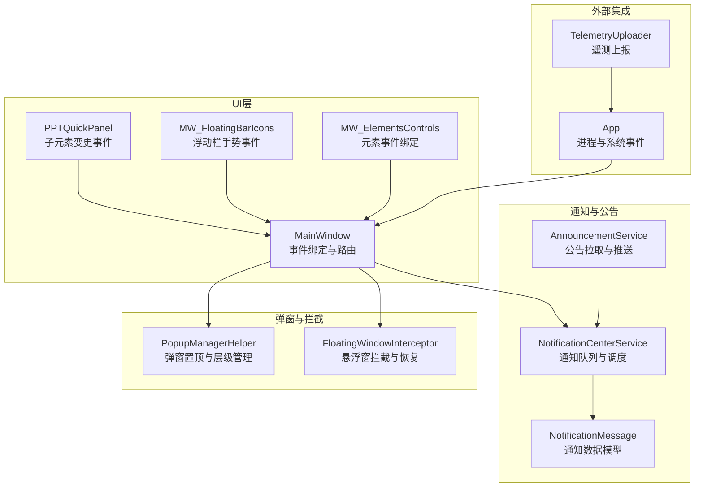
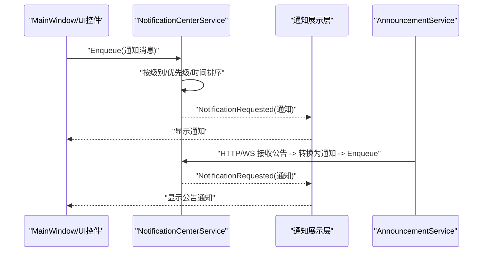
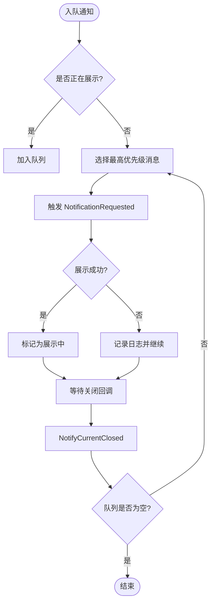
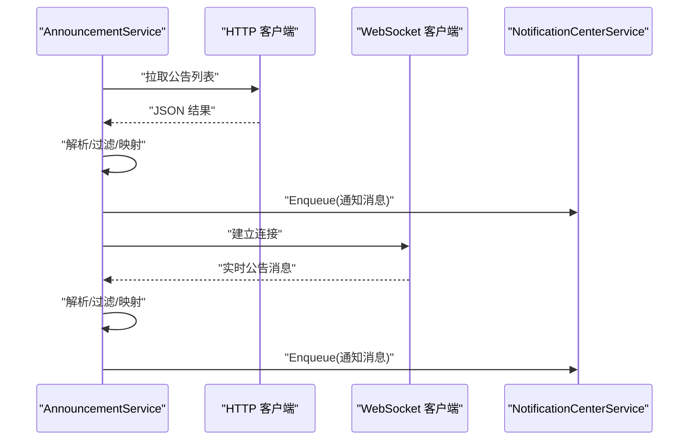
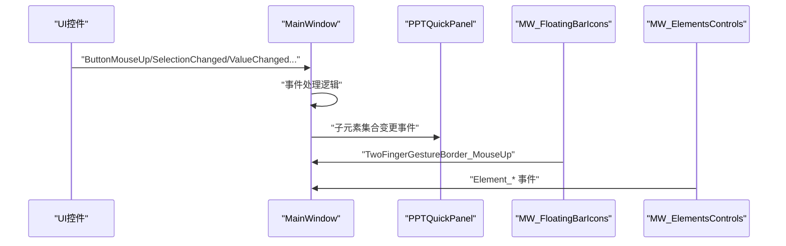
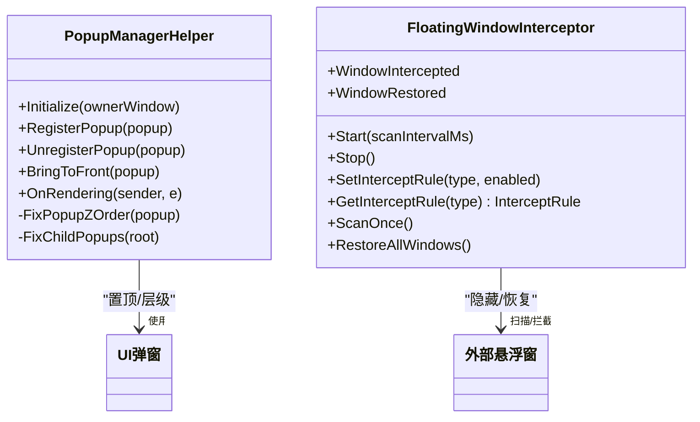
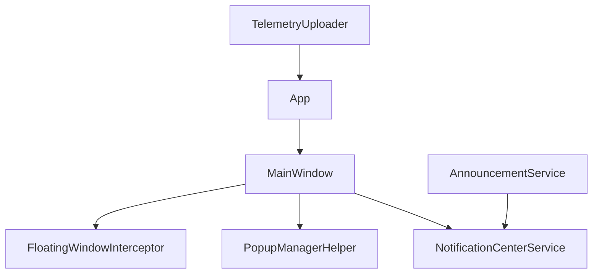

# 事件驱动架构

## 引言
本文件系统性梳理 InkCanvasForClass 的事件驱动架构，围绕 MainWindow 的事件总线模式、消息传递机制与异步处理进行深入解析。重点覆盖事件分类与层次结构（用户交互事件、系统状态事件、业务逻辑事件、外部集成事件）、事件处理器的注册与管理（订阅、优先级、生命周期）、事件传播与路由（冒泡/捕获/拦截策略）、事件数据的序列化与版本兼容、扩展指南（自定义事件类型与处理器开发）、以及调试与监控最佳实践。

## 项目结构
事件系统主要分布在以下模块：
- UI 层事件绑定与路由：MainWindow 及其子页面控制器
- 通知与公告事件：NotificationCenterService 与 AnnouncementService
- 弹窗与拦截事件：PopupManagerHelper 与 FloatingWindowInterceptor
- 事件数据模型：NotificationMessage
- 外部集成与遥测：App 与 TelemetryUploader

## 核心组件
- 事件总线与消息调度
  - NotificationCenterService：基于静态队列与优先级的事件调度器，负责通知消息的入队、历史记录与出队展示。
  - AnnouncementService：外部公告来源的异步消费者，支持 HTTP 拉取与 WebSocket 实时推送，解析后转换为通知消息并入队。
- UI 事件绑定与路由
  - MainWindow：集中注册各类控件事件（鼠标、触摸、键盘、 InkCanvas 事件），形成事件总线入口。
  - PPTQuickPanel：监听 InkCanvas 子元素集合变化，作为业务事件的桥接。
  - MW_FloatingBarIcons、MW_ElementsControls：分别处理浮动栏手势与元素级交互事件。
- 弹窗与拦截事件
  - PopupManagerHelper：维护弹窗层级与置顶，通过 Win32 API 控制 Z-order，响应打开/关闭事件。
  - FloatingWindowInterceptor：扫描并拦截第三方悬浮窗，支持规则化匹配与恢复。
- 事件数据模型
  - NotificationMessage：统一的通知消息结构，包含类型、级别、优先级、来源、动作等元数据。

## 架构总览
事件驱动架构采用“事件总线 + 消息分发 + 异步处理”的组合模式：
- 事件总线：MainWindow 负责收集用户交互与系统事件，作为单一入口。
- 消息分发：NotificationCenterService 按优先级与级别排序，触发 UI 展示。
- 异步处理：AnnouncementService 通过后台任务拉取与接收外部消息，避免阻塞 UI。
- 弹窗与拦截：PopupManagerHelper 与 FloatingWindowInterceptor 通过事件回调与 Win32 API 协同，保证 UI 行为一致性。

## 详细组件分析

### 事件总线与消息调度（NotificationCenterService）
- 设计要点
  - 静态单例：全局队列与历史列表，线程安全通过锁保护。
  - 事件发布：NotificationRequested 作为统一事件出口，供 UI 层订阅。
  - 排序策略：按级别降序、优先级降序、创建时间升序，确保紧急与高优先级消息优先展示。
- 生命周期
  - 入队：Enqueue/EnqueueText，自动维护历史长度上限。
  - 出队：TryShowNext，单次仅允许一个消息处于展示中，避免并发冲突。
  - 关闭回调：NotifyCurrentClosed，用于切换下一个待展示消息。
- 性能与可靠性
  - 异常兜底：展示失败时记录日志并尝试继续下一个消息。
  - 历史限制：固定容量，避免内存膨胀。

### 外部公告与实时推送（AnnouncementService）
- 数据来源
  - HTTP 拉取：客户端公告接口，解析 JSON 并转换为通知消息。
  - WebSocket 实时推送：连接候选地址，循环重连，断线自动恢复。
- 过滤与版本兼容
  - 版本过滤：最小/最大版本号与本地版本比较。
  - 渠道过滤：当前更新通道与公告渠道匹配。
  - 已读状态：基于设置中的已读 ID 列表过滤重复或已读项。
- 消息映射
  - 类型映射：根据公告类型映射为通知消息类型。
  - 级别映射：根据公告级别映射为通知级别。
  - 本地化：多语言文本选择与摘要生成。
- 异步与容错
  - 后台任务：StartAsync 启动，StopAsync 停止，支持取消令牌。
  - 重连策略：服务端 500 错误降级为 HTTP 拉取通道，持续重试。
  - 日志记录：失败场景统一记录日志，便于诊断。

### UI 事件绑定与路由（MainWindow）
- 事件绑定策略
  - 分层注册：工具弹窗、背景调色板、画笔调色板、橡皮擦、手势、图像选项、形状绘制等，均通过集中方法注册，避免分散。
  - InkCanvas 事件：预览鼠标、触控笔按下/抬起、右键等，作为核心交互入口。
  - 子元素变更：监听 InkCanvas 子元素集合变化，触发业务事件。
- 事件路由
  - 事件从 UI 控件冒泡至 MainWindow，再由事件处理器转换为内部消息或直接驱动 UI。
  - 浮动栏与元素级事件：通过 MW_FloatingBarIcons 与 MW_ElementsControls 统一处理，减少跨模块耦合。
- 生命周期
  - 初始化：构造函数中完成事件绑定与基础状态初始化。
  - 清理：窗口关闭或停止时，确保事件解绑与资源释放。

### 弹窗与拦截（PopupManagerHelper 与 FloatingWindowInterceptor）
- PopupManagerHelper
  - 注册与生命周期：注册弹窗 Opened/Closed 事件，维护打开弹窗集合与句柄缓存。
  - 置顶与层级：通过 Win32 SetWindowPos 将弹窗置顶，并确保子弹窗层级一致。
  - 渲染回调：CompositionTarget.Rendering 周期性修复层级与位置。
- FloatingWindowInterceptor
  - 规则化拦截：定义多种 InterceptType 与规则（进程名、标题/类名模式、窗口样式、尺寸等）。
  - 扫描与拦截：定时扫描系统窗口，命中规则即隐藏并记录，支持恢复。
  - 事件回调：WindowIntercepted/WindowRestored 提供外部感知与扩展点。

### 事件数据模型（NotificationMessage）
- 字段设计
  - 标识与来源：Id、Source、ProviderId、AnnouncementId/Type。
  - 类型与级别：Type（Update/Urgent/Important/Reminder/Other）、Level（Low/Normal/High/Critical）。
  - 展示与交互：Title/Summary/Content、Icon、ActionText/ActionUrl、DisplaySeconds、ForcePopup、Priority。
  - 时间戳：CreatedAt。
- 序列化与版本兼容
  - 使用 JSON 序列化，支持多语言内容与摘要生成。
  - 版本兼容：AnnouncementService 在解析时对字段存在性与格式进行健壮性判断。

## 依赖关系分析
- 组件耦合
  - MainWindow 与各弹窗/工具控件：强绑定，集中事件入口。
  - AnnouncementService 与 NotificationCenterService：单向依赖，前者生产消息，后者消费。
  - PopupManagerHelper 与 FloatingWindowInterceptor：独立模块，分别负责 UI 与系统级行为。
- 外部依赖
  - 系统事件：App.xaml.cs 中的系统会话结束与控制台信号处理。
  - 遥测：TelemetryUploader 通过 Sentry 上报运行时信息。

## 性能考量
- 异步与非阻塞
  - AnnouncementService 使用后台任务与循环重连，避免阻塞 UI 线程。
  - PopupManagerHelper 通过渲染回调周期性修复层级，降低频繁操作带来的抖动。
- 资源管理
  - 通知历史限制为固定容量，防止内存增长。
  - FloatingWindowInterceptor 在停止时恢复所有被拦截窗口，避免系统状态残留。
- 事件处理
  - 事件处理器尽量轻量，复杂逻辑放入后台任务或延迟执行，避免 UI 卡顿。

## 故障排查指南
- 通知未显示
  - 检查 NotificationRequested 是否被正确订阅。
  - 查看 NotificationCenterService 的日志输出，确认消息是否入队与展示失败原因。
- 公告未到达
  - 确认 AnnouncementService 的 Token、API 地址与 WebSocket 地址配置。
  - 观察重连日志，区分 HTTP 拉取与 WebSocket 推送状态。
- 弹窗层级异常
  - 检查 PopupManagerHelper 的置顶逻辑与渲染回调是否正常。
  - 确认外部悬浮窗拦截规则是否生效，必要时调用 RestoreAllWindows。
- 系统事件与崩溃
  - 关注 App.xaml.cs 中的系统会话结束与控制台信号处理日志。
  - 遥测上报可用于定位运行时问题，结合 Sentry 用户信息与设备标识进行分析。

## 结论
InkCanvasForClass 的事件驱动架构以 MainWindow 为核心事件入口，结合 NotificationCenterService 的消息调度与 AnnouncementService 的外部集成，实现了用户交互、系统状态、业务逻辑与外部事件的统一处理。通过 PopupManagerHelper 与 FloatingWindowInterceptor 对 UI 与系统行为进行协同治理，整体架构具备良好的扩展性与可维护性。建议在扩展新事件类型时遵循现有命名与优先级策略，并严格控制事件处理器的复杂度，确保异步与容错机制完善。

## 附录
- 事件分类与层次结构
  - 用户交互事件：鼠标、触摸、键盘、InkCanvas 事件。
  - 系统状态事件：窗口激活/失活、系统会话结束、控制台信号。
  - 业务逻辑事件：PPT 快捷面板、浮动栏手势、元素级拖拽与变换。
  - 外部集成事件：公告拉取与实时推送、悬浮窗拦截与恢复。
- 扩展指南
  - 自定义事件类型：新增枚举或消息结构，确保与 NotificationMessage 兼容。
  - 事件处理器开发：遵循现有注册模式，注意线程与异常处理。
  - 性能优化：优先使用异步与延迟执行，避免在 UI 线程执行耗时操作。
- 调试与监控最佳实践
  - 使用日志记录关键路径与异常。
  - 通过遥测上报运行时信息，结合用户标识与设备信息定位问题。
  - 定期清理通知历史与拦截状态，避免资源泄漏。
