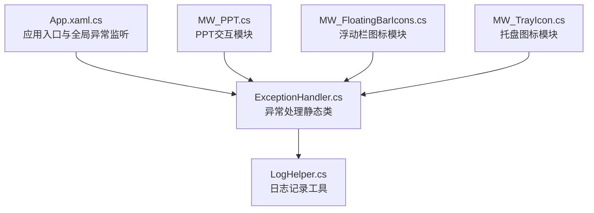
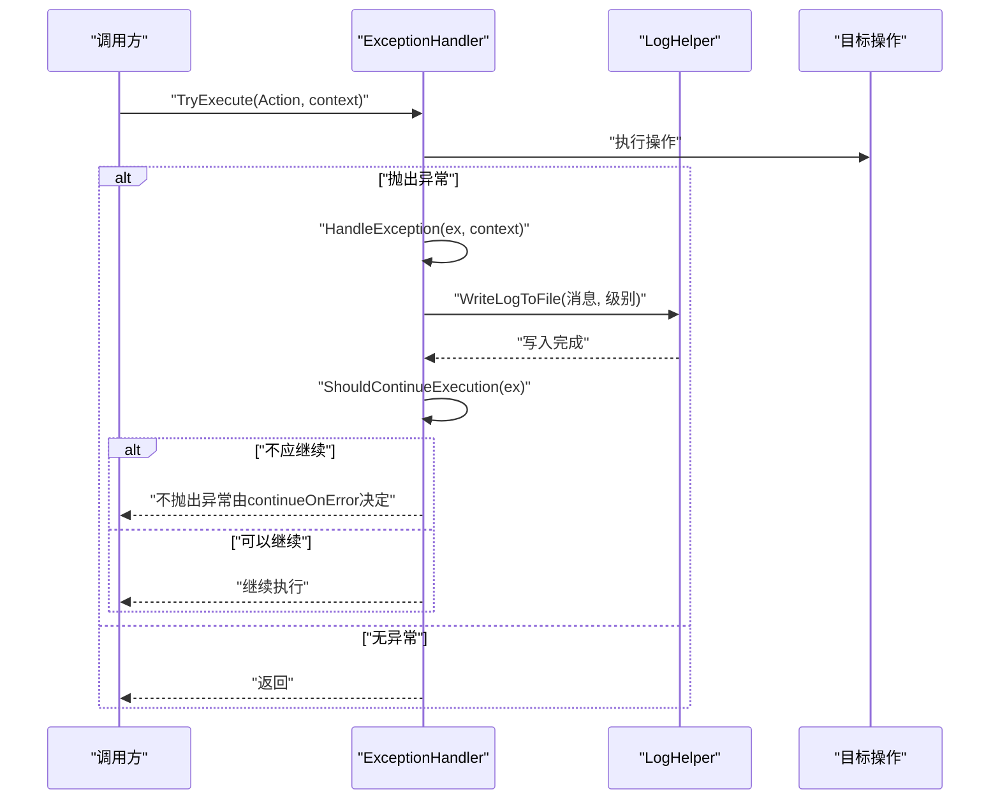
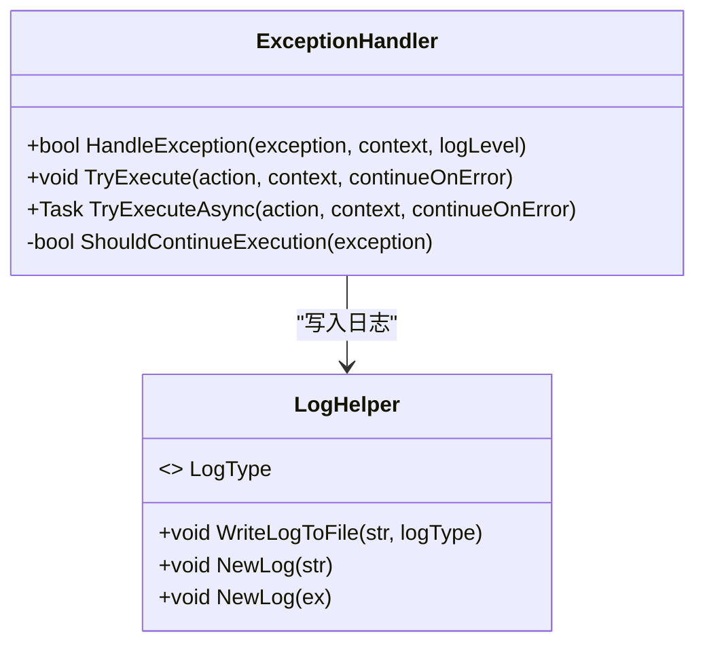
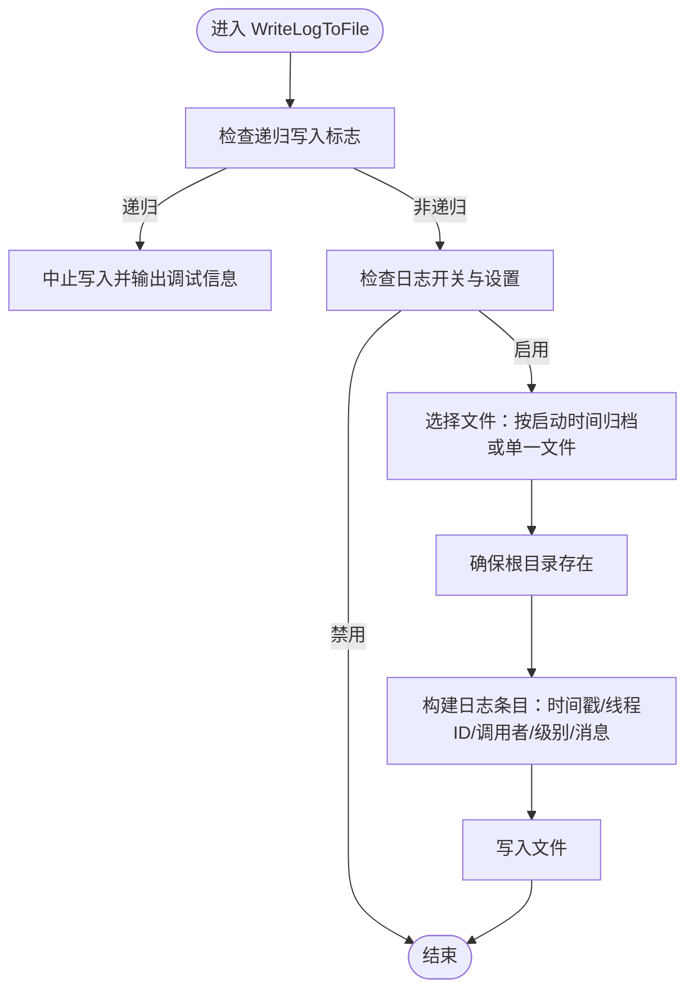
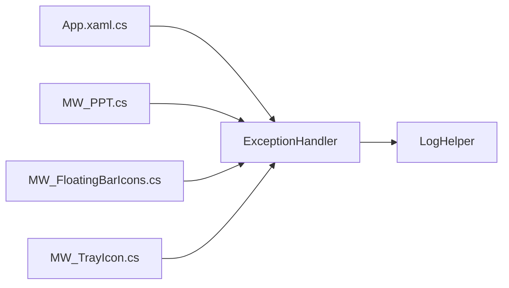

# 异常处理服务

## 简介
本文件系统化梳理 Ink Canvas 项目中的异常处理服务，重点围绕 ExceptionHandler 类的设计与实现，解释其全局异常捕获策略、异常分类与处理流程，详解 HandleException、TryExecute、TryExecuteAsync 的实现原理与使用场景，并说明 ShouldContinueExecution 的决策机制与针对不同异常类型的处理策略。同时，结合 LogHelper 的集成使用，阐述日志记录体系与日志级别管理，提供最佳实践建议（上下文信息记录、内部异常链跟踪、用户友好提示），并给出扩展指南与自定义异常类型的集成方法。

## 项目结构
异常处理服务位于 Ink Canvas/Helpers 目录，核心文件为 ExceptionHandler.cs 与 LogHelper.cs；应用层在 App.xaml.cs、MW_PPT.cs、MW_FloatingBarIcons.cs、MW_TrayIcon.cs 等模块中广泛使用异常处理服务与日志记录。

## 核心组件
- ExceptionHandler：提供统一的异常处理入口，负责日志记录与继续执行决策，并封装同步/异步安全执行包装。
- LogHelper：提供日志写入能力，支持按启动时间归档、大小限制清理、递归写入保护、调用者信息注入与多种日志级别。

## 架构总览
异常处理服务采用“静态工具类 + 日志工具”的协作模式：
- ExceptionHandler 负责异常分类与继续执行决策，统一委托 LogHelper 进行日志落盘。
- LogHelper 提供线程安全、可配置的文件写入能力，支持按需归档与清理。
- 应用层通过 ExceptionHandler 的 TryExecute/TryExecuteAsync 包装潜在风险操作，避免异常扩散并保证关键流程继续运行。

## 详细组件分析

### ExceptionHandler 设计与实现
- 统一入口：HandleException 接收异常、上下文与日志级别，拼接上下文与异常消息，必要时追加内部异常信息，随后委托 LogHelper 写入日志，并基于异常类型判断是否应继续执行。
- 决策机制：ShouldContinueExecution 对致命异常（如 OutOfMemoryException、AccessViolationException）直接返回 false，其余异常默认允许继续执行。
- 安全执行：TryExecute 封装 Action 执行，捕获异常后调用 HandleException，并依据 continueOnError 参数决定是否重新抛出异常。
- 异步支持：TryExecuteAsync 提供对 Func&lt;Task&gt; 的异步安全执行，行为与 TryExecute 一致。

### 日志记录系统与级别管理
- 写入流程：WriteLogToFile 通过 Interlocked 实现递归写入保护，避免日志写入过程再次触发日志写入；随后根据设置选择单一文件或按启动时间归档文件；注入时间戳、线程ID、调用者信息与日志级别。
- 归档与清理：当启用按日期保存时，自动创建 Logs 文件夹并限制总大小（默认5MB），超过阈值时清空并记录清理日志。
- 异常专用记录：NewLog(Exception) 自动格式化异常类型、消息与堆栈，并包含内部异常链信息，便于问题定位。

### 使用场景与调用示例
- 应用层全局异常监听：App.xaml.cs 中注册未处理异常监听并在退出阶段记录退出状态与设备标识，配合 ExceptionHandler 记录关键异常。
- PPT 交互模块：在 PPT 播放与导航过程中，使用 TryExecute 包装 UI 激活等易失败操作，避免因个别 UI 操作异常导致整体流程中断。
- 图标与托盘模块：在更新 UI 状态或处理用户交互时，使用 ExceptionHandler 记录警告级别异常，保证功能可用性。

## 依赖关系分析
- ExceptionHandler 依赖 LogHelper 进行日志落盘；内部不直接依赖 UI 或业务模块，保持通用性。
- 应用层（App.xaml.cs）与多个业务模块（MW_PPT.cs、MW_FloatingBarIcons.cs、MW_TrayIcon.cs）均依赖 ExceptionHandler 与 LogHelper，形成统一的异常与日志处理规范。

## 性能考量
- 递归写入保护：LogHelper 使用 Interlocked 标志避免日志写入过程中的递归调用，降低死锁与重复写入风险。
- 文件写入并发：通过 WithWriteAccess 包裹文件写入，减少外部异常对日志系统的干扰。
- 归档与清理：按启动时间归档与大小限制清理，避免日志文件无限增长，保障磁盘空间与读取效率。
- 异常处理成本：TryExecute/TryExecuteAsync 仅在异常时产生额外开销，正常路径几乎零成本。

## 故障排查指南
- 常见问题定位
  - 日志未生成：检查 MainWindow.Settings.Advanced.IsLogEnabled 与 IsSaveLogByDate 设置，确认根目录可写。
  - 日志过大：确认 Logs 文件夹大小清理阈值与清理逻辑是否生效。
  - 递归日志：若出现“递归日志”调试输出，检查是否存在日志写入回调中再次触发日志写入的情况。
- 异常处理策略
  - 对 OutOfMemoryException、AccessViolationException 等致命异常，系统默认不继续执行，避免进一步恶化。
  - 对一般异常，默认允许继续执行，可通过 continueOnError 控制是否抛出异常。
- 用户友好提示
  - 在 UI 层对关键操作使用 TryExecute 包装，避免异常导致界面冻结或流程中断；对可恢复的警告类异常，使用 Warning 级别日志记录并提示用户。

## 结论
ExceptionHandler 与 LogHelper 构成了 Ink Canvas 的基础异常与日志基础设施：前者负责异常分类与继续执行决策，后者负责可靠、可配置的日志落盘。二者协同工作，既保证了关键流程的稳定性，又提供了充分的问题诊断信息。通过统一的 TryExecute/TryExecuteAsync 包装与合理的日志级别管理，开发者可以在复杂业务场景中快速集成健壮的异常处理能力。

## 附录

### 最佳实践
- 上下文信息记录：在调用 HandleException 或 TryExecute 时，提供清晰的 context 描述，便于日志检索与问题定位。
- 内部异常链跟踪：利用 ExceptionHandler 的内部异常消息拼接与 LogHelper.NewLog(Exception) 的完整堆栈记录，保留完整的异常链信息。
- 用户友好提示：对可恢复的警告类异常，使用 Warning 级别日志并提供用户提示；对不可恢复的致命异常，避免继续执行并记录详细信息。
- 统一异常处理：在 UI 交互、COM 对象释放、文件操作等易失败场景，统一使用 TryExecute/TryExecuteAsync 包装。

### 扩展指南与自定义异常类型集成
- 新增异常类型处理策略：在 ShouldContinueExecution 中增加新的异常类型分支，明确其是否应终止执行。
- 自定义日志级别：根据业务场景选择合适的 LogType（Info、Trace、Error、Event、Warning），并在 HandleException 中传入对应级别。
- 统一包装接口：为新增模块提供与现有模块一致的异常处理风格，确保日志一致性与可维护性。

章节来源
