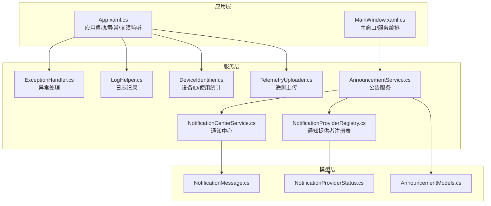
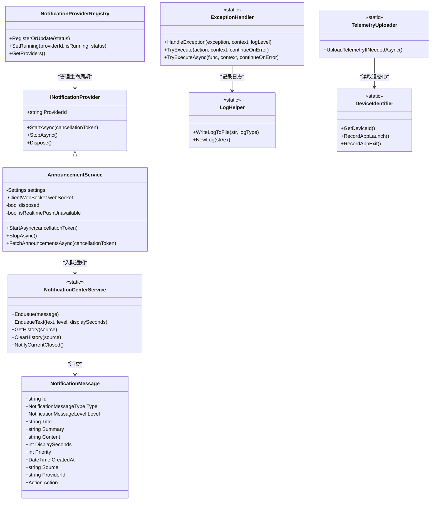
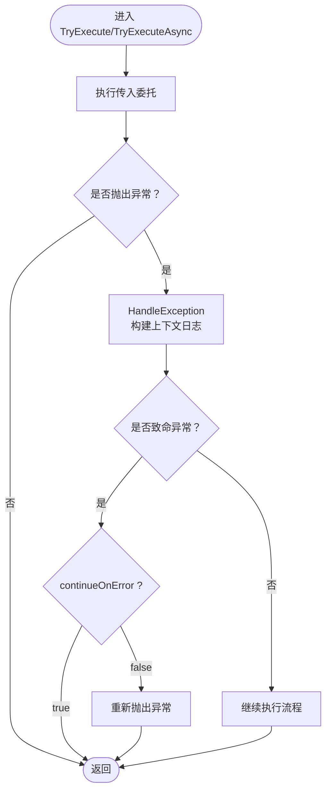
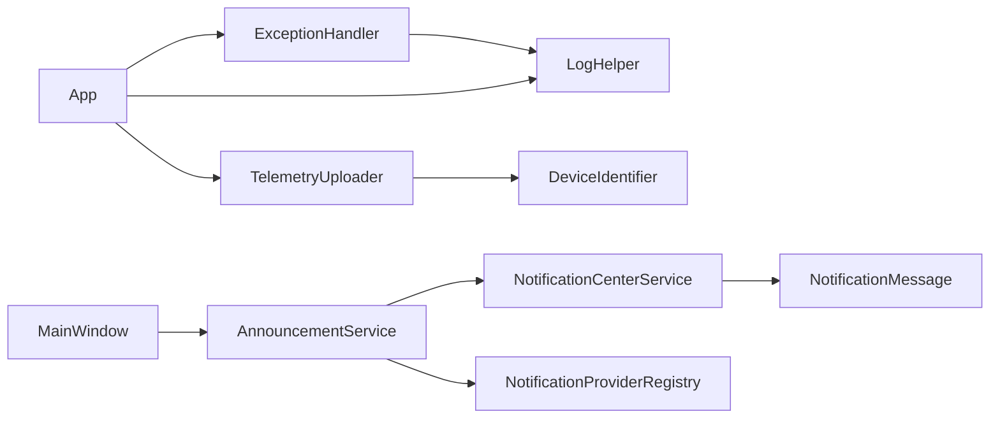

# 全局服务架构

## 引言
本文件面向 InkCanvasForClass 的全局服务架构，聚焦以下主题：
- InkCanvasForClass 中全局服务的设计模式与实现机制（服务注册、依赖注入、生命周期管理）
- 异常处理服务的架构设计（全局异常捕获、错误分类、日志记录、用户通知）
- 通知中心服务的实现原理（消息分发、优先级管理、用户交互、持久化存储）
- 遥测服务的架构设计（数据收集、传输协议、隐私保护、性能监控）
- 服务间通信机制（事件总线、消息传递、异步处理）
- 服务扩展与自定义指南（新服务开发、接口设计、集成测试）
- 服务性能优化策略与故障恢复机制

## 项目结构
全局服务主要分布在 Helpers 与 Models 目录，配合 App 与 MainWindow 的启动与生命周期管理，形成松耦合、可扩展的服务体系。

## 核心组件
- 异常处理服务：统一捕获与分类异常，决定是否继续执行，并记录日志。
- 日志服务：线程安全写入日志文件，支持按启动时间归档与大小清理。
- 通知中心服务：集中排队与分发通知，支持优先级与历史记录。
- 通知提供者注册表：维护各通知提供者的运行状态与元数据。
- 公告服务：拉取公告、WebSocket 实时推送、过滤与本地化、历史与未读计数。
- 遥测上传服务：基于 Sentry 的匿名遥测，含敏感信息脱敏与隐私控制。
- 设备标识服务：生成与校验设备ID，记录使用统计与更新优先级。

## 架构总览
全局服务采用“静态工具类 + 接口契约 + 模型承载”的组合模式：
- 静态工具类（如异常处理、通知中心、遥测上传）提供全局能力，内部通过锁与事件实现线程安全与解耦。
- 接口契约（INotificationProvider）定义服务生命周期，便于注册表统一管理。
- 模型承载（通知消息、公告项、提供者状态）保证跨模块的数据一致性与序列化兼容。

## 详细组件分析

### 异常处理服务（ExceptionHandler）
- 能力概述
  - 统一处理异常，构建上下文日志，决定是否继续执行。
  - 提供同步与异步执行包装，自动调用日志记录与异常分类。
- 关键点
  - 对特定致命异常（如内存溢出、访问冲突）直接判定不可继续。
  - 支持 continueOnError 参数控制异常时是否抛出。
- 与日志协作
  - 通过日志助手记录异常堆栈与内部异常链路。

## 依赖关系分析
- 低耦合与高内聚
  - 通知中心与公告服务通过接口契约与事件解耦，注册表统一管理生命周期。
  - 遥测上传依赖设备标识服务获取设备 ID，日志服务贯穿异常与崩溃场景。
- 外部依赖
  - Sentry 用于遥测事件上报。
  - WebSocket/HTTP 用于公告实时推送与拉取。
- 循环依赖风险
  - 通知中心为纯静态工具类，不持有服务实例，避免循环依赖。
  - 注册表仅维护状态对象，不持有具体服务实例。

## 性能考量
- 线程安全与并发
  - 通知中心与注册表使用锁保护共享状态，避免竞态。
  - 日志服务通过原子操作防止递归写入。
- I/O 与网络
  - 通知中心仅在空闲时分发，避免阻塞入队。
  - 公告服务对 WebSocket 连接失败进行指数退避与快速重试，降低抖动。
- 存储与清理
  - 通知历史限制数量，避免无限增长。
  - 日志文件夹大小上限控制，定期清理超限文件。
- 遥测与隐私
  - 仅在隐私同意与设备 ID 有效时上传，减少无效请求。
  - 敏感信息脱敏，降低合规风险与带宽消耗。

[本节为通用指导，无需列出具体文件来源]

## 故障排查指南
- 公告服务无法接收实时推送
  - 检查 WebSocket URL 构造与候选地址，确认服务端状态码与异常类型。
  - 观察注册表状态变化，确认是否降级为 HTTP 拉取。
- 通知不显示或堆积
  - 检查通知级别与优先级排序规则，确认历史记录是否过多导致入队阻塞。
  - 确认 UI 是否正确订阅 NotificationRequested 事件。
- 遥测未上传
  - 检查隐私协议是否同意、上传级别是否开启、设备 ID 是否有效。
  - 查看日志中“遥测上传失败”警告与 Sentry 事件记录。
- 异常未被捕获或重复崩溃
  - 检查 App 的 Dispatcher 与域未处理异常处理逻辑，确认是否被安全处理。
  - 查看崩溃日志文件，定位最后错误信息与系统状态。

## 结论
InkCanvasForClass 的全局服务以“静态工具类 + 接口契约 + 模型承载”为核心，实现了：
- 统一的异常处理与日志记录，保障稳定性与可观测性；
- 可靠的通知中心与公告服务，兼顾实时性与可用性；
- 遥测上传与隐私控制并重，满足合规要求；
- 通过注册表与事件总线实现服务间低耦合协作。

建议在扩展新服务时遵循现有接口与模型约定，确保生命周期与状态可见性。

[本节为总结性内容，无需列出具体文件来源]

## 附录

### 服务扩展与自定义指南
- 开发步骤
  - 定义服务接口（参考 INotificationProvider），声明 ProviderId、StartAsync、StopAsync。
  - 在启动阶段注册服务，通过注册表上报初始状态。
  - 在合适时机入队通知或触发事件，与通知中心解耦。
  - 在停止阶段释放资源，通过注册表更新状态。
- 接口设计要点
  - ProviderId 唯一且稳定，便于注册表识别。
  - StartAsync/StopAsync 支持取消令牌，确保可中断。
- 集成测试建议
  - 使用内存中的事件订阅验证通知分发顺序与优先级。
  - 模拟网络异常与 WebSocket 断开，验证降级与重试逻辑。
  - 验证日志与崩溃日志的完整性与敏感信息脱敏效果。