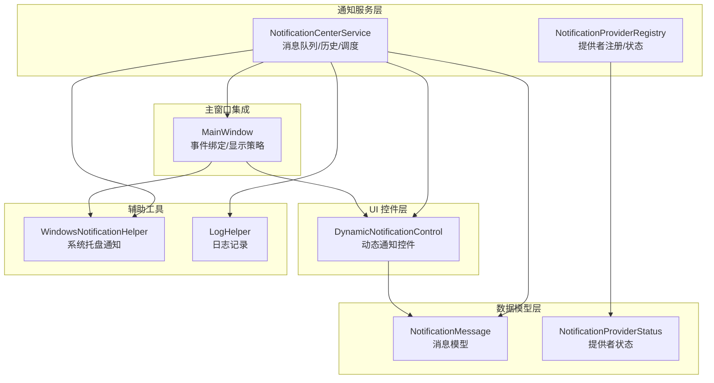
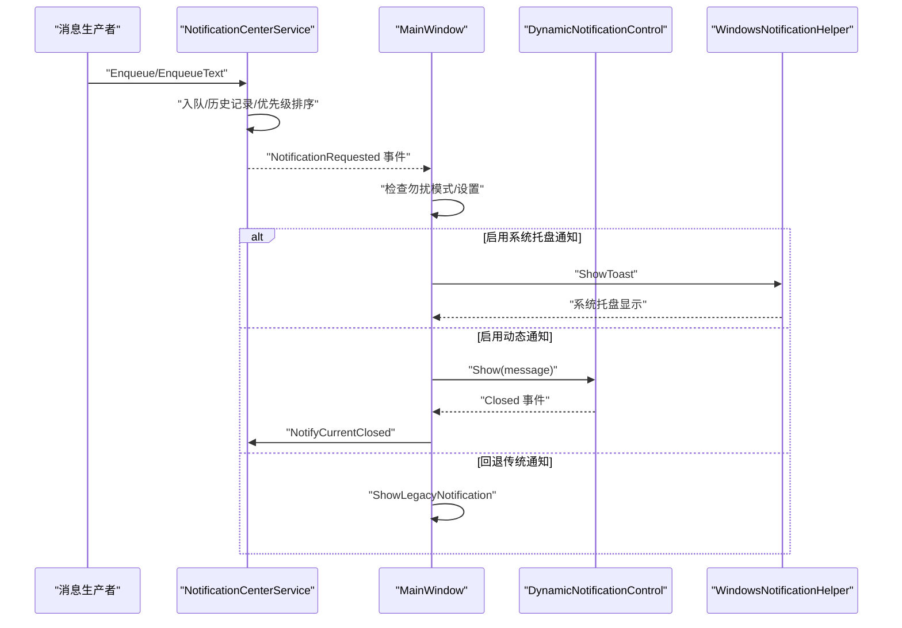
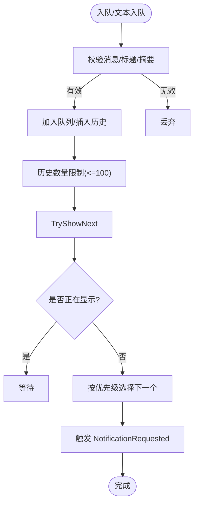
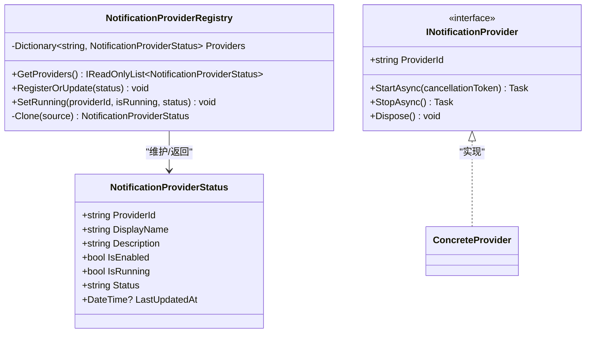
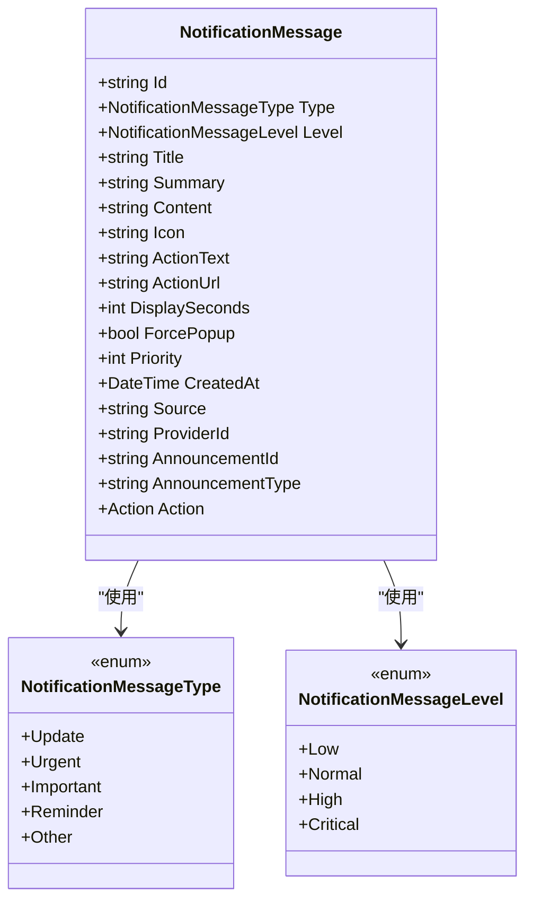
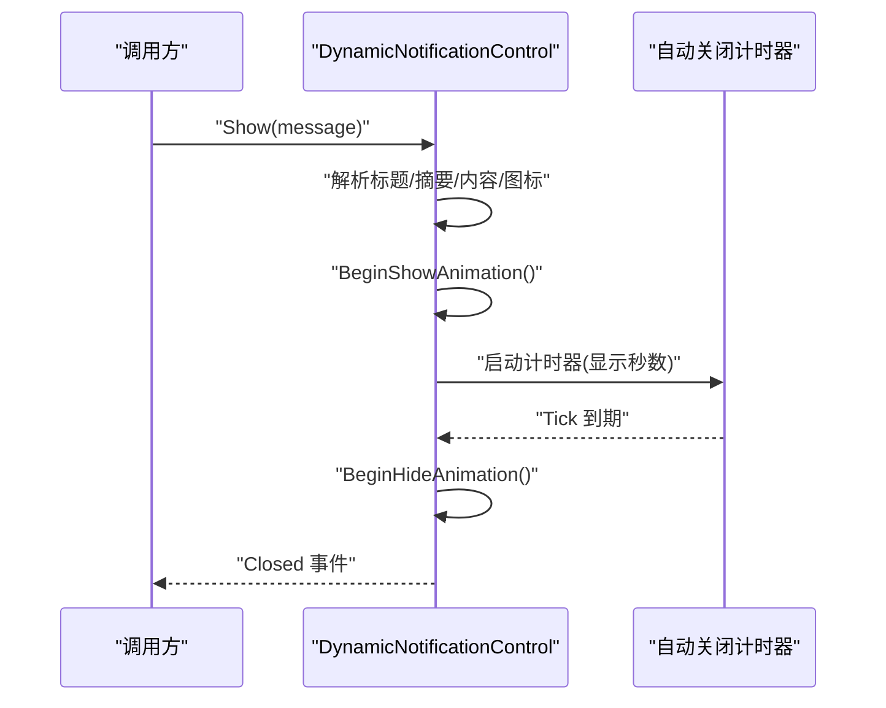
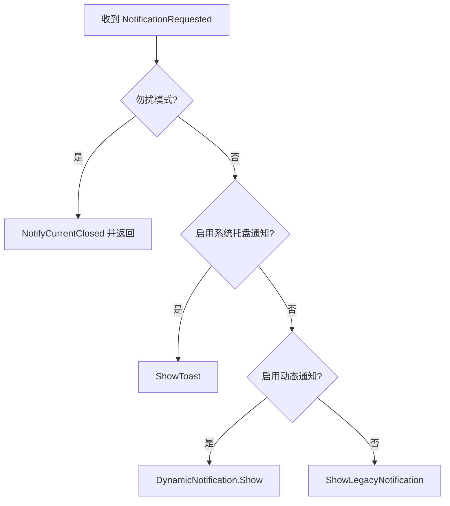
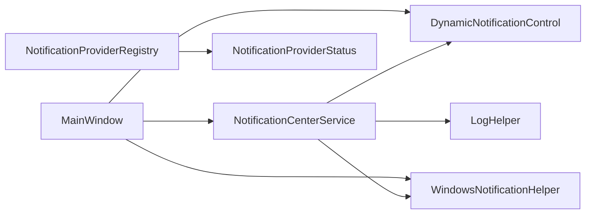

# 通知中心服务

## 简介
本文件为通知中心服务的综合技术文档，围绕 NotificationCenterService 的架构与实现进行深入解析，涵盖通知消息的创建、分发与管理机制；通知提供者的注册与生命周期管理；通知数据模型的设计与优先级策略；动态通知控件的渲染与交互；通知显示策略（位置、动画、关闭机制）；以及扩展指南与性能优化建议。文档面向不同技术背景的读者，力求在保持准确性的同时提升可读性。

## 项目结构
通知系统主要由以下模块构成：
- 通知服务层：负责消息队列、历史记录、优先级调度与事件分发
- 通知提供者注册中心：维护通知提供者状态与运行信息
- 数据模型层：定义通知消息与提供者状态的数据结构
- 动态通知控件：承载通知的可视化展示与交互
- 主窗口集成：接收服务事件并协调多种通知显示策略
- 辅助工具：Windows 托盘通知、日志记录等

## 核心组件
- 通知中心服务（NotificationCenterService）
  - 负责消息入队、历史记录维护、优先级排序与事件派发
  - 提供文本快捷入队接口，支持级别与显示时长配置
  - 通过事件通知外部显示层，具备异常兜底与自动重试能力
- 通知提供者注册中心（NotificationProviderRegistry）
  - 维护提供者状态字典，支持查询、注册更新与运行状态标记
  - 提供只读快照与线程安全访问
- 通知消息模型（NotificationMessage）
  - 定义消息类型、级别、标题摘要、图标、动作、显示时长、优先级、来源与提供者标识等
  - 支持序列化与忽略特定字段
- 动态通知控件（DynamicNotificationControl）
  - 承载通知的视觉呈现与交互，支持展开/收起、悬停暂停、自动关闭、点击动作
  - 提供显示/隐藏动画与事件回调
- 主窗口集成（MainWindow）
  - 订阅通知请求事件，根据设置选择系统托盘通知或动态通知
  - 实现“勿扰模式”抑制策略与传统通知回退
- Windows 托盘通知（WindowsNotificationHelper）
  - 基于系统通知框架实现跨版本兼容的托盘气泡提示
- 日志辅助（LogHelper）
  - 提供统一日志写入与文件夹清理策略，保障稳定性与可观测性

## 架构总览
通知系统采用“服务-控件-主窗口”的分层架构：
- 服务层集中处理消息与状态，解耦显示策略
- 控件层专注 UI 表现与交互，便于扩展与替换
- 主窗口根据用户设置与场景条件选择最优显示路径
- 注册中心与日志工具提供运行期治理与可观测性支撑

## 详细组件分析

### 通知中心服务（NotificationCenterService）
- 消息队列与历史管理
  - 使用线程安全集合与锁保护，确保并发安全
  - 历史列表限制长度，维持最近 100 条记录
- 入队与优先级调度
  - 入队前校验标题/摘要，避免无效消息
  - 排序规则：级别降序 → 优先级降序 → 创建时间升序
- 文本快捷入队
  - 自动生成唯一 ID、类型映射、图标与优先级
- 异常处理与自动恢复
  - 分发异常时记录日志并触发当前通知关闭，避免阻塞后续消息

### 通知提供者注册中心（NotificationProviderRegistry）
- 提供者状态字典
  - 键为提供者 ID（大小写不敏感），值为状态对象副本
- 查询与更新
  - 返回只读快照并按 ID 排序，保证 UI 一致性
  - 更新时记录最后更新时间，支持运行状态标记
- 生命周期管理
  - 通过外部提供者实现接口（INotificationProvider）进行启动/停止

### 通知消息数据模型（NotificationMessage）
- 属性体系
  - 标识与来源：Id、Source、ProviderId、AnnouncementId/Type
  - 视觉与行为：Title、Summary、Content、Icon、ActionText、ActionUrl、ForcePopup
  - 时间与显示：DisplaySeconds、CreatedAt
  - 策略与优先级：Type（消息类型）、Level（级别）、Priority
  - 可执行动作：Action（委托）
- 序列化控制
  - 部分属性（如 Action）通过 JSON 忽略，避免序列化开销与安全风险

### 动态通知控件（DynamicNotificationControl）
- 渲染逻辑
  - 根据消息级别与类型选择图标
  - 自动计算显示时长，支持强制弹窗模式
  - 展开/收起面板，显示摘要与详细内容
- 用户交互
  - 左键点击切换展开状态
  - 关闭按钮与自动计时器关闭
  - 悬停暂停，离开继续倒计时
  - 动作按钮支持执行委托或打开 URL
- 动画与可见性
  - 进场：透明度渐变 + 平移缓动
  - 退场：透明度渐变 + 平移回退，结束后复位状态并触发关闭事件

### 主窗口集成与显示策略（MainWindow）
- 事件绑定
  - 订阅通知请求事件，处理勿扰模式与显示策略
- 显示策略
  - 系统托盘通知：在启用时调用系统通知
  - 动态通知：在启用时交由控件展示
  - 传统通知：作为回退方案，使用滑入/淡出动画
- 勿扰模式
  - 根据设置与当前模式（演示/白板）判断是否抑制通知

### Windows 托盘通知（WindowsNotificationHelper）
- 兼容性策略
  - Win7 使用任务栏气球提示
  - 现代 Windows 使用系统通知构建器
- 参数适配
  - 标题与摘要/内容的优先级处理，确保消息可读性

### 日志与错误处理（LogHelper）
- 日志写入
  - 支持按启动时间归档与大小清理
  - 防递归写入，避免日志风暴
- 错误兜底
  - 通知服务与主窗口在异常时记录日志并关闭当前通知，防止阻塞

## 依赖关系分析
- 组件耦合
  - 服务层与 UI 控件通过事件解耦，便于替换显示策略
  - 主窗口作为编排者，依赖设置与环境状态决定显示路径
- 外部依赖
  - 系统通知框架（现代 Windows）与第三方托盘图标库
  - WPF 动画与事件模型
- 循环依赖
  - 未发现直接循环依赖；控件关闭事件回传至服务层形成单向闭环

## 性能考虑
- 队列与历史管理
  - 使用锁保护与固定容量历史，避免无限增长导致内存压力
- 优先级排序
  - 仅在有新消息或当前无显示时触发，减少不必要的排序开销
- UI 动画与计时器
  - 控件使用轻量动画与一次性计时器，避免资源泄漏
- 日志与 IO
  - 日志写入加锁与防递归，按需归档与清理，降低磁盘占用
- 显示策略
  - 在高负载场景优先使用系统托盘通知，减少 UI 渲染压力

## 故障排除指南
- 通知不显示
  - 检查勿扰模式设置与当前场景（演示/白板）
  - 确认动态通知开关与控件实例可用
  - 查看日志文件定位异常
- 动态通知无法关闭
  - 检查鼠标悬停区域与按钮点击事件
  - 确认计时器是否被意外暂停
- 系统托盘通知失败
  - 确认系统通知权限与版本兼容性
  - 查看异常日志中的具体错误信息
- 历史记录异常
  - 确认历史上限与入队逻辑，避免重复或无效消息

## 结论
通知中心服务通过清晰的分层设计与事件驱动机制，实现了消息的可靠入队、智能调度与多策略显示。配合提供者注册中心与完善的日志体系，系统在可扩展性、可观测性与用户体验方面均具备良好表现。建议在实际集成中关注显示策略配置与性能监控，持续优化优先级与动画体验。

## 附录

### 扩展指南：自定义通知提供者
- 实现接口
  - 实现提供者接口，定义 ProviderId，并在启动/停止阶段处理资源生命周期
- 注册与状态上报
  - 通过注册中心上报状态，包含启用/运行状态与最后更新时间
- 与服务集成
  - 在合适时机启动提供者，生成并入队通知消息，利用现有事件分发机制

### 设置页面与显示策略配置
- 设置项概览
  - 启用公告、强制弹窗、连接参数（API/WS/Token）、动态通知开关、系统托盘通知开关、勿扰模式（含演示/白板细分）
  - 通知位置（顶部居中/右上/左上）、动画模式（关闭/简单/标准）、各类别显示时长滑块、测试按钮
- 配置生效
  - 主窗口根据设置选择系统托盘或动态通知，未启用时回退传统通知

章节来源
