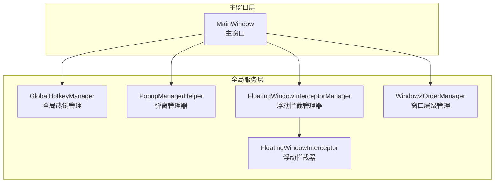
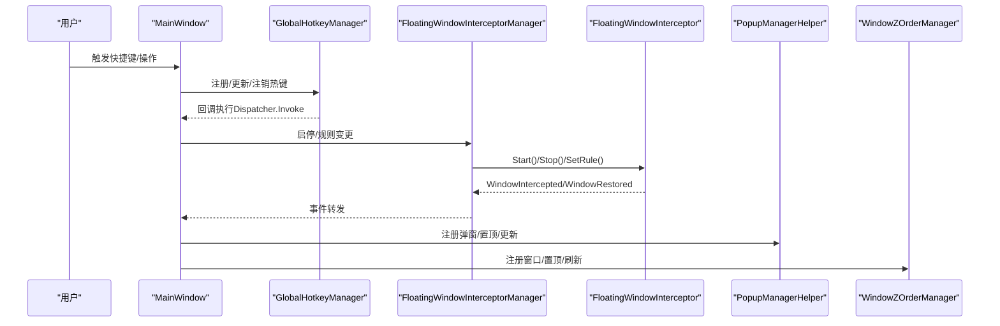
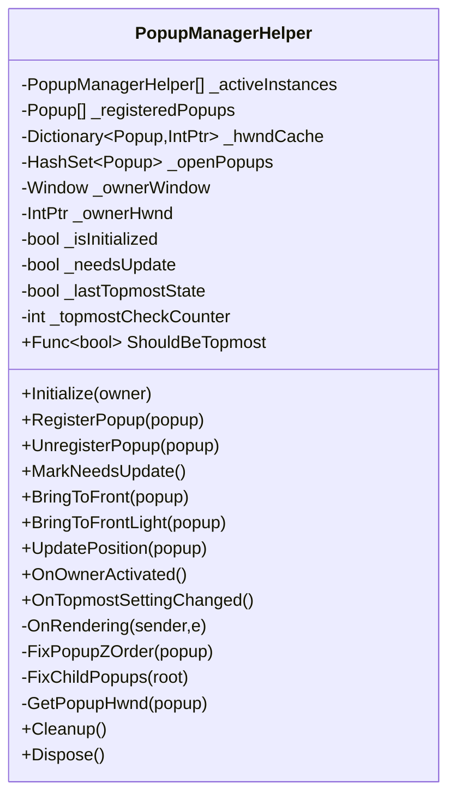
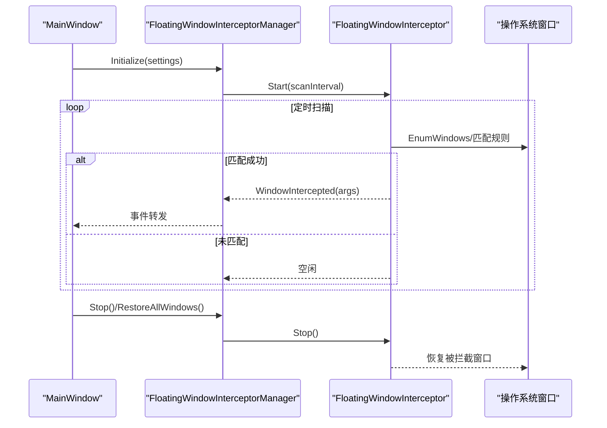
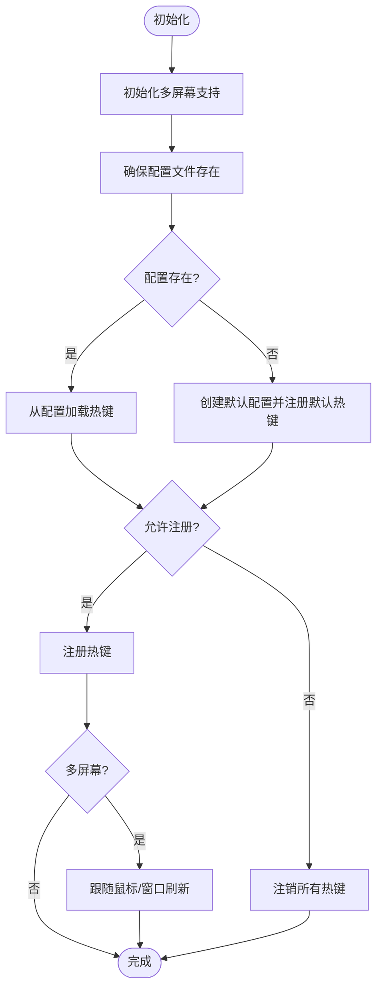
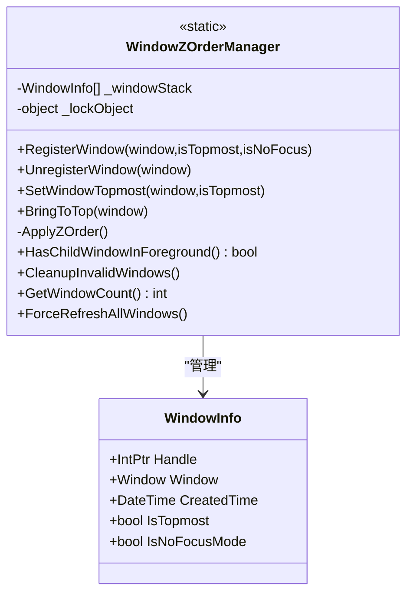
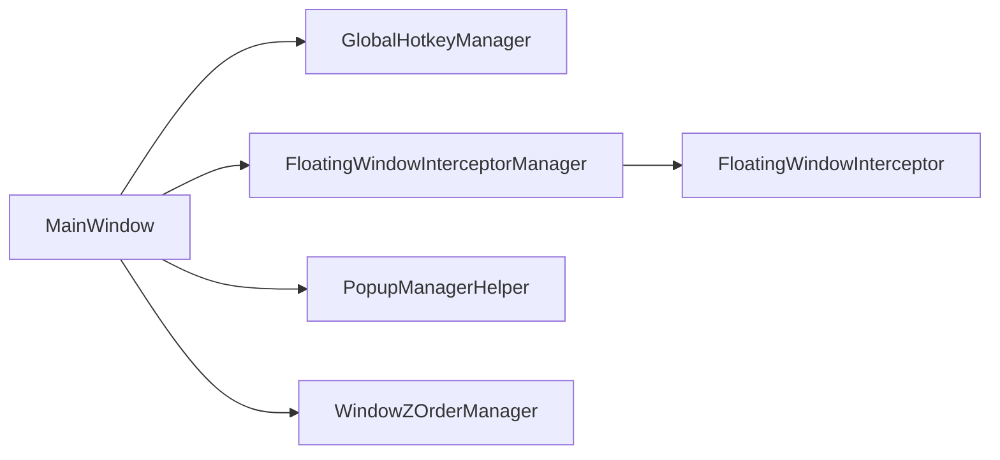

# 服务通信模式

## 引言
本文件聚焦 InkCanvasForClass 中全局服务之间的通信机制与协作模式，围绕以下主题展开：
- 弹窗管理器的事件分发与状态同步
- 浮动窗口拦截器的管理策略与优先级处理
- 全局热键管理的键盘事件捕获与快捷键响应
- 窗口层级管理的架构设计与焦点管理
- 服务间通信的最佳实践（事件驱动、消息传递、异步处理）
- 性能优化与并发安全建议

## 项目结构
InkCanvasForClass 采用“主窗口 + 多个全局服务”的架构。主窗口负责聚合与编排，各全局服务通过事件与方法调用进行松耦合通信。

## 核心组件
- 弹窗管理器（PopupManagerHelper）
  - 负责弹窗的注册、打开/关闭事件处理、Z-Order 置顶、位置更新与子弹窗同步。
  - 关键点：渲染回调周期性检查、Hwnd 缓存、条件置顶策略。
- 浮动窗口拦截器（FloatingWindowInterceptor + Manager）
  - 管理拦截规则、扫描线程、事件分发（拦截/恢复）、统计与配置应用。
  - 关键点：父子规则联动、扫描间隔、运行状态维护。
- 全局热键管理（GlobalHotkeyManager）
  - 基于 NHotkey 实现全局快捷键注册、跨屏幕支持、智能启用/禁用、动作调度。
  - 关键点：主线程调度、多屏幕与鼠标跟踪、配置持久化。
- 窗口层级管理（WindowZOrderManager）
  - 维护窗口栈、置顶策略、焦点与可见性判断、强制刷新。
  - 关键点：临界区锁、Win32 API 调用、无焦点模式下的层级策略。

## 架构总览
全局服务通过主窗口进行统一初始化与事件桥接，形成“主窗口编排 + 服务自治 + 事件驱动”的协作模式。

## 详细组件分析

### 弹窗管理器（PopupManagerHelper）
职责与流程
- 初始化与注册：绑定 CompositionTarget.Rendering，注册弹窗 Opened/Closed 事件，缓存 Hwnd。
- 状态同步：周期性检查与修复 Z-Order；支持“条件置顶”策略（ShouldBeTopmost）。
- 事件驱动：弹窗打开/关闭、主窗口激活、置顶状态变更均触发同步。
- 位置更新：通过微调 Offset 触发布局重算，保证视觉一致性。

### 浮动窗口拦截器（FloatingWindowInterceptor + Manager）
职责与流程
- 管理器（Manager）：封装拦截器生命周期、事件桥接、规则联动、配置应用与统计。
- 拦截器（Interceptor）：基于扫描线程枚举窗口，按规则匹配并隐藏/恢复目标窗口，发布事件。
- 优先级与父子规则：父规则启用/禁用会联动子规则；子规则启用/禁用会联动父规则。

### 全局热键管理（GlobalHotkeyManager）
职责与流程
- 注册/注销：基于 NHotkey 注册全局快捷键，避免冲突，支持重复注册替换。
- 主线程调度：在回调中通过 Dispatcher.Invoke 切换到 UI 线程执行业务逻辑。
- 多屏幕与智能启用：根据窗口位置、焦点、鼠标位置动态刷新热键注册。
- 配置持久化：支持从 JSON 配置文件加载/保存，支持默认快捷键回退。

### 窗口层级管理（WindowZOrderManager）
职责与流程
- 注册/注销：维护窗口栈，记录 Hwnd、创建时间、置顶与无焦点模式标记。
- 置顶策略：对置顶且可见的窗口统一置顶，必要时修正扩展样式。
- 焦点与前台：检测前景是否有子窗口，清理无效记录，强制刷新。

### 主窗口集成与事件桥接
- 浮动拦截器集成：主窗口初始化拦截器管理器，订阅拦截/恢复事件，通过设置项控制启停与规则联动。
- 热键事件桥接：主窗口提供具体 UI 行为（如撤销、重做、工具切换），由热键管理器在回调中调度。

## 依赖关系分析
- 主窗口对全局服务的依赖：MainWindow 持有各服务实例并进行初始化与事件桥接。
- 服务内聚与解耦：
  - 弹窗管理器与拦截器管理器分别独立维护状态与事件。
  - 热键管理器与窗口层级管理器通过主窗口间接交互。
- 外部依赖：
  - NHotkey（全局热键）
  - Win32 API（窗口层级、样式、可见性）
  - WPF Dispatcher（UI 线程调度）

## 性能考量
- 渲染回调节流：弹窗管理器通过计数器与最小更新间隔降低频繁置顶带来的开销。
- 扫描线程与间隔：拦截器使用定时器扫描，合理设置扫描间隔，避免高负载。
- UI 线程调度：热键回调通过 Dispatcher.Invoke 切换到 UI 线程，避免跨线程访问。
- Hwnd 缓存：弹窗管理器缓存 Hwnd，减少频繁查询与验证成本。
- 并发安全：窗口层级管理器使用锁保护共享状态，避免竞态。

## 故障排查指南
- 弹窗置顶异常
  - 检查 ShouldBeTopmost 返回值与 Owner 激活事件是否触发。
  - 确认 Hwnd 缓存有效性与 IsWindow 校验。
- 拦截器未生效
  - 核对规则启用状态与父子规则联动。
  - 检查扫描间隔与运行状态，确认已 Start。
- 热键不响应
  - 检查是否处于允许注册状态（多屏幕/焦点/鼠标位置策略）。
  - 确认配置文件存在且可读，必要时回退默认配置。
- 窗口层级错乱
  - 调用 ForceRefreshAllWindows 或 CleanupInvalidWindows。
  - 检查置顶与无焦点模式设置。

## 结论
InkCanvasForClass 通过主窗口统一编排，结合事件驱动与方法调用，实现了全局服务间的低耦合协作。弹窗管理器、浮动拦截器、全局热键与窗口层级管理各司其职，并通过清晰的生命周期与事件桥接保障稳定性与可维护性。建议在生产环境中进一步完善日志分级、异常隔离与资源回收策略，持续优化扫描与调度频率以平衡性能与实时性。

## 附录
- 旧式系统热键（Win32）示例：用于理解底层机制，当前项目主要使用 NHotkey。
  
章节来源
