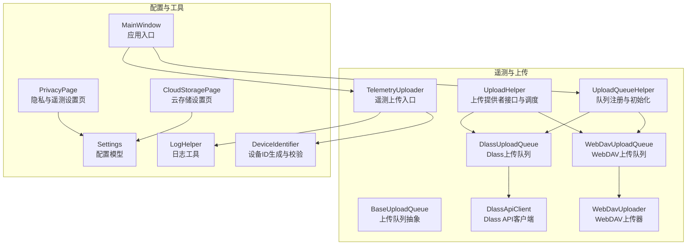
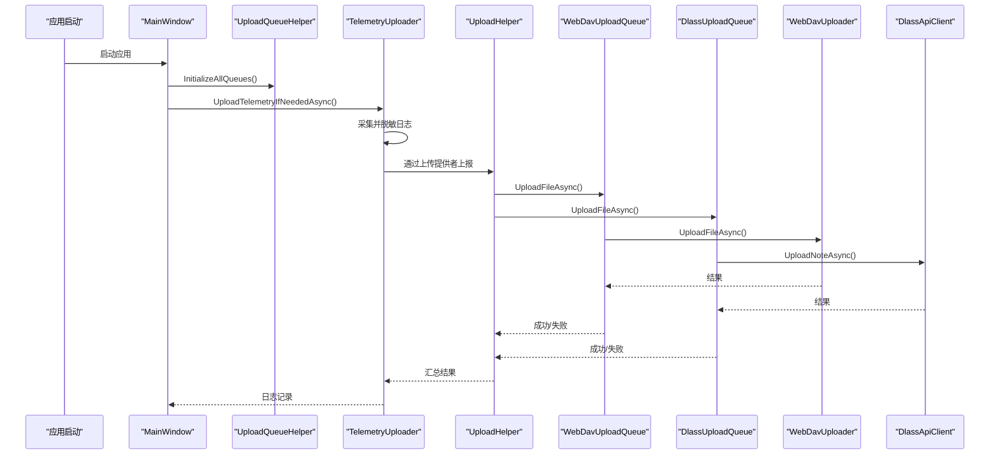
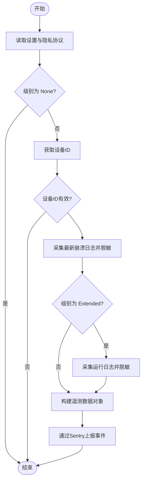
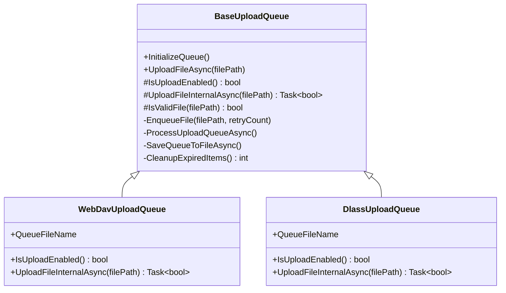
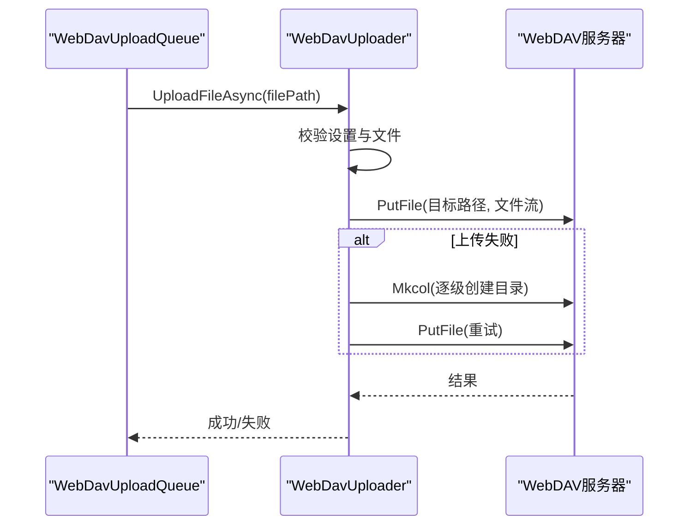
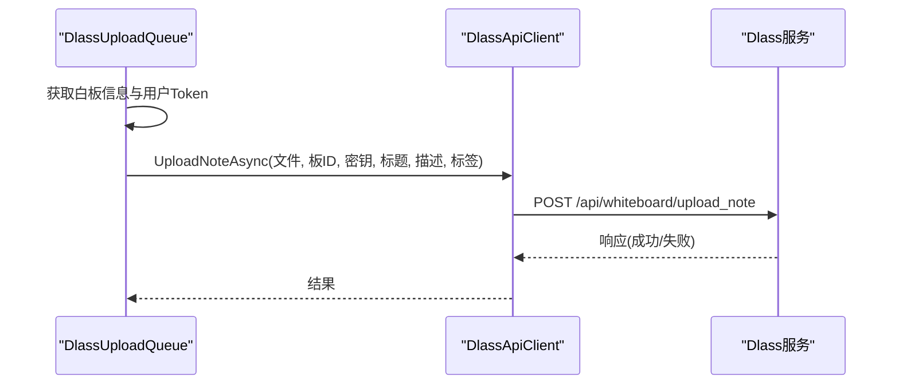
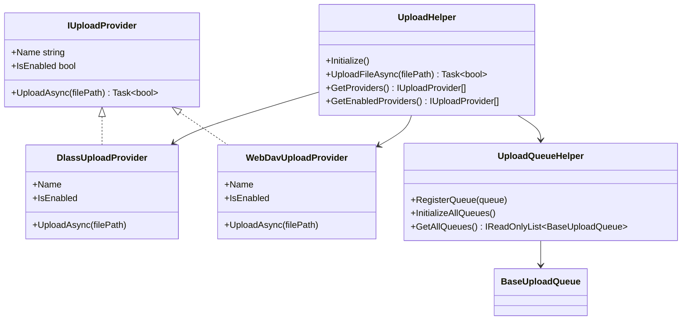
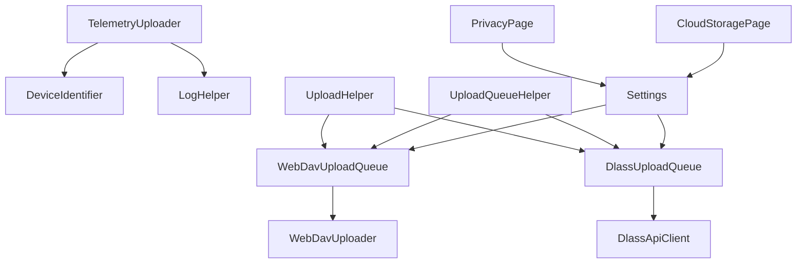

# 遥测服务

## 简介
本文件面向“遥测服务”的实现与使用，重点围绕 TelemetryUploader 的架构设计与实现机制展开，涵盖遥测数据的采集、脱敏、格式化与上报流程；上传队列系统的设计与实现（BaseUploadQueue 抽象与 WebDavUploadQueue/DlassUploadQueue 具体实现）；遥测数据的分类与优先级管理（不同级别数据的处理策略与批量上传机制）；数据传输的安全保障（加密传输、身份验证与数据完整性校验）；配置管理（上传频率、数据保留策略与网络状态检测）；以及遥测数据的分析与可视化方法、性能优化策略与故障恢复机制。

## 项目结构
遥测相关代码主要集中在 Ink Canvas\Helpers 下，配合设置页与资源定义共同构成完整的遥测体系：
- 遥测上传入口与脱敏逻辑：TelemetryUploader
- 上传队列抽象与通用实现：BaseUploadQueue
- 具体上传提供者与队列：WebDavUploadQueue、DlassUploadQueue
- 上传提供者接口与统一调度：UploadHelper、UploadQueueHelper
- 上传客户端与 WebDAV 上传器：DlassApiClient、WebDavUploader
- 设备标识与日志工具：DeviceIdentifier、LogHelper
- 配置与设置页：PrivacyPage、CloudStoragePage、Settings

## 核心组件
- TelemetryUploader：负责遥测数据的采集、脱敏与上报，支持 Basic/Extended 级别，分别上传崩溃日志与运行日志，并通过 Sentry 上报事件。
- BaseUploadQueue：上传队列抽象基类，定义通用的队列行为（初始化、入队、批量处理、重试、持久化、过期清理、文件校验等）。
- WebDavUploadQueue/DlassUploadQueue：具体上传队列实现，分别对接 WebDAV 与 Dlass 服务，封装上传逻辑与条件判断。
- UploadHelper/UploadQueueHelper：提供上传提供者接口与统一调度，注册并初始化各上传队列，支持延迟上传与并发上传。
- WebDavUploader/DlassApiClient：底层上传器与 API 客户端，负责网络传输、认证与错误处理。
- DeviceIdentifier/LogHelper：设备标识生成与日志记录，保障遥测与上传过程的可观测性与可追溯性。
- 配置与设置页：PrivacyPage/CloudStoragePage 与 Settings 模型，提供遥测级别、隐私协议、上传提供者与 WebDAV/Dlass 参数配置。

## 架构总览
遥测服务采用“采集-脱敏-队列-上传-上报”的流水线式架构。应用启动后，MainWindow 初始化上传队列并触发 TelemetryUploader 进行遥测上报；上传队列通过 UploadHelper/UploadQueueHelper 统一调度，支持多种上传提供者与批量上传、重试与持久化。

## 详细组件分析

### TelemetryUploader：遥测数据采集、脱敏与上报
- 数据采集与级别控制
  - 依据设置中的 TelemetryUploadLevel（None/Basic/Extended）决定是否采集与上报。
  - Basic 级别：采集最新崩溃日志（脱敏）。
  - Extended 级别：额外采集运行日志（脱敏）。
- 脱敏策略
  - 使用正则表达式对邮箱、手机号、IPv4、Windows 路径、UNC 路径、URL 参数、键值对与 JSON 字段中的敏感信息进行替换。
- 设备与环境信息
  - 通过 DeviceIdentifier 获取设备 ID，附加应用版本、操作系统版本、更新通道等元数据。
- 上报渠道
  - 通过 Sentry SDK 上报事件，包含用户信息与遥测数据标签与附加信息。

### BaseUploadQueue：上传队列抽象与通用实现
- 队列与持久化
  - 使用并发队列存储待上传项，支持序列化保存至 Configs 目录下的 JSON 文件，避免重启丢失。
- 批量上传与并发
  - 默认批量大小为 10，异步并发上传，完成后保存队列状态。
- 重试与错误处理
  - 最大重试次数为 3；根据错误类型（超时、网络错误、特定 HTTP 状态码）判定是否可重试。
- 文件校验与过期清理
  - 校验文件扩展名与大小；队列项最大存活时间为 72 小时，定期清理过期项。
- 并发控制
  - 使用信号量控制队列处理与保存的并发，避免竞争与死锁。

### WebDavUploadQueue 与 WebDavUploader：WebDAV 上传实现
- WebDavUploadQueue
  - 队列文件名为 WebDavUploadQueue.json；上传启用条件由 WebDavUploader.IsWebDavEnabled() 判断。
  - UploadFileInternalAsync 调用 WebDavUploader.UploadFileAsync 完成实际上传。
- WebDavUploader
  - 读取设置中的 WebDAV 地址、用户名、密码与根目录，构造目标路径。
  - 若首次上传失败，尝试创建目录后再上传；支持取消令牌与异常处理。

### DlassUploadQueue 与 DlassApiClient：Dlass 上传实现
- DlassUploadQueue
  - 队列文件名为 DlassUploadQueue.json；上传启用条件为设置中开启自动上传。
  - UploadFileInternalAsync 获取白板信息与用户 Token，准备上传参数（标题、描述、标签），调用 DlassApiClient.UploadNoteAsync 完成上传。
- DlassApiClient
  - 支持 OAuth 获取 Access Token 或使用用户 Token；支持 GET/POST/PUT/DELETE 请求与文件上传。
  - 上传时设置白板认证头（X-Board-ID、X-Secret-Key）与文件内容。

### UploadHelper 与 UploadQueueHelper：上传提供者与队列管理
- UploadHelper
  - 定义 IUploadProvider 接口，提供 WebDavUploadProvider 与 DlassUploadProvider，默认注册并绑定对应队列。
  - UploadFileAsync 支持上传延迟（分钟）、文件可访问性检查、并发上传多个提供者、错误日志记录。
- UploadQueueHelper
  - 统一注册与初始化所有上传队列，确保应用启动后队列可用。

## 依赖关系分析
- 组件耦合
  - TelemetryUploader 依赖 DeviceIdentifier 与 LogHelper，通过 Sentry 上报遥测事件。
  - 上传队列依赖 UploadHelper/UploadQueueHelper 进行注册与初始化。
  - WebDavUploadQueue 依赖 WebDavUploader；DlassUploadQueue 依赖 DlassApiClient。
- 外部依赖
  - Sentry SDK 用于遥测事件上报。
  - WebDav 客户端库用于 WebDAV 上传。
  - HttpClient 用于 Dlass API 通信。
- 配置依赖
  - Settings 模型提供 Dlass/WebDAV 参数与上传延迟等配置；PrivacyPage/CloudStoragePage 提供用户交互界面。

## 性能考量
- 批量上传与并发
  - 默认批量大小为 10，减少网络连接开销；并发上传提升吞吐。
- 队列持久化与恢复
  - 队列状态保存至 JSON 文件，应用重启后自动恢复，避免重复上传。
- 过期清理与容量控制
  - 最大队列长度与 72 小时过期时间限制，防止内存与磁盘膨胀。
- 重试策略
  - 最大重试次数为 3，结合可重试错误类型（超时、网络错误、部分 HTTP 状态码）降低失败率。
- 上传延迟
  - UploadHelper 支持分钟级上传延迟，平滑网络负载。

## 故障排查指南
- 遥测上传失败
  - 检查隐私协议是否同意与 TelemetryUploadLevel 是否为 None。
  - 确认设备 ID 是否有效。
  - 查看日志文件中的 Warning/Error 记录。
- 上传队列异常
  - 检查 Configs 目录下队列 JSON 文件是否损坏或权限问题。
  - 关注队列恢复日志与过期清理记录。
- WebDAV 上传失败
  - 校验 WebDAV 地址、用户名、密码与根目录设置。
  - 确认网络连通性与目录创建权限。
- Dlass 上传失败
  - 校验用户 Token、白板信息与认证头设置。
  - 检查 API 基础地址与网络状态。

## 结论
遥测服务通过 TelemetryUploader 实现遥测数据的采集与脱敏上报，借助 BaseUploadQueue 抽象与 WebDavUploadQueue/DlassUploadQueue 实现稳定可靠的批量上传与重试机制；UploadHelper/UploadQueueHelper 提供统一的上传提供者与队列管理；配合 Settings 与设置页实现灵活的配置与用户体验。整体架构具备良好的扩展性、可观测性与容错能力。

## 附录
- 配置项参考
  - 遥测级别与隐私协议：PrivacyPage
  - Dlass/WebDAV 参数与自动上传：CloudStoragePage
  - 上传延迟与提供者启用：Settings 中 Upload/Dlass/WebDav 相关字段
- 数据保留策略
  - 日志文件夹大小超过 5MB 时清空，避免无限增长。
- 网络状态检测
  - 上传器内部通过异常与 HTTP 状态码识别网络错误与超时，结合重试策略提升成功率。

章节来源
