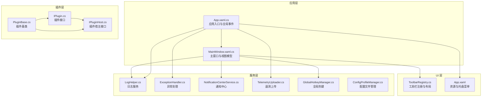
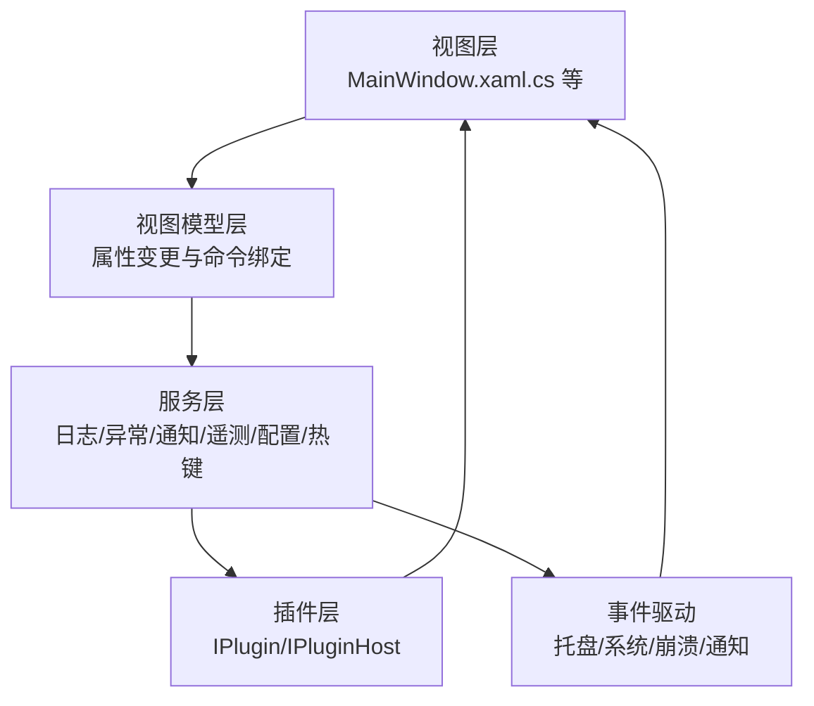
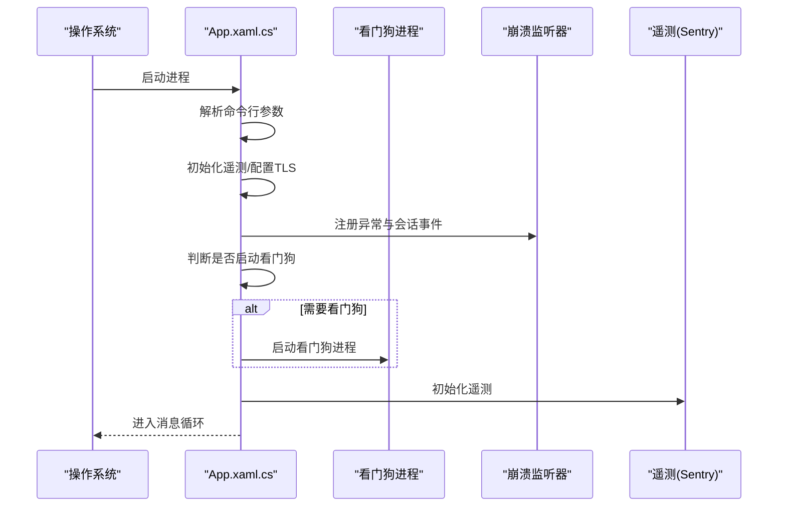
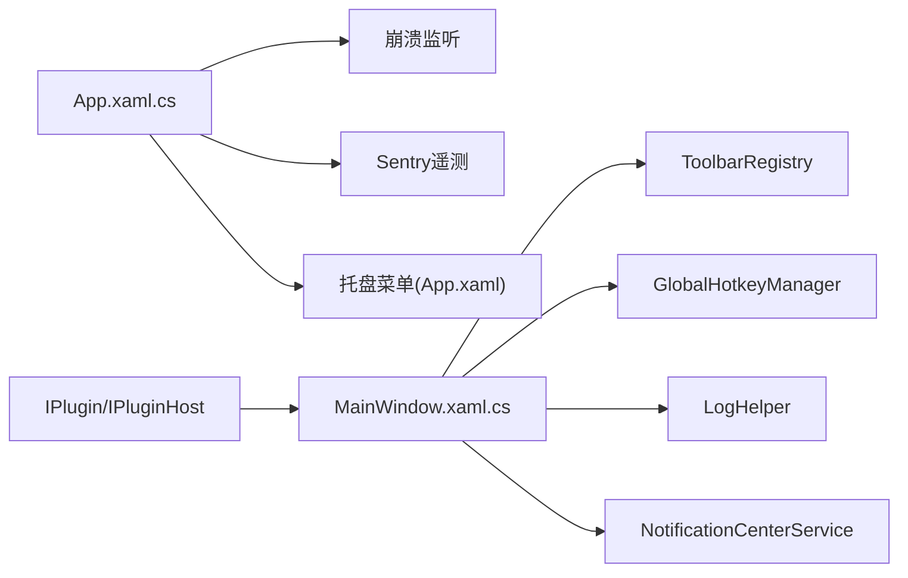

# 系统架构设计

## 引言
本文件面向 InkCanvasForClass 的系统架构设计，围绕 MVVM 架构模式、模块化与分层设计、应用程序入口与启动流程、全局服务与事件驱动、配置管理、监控与诊断等方面进行全面阐述。文档旨在帮助开发者与维护者快速理解系统设计思想、关键实现与扩展点。

## 项目结构
InkCanvasForClass 采用 WPF 桌面应用架构，结合模块化与分层设计，将 UI、业务逻辑、辅助服务与插件体系解耦。核心目录与职责概览如下：
- Ink Canvas：主应用工程，包含 UI、主窗口、工具栏、弹窗、设置视图、国际化资源、样式与图标资源等。
- Helpers：通用服务与基础设施，如日志、异常处理、配置文件管理、遥测、通知中心、全局热键、PPT/COM 辅助等。
- Controls：可复用 UI 控件与工具栏系统，支持动态布局与规则化显示。
- Windows：各类窗口与设置页面，承载具体功能视图。
- InkCanvas.PluginSdk：插件接口与宿主契约，定义插件生命周期与服务注册能力。
- 配置与资源：App.config、App.xaml、资源字典、本地化字符串等。

## 核心组件
- 应用入口与生命周期管理：App.xaml.cs 负责应用启动、命令行参数解析、看门狗监控、崩溃监听、异常处理、托盘菜单与资源初始化。
- 主窗口与视图模型：MainWindow.xaml.cs 承载 UI 逻辑、工具栏注入、通知、计时器、PPT/COM 集成、全局热键、页面与画布管理。
- 日志与异常：LogHelper 提供统一日志写入与归档；ExceptionHandler 提供异常处理与继续执行策略。
- 通知中心：NotificationCenterService 提供消息队列、历史记录与优先级调度。
- 遥测与诊断：TelemetryUploader 负责脱敏遥测数据收集与上报；崩溃日志与运行日志收集。
- 配置管理：ConfigProfileManager 支持多配置文件保存、切换与热重载。
- 工具栏系统：ToolbarRegistry 提供动态布局、规则化显示与配置持久化。
- 全局热键：GlobalHotkeyManager 提供跨屏幕、上下文感知的热键注册与管理。
- 插件系统：IPlugin/IPluginHost/PluginBase 定义插件生命周期与服务注册契约。

## 架构总览
InkCanvasForClass 采用 MVVM 与模块化分层架构：
- 视图层（View）：MainWindow 与各窗口/控件，负责渲染与用户交互。
- 视图模型（ViewModel）：MainWindow 承担大量视图模型职责（MVVM 混合），通过属性变更通知与命令绑定实现数据驱动。
- 服务层（Service）：日志、异常、通知、遥测、配置、热键等服务以静态/单例方式提供。
- 插件层（Plugin）：通过 IPlugin/IPluginHost 抽象实现功能扩展与生命周期管理。
- 事件驱动：全局事件（托盘菜单、系统事件、崩溃事件）、通知中心事件、工具栏规则评估等形成松耦合的消息流。

[本图为概念性架构示意，不直接映射具体源码文件]

## 详细组件分析

### 应用入口与启动流程（App.xaml.cs）
- 启动阶段：解析命令行参数、设置 AppUserModelID、初始化遥测（Sentry）、配置 TLS 协议以兼容 Windows 7。
- 看门狗监控：识别 --watchdog 参数，启动看门狗主循环；根据崩溃行为（静默重启）决定是否启动看门狗。
- 崩溃监听：注册未处理异常、控制台中断、系统会话结束、进程退出等事件，统一写入崩溃日志并清理资源。
- 启动画面：条件加载启动画面，支持进度与消息更新。
- 全局异常处理：UI 线程与非 UI 线程异常分别处理，对特定 COM 异常进行安全降级。

## 依赖关系分析
- 组件耦合：
  - MainWindow 与 ToolbarRegistry 强耦合（注入与布局），但通过规则系统降低硬编码。
  - App 与崩溃监听、托盘菜单、遥测强耦合，体现全局服务特性。
  - 插件系统通过 IPluginHost 松耦合，避免核心对扩展的直接依赖。
- 外部依赖：
  - Sentry 用于遥测与崩溃上报。
  - NHotkey 用于全局热键。
  - WPF/XAML 资源与现代 UI 控件库。

## 性能考虑
- 启动优化：启动画面与进度提示，减少用户感知等待；条件加载与懒初始化（如日志目录、配置文件）。
- 线程模型：UI 事件在 Dispatcher 上执行，避免跨线程访问 UI；全局热键回调在主线程调度。
- I/O 与磁盘：日志与配置文件写入采用带写保护的目录创建与原子写入策略；日志文件夹大小限制与清理。
- 异常与稳定性：针对 WPF InkCanvas 已知线程访问问题进行安全降级；崩溃监听与看门狗保障可用性。
- 遥测开销：脱敏与异步上报，避免阻塞主线程。

[本节为通用性能建议，不直接分析具体代码片段]

## 故障排查指南
- 崩溃日志定位：崩溃日志位于应用根目录的 Crashes 文件夹，按启动时间命名，包含内存/CPU/运行时长等状态信息。
- 日志查看：LogHelper 支持按启动时间归档或单一文件模式，具备递归日志保护与清理策略。
- 异常处理：ExceptionHandler 提供异常记录与继续执行策略，区分致命异常（内存/访问冲突）与可恢复异常。
- 看门狗：通过 --watchdog 参数识别看门狗进程，必要时终止主流程以进入监控循环。
- 遥测诊断：TelemetryUploader 收集崩溃与运行日志（脱敏），便于远程诊断。

## 结论
InkCanvasForClass 通过 MVVM 与模块化分层设计，结合事件驱动与全局服务，实现了稳定、可扩展且易于维护的桌面应用架构。应用入口的启动流程、崩溃监控与看门狗保障了可用性；配置管理与工具栏系统提供了灵活的布局与策略控制；插件系统为生态扩展奠定基础。建议在后续迭代中进一步明确 MVVM 分层边界、引入依赖注入容器以增强服务解耦，并完善单元测试与可观测性指标。

## 附录
- 配置文件位置：Configs/Settings.json（当前生效）、Configs/Profiles/*（多配置文件）、Configs/HotkeyConfig.json（热键配置）、Configs/ToolbarConfigs/*（工具栏布局）。
- 资源与主题：App.xaml 聚合资源字典与现代 UI 资源；托盘菜单与图标资源集中管理。
- 运行时配置：App.config 指定 .NET 运行时版本与兼容策略。