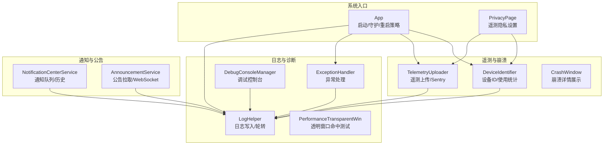
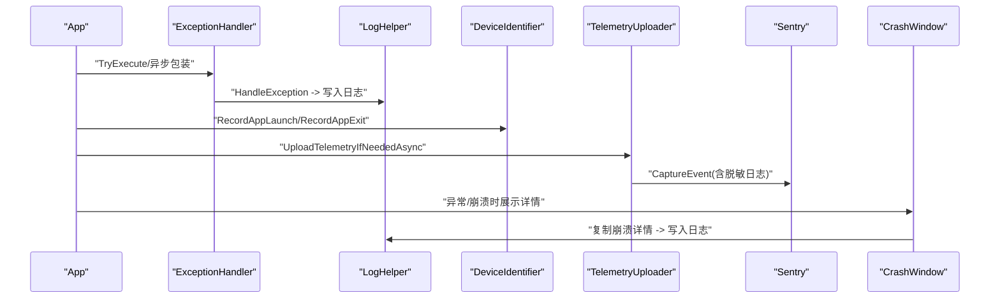
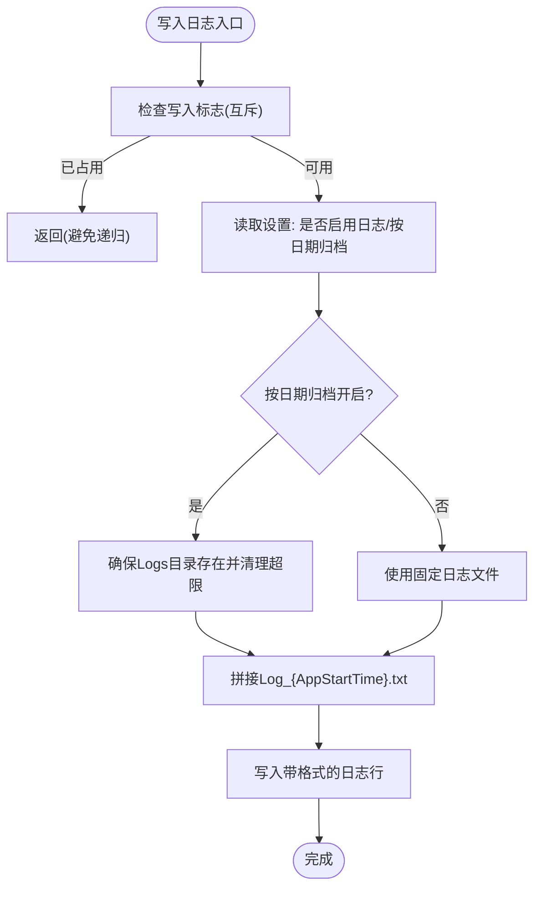
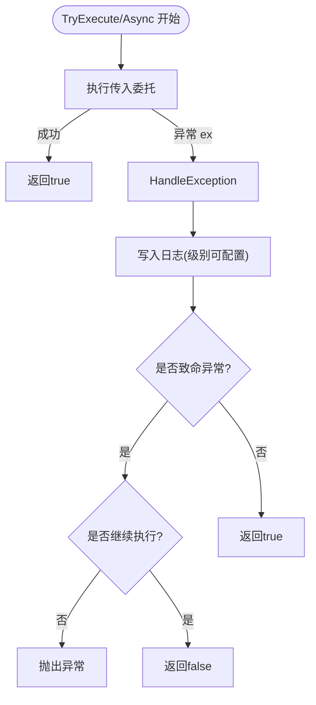
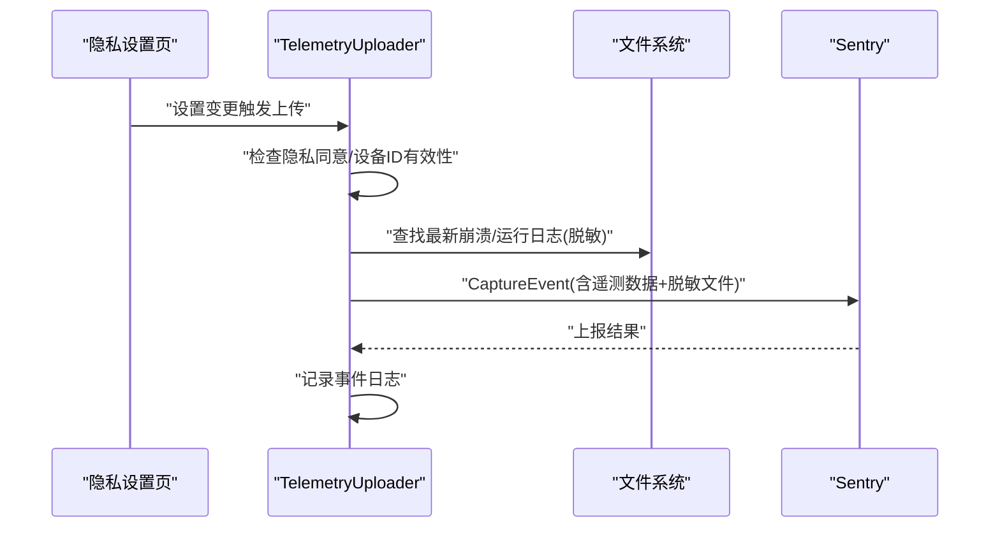
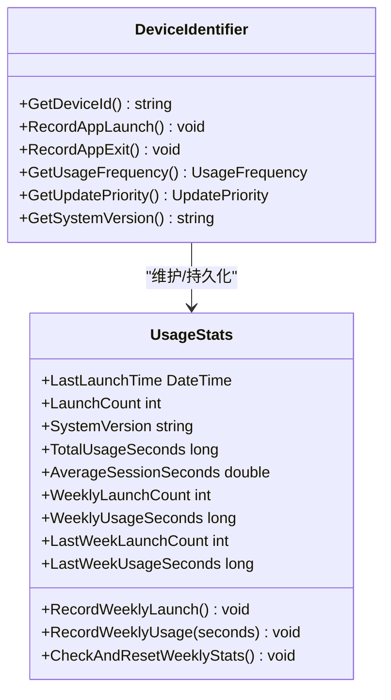
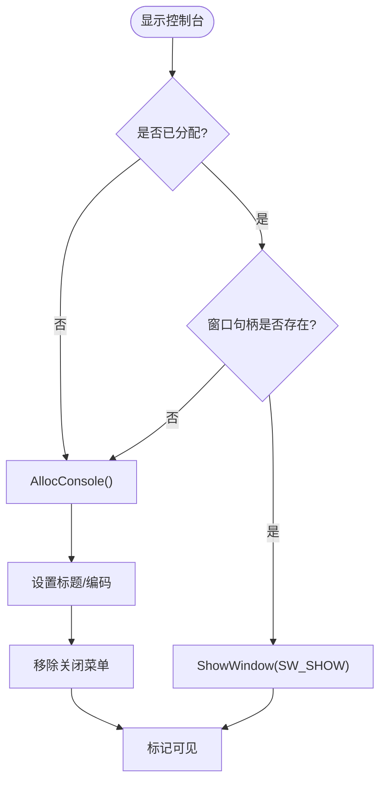
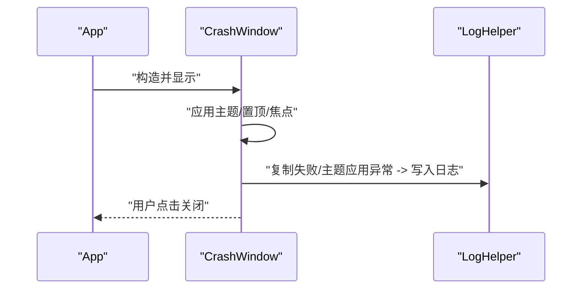
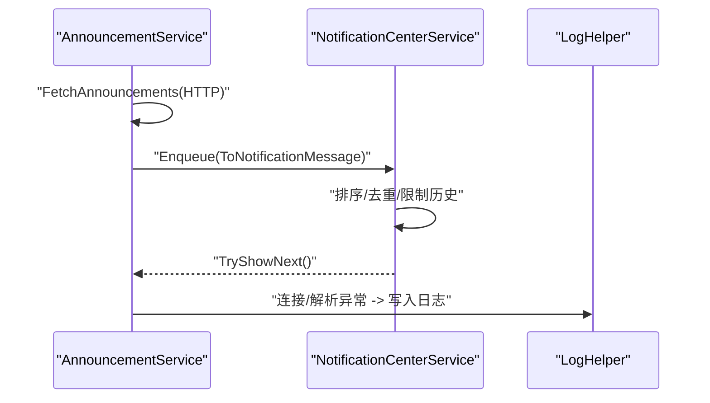
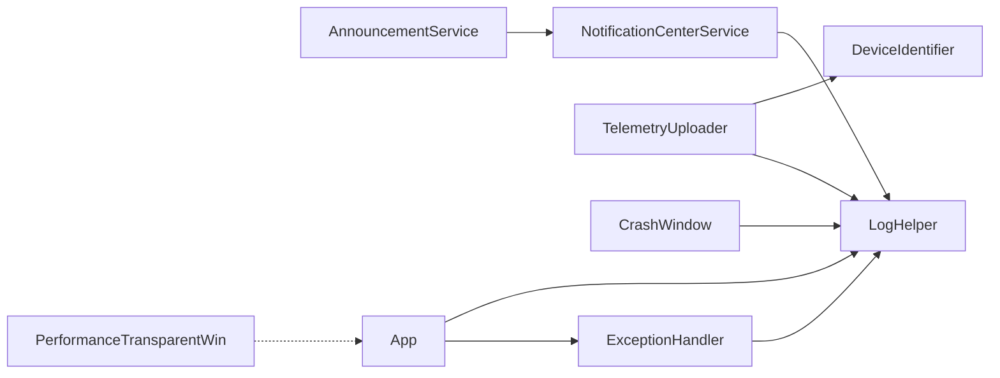

# 监控与诊断系统

## 简介
本文件面向 InkCanvasForClass 的监控与诊断系统，系统性梳理其整体架构与实现要点，覆盖以下方面：
- 性能监控与内存使用跟踪
- 错误日志收集与系统健康检查
- 日志系统实现机制（级别、格式、轮转、远程传输）
- 遥测数据采集与分析（用户行为统计、性能指标、崩溃数据分析）
- 诊断工具集成（调试控制台、性能分析、内存泄漏检测辅助）
- 监控告警机制（阈值、规则与通知策略）
- 扩展与定制指南（自定义指标、监控面板与报表）
- 监控数据的隐私保护与合规性

## 项目结构
监控与诊断相关代码主要集中在 Ink Canvas/Helpers 与 Ink Canvas/Windows 下列模块：
- 日志与异常处理：LogHelper、ExceptionHandler、DebugConsoleManager
- 遥测与崩溃上报：TelemetryUploader、DeviceIdentifier
- 系统健康与崩溃窗口：App（启动与守护）、CrashWindow
- 通知中心与公告：NotificationCenterService、AnnouncementService
- 性能透明窗口：PerformanceTransparentWin（渲染与命中测试）

## 核心组件
- 日志系统（LogHelper）
  - 支持按启动时间归档与固定文件两种模式，自动清理超限日志文件夹，防止磁盘膨胀。
  - 提供统一日志写入接口，包含时间戳、线程ID、日志级别与调用者信息。
- 异常处理（ExceptionHandler）
  - 统一封装异常捕获与日志记录，区分致命异常（如内存溢出、访问违例）与可恢复异常。
  - 提供同步与异步执行包装，支持上下文字符串与继续执行策略。
- 遥测上传（TelemetryUploader）
  - 基于 Sentry 的遥测事件上报，包含设备ID、更新通道、应用版本、OS版本等元数据。
  - 支持 Basic/Extended 两个级别，Extended 会附加脱敏后的运行日志。
  - 自动脱敏邮箱、电话、IP、路径、密钥、URL参数等敏感信息。
- 设备标识与使用统计（DeviceIdentifier）
  - 生成稳定的25字符设备ID，结合硬件指纹与校验位，具备跨硬件变更的容错能力。
  - 维护使用统计（启动次数、总时长、周统计、平均会话时长），并计算使用频率与更新优先级。
- 调试控制台（DebugConsoleManager）
  - 动态分配/显示/隐藏控制台，移除关闭菜单，避免误关进程。
- 崩溃窗口（CrashWindow）
  - 展示崩溃详情，支持复制与关闭，配合遥测与日志定位问题。
- 通知中心与公告（NotificationCenterService、AnnouncementService）
  - 统一通知队列与历史，支持实时公告推送与HTTP回退。

## 架构总览
监控与诊断系统围绕“日志—异常—遥测—崩溃—通知—系统健康”闭环构建，关键交互如下：

## 详细组件分析

### 日志系统（LogHelper）
- 日志级别：Info、Trace、Error、Event、Warning
- 日志格式：包含时间戳、线程ID、级别、调用者信息与消息正文
- 归档策略：按启动时间命名日志文件，启用按日期归档时自动清理超限文件夹（默认上限5MB）
- 并发安全：使用原子标志避免递归写入导致的死锁
- 输出位置：支持固定文件与按启动时间归档两种模式

### 异常处理（ExceptionHandler）
- 统一异常捕获，记录上下文与内部异常链
- 针对致命异常（内存溢出、访问违例）决定是否继续执行
- 提供同步与异步 TryExecute/TryExecuteAsync 包装，简化调用方逻辑

### 遥测上传（TelemetryUploader）
- 遥测级别：None、Basic、Extended
- 数据内容：设备ID、更新通道、应用版本、OS版本、是否有崩溃日志/运行日志
- 脱敏策略：邮箱、手机号、IPv4、Windows路径、UNC路径、密钥键值、JSON字段、URL参数
- 传输通道：Sentry 事件上报，附带用户信息与额外数据
- 触发条件：满足隐私同意、设备ID有效、上传级别非 None

### 设备标识与使用统计（DeviceIdentifier）
- 设备ID生成：基于硬件指纹（CPU/主板/BIOS/磁盘/MachineGuid等）+SHA256+校验位，保证稳定性与唯一性
- 使用统计：启动次数、总使用时长、平均会话时长、周统计（启动次数与时长）
- 频率与优先级：综合评分（活跃度、周启动次数、周使用时长、历史时长）划分高频/中频/低频，并对应更新优先级
- 文件落盘：设备ID与使用统计分别持久化，含主文件与备份文件，异常时自动降级

### 调试控制台（DebugConsoleManager）
- 动态分配控制台窗口，设置标题与编码，禁用关闭菜单
- 提供显示/隐藏/写入接口，避免重复分配与异常

### 崩溃窗口（CrashWindow）
- 展示崩溃详情文本框，支持复制与关闭
- 主题适配系统设置，异常时记录日志

### 通知中心与公告（NotificationCenterService、AnnouncementService）
- 通知中心：队列化通知，按级别/优先级/创建时间排序，限制历史数量
- 公告服务：支持HTTP拉取与WebSocket实时推送，过滤过期/未开始/版本/渠道不匹配项，支持标记已读与未读计数

## 依赖关系分析
- 日志与异常：ExceptionHandler 依赖 LogHelper；App 在启动/退出与守护过程中大量使用日志与异常处理。
- 遥测与设备：TelemetryUploader 依赖 DeviceIdentifier 获取设备ID；上传前检查隐私同意与设备ID有效性。
- 崩溃与遥测：崩溃详情可通过 CrashWindow 复制，随后由日志系统记录，便于后续遥测分析。
- 通知与公告：AnnouncementService 与 NotificationCenterService 协作，形成统一的消息分发与历史管理。
- 性能与命中测试：PerformanceTransparentWin 通过透明命中测试与DWM/WindowChrome组合，减少不必要的绘制区域，间接提升性能表现。

## 性能考量
- 日志写入采用互斥标志避免递归与并发冲突，按日期归档与限额清理降低IO与磁盘压力。
- 遥测上传在后台线程执行，脱敏处理减少敏感数据泄露风险。
- 设备ID与使用统计缓存（2分钟）降低频繁IO与计算开销。
- 透明窗口命中测试与DWM/WindowChrome组合减少非必要绘制区域，改善渲染性能。
- 启动守护与静默重启策略在主线程卡顿时尝试恢复，保障用户体验。

## 故障排查指南
- 查看日志
  - 固定文件或按启动时间归档文件位于应用根目录或 Logs 子目录，注意5MB限额清理记录。
  - 关注 Error/Warning/Event 级别日志，定位异常发生上下文与调用者信息。
- 异常处理
  - 使用 TryExecute/TryExecuteAsync 包裹易错逻辑，确保异常被捕获并记录。
  - 对致命异常（内存溢出、访问违例）应终止执行并上报。
- 遥测与崩溃
  - 确认隐私同意与设备ID有效性；Extended 级别会附加脱敏运行日志。
  - 崩溃详情可通过 CrashWindow 复制，结合日志定位问题。
- 通知与公告
  - 若实时推送失败，服务会回退到HTTP拉取；检查网络与公告源地址。
- 调试控制台
  - 通过 DebugConsoleManager 显示控制台，查看实时输出与交互。

## 结论
该监控与诊断系统以日志为核心，结合异常处理、遥测上传、设备标识统计、崩溃窗口与通知中心，形成了完整的可观测性闭环。系统注重隐私保护（脱敏与最小化采集）、性能优化（限额清理、缓存与透明窗口命中测试）与用户体验（静默重启、主题适配、实时公告）。通过合理的扩展点与定制指南，可在不破坏现有机制的前提下引入自定义指标与报表。

## 附录

### 监控告警机制（建议）
- 阈值设置
  - 日志级别阈值：Error/Warning 高频告警；Event 重要事件告警
  - 崩溃率阈值：单位时间内崩溃次数/总启动次数
  - 性能阈值：平均会话时长下降、周启动次数异常波动
- 告警规则
  - 基于 DeviceIdentifier 的使用频率与更新优先级，动态调整告警策略
  - 遥测事件标签（设备ID、更新通道、OS版本）用于聚合与对比
- 通知策略
  - 通知中心优先级排序，Critical/Urgent 通知强制弹窗
  - 公告服务支持按版本/渠道过滤，避免无关告警

### 扩展与定制指南
- 自定义指标
  - 在 DeviceIdentifier 中扩展 UsageStats 字段，或新增独立统计模块
  - 在 TelemetryUploader 中扩展遥测数据结构与脱敏规则
- 监控面板
  - 基于日志文件与遥测事件标签构建可视化面板（建议使用外部工具）
- 报表生成
  - 按周/月导出使用统计与崩溃报告，结合隐私政策脱敏处理

### 隐私保护与合规性
- 隐私同意：必须获得用户同意方可上传遥测
- 数据最小化：仅上传匿名设备ID、版本与系统信息
- 脱敏处理：对邮箱、电话、IP、路径、密钥、URL参数进行替换
- 文件清理：日志文件夹超限时自动清理，保留清理记录
- 同步与存储：设备ID与使用统计文件采用加密/安全路径存储

章节来源
