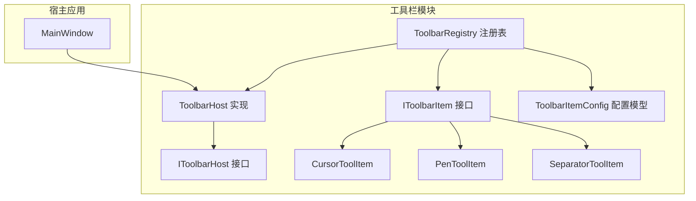
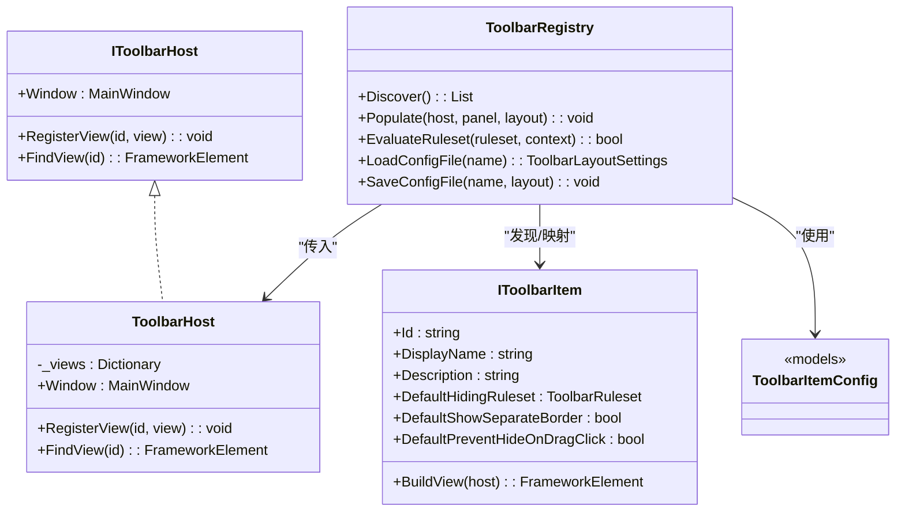
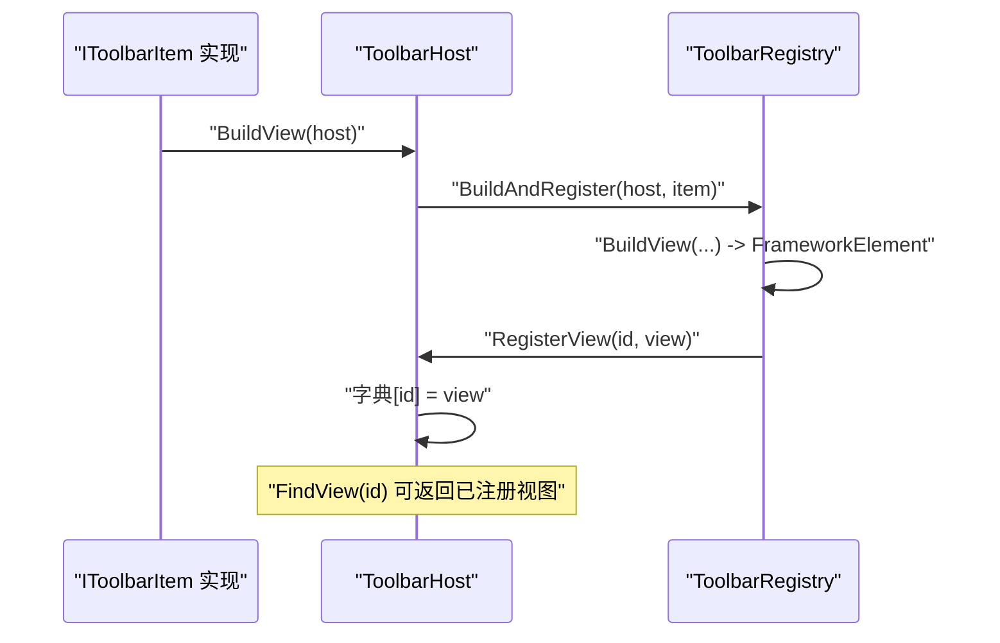
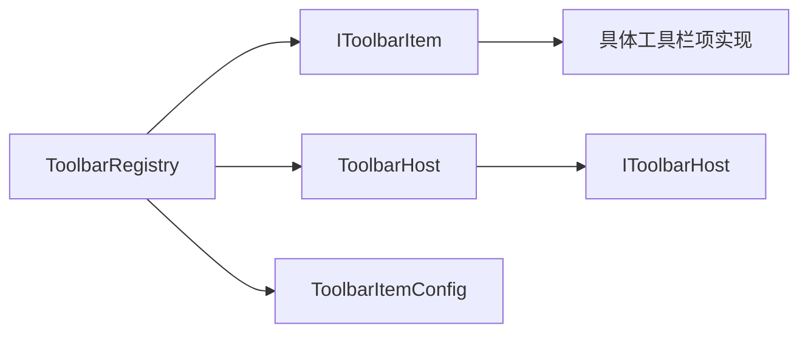

# 工具栏架构设计

## 简介
本文件面向工具栏架构设计，围绕 ToolbarHost 类及其在工具栏系统中的角色展开，系统性说明其作为 IToolbarHost 接口实现的设计理念与运行机制；深入解析工具栏初始化流程、视图注册与查找机制、以及 ToolbarItemConfig 的配置管理能力（布局、显示属性与行为）。同时对架构中的关键设计决策（字典存储、ID 映射、视图缓存策略等）进行剖析，并提供架构图与序列图帮助开发者理解整体设计与扩展点。

## 项目结构
工具栏相关代码集中于 Ink Canvas/Controls/Toolbar 目录，包含接口定义、宿主实现、规则与配置模型、注册表与工具栏项实现等模块。MainWindow 通过 ToolbarHost 与 ToolbarRegistry 协作完成工具栏的动态注入与可见性控制。

## 核心组件
- IToolbarHost：定义宿主接口，提供 MainWindow 引用、按 id 注册视图与按 id 查找视图的能力，是插件与宿主交互的桥梁。
- ToolbarHost：MainWindow 对 IToolbarHost 的实现，内部以字典存储视图，提供注册与查找方法，支持空值与空字符串安全检查。
- IToolbarItem：工具栏项的抽象接口，定义唯一标识、显示名称、描述、默认隐藏规则、默认边框策略与构建视图的工厂方法。
- ToolbarRegistry：工具栏注册表，负责工具栏项发现、布局配置的加载/保存、视图构建与注入、可见性评估与分段渲染。
- ToolbarItemConfig：配置模型，包含规则集（Ruleset/RuleGroup/Rule）、组件条目（ComponentEntry）、布局设置（LayoutSettings）与隐藏规则枚举，支撑复杂条件下的显示/隐藏逻辑。

## 架构总览
工具栏系统采用“接口约束 + 宿主实现 + 注册表驱动”的分层架构：
- IToolbarHost 抽象出宿主能力，使插件仅依赖接口，降低耦合。
- ToolbarHost 提供最小可用实现，承载视图注册与查找。
- ToolbarRegistry 负责装配：发现 IToolbarItem 实现、按配置生成视图、注入容器、应用规则集并控制可见性。
- ToolbarItemConfig 提供可序列化的布局与规则配置，支持条件组合与反转逻辑。

## 详细组件分析

### ToolbarHost：宿主实现与视图管理
- 设计理念
  - 将 MainWindow 的能力以接口形式暴露，插件通过 host.Window 访问宿主功能，便于后续逐步收敛接口范围。
  - 以字典存储视图，提供 O(1) 查找与注册能力，简化跨组件通信。
- 关键机制
  - 注册：RegisterView(id, view)，空 id 或空视图直接忽略，避免污染字典。
  - 查找：FindView(id)，空 id 返回 null，否则尝试获取并返回。
- 错误处理
  - 对空输入进行防御式判断，保证线程安全与健壮性。
- 性能特性
  - 字典查找与插入均为平均 O(1)，适合高频调用场景。
  - 无缓存失效策略，视图生命周期由调用方管理。

## 依赖关系分析
- 组件耦合
  - ToolbarRegistry 依赖 IToolbarItem 发现与映射，依赖 ToolbarHost 进行视图注册，依赖 ToolbarItemConfig 进行规则与布局解析。
  - IToolbarHost 与 ToolbarHost 低耦合，仅通过接口交互，便于替换实现。
- 外部依赖
  - 配置文件系统依赖 JSON 序列化与文件 IO；规则评估依赖上下文字典。
- 循环依赖
  - 未发现直接循环依赖；注册表与宿主之间为单向依赖。

## 性能考量
- 查找与注册
  - 字典 O(1) 查找与插入，适合高频访问；建议在构建阶段集中注册，避免运行时频繁变更。
- 规则评估
  - 规则树深度与分支数影响评估时间；建议合理拆分规则组，减少不必要的计算。
- 文件 IO
  - 配置加载/保存涉及磁盘 IO，建议异步化并在后台线程执行，避免阻塞 UI。
- 可见性更新
  - 递归遍历容器更新可见性，建议在模式切换时批量更新，减少多次重绘。

## 故障排查指南
- 规则集不生效
  - 检查上下文字典是否正确填充（标注模式、PPT 模式、用户折叠状态）。
  - 确认规则集是否被正确附加到元素的依赖属性上。
- 视图找不到
  - 确认 IToolbarItem.Id 与配置中的 id 一致；检查是否成功注册到 ToolbarHost。
- 配置加载失败
  - 查看日志输出，确认主配置文件是否存在或损坏；系统会尝试从备份恢复。
- 面板未更新
  - 确认已调用 UpdateVisibilityByMode 并传入正确的上下文。

## 结论
该工具栏架构通过接口抽象、宿主实现与注册表驱动，实现了高内聚、低耦合的可扩展系统。ToolbarHost 以简洁的字典存储提供稳定的视图索引能力；ToolbarItemConfig 提供强大的规则与布局表达；ToolbarRegistry 负责装配、注入与可见性控制，形成完整的工具栏生命周期闭环。该设计既满足当前阶段的功能需求，也为后续接口收敛与性能优化预留了空间。

## 附录
- 扩展点建议
  - 新增工具栏项：实现 IToolbarItem 接口并返回视图，注册表将自动发现与装配。
  - 自定义规则：基于 ToolbarRuleset/Group/Rule 组合表达复杂条件，结合上下文字典实现动态显示。
  - 宿主能力收敛：逐步将 MainWindow 的具体行为封装到 ToolbarHost 方法/事件中，缩小接口暴露面。
- 最佳实践
  - 使用 InstanceId 区分同类型多实例，避免 id 冲突。
  - 在构建阶段集中注册视图，减少运行时查找成本。
  - 对配置文件操作进行异常捕获与日志记录，提升可观测性。