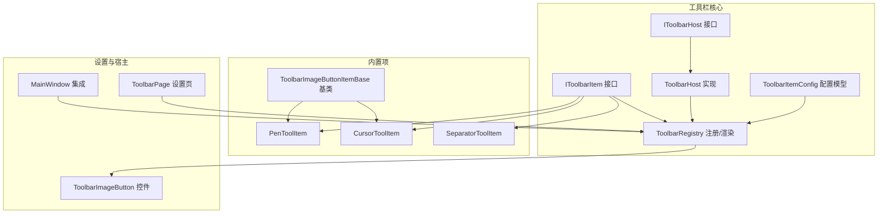
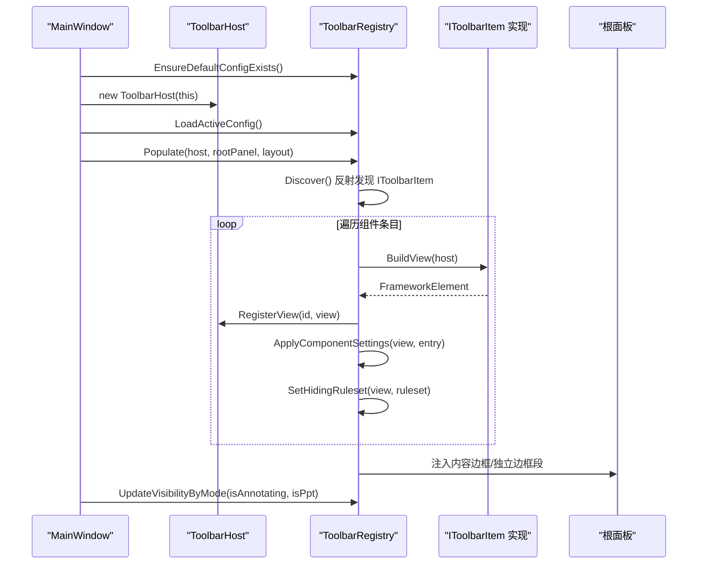
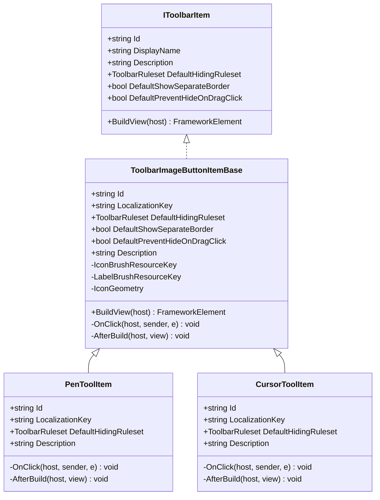
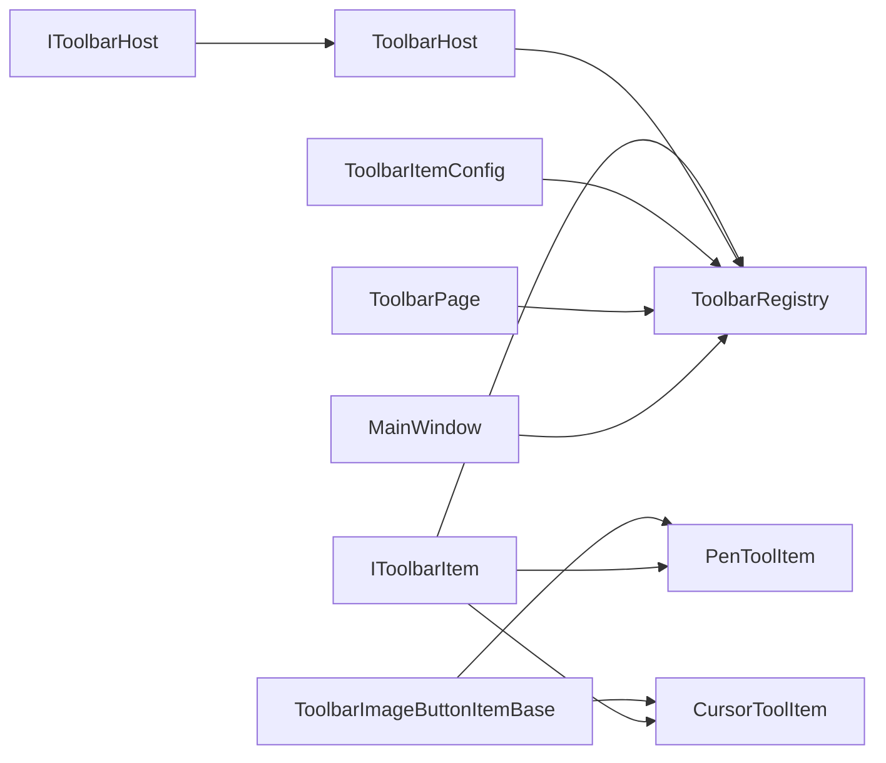

# 工具栏自定义与扩展

## 简介
本指南面向需要在 Ink Canvas 中进行工具栏自定义与扩展的开发者，系统讲解如何：
- 继承 ToolbarImageButtonItemBase 创建自定义工具栏按钮项
- 使用工具栏配置系统管理工具栏项的排列、分隔符与布局
- 自定义工具栏项的样式、图标与交互行为
- 在运行时动态添加、移除与修改工具栏项
- 提供从简单按钮到复杂复合工具的完整扩展示例
- 总结性能优化、内存管理与用户体验提升的最佳实践

## 项目结构
工具栏子系统位于 Ink Canvas/Controls/Toolbar 及其 Items 子目录，核心由以下模块组成：
- 接口层：IToolbarItem、IToolbarHost
- 注册与渲染：ToolbarRegistry、ToolbarHost
- 配置模型：ToolbarItemConfig（规则集、组件条目、布局设置）
- 基础按钮基类：ToolbarImageButtonItemBase
- 内置项示例：PenToolItem、CursorToolItem、SeparatorToolItem
- 设置页与动态配置：ToolbarPage.xaml.cs
- 主窗口集成：MW_Toolbar.cs
- 按钮控件：ToolbarImageButton.xaml.cs

## 核心组件
- IToolbarItem：定义工具栏项的最小契约，包括标识、显示名、描述、默认隐藏规则、是否独立边框、是否阻止拖拽时隐藏，以及构建视图的方法。
- IToolbarHost：工具栏项与宿主（MainWindow）的桥接，提供注册/查找视图的能力。
- ToolbarHost：MainWindow 的 IToolbarHost 实现，维护视图字典映射。
- ToolbarRegistry：发现、装配、渲染工具栏项，支持规则评估、可见性控制、布局注入、配置文件读写与备份。
- ToolbarItemConfig：规则集、规则组、规则、组件条目、布局设置等配置模型，支持 JSON 序列化与反序列化。
- ToolbarImageButtonItemBase：内置按钮型项的抽象基类，封装图标、标签、点击事件与构建流程。
- 内置项示例：PenToolItem、CursorToolItem、SeparatorToolItem 展示了如何基于基类快速实现按钮项。

## 架构总览
工具栏的运行时流程如下：
- 主窗口初始化时创建 ToolbarHost，并加载当前配置，调用 ToolbarRegistry.Populate 将工具栏项注入到根面板。
- ToolbarRegistry 通过反射发现所有 IToolbarItem 实现，逐个构建视图并注册到宿主字典。
- 对每个组件条目应用设置（尺寸、对齐、边距、透明度、图标大小、字体大小、红样式等），并根据规则集决定初始可见性。
- 支持按条件（标注模式、PPT 模式、用户折叠）动态更新可见性。
- 设置页 ToolbarPage 提供可视化编辑器，支持拖拽排序、规则集编辑、组件设置编辑与配置文件管理。

## 详细组件分析

### 组件 A：ToolbarImageButtonItemBase 基类与派生项
- 职责：提供统一的按钮型工具栏项构建流程，包括标签、图标、资源绑定、点击事件与构建后钩子。
- 关键点：
  - 默认隐藏规则：AlwaysShow 并附加“用户折叠”条件
  - 支持通过几何字符串设置图标路径
  - 支持通过资源键设置图标/标签画刷
  - 构建完成后可执行 AfterBuild 钩子以附加额外行为（如弹出面板）

## 依赖关系分析
- 组件耦合：
  - IToolbarItem 与 ToolbarRegistry 之间通过反射发现与构建建立松耦合
  - ToolbarHost 仅负责视图注册/查找，职责单一
  - ToolbarRegistry 依赖 ToolbarItemConfig 的规则集与组件设置
- 外部依赖：
  - 配置文件读写使用 Newtonsoft.Json
  - 日志记录使用 LogHelper
  - 设置页依赖 SettingsManager 与本地化资源

## 性能考虑
- 规则集评估：
  - 使用状态缓存（Ruleset.State、RuleGroup.State、Rule.State）避免重复计算
  - 逻辑短路：And 模式遇不满足即停止，Or 模式遇满足即停止
- 视图构建：
  - 通过 ToolbarHost 缓存视图字典，减少重复查找
  - ApplyComponentSettings 仅在必要时设置属性，避免不必要的 WPF 重排
- 可见性更新：
  - UpdateVisibilityByMode 递归遍历注入元素，先判断规则集再决定可见性
  - HasVisibleLeafContent 仅在内容边框层级检查可见性，减少无效遍历
- 配置文件：
  - 读写前进行备份，失败时回滚，降低 UI 卡顿风险

## 故障排查指南
- 工具栏项未显示：
  - 检查组件条目的 HidingRuleset 是否与当前上下文匹配（标注模式、PPT 模式、用户折叠）
  - 确认组件设置中的最小/最大尺寸与固定尺寸是否冲突
- 图标或标签颜色异常：
  - 确认资源键是否存在，或是否设置了 UseRedStyle 导致覆盖画刷
- 配置文件损坏：
  - 查看日志中“加载备份”与“从备份恢复”的提示，确认备份是否成功
- 动态配置无效：
  - 确认 ToolbarPage 已保存配置并触发 MainWindow.RebuildToolbar
  - 检查设置页的 Suppress 标志位，避免误抑制保存

## 结论
通过 ToolbarImageButtonItemBase 与 ToolbarRegistry 的协作，Ink Canvas 提供了灵活且高性能的工具栏扩展机制。借助 ToolbarItemConfig 的规则集与组件设置，开发者可以轻松实现从简单按钮到复杂复合工具的自定义，并通过设置页进行可视化配置与动态调整。遵循本文的最佳实践，可在保证性能与稳定性的前提下，显著提升用户体验。

## 附录

### 最佳实践清单
- 自定义按钮项
  - 继承 ToolbarImageButtonItemBase，重写 Id、LocalizationKey、DefaultHidingRuleset、Description
  - 在 OnClick 中调用宿主窗口的对应处理逻辑，在 AfterBuild 中附加弹出面板或定位目标
  - 如需自定义图标，设置 IconGeometry 或 IconBrushResourceKey
- 分隔符与布局
  - 使用 ShowSeparateBorder 区分独立边框段与普通内容边框
  - 合理使用组（builtin.group）组织相关按钮，便于批量隐藏/显示
- 样式与交互
  - 使用 ComponentSettingKeys 设置尺寸、对齐、边距、透明度、字号、图标大小
  - 使用 UseRedStyle 快速切换警示风格
  - 通过 PreventHideOnDragClick 控制拖拽时的隐藏策略
- 动态配置
  - 在 ToolbarPage 中通过拖拽添加/移除/排序组件
  - 编辑规则集以适配不同场景（标注/PPT/折叠）
  - 保存配置后调用 RebuildToolbar 生效