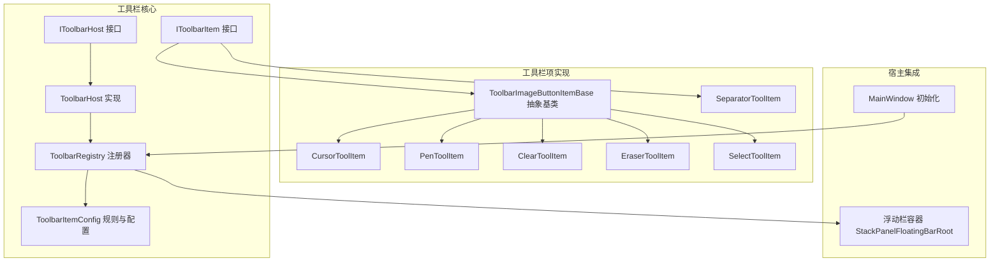
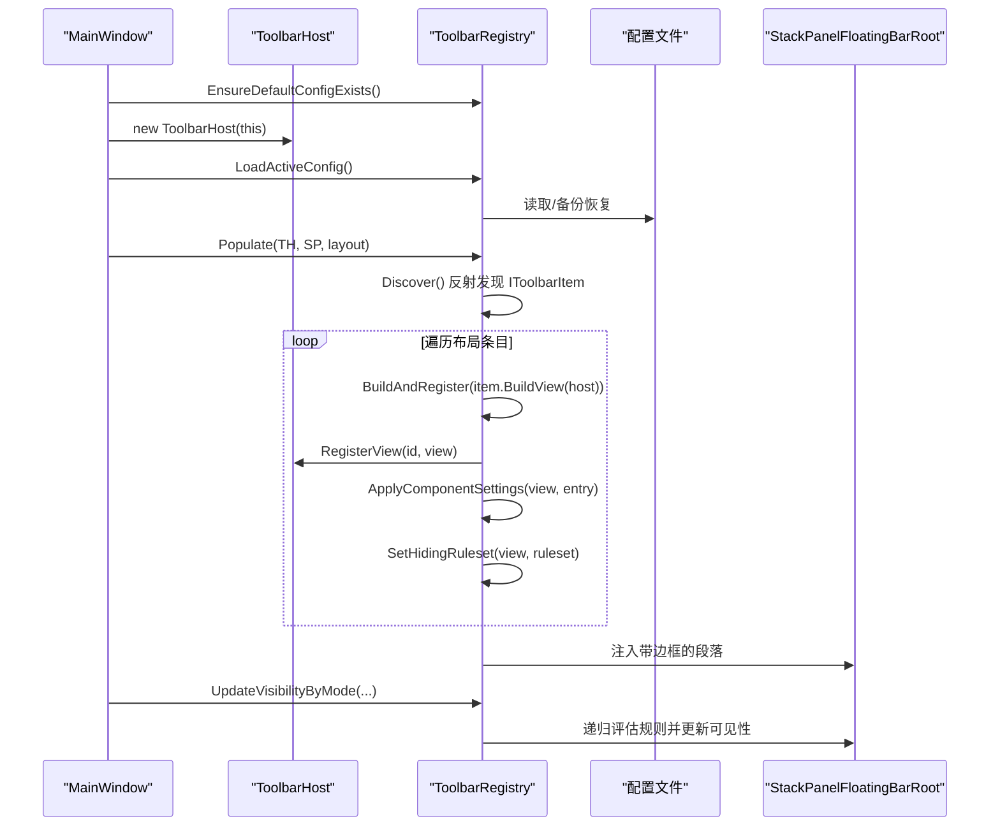
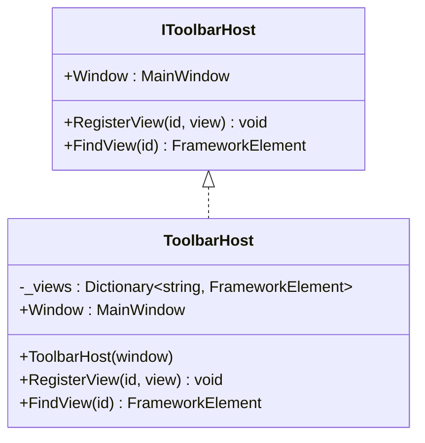
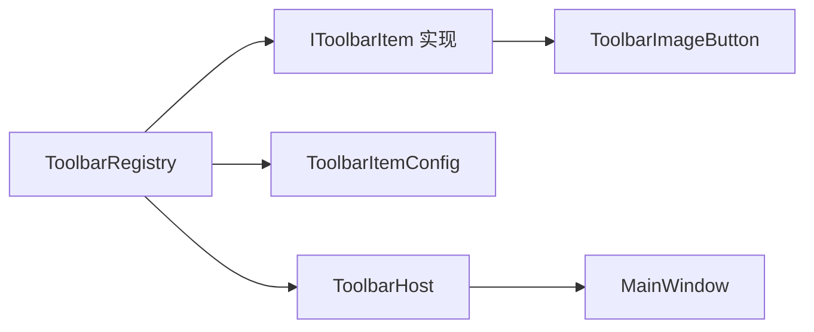

# 工具栏管理系统

## 简介
本文件系统性介绍 InkCanvasForClass 的工具栏管理系统，重点覆盖以下方面：
- ToolbarHost 的架构设计与工作原理：初始化、宿主桥接、视图注册与查找。
- ToolbarRegistry 的工具栏项注册、发现与管理：规则评估、布局装配、可见性控制、配置持久化与动态加载。
- IToolbarItem 接口的设计理念与实现规范：统一的构建流程、默认隐藏策略、本地化与图标资源。
- 工具栏的拖拽排序、自定义配置与动态加载机制：布局配置文件、条件规则、分组与独立边框。
- 工具栏项状态管理、图标资源与本地化支持：附加属性、样式与资源绑定。
- 最佳实践与性能优化建议：避免反射开销、减少 UI 层级、合理使用附加属性。

## 项目结构
工具栏相关代码集中在 Ink Canvas/Controls/Toolbar 下，包含接口、宿主、注册器、配置模型与内置工具栏项基类及若干具体项；MainWindow 在初始化时通过 ToolbarRegistry 完成工具栏的装配与动态加载。

## 核心组件
- IToolbarHost：工具栏项与宿主（MainWindow）之间的桥接接口，提供窗口引用与视图注册/查找能力。
- IToolbarItem：工具栏项的最小契约，定义标识、显示名、描述、默认隐藏规则、是否显示独立边框、是否阻止拖拽点击时隐藏等，并负责构建视图。
- ToolbarHost：IToolbarHost 的具体实现，持有 MainWindow 引用并维护 id 到视图的映射字典。
- ToolbarRegistry：静态注册器，负责工具栏项的自动发现、布局装配、规则评估、可见性更新、配置文件的读写与备份恢复、以及将最终 UI 注入到宿主容器。
- ToolbarItemConfig：规则与配置模型，包括 ToolbarRuleset/Group/Rule 的逻辑组合、条件集合、布局条目 ToolbarComponentEntry 及其设置键值。

## 架构总览
工具栏系统的运行流程如下：
- MainWindow 初始化时创建 ToolbarHost，并加载当前配置文件，调用 ToolbarRegistry.Populate 将布局装配到指定容器。
- ToolbarRegistry 通过反射发现所有实现 IToolbarItem 的类型，构建视图并注册到 ToolbarHost。
- 每个视图根据 ToolbarComponentEntry 的设置进行尺寸、对齐、边距、透明度、图标大小与颜色等样式应用。
- ToolbarRegistry 将条目扁平化为 DisplayItem，按“独立边框”与“内容边框”分段，生成 Border+StackPanel 结构注入容器。
- 可见性由 ToolbarRuleset 与上下文条件（标注模式、PPT 模式、用户折叠状态）共同决定，递归更新容器内可见性。

## 详细组件分析

### ToolbarHost：宿主桥接与视图注册
- 职责
  - 暴露 MainWindow 引用，作为插件与宿主交互的入口。
  - 维护 id 到 FrameworkElement 的映射，支持按 id 查找已注入的视图。
- 设计要点
  - 使用字典存储，注册/查找均为 O(1)。
  - 对空参数进行防御式检查，避免异常。
- 与 ToolbarRegistry 的协作
  - ToolbarRegistry 在构建每个 IToolbarItem 的视图后，调用 RegisterView 进行登记，以便后续通过 FindView 进行跨组件查找。

## 依赖关系分析
- 组件耦合
  - ToolbarRegistry 依赖 IToolbarItem 的实现与 ToolbarItemConfig 的规则/配置模型。
  - ToolbarHost 仅依赖 MainWindow 引用与字典映射，耦合度低。
- 外部依赖
  - 配置文件读写依赖 Newtonsoft.Json 与文件系统。
  - 日志记录依赖 LogHelper。
- 潜在循环
  - 当前结构未发现循环依赖；IToolbarItem 的实现通过 ToolbarRegistry 注入到容器，不反向依赖 ToolbarRegistry。

## 性能考量
- 反射与实例化
  - Discover 通过反射扫描并实例化 IToolbarItem，建议在首次使用后缓存结果，避免重复扫描。
- UI 层级与可见性
  - Populate 会清空并重建注入元素，频繁切换配置时可考虑局部更新而非全量重建。
  - UpdateVisibilityByMode 采用递归遍历，建议在大规模工具栏时限制刷新频率或批量更新。
- 资源与样式
  - ApplyComponentSettings 对每项进行多次属性设置，建议合并设置或延迟生效。
  - 红样式与资源解析可能触发资源查找，建议集中处理或复用资源引用。

[本节为通用指导，无需特定文件来源]

## 故障排查指南
- 配置文件问题
  - 主配置不存在或损坏时，尝试从备份恢复；若仍失败，将回退到默认布局。
  - 检查配置目录权限与写入保护，必要时使用写入保护管理器。
- 工具栏项未显示
  - 检查 IToolbarItem 实现是否被正确发现（非抽象/非接口且可实例化）。
  - 核对 HidingRuleset 与当前上下文（标注/PPT/折叠），确认评估结果。
- 视图未注册
  - 确认 BuildView 返回非空视图，并在 BuildAndRegister 后已注册到 ToolbarHost。
- 事件未响应
  - 确认在 BuildView 中正确绑定事件并在 AfterBuild 中完成必要的宿主关联。

## 结论
该工具栏系统通过清晰的接口契约与注册器模式，实现了工具栏项的自动发现、灵活的规则驱动可见性控制、可扩展的配置持久化与动态加载。借助 ToolbarHost 提供的宿主桥接，插件可便捷访问 MainWindow 能力；通过 ToolbarImageButtonItemBase 统一了按钮类项的构建流程与本地化、图标资源处理。建议在实际扩展中遵循接口规范、合理使用规则系统与组件设置键，并关注性能与可维护性。

[本节为总结，无需特定文件来源]

## 附录：自定义工具栏项开发指南
- 实现步骤
  - 新建类实现 IToolbarItem 或继承 ToolbarImageButtonItemBase。
  - 明确 Id 与 DisplayName（可使用本地化键），设置 DefaultHidingRuleset。
  - 在 BuildView 中创建并配置视图，绑定事件；如需额外关联宿主 UI，覆写 AfterBuild。
  - 将点击逻辑委托给 MainWindow 的对应处理方法。
- 规则与可见性
  - 使用 ToolbarRuleset.AlwaysShow()/AnnotationOnly()/PptOnly()/PptAnnotationOnly() 作为起点，必要时叠加 WithHideOnCollapsed/WithPreventHideOnCollapsed。
  - 在布局配置中设置 hidingRuleset 或迁移到新的规则集。
- 组件设置
  - 使用 ComponentSettingKeys 设置尺寸、对齐、边距、透明度、图标/字体大小、红样式等。
  - 对于特殊控件（如快速配色板），可在 AfterBuild 中同步显示模式。
- 本地化与图标
  - 通过 Strings.GetString 或资源键设置标签文本与图标刷子。
  - 图标几何可通过字符串解析，或直接设置资源键。
- 最佳实践
  - 避免在 BuildView 中执行耗时操作，尽量延迟到 AfterBuild。
  - 保持 Id 唯一且稳定，避免与内置项冲突。
  - 在配置文件中为新项预留位置，便于用户自定义排序与分组。