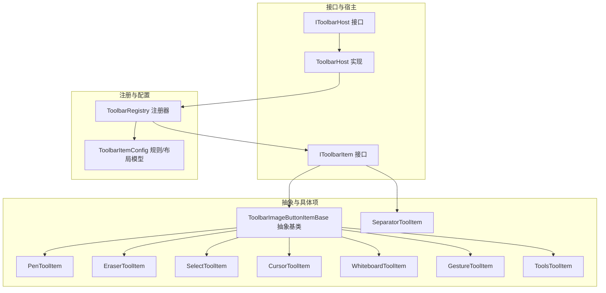
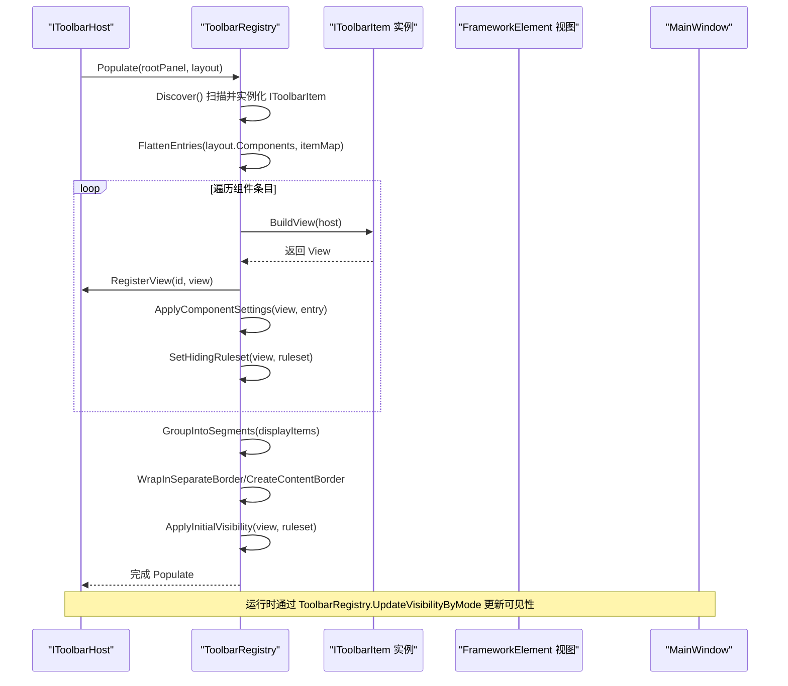
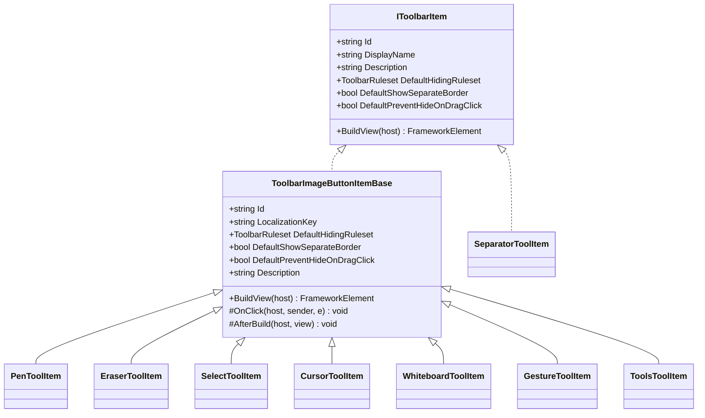
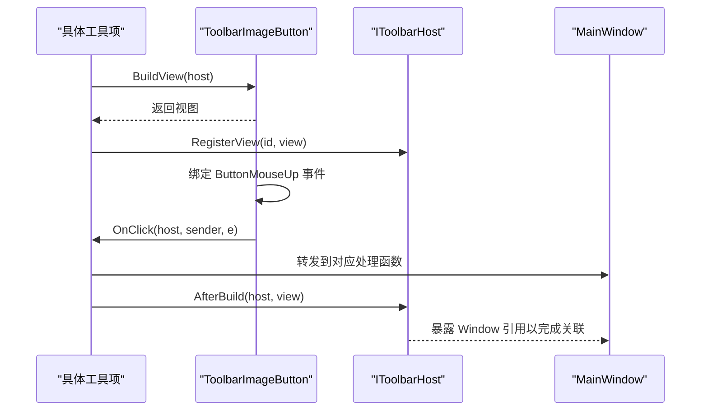
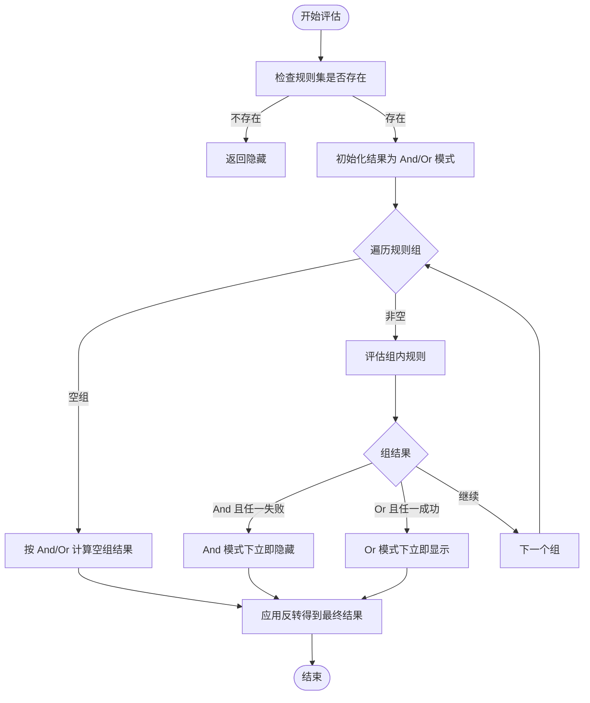
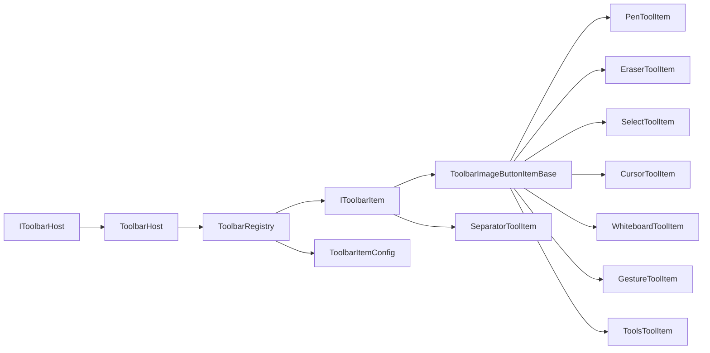

# 工具栏项实现

## 简介
本文件面向“工具栏项实现”的技术文档，聚焦于内置工具栏项的实现细节与运行机制。重点覆盖以下方面：
- 核心工具栏项：PenToolItem、EraserToolItem、SelectToolItem、CursorToolItem、WhiteboardToolItem、GestureToolItem、ToolsToolItem 等
- 接口与宿主：IToolbarItem、IToolbarHost、ToolbarHost
- 规则系统：隐藏规则、分组与逻辑组合、条件上下文
- 生命周期与事件：构建视图、点击回调、构建后钩子
- 与主窗口通信：通过 IToolbarHost 将事件转发至 MainWindow
- 图标与本地化：资源键、几何图标、字符串本地化
- 可扩展性：如何新增自定义工具栏项
- 性能与稳定性：可见性评估、配置持久化、错误日志

## 项目结构
工具栏体系位于 Ink Canvas/Controls/Toolbar 下，采用“接口 + 抽象基类 + 具体项 + 注册器 + 配置模型”的分层设计：
- 接口层：IToolbarItem、IToolbarHost
- 抽象层：ToolbarImageButtonItemBase
- 具体项：PenToolItem、EraserToolItem、SelectToolItem、CursorToolItem、WhiteboardToolItem、GestureToolItem、ToolsToolItem、SeparatorToolItem
- 注册与布局：ToolbarRegistry（发现、装配、分段、可见性评估、配置读写）
- 配置模型：ToolbarItemConfig（规则、分组、逻辑模式、组件条目、布局设置）

## 核心组件
- IToolbarItem：定义工具栏项的标识、显示名、描述、默认隐藏规则、是否带分隔边框、拖拽点击时是否阻止隐藏，以及 BuildView 构建视图的契约。
- IToolbarHost/ToolbarHost：提供对 MainWindow 的访问桥接，并维护已注册视图的字典，支持按 id 查找与回填。
- ToolbarImageButtonItemBase：通用图片按钮型工具栏项的抽象基类，负责标签、图标、点击事件绑定、构建后钩子等。
- ToolbarRegistry：工具栏装配与布局的核心，负责发现 IToolbarItem 实例、装配视图、分段、应用隐藏规则、读写配置、更新可见性。
- ToolbarItemConfig：规则系统与布局配置的数据模型，包括 ToolbarRuleset、ToolbarRuleGroup、ToolbarRule、ToolbarComponentEntry、ToolbarLayoutSettings。

## 架构总览
工具栏项的运行链路如下：
- 注册器扫描程序集，实例化所有 IToolbarItem 实现，形成可装配列表
- 根据布局配置（ToolbarLayoutSettings）扁平化组件条目，构建视图并注册到宿主
- 将连续项放入内容边框，遇到“独立边框”标记的项则单独包装
- 应用隐藏规则（基于条件上下文）决定初始可见性
- 运行时根据模式切换（注释/演示/折叠）动态评估并更新可见性

## 详细组件分析

### IToolbarItem 与 ToolbarImageButtonItemBase
- IToolbarItem：统一暴露 Id、DisplayName、Description、DefaultHidingRuleset、DefaultShowSeparateBorder、DefaultPreventHideOnDragClick 与 BuildView
- ToolbarImageButtonItemBase：封装了通用图片按钮的构建流程，包括：
  - 设置标签文本（优先使用本地化键）
  - 可选几何图标与资源色刷
  - 绑定 ButtonMouseUp 事件到 OnClick
  - AfterBuild 钩子供子类附加主窗口关联逻辑

### PenToolItem
- 职责：作为“书写笔”工具项，点击事件转发至 MainWindow.PenIcon_Click；构建后通过 AttachPenIconView 关联视图
- 默认隐藏规则：AlwaysShow 并在“被用户折叠”时隐藏
- 本地化键：FloatingBar_Annotate
- 图标与主题：由基类统一处理，支持资源键与几何图标

### EraserToolItem
- 职责：区域擦除工具项，点击事件转发至 MainWindow.EraserIcon_Click；构建后通过 AttachEraserIcon 关联视图
- 默认隐藏规则：仅注释模式下显示，并在“被用户折叠”时隐藏
- 本地化键：FloatingBar_AreaEraser

### SelectToolItem
- 职责：套索选择工具项，点击事件转发至 MainWindow.SymbolIconSelect_MouseUp；构建后通过 AttachSymbolIconSelect 关联视图
- 默认隐藏规则：仅注释模式下显示，并在“被用户折叠”时隐藏
- 本地化键：FloatingBar_LassoSelect

### CursorToolItem
- 职责：鼠标指针工具项，点击事件转发至 MainWindow.CursorIcon_Click；构建后通过 AttachCursorIconView 关联视图
- 默认隐藏规则：AlwaysShow 并在“被用户折叠”时隐藏
- 本地化键：FloatingBar_Mouse

### WhiteboardToolItem
- 职责：白板工具项，点击事件转发至 MainWindow.ImageBlackboard_MouseUp；构建后通过 AttachWhiteboardBtn 关联视图
- 默认隐藏规则：AlwaysShow 并在“被用户折叠”时隐藏
- 本地化键：FloatingBar_Whiteboard

### GestureToolItem
- 职责：手势工具项，点击事件转发至 MainWindow.TwoFingerGestureBorder_MouseUp；构建后通过 AttachGestureBtn 关联视图
- 默认隐藏规则：仅注释模式下显示（不自动随折叠隐藏）
- 独立边框：默认启用，拖拽点击时阻止隐藏
- 图标：使用几何图标 DisabledGestureIcon

### ToolsToolItem
- 职责：工具箱入口，点击事件转发至 MainWindow.SymbolIconTools_MouseUp；构建后通过 AttachToolsBtn 关联视图
- 默认隐藏规则：AlwaysShow 并在“被用户折叠”时隐藏
- 本地化键：Board_Tools

### SeparatorToolItem
- 职责：工具栏分隔符，渲染为垂直细线边框
- 默认隐藏规则：AlwaysShow 并在“被用户折叠”时隐藏
- 不是图片按钮类型，直接返回 Border 视图

### 事件处理与生命周期
- 构建阶段：BuildView 负责创建 ToolbarImageButton 或其他 FrameworkElement，设置标签、图标、颜色资源，绑定 ButtonMouseUp 事件
- 回调阶段：OnClick 由子类实现，将事件转发给 MainWindow 对应处理函数
- 附加阶段：AfterBuild 提供子类挂接主窗口控件的机会（如视图注册、状态绑定）

### 规则系统与可见性
- 条件上下文：isAnnotating、isPptMode、isContentCollapsedByUser
- 规则模型：ToolbarRuleset 包含多个 ToolbarRuleGroup，每组内包含若干 ToolbarRule，支持 And/Or 逻辑与反转
- 评估流程：先评估每个规则，再按组聚合，最后按整体规则集反转，得到最终状态
- 应用时机：Populate 时设置初始可见性；运行时 UpdateVisibilityByMode 动态更新

### 与主窗口的通信
- IToolbarHost 暴露 MainWindow 引用，插件可通过 host.Window 访问主窗口成员
- 工具项通过 OnClick 将事件转发到 MainWindow 的具体处理函数（如 PenIcon_Click、EraserIcon_Click 等）
- AfterBuild 阶段常用于将视图注册到主窗口或建立额外绑定

### 图标资源管理、本地化与主题适配
- 本地化：DisplayName 通过 Strings.GetString(LocalizationKey) 获取，若无则回退为键名
- 图标：支持两种方式
  - 几何图标：IconGeometry 为字符串几何数据，解析后赋给按钮
  - 资源色刷：IconBrushResourceKey/LabelBrushResourceKey 优先尝试资源查找，否则使用 SetResourceReference
- 主题适配：边框背景与描边通过资源键 FloatBarBackground、FloatBarBorderBrush 应用，随主题切换自动生效

## 依赖关系分析
- 组件耦合
  - 工具项依赖 IToolbarItem 接口与 ToolbarImageButtonItemBase 抽象类，降低与主窗口的直接耦合
  - ToolbarRegistry 依赖 IToolbarItem 实现集合、配置模型与宿主接口
  - IToolbarHost 与 ToolbarHost 将主窗口暴露给插件，便于扩展
- 规则依赖
  - ToolbarRuleset 依赖 ToolbarRuleGroup 与 ToolbarRule，形成可序列化的规则表达式
- 配置依赖
  - ToolbarLayoutSettings 依赖 ToolbarComponentEntry，后者包含组件 id、实例 id、隐藏规则、设置字典与子节点

## 性能考虑
- 规则评估缓存：规则状态通过 State 字段记录，避免重复计算
- 可见性批量更新：UpdateVisibilityByMode 一次性评估整棵子树，减少多次遍历
- 配置持久化：配置文件读写采用备份策略，异常时快速回退，保证稳定性
- 资源复用：图标与色刷通过资源键复用，减少对象创建开销

## 故障排查指南
- 工具项未显示
  - 检查默认隐藏规则与当前模式（注释/演示/折叠），确认是否被 EvaluateRuleset 判定为隐藏
  - 确认组件条目中是否设置了 ShowSeparateBorder 或 PreventHideOnDragClick
- 点击无响应
  - 确认 OnClick 是否正确转发到 MainWindow 对应处理函数
  - 检查视图是否成功注册到 IToolbarHost
- 图标或颜色不生效
  - 检查 IconBrushResourceKey/LabelBrushResourceKey 是否存在于资源字典
  - 检查 IconGeometry 是否为有效几何字符串
- 配置加载失败
  - 查看日志输出，确认主配置文件是否存在或损坏
  - 若主文件损坏，系统会尝试加载备份并恢复

## 结论
该工具栏体系通过清晰的接口与抽象基类，实现了高内聚、低耦合的工具项扩展能力；借助规则系统与配置持久化，提供了灵活的可见性控制与布局定制；通过 IToolbarHost 与 ToolbarRegistry 的协作，确保了与主窗口的松耦合通信与稳定的运行时表现。对于新增工具项，遵循 ToolbarImageButtonItemBase 的约定即可快速集成。

## 附录：扩展开发指南
- 创建自定义工具栏项
  - 新建类实现 IToolbarItem 或继承 ToolbarImageButtonItemBase
  - 在 BuildView 中创建视图、设置标签与图标、绑定点击事件
  - 在 OnClick 中转发到 MainWindow 的处理函数
  - 如需与主窗口建立额外关联，在 AfterBuild 中完成
- 接口实现要点
  - Id 必须唯一；DisplayName 通过本地化键获取；Description 用于提示信息
  - DefaultHidingRuleset 使用 ToolbarRuleset 工厂方法并可叠加 WithHideOnCollapsed/WithPreventHideOnCollapsed
  - 如需独立边框或阻止拖拽点击隐藏，请设置相应默认值
- 集成方法
  - 将新类编译进同一程序集，ToolbarRegistry 会自动发现并实例化
  - 在布局配置中添加 ToolbarComponentEntry，指定 id、hidingRuleset、settings 等
  - 通过 ToolbarRegistry.Populate 将其注入到目标 Panel
- 最佳实践
  - 保持 OnClick 仅做事件转发，业务逻辑集中在 MainWindow
  - 使用资源键而非硬编码颜色，确保主题一致性
  - 为复杂图标提供几何数据与资源色刷双方案，提升可维护性
  - 对关键路径增加日志记录，便于排障

章节来源
