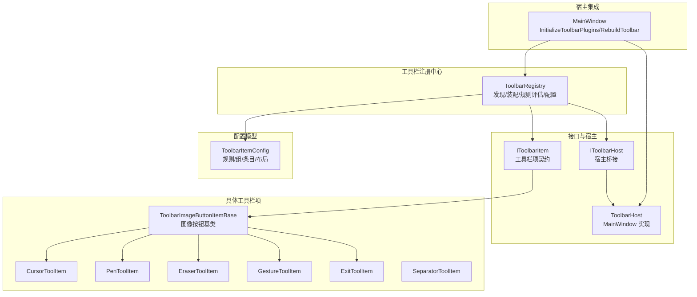
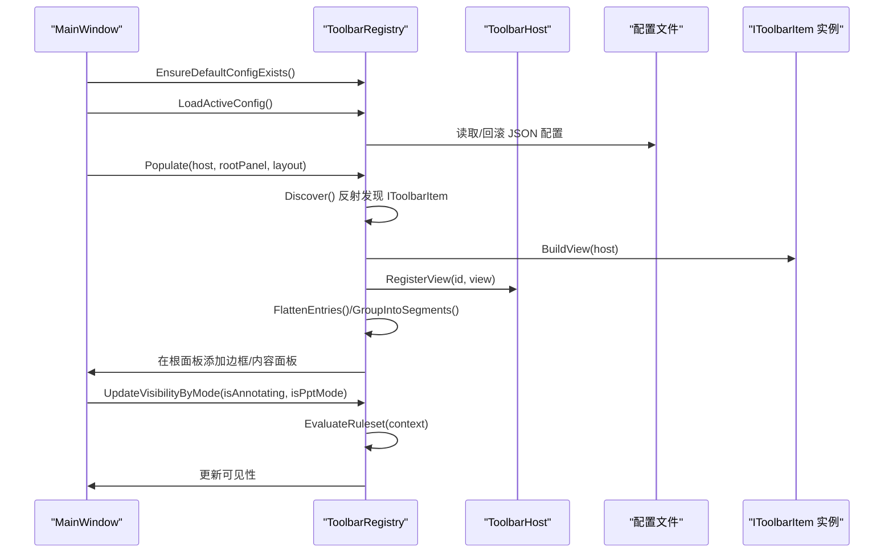
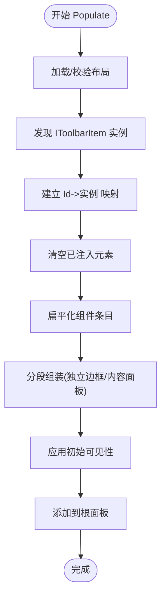
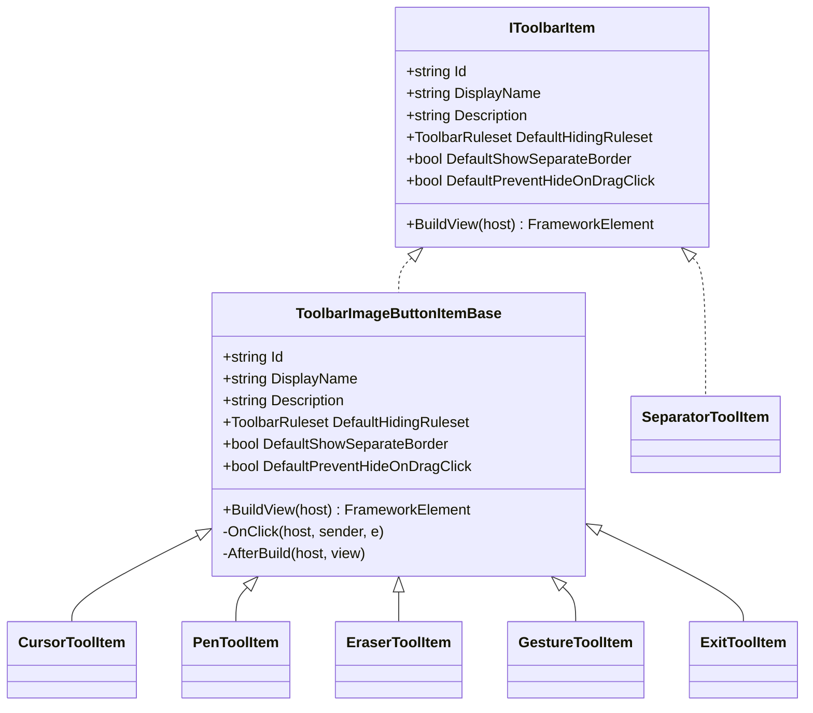
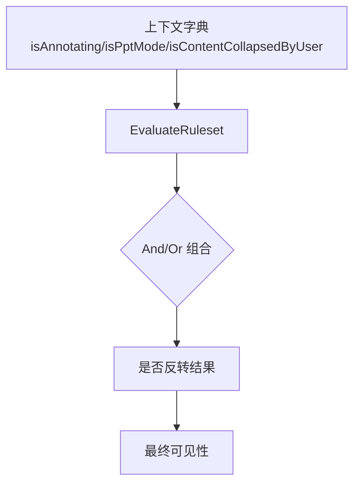
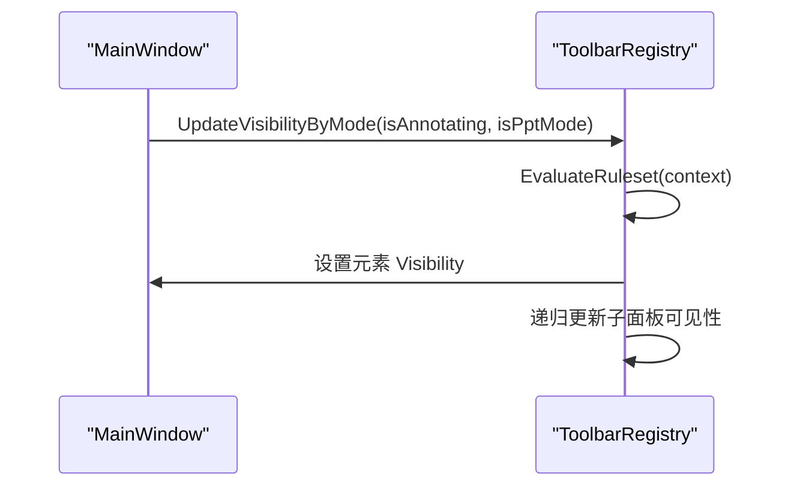
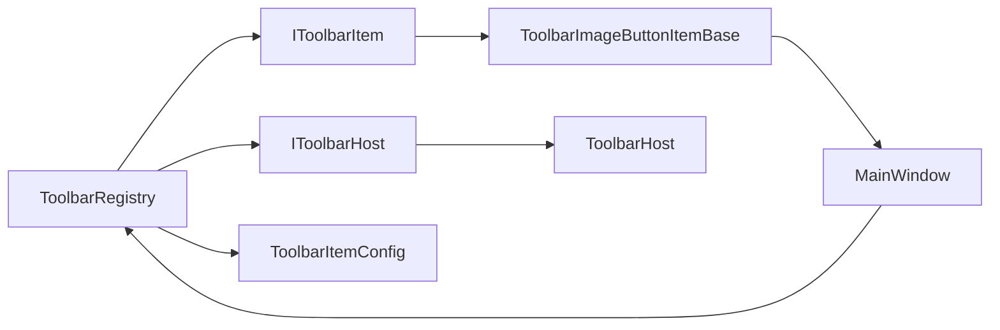

# 工具栏注册中心

## 简介
本文件系统性阐述工具栏注册中心的设计与实现，重点覆盖以下方面：
- ToolbarRegistry 的核心职责：工具栏项发现、布局装配、规则评估与可见性控制、配置持久化与回滚。
- IToolbarItem 接口设计规范与实现要点，帮助开发者快速实现自定义工具栏项。
- 工具栏项的分类体系、隐藏规则与优先级管理、动态加载与运行时可见性更新。
- 元数据管理（组件设置）、状态同步与事件传播机制。
- 最佳实践、性能优化建议与错误处理策略。

## 项目结构
工具栏相关代码集中在 Ink Canvas/Controls/Toolbar 目录，围绕“注册中心 + 接口 + 配置模型 + 宿主桥接”的分层组织：
- 注册中心：ToolbarRegistry 负责发现、装配、渲染、规则评估与配置管理。
- 接口与宿主：IToolbarItem 定义工具栏项契约；IToolbarHost 提供宿主能力桥接。
- 配置模型：ToolbarItemConfig 定义规则集、组件条目与布局设置。
- 具体工具栏项：继承 ToolbarImageButtonItemBase 或直接实现 IToolbarItem 的内置项。
- 宿主集成：MainWindow 通过 ToolbarHost 暴露窗口实例，并在初始化时调用注册中心完成装配。

## 核心组件
- ToolbarRegistry：静态注册中心，负责工具栏项的反射发现、布局装配、规则评估与可见性更新、配置文件的读写与回滚、注入元素清理等。
- IToolbarItem：工具栏项契约，定义唯一标识、显示名、描述、默认隐藏规则、默认是否独立边框、默认拖拽点击是否阻止隐藏、构建视图方法。
- IToolbarHost/ToolbarHost：宿主桥接，向插件暴露 MainWindow 引用，并提供按 id 注册/查找视图的能力。
- ToolbarItemConfig：规则与布局模型，包含逻辑模式（And/Or）、规则组、规则、组件条目、布局设置、隐藏规则枚举等。
- 具体工具栏项：如 ToolbarImageButtonItemBase 及其派生项（光标、笔、橡皮、手势、退出等），以及分隔符等。

## 架构总览
工具栏注册中心采用“声明式布局 + 规则驱动可见性”的架构：
- 声明式布局：通过 ToolbarLayoutSettings 与 ToolbarComponentEntry 描述工具栏的组件顺序、分组、边框策略与组件设置。
- 规则驱动：ToolbarRuleset/ToolbarRuleGroup/ToolbarRule 定义 And/Or 逻辑组合、反转、条件集合，支持 isAnnotating、isPptMode、isContentCollapsedByUser 等条件。
- 运行时装配：ToolbarRegistry 通过反射发现 IToolbarItem 实例，构建视图并注册到宿主，再按布局装配到根面板，最后按规则评估更新可见性。

## 详细组件分析

### ToolbarRegistry 组件分析
- 发现机制：通过反射扫描当前程序集，筛选实现 IToolbarItem 的非抽象类型，实例化后缓存，避免重复发现。
- 装配流程：将布局中的组件条目映射到已发现的工具栏项，构建视图并注册到宿主；对分组进行扁平化与段落化，生成带边框或内容面板的容器。
- 规则评估：支持 And/Or 逻辑、规则组反转、规则反转，结合上下文字典（注解模式、PPT 模式、用户折叠状态）计算最终可见性。
- 配置管理：提供配置目录、列表、加载、保存、删除、默认配置创建与回滚；异常时记录日志并回退到默认布局。
- 可见性更新：递归遍历面板，按规则评估子元素可见性，并在内容面板层面做“叶节点可见性聚合”。

### IToolbarItem 接口与实现规范
- 必备属性与方法：Id、DisplayName、Description、DefaultHidingRuleset、DefaultShowSeparateBorder、DefaultPreventHideOnDragClick、BuildView(host)。
- 实现建议：
  - 使用稳定的 Id，避免与内置 Id 冲突。
  - DefaultHidingRuleset 应结合业务场景选择 AlwaysShow/AnnotationOnly/PptOnly/PptAnnotationOnly，并可叠加 WithHideOnCollapsed/WithPreventHideOnCollapsed。
  - BuildView 返回的 FrameworkElement 应设置 InjectedTag，便于注册中心识别与清理。
  - 若为按钮型项，建议继承 ToolbarImageButtonItemBase，复用图标/标签资源绑定与点击事件封装。

### 隐藏规则与优先级管理
- 规则模型：ToolbarRuleset 包含多个 ToolbarRuleGroup，每个组内包含若干 ToolbarRule；支持 And/Or 逻辑、组反转、规则反转。
- 条件体系：内置条件 isAnnotating、isPptMode、isContentCollapsedByUser；可通过 AvailableConditions 获取本地化名称。
- 优先级策略：
  - 组件级优先：ToolbarComponentEntry 的 HidingRuleset 优先于 HidingRule（迁移兼容）。
  - 分组策略：ShowSeparateBorder 控制是否以独立边框展示，影响布局与样式。
  - 用户偏好：IsContentCollapsedByUser 影响 WithHideOnCollapsed/WithPreventHideOnCollapsed 的行为。

### 动态加载与运行时可见性更新
- 初始化：MainWindow.InitializeToolbarPlugins 调用 EnsureDefaultConfigExists、LoadActiveConfig、Populate、注册可见性更新回调。
- 运行时更新：UpdateToolbarComponentVisibility 调用 UpdateVisibilityByMode，传入注解模式与 PPT 模式状态，触发整棵注入树的可见性重算。
- 事件传播：工具栏项通过宿主桥接访问 MainWindow 事件（如点击事件），实现跨组件协作。

### 元数据管理与组件设置
- 组件设置键：最小/最大/固定宽高、字体/图标尺寸、水平/垂直对齐、外边距/内边距、不透明度、是否使用红色风格、显示模式等。
- 应用策略：ApplyComponentSettings 将设置映射到视图属性；对 ToolbarImageButton 支持红色风格与资源绑定；对 QuickColorPaletteControl 支持显示模式强制应用。
- 布局默认值：CreateDefaultLayout 提供内置默认布局，包含常用工具与分组、分隔符、独立边框项等。

## 依赖关系分析
- ToolbarRegistry 依赖：
  - IToolbarItem：通过反射发现具体工具栏项。
  - IToolbarHost/ToolbarHost：注册视图以便宿主查找与协作。
  - ToolbarItemConfig：解析布局与规则。
  - 日志与设置：日志记录、配置文件路径、设置读取。
- 工具栏项依赖：
  - ToolbarImageButtonItemBase：统一按钮型项的构建与资源绑定。
  - MainWindow：通过宿主桥接访问窗口事件与 UI 元素。
- 宿主集成：
  - MainWindow 在初始化阶段完成配置准备、注册中心装配与可见性更新。

## 性能考量
- 反射发现：仅在首次调用 Discover 时执行，结果缓存，避免重复扫描。
- 面板遍历：UpdatePanelVisibility 递归遍历注入元素，建议保持布局层级合理，减少不必要的嵌套。
- 配置 IO：保存/加载涉及磁盘 IO，建议在后台线程执行或批量操作，必要时使用进程保护包装。
- 视图构建：BuildView(host) 中的异常会被捕获并记录，避免影响整体装配流程。

## 故障排查指南
- 发现失败：检查 IToolbarItem 实现类是否可被反射实例化，查看日志中“实例化失败”记录。
- 配置缺失/损坏：EnsureDefaultConfigExists 会创建默认配置；若主配置不存在或损坏，尝试回滚 .bak 并记录警告/错误日志。
- 可见性异常：确认组件条目的 HidingRuleset 是否正确设置；检查上下文字典是否包含 isAnnotating/isPptMode/isContentCollapsedByUser。
- 视图未注册：确认 BuildView(host) 返回非空且已通过 host.RegisterView 注册；否则宿主无法通过 FindView(id) 查找。

## 结论
工具栏注册中心通过声明式布局与规则驱动的可见性管理，实现了灵活、可扩展的工具栏装配与运行时控制。依托 IToolbarItem 接口与 ToolbarItemConfig 模型，开发者可以快速实现自定义工具栏项并参与统一的隐藏规则与组件设置体系。配合 MainWindow 的宿主桥接，工具栏项能够与主界面事件紧密协作，满足复杂交互需求。

## 附录：最佳实践与扩展指南

- 自定义工具栏项实现步骤
  - 实现 IToolbarItem 或继承 ToolbarImageButtonItemBase，提供稳定 Id、默认隐藏规则与 BuildView。
  - 在 BuildView 中返回 FrameworkElement，并设置 InjectedTag；如为按钮，利用 ToolbarImageButton 的资源绑定简化图标/标签绘制。
  - 如需与主窗口交互，通过 host.Window 访问事件或 UI 元素（注意接口演进阶段的限制）。
  - 在 MainWindow.InitializeToolbarPlugins 中确保配置存在并完成 Populate。

- 隐藏规则与优先级
  - 优先使用 HidingRuleset；若无则迁移 HidingRule。
  - 对需要用户手动隐藏的组件，使用 WithHideOnCollapsed；对需要始终显示的组件，使用 WithPreventHideOnCollapsed。
  - 合理使用 ShowSeparateBorder 控制独立边框展示，提升视觉层次。

- 组件设置与样式
  - 使用 ComponentSettingKeys 中的键设置宽高、对齐、边距、内边距、不透明度、红色风格与显示模式。
  - 对按钮型组件，优先使用 ToolbarImageButton 的 LabelFontSize/IconHeight 与 UseRedStyle；对 QuickColorPaletteControl，支持显示模式强制应用。

- 配置管理
  - 首次启动自动创建 default.json；支持列出、加载、保存、删除与回滚。
  - 配置损坏时自动回滚 .bak 并记录日志，必要时降级到默认布局。

- 错误处理与日志
  - 发现与构建异常会被捕获并记录；建议在开发阶段关注日志输出，定位问题。
  - 配置 IO 异常同样记录错误日志，便于排查权限与路径问题。

章节来源
