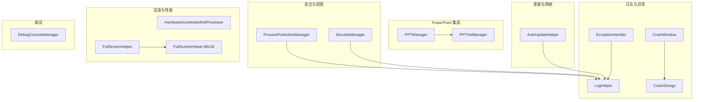
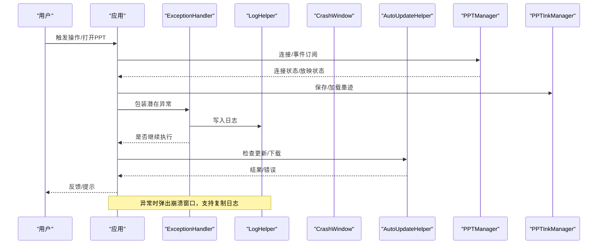
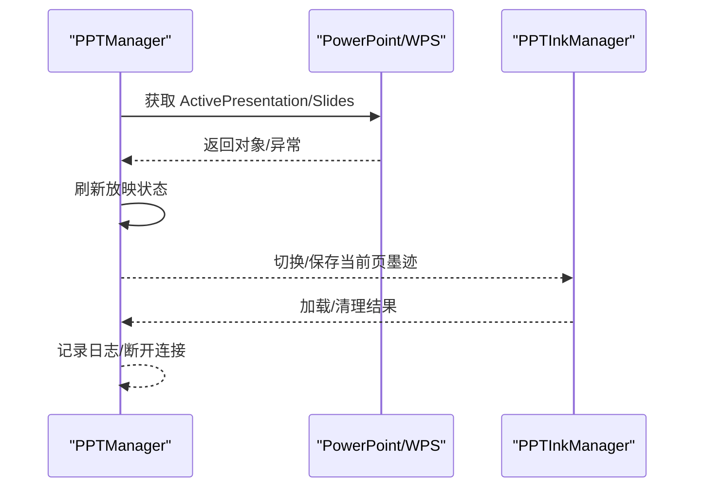
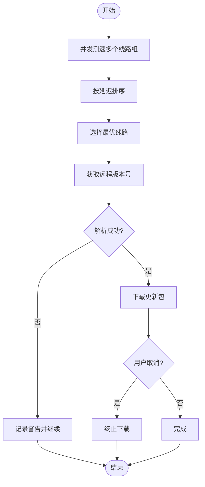
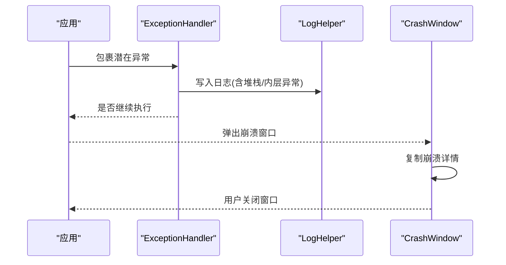
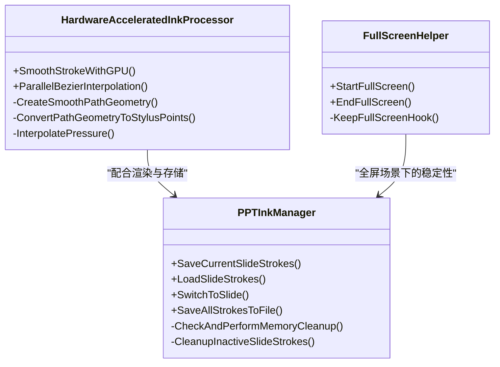
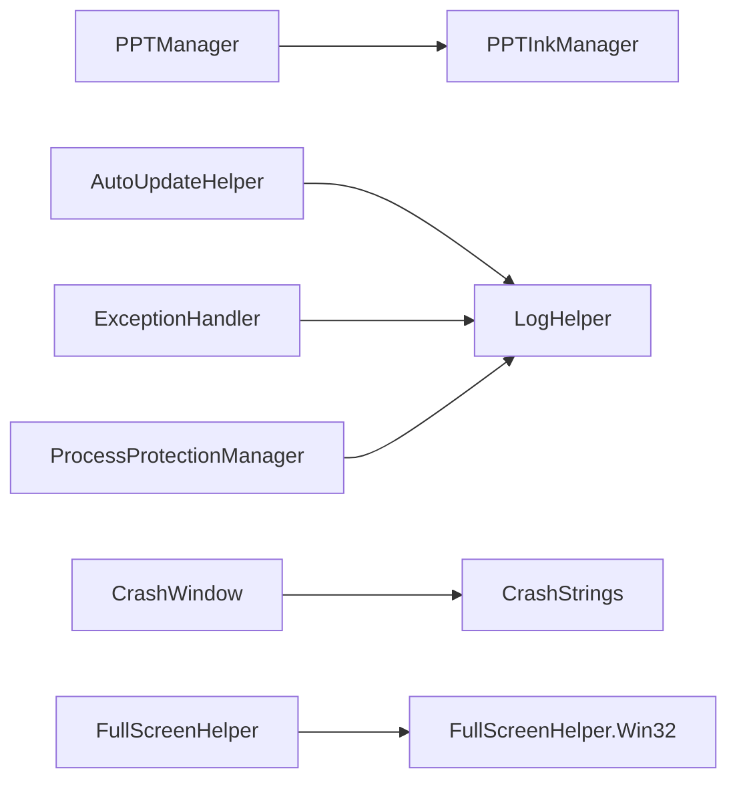

# 故障排除与常见问题

## 简介
本文件面向使用 InkCanvasForClass 的教师与技术支持人员，系统化梳理安装、配置与使用阶段的常见问题，覆盖 PowerPoint 集成、Office 兼容性、系统权限、崩溃处理、性能优化、网络更新与代理、系统兼容性等主题。文档提供可操作的问题诊断流程、日志分析方法、错误代码解读与根因分析技巧，并给出标准化的用户反馈与问题报告流程。

## 项目结构
围绕 InkCanvasForClass 的“故障排除”主题，相关代码主要分布在以下模块：
- 日志与异常处理：ExceptionHandler、LogHelper、CrashWindow、CrashStrings
- PowerPoint 集成：PPTManager、PPTInkManager
- 自动更新与网络：AutoUpdateHelper
- 安全与权限：SecurityManager、ProcessProtectionManager
- 渲染与性能：HardwareAcceleratedInkProcessor、FullScreenHelper、FullScreenHelper.Win32
- 调试工具：DebugConsoleManager

## 核心组件
- 日志与异常处理：统一异常捕获、日志落盘、崩溃窗口展示与复制。
- PowerPoint 集成：统一连接、事件订阅、放映状态检测、墨迹按页持久化与内存管理。
- 自动更新：多线路测速、超时控制、下载取消、版本解析与缓存。
- 安全与权限：密码/TOTP 验证、进程保护（文件/目录句柄锁定）、写入门闩。
- 渲染与性能：GPU 加速平滑、全屏 Hook、内存清理策略。
- 调试工具：控制台可见性与输出。

## 架构总览
下图展示“问题诊断—日志—异常—更新—集成”的闭环流程，帮助定位崩溃、网络与 Office 集成问题。

## 详细组件分析

### PowerPoint 集成问题（PPTManager 与 PPTInkManager）
- 连接与事件
  - 通过 COM 获取 PowerPoint/WPS 应用对象，注册打开/关闭/放映开始/切换等事件。
  - 放映状态通过 SlideShowWindows/View 判断，异常时根据 HResult 判定是否断开。
- 墨迹管理
  - 按页内存化存储 StrokeCollection，支持强制保存、加载与切换。
  - 内存阈值与清理策略，避免长时间放映导致内存膨胀。
- 常见问题
  - 保护模式只读、COM 组件损坏、权限不一致、空演示文稿页数为 0。
- 诊断要点
  - 检查 IsConnected、IsInSlideShow 状态变更事件。
  - 查看日志中“连接/断开/事件注册/放映状态”记录。
  - 关注 COM 异常 HResult，区分业务异常与环境异常。

### 自动更新与网络问题（AutoUpdateHelper）
- 多线路测速与缓存：并发 HEAD 测速，按延迟排序，缓存 15 分钟。
- 超时与异常：统一 10 秒超时，区分 HTML 返回与版本号提取。
- 下载取消：全局取消令牌，避免长时间阻塞 UI。
- Windows 7 兼容：自定义 HttpClientHandler，绕过证书校验。
- 常见问题
  - 线路不可用、超时、版本号解析失败、下载中断。
- 诊断要点
  - 查看“可用线路组/延迟/缓存复用/超时/HTML 提取”日志。
  - 使用 RequestCancelDownload 触发取消，观察状态文件。

### 崩溃处理与日志分析（ExceptionHandler、LogHelper、CrashWindow）
- 异常处理
  - TryExecute/TryExecuteAsync 包裹操作，统一记录日志并决定是否继续。
  - 对 OutOfMemoryException、AccessViolationException 等致命异常直接终止。
- 日志系统
  - 支持按启动时间分档日志、大小上限清理、线程安全写入、调用者信息。
  - 可配置开关：是否启用日志、是否按日期分档。
- 崩溃窗口
  - 展示崩溃详情、复制到剪贴板、主题适配。
- 诊断流程
  - 收集日志文件（含按启动时间分档的 Log_{AppStartTime}.txt）。
  - 复制崩溃详情，标注操作步骤、环境信息（Office 版本、Windows 版本、权限）。
  - 提交 Issue 时附带日志与崩溃详情。

### 安全与权限（SecurityManager、ProcessProtectionManager）
- 密码与 TOTP
  - PBKDF2 派生、固定时间比较、TOTP 6 位验证码容差窗口。
  - 支持密码设置/修改/验证，TOTP 仅模式。
- 进程保护
  - 启用后对应用根路径递归锁定 .exe/.dll/.config/.manifest/.dat/.enc 与 Names.txt。
  - 写入时临时释放目标路径锁，避免死锁；写入门闩超时降级处理。
- 常见问题
  - 写入失败、锁冲突、超时降级、路径排除。
- 诊断要点
  - 查看“写入门闩超时/降级释放/锁定目录/锁定文件”日志。
  - 确认排除目录（Configs/Saves/Backups/Logs/AutoUpdate）不被误删。

### 渲染与性能（HardwareAcceleratedInkProcessor、FullScreenHelper）
- GPU 加速平滑：使用 PathGeometry 与并行贝塞尔插值，保持压感信息。
- 全屏稳定性：通过 Win32 Hook 强制窗口全屏，禁用 DWM 过渡动画，恢复时回写 WPF 尺寸。
- 内存清理：PPTInkManager 按页内存化，超过阈值清理不活跃页，定期清理。
- 常见问题
  - 渲染卡顿、全屏闪烁、内存占用高。
- 诊断要点
  - 查看“GPU 加速/并行插值/内存清理”日志。
  - 全屏前后对比窗口尺寸与 Hook 行为。

## 依赖关系分析
- 组件耦合
  - PPTManager 与 PPTInkManager 强耦合：前者负责连接与事件，后者负责墨迹生命周期。
  - AutoUpdateHelper 与 LogHelper：前者大量写入日志，后者负责落盘与清理。
  - ProcessProtectionManager 与 LogHelper：写入时通过 WithWriteAccess 与日志落盘协同。
- 外部依赖
  - Office COM 组件（PowerPoint/WPS）、Windows API（User32/Dwmapi）、.NET 运行时。
- 循环依赖
  - 未发现直接循环依赖；日志与异常处理形成单向依赖链。

## 性能考虑
- 渲染性能
  - 使用 GPU 加速平滑与并行贝塞尔插值，保持压感一致性。
  - 全屏场景禁用 DWM 过渡动画，减少过渡抖动。
- 内存管理
  - PPTInkManager 设置 100MB 内存上限，5 分钟清理一次不活跃页。
  - 通过“快速切换保护”避免频繁写入导致抖动。
- CPU 占用
  - 定时器周期性检查（连接/放映/进程），降低频率以节省 CPU。
  - 更新测速并发但带缓存，避免重复测速。
- 建议
  - 高分辨率/高帧率场景建议开启硬件加速。
  - 长时间放映建议启用自动保存，避免内存持续增长。

## 故障排除指南

### 一、安装与运行环境
- .NET 运行时
  - 现象：无法启动/提示缺少运行时。
  - 排查：确认已安装 .NET 6.0 或更高版本。
- Office 兼容性
  - 现象：启动后闪退、放映后不切换到 PPT 模式。
  - 排查：确保 Office 已激活；退出保护模式；与 PowerPoint 以相同权限运行；避免 WPS COM 组件冲突。

### 二、PowerPoint 集成问题
- 症状
  - 无法连接 PowerPoint/WPS、放映状态异常、切换页面崩溃。
- 诊断
  - 查看 PPTManager 日志中“连接/事件注册/放映状态/断开连接”记录。
  - 关注 COM 异常 HResult，区分业务异常与环境异常。
  - 检查 PPTInkManager 内存清理日志，确认是否触发清理。
- 处理
  - 以相同权限运行应用与 PowerPoint。
  - 卸载 WPS 后重装 Office，或修复 COM 组件。
  - 避免在保护模式下放映。

### 三、系统权限与进程保护
- 症状
  - 写入失败、文件被占用、更新失败。
- 诊断
  - 查看 ProcessProtectionManager 日志中“写入门闩超时/降级释放/锁定目录/锁定文件”。
  - 确认目标路径是否在排除目录（Logs、AutoUpdate 等）。
- 处理
  - 以管理员权限运行应用。
  - 关闭占用目标文件的其他进程。
  - 检查安全软件隔离策略。

### 四、崩溃与日志分析
- 症状
  - 应用崩溃、黑屏、无响应。
- 诊断
  - 打开崩溃窗口，复制崩溃详情。
  - 收集日志文件（按启动时间分档），查看异常堆栈与内层异常。
  - 使用 DebugConsoleManager 显示控制台，观察实时输出。
- 处理
  - 按“系统权限—Office 权限—PowerPoint 集成—网络更新”顺序排查。
  - 提交 Issue 时附带日志与崩溃详情。

### 五、网络相关问题（更新、代理、云存储）
- 症状
  - 更新失败、版本号解析失败、下载中断。
- 诊断
  - 查看 AutoUpdateHelper 日志中“测速/缓存/超时/HTML 提取/下载取消”。
  - Windows 7 场景检查证书绕过逻辑。
- 处理
  - 更换线路组或使用直连。
  - 配置系统代理或企业代理白名单。
  - 使用 RequestCancelDownload 取消长时间阻塞任务。

### 六、系统兼容性问题
- Windows 版本差异
  - Windows 7：使用特殊 HttpClientHandler；注意证书校验。
  - 其他版本：标准 HTTP 客户端。
- 硬件加速
  - 全屏场景禁用 DWM 过渡动画；渲染场景使用 GPU 加速。
- 建议
  - 优先使用较新 Windows 版本与现代 Office。
  - 如需在旧系统运行，确保字体与运行时完整。

### 七、用户反馈与问题报告流程（标准化）
- 步骤
  1) 复现问题：记录操作步骤、环境信息（Office 版本、Windows 版本、权限）。
  2) 收集日志：打包 Logs 文件夹与按启动时间分档的日志文件。
  3) 截图/录屏：提供崩溃窗口截图或录屏片段。
  4) 提交 Issue：附带日志、崩溃详情、环境信息与复现步骤。
- 模板建议
  - 标题：简述问题（如“放映后崩溃”）
  - 环境：Windows 版本、Office 版本、.NET 版本、管理员权限
  - 步骤：具体操作步骤
  - 日志：附带日志文件与崩溃详情
  - 附件：截图/录屏

## 结论
通过统一的日志体系、完善的异常处理、稳定的 PowerPoint 集成与进程保护机制，InkCanvasForClass 能够在复杂教学环境中提供可靠的书写与演示体验。建议用户在使用前完成运行时与 Office 的准备，出现问题时按“日志—权限—Office—网络—集成”顺序排查，并按标准化流程提交反馈，以便快速定位与修复问题。

## 附录
- 常用日志关键词
  - 连接/断开/事件注册/放映状态/墨迹保存/内存清理/写入门闩/降级释放/测速/缓存/超时/HTML 提取
- 常见 HResult
  - 0x80010001/0x8001010A：COM 繁忙
  - 0x80048240：无活动演示文稿
  - 0x8001010E/0x80004005/0x800706B5：无效对象/拒绝访问/系统错误
- 调试工具
  - DebugConsoleManager：显示/隐藏控制台，输出 UTF-8 日志行

章节来源
