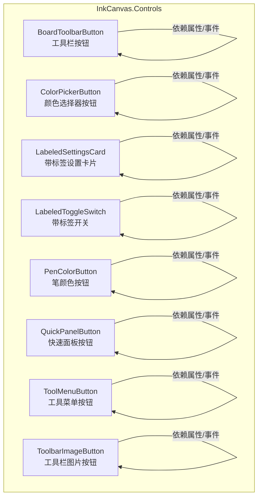
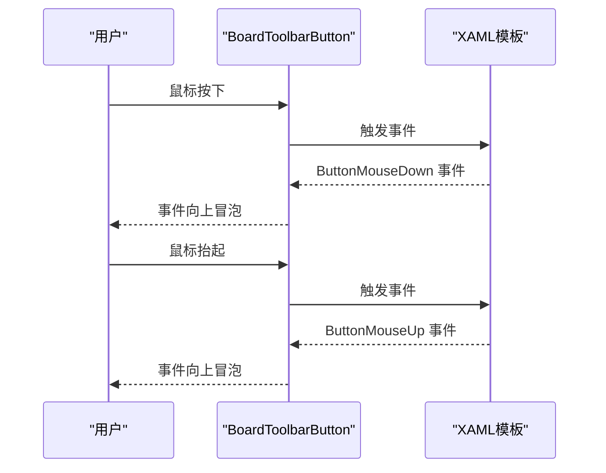
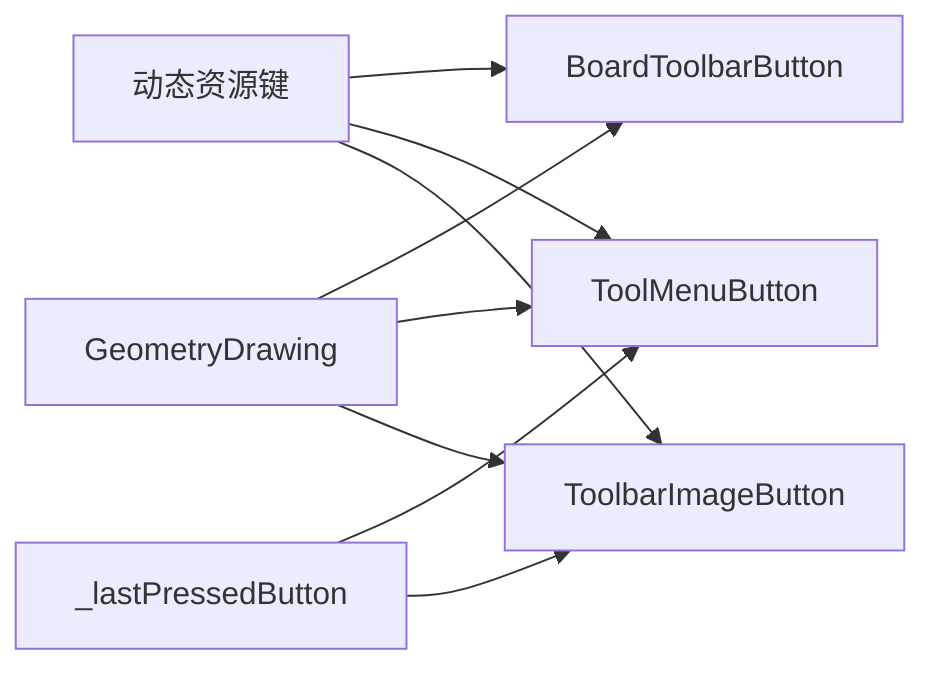

# 自定义控件库

## 简介
本文件系统性梳理 InkCanvasForClass 自定义控件库中与白板工具栏相关的控件：BoardToolbarButton、ColorPickerButton、LabeledSettingsCard、LabeledToggleSwitch、PenColorButton、QuickPanelButton、ToolMenuButton 与 ToolbarImageButton。内容涵盖设计理念、数据绑定与依赖属性、事件模型、样式与主题适配、继承与复用机制、模板与资源管理、性能优化与内存管理建议，以及典型使用场景与最佳实践。

## 项目结构
这些控件均位于 InkCanvas.Controls 子项目中，采用“XAML 视图 + 后台代码隐藏”的标准 WPF 模式组织，控件派生自 UserControl，通过依赖属性与事件实现与宿主页面的数据交互，并广泛使用动态资源（DynamicResource）以支持主题切换。

## 核心组件
本节对各控件进行概览式说明，后续章节将逐个深入。

- BoardToolbarButton：用于白板浮动工具条的按钮，支持图标几何路径、标签文本、边框圆角与位置状态（首/中/尾/单），并暴露边框与前景等外观属性。
- ColorPickerButton：颜色选择器中的单色按钮，支持选中态勾选图标、尺寸与勾选图标尺寸控制。
- LabeledSettingsCard：基于现代 UI 设置卡片的封装，内含可双向绑定的开关，支持标题、描述、图标来源与显示条件。
- LabeledToggleSwitch：带标签与提示文本的开关控件，支持显示条件、开关文案与提示文本。
- PenColorButton：笔颜色选择按钮，支持高光笔透明网格叠加、选中态勾选图标、边框颜色与选中状态。
- QuickPanelButton：快速面板按钮，支持图标与可选标签文本，标签随文本存在自动显隐。
- ToolMenuButton：工具菜单按钮，支持图标几何路径与画刷、按压态背景高亮、全局按压状态记忆。
- ToolbarImageButton：工具栏图片按钮，支持图标几何绘制、标签与前景色、禁用态半透明效果、按压态背景高亮。

## 架构总览
这些控件共享统一的交互模式：通过依赖属性驱动 UI 更新；通过事件向宿主传递用户操作；通过动态资源实现主题化外观；通过 XAML 模板与后台逻辑解耦视图与行为。

```mermaid
classDiagram
class BoardToolbarButton {
+依赖属性 : Label, IconGeometry, Position, IconBrush, IsEnabledBinding
+事件 : ButtonMouseDown, ButtonMouseUp
+外观 : Background, BorderBrush, Foreground
+方法 : UpdateCornerRadius(), UpdateIconOpacity()
}
class ColorPickerButton {
+依赖属性 : Color, IsChecked, CheckIconFill, ButtonSize, CheckIconSize
+事件 : ButtonMouseDown, ButtonMouseLeave, ButtonMouseUp
}
class LabeledSettingsCard {
+依赖属性 : Header, Description, Icon, IconSource, HeaderIcon, IsOn, ShowWhen, SwitchName
+事件 : Toggled
+方法 : ApplyIcon()
}
class LabeledToggleSwitch {
+依赖属性 : Label, Hint, IsOn, OnContent, OffContent, ShowWhen
+事件 : Toggled
}
class PenColorButton {
+依赖属性 : Color, BorderBrushColor, IsHighlighter, IsChecked, CheckIconSource
+事件 : ButtonMouseUp
}
class QuickPanelButton {
+依赖属性 : Label, IconSource, LabelFontSize
+事件 : ButtonMouseUp
}
class ToolMenuButton {
+依赖属性 : Label, IconGeometry, IconBrush
+静态 : _lastPressedButton
+事件 : ButtonMouseDown, ButtonMouseLeave, ButtonMouseUp
}
class ToolbarImageButton {
+依赖属性 : Label, IconGeometryDrawing, IconBrush, LabelBrush
+静态 : _lastPressedButton
+事件 : ButtonMouseDown, ButtonMouseLeave, ButtonMouseUp
}
```

## 详细组件分析

### BoardToolbarButton 组件
- 设计理念：为白板浮动工具条提供统一的按钮容器，支持多位置组合（首/中/尾/单）的圆角与边框处理，允许通过几何路径注入图标，支持禁用态透明度调整。
- 关键依赖属性
  - Label：按钮下方标签文本
  - IconGeometry：SVG 几何字符串，运行时解析为 Geometry
  - Position：按钮在组中的位置，影响圆角与边框
  - IconBrush：图标画刷
  - IsEnabledBinding：外部禁用绑定，联动图标透明度
- 事件
  - ButtonMouseDown/ButtonMouseUp：鼠标按下/抬起事件透传
- 外观属性
  - Background/BorderBrush/Foreground：直接代理到内部边框与文本块
- 使用场景
  - 工具条组合按钮、分段按钮组、上下文工具条
- 最佳实践
  - 在加载时设置 Position 以正确应用圆角
  - 使用动态资源绑定 IconBrush 与前景色以适配主题

## 依赖关系分析
- 控件间无直接依赖，均通过依赖属性与事件与宿主交互
- 共享特性
  - 动态资源：IconForeground、FloatBarForeground、BoardFloatBarBackground、BoardFloatBarBorderBrush 等
  - 按压态一致性：ToolMenuButton 与 ToolbarImageButton 使用静态变量维护唯一按压态
  - 几何图标：BoardToolbarButton、ToolMenuButton、ToolbarImageButton 使用 DrawingImage + GeometryDrawing 注入图标
- 资源与主题
  - 通过 DynamicResource 实现主题切换
  - 建议在 App.xaml 或主题资源字典中集中定义上述动态资源键

## 性能考虑
- 渲染与缩放
  - 图标统一使用高精度位图缩放模式，避免模糊
  - 几何图标使用 DrawingImage + GeometryDrawing，适合矢量缩放
- 事件与状态
  - ToolMenuButton 与 ToolbarImageButton 使用静态变量记录按压态，避免重复计算与布局抖动
  - 禁用态统一降低透明度与禁用交互，减少无效事件处理
- 内存与资源
  - 勾选图标资源建议使用相对路径与缓存友好命名，避免重复加载
  - 高光笔透明网格仅在启用时可见，减少不必要的渲染开销
- 建议
  - 对频繁切换的主题场景，尽量使用动态资源键而非硬编码颜色
  - 将几何图标字符串与画刷在控件加载时一次性解析与赋值

[本节为通用性能建议，无需特定文件引用]

## 故障排查指南
- 图标不显示或显示异常
  - 检查几何字符串是否有效，确认加载时已解析
  - 确认动态资源键是否存在且值非空
- 按压态未恢复
  - 确认鼠标离开事件未被拦截
  - 检查控件是否处于禁用态
- 勾选图标不显示
  - 确认 IsChecked 为 true 且勾选图标资源路径有效
- 标签文本不显示
  - 确认 Label 非空，QuickPanelButton 会根据文本存在自动显隐
- 主题切换后颜色不生效
  - 确认使用了 DynamicResource 并在主题资源字典中定义对应键

## 结论
该控件库围绕白板工具栏场景，提供了从基础按钮到设置卡片的完整 UI 组件族。通过依赖属性与事件实现松耦合交互，借助动态资源实现主题化外观，通过几何图标与高精度缩放保证清晰渲染。建议在实际项目中遵循本文档的使用模式与最佳实践，以获得稳定、可维护且高性能的用户体验。

[本节为总结性内容，无需特定文件引用]

## 附录
- 样式与资源管理建议
  - 将常用颜色、尺寸、字体等定义为资源字典，集中管理
  - 为图标与按钮提供统一的尺寸规范与间距规范
- 主题适配
  - 为浅色/深色主题分别提供资源字典，按需切换
  - 使用 DynamicResource 绑定颜色与画刷，避免硬编码
- 使用模式
  - 工具条组合：BoardToolbarButton + ToolbarImageButton
  - 颜色选择：ColorPickerButton + PenColorButton
  - 设置项：LabeledSettingsCard + LabeledToggleSwitch
  - 快速入口：QuickPanelButton
  - 工具菜单：ToolMenuButton

[本节为概念性内容，无需特定文件引用]