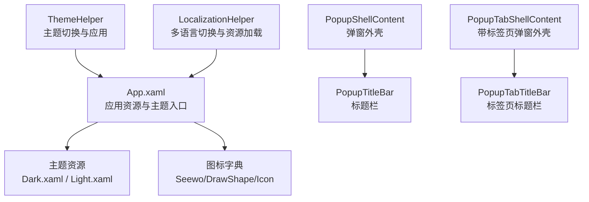
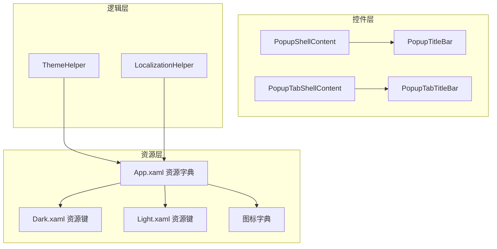
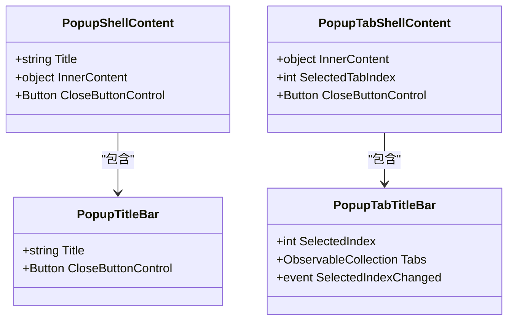
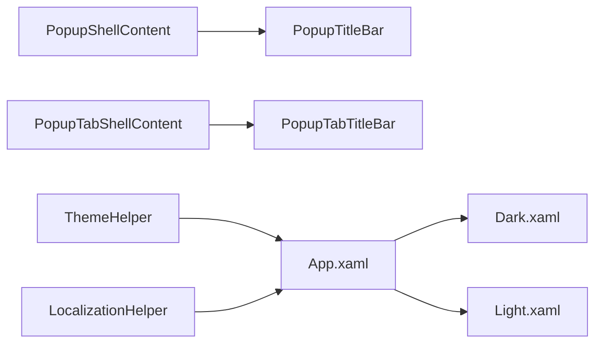

# 用户界面系统

## 简介
本文件面向 InkCanvasForClass 的用户界面系统，聚焦于自定义控件库的设计与实现，涵盖控件继承体系、样式系统与模板机制；主题系统（深色/浅色主题切换、动态样式应用、自定义主题创建）；多语言支持（资源文件管理、动态语言切换、文本本地化机制）；弹窗系统（PopupShellContent 的扩展机制、模态对话框管理与响应式布局适配）；以及自定义控件开发指南（模板定义、事件处理、数据绑定最佳实践）、UI 性能优化策略与内存管理、渲染优化技巧，并提供具体控件使用示例与样式定制方法。

## 项目结构
- 应用程序资源与主题入口位于 App.xaml，统一合并 Modern 主题与图标字典。
- 自定义弹窗控件位于 InkCanvas.Controls/Popups，包含基础弹窗外壳、带标签页外壳、标题栏等。
- 样式资源位于 Ink Canvas/Resources/Styles，提供深色与浅色两套主题资源。
- 主题与本地化辅助位于 Ink Canvas/Helpers，分别负责主题应用与多语言切换。

## 核心组件
- 弹窗外壳与标题栏
  - PopupShellContent：提供可承载内容的弹窗外壳，支持动态标题与内部内容绑定。
  - PopupTitleBar：内置标题与关闭按钮，使用动态资源实现主题色。
  - PopupTabShellContent：带标签页的弹窗外壳，支持多标签页切换。
  - PopupTabTitleBar：动态生成标签项，支持图标、选中指示与交互。
- 主题系统
  - Dark.xaml / Light.xaml：定义大量动态资源键，覆盖背景、边框、前景、图标等。
  - ThemeHelper：根据设置与系统主题选择有效主题并应用到元素。
- 多语言系统
  - LocalizationHelper：动态切换当前文化，支持嵌入式资源与回退资源管理。
- 应用资源入口
  - App.xaml：合并 Modern 主题、XAML 控件资源与图标字典，作为全局资源入口。

## 架构总览
UI 架构围绕“资源驱动 + 控件模板 + 动态主题 + 多语言”的设计展开：
- 资源驱动：通过 Application.Resources 合并主题与图标资源，控件通过 DynamicResource 绑定资源键，实现主题切换时的自动更新。
- 控件模板：PopupShellContent/PopupTabShellContent 使用 ContentPresenter 承载内部内容，支持以模板形式复用外壳样式。
- 主题系统：ThemeHelper 依据设置与系统主题选择 ElementTheme 并调用 ThemeManager 应用，Dark/Light 资源字典提供完整视觉变量。
- 多语言系统：LocalizationHelper 切换 CurrentUICulture，动态替换各 Strings 类的资源管理器，支持嵌入式与外部 resx 回退。

## 详细组件分析

### 弹窗外壳与标题栏组件
- PopupShellContent
  - 依赖属性：Title、InnerContent，内部通过 ContentPresenter 承载内容。
  - 模板结构：外层圆角边框 + 内层边框与背景 + 标题栏 + 内容区。
  - 适用场景：工具弹窗、设置面板等需要统一外壳样式的场景。
- PopupTitleBar
  - 依赖属性：Title，内置关闭按钮，使用动态资源控制前景色与悬停样式。
  - 适用场景：所有弹窗的标题与关闭操作。
- PopupTabShellContent 与 PopupTabTitleBar
  - 支持标签页集合，动态构建标签项，选中态视觉反馈（背景与下划线指示）。
  - 适用场景：多模块设置或功能分组的弹窗。

## 依赖关系分析
- 资源依赖
  - 控件模板通过 DynamicResource 引用资源键，资源键由 Dark.xaml / Light.xaml 提供，App.xaml 合并资源字典。
- 代码依赖
  - ThemeHelper 依赖 iNKORE.UI.WPF.Modern 的 ThemeManager 与注册表查询。
  - LocalizationHelper 依赖反射与资源管理器替换，确保多文化字符串即时生效。
- 控件依赖
  - PopupShellContent/PopupTabShellContent 依赖 PopupTitleBar/PopupTabTitleBar 的公共控件。

## 性能考虑
- 资源访问
  - 使用 DynamicResource 使主题切换时无需重建控件树，但频繁切换仍可能引发布局重计算；建议批量切换主题后再刷新 UI。
- 图标与位图
  - 图标资源以 BitmapImage 形式提供，注意避免重复加载相同 URI；可利用 WPF 缓存机制减少内存占用。
- 集合与事件
  - PopupTabTitleBar 使用 ObservableCollection 管理标签，建议在 UI 线程进行集合操作，避免跨线程异常与闪烁。
- 字符串资源
  - LocalizationHelper 对嵌入式资源进行缓存，减少重复解析开销；切换文化后应避免频繁切换以降低 IO 与反射成本。

[本节为通用指导，无需列出具体文件来源]

## 故障排查指南
- 主题未生效
  - 检查 ThemeHelper.ApplyTheme 是否传入非空 element 与 settings；确认有效主题返回值与 ThemeManager 调用未抛出异常。
  - 确认 App.xaml 已合并 Modern 主题资源。
- 文本未本地化
  - 检查 CurrentCulture 是否成功设置；确认目标 Strings 类已安装 EmbeddedResourceManager 或恢复原始资源管理器。
  - 确认嵌入式资源键存在且大小写匹配。
- 弹窗外壳内容不显示
  - 确认 InnerContent 已赋值且 ContentPresenter 正常绑定；检查外壳模板中 ContentArea 的命名与可见性。

## 结论
该 UI 系统通过“资源驱动 + 控件模板 + 动态主题 + 多语言”的组合，实现了高内聚、低耦合的可扩展界面框架。弹窗外壳与标题栏组件提供了统一的外观与交互体验；主题系统与资源字典保证了深色/浅色模式的一致性；多语言系统支持嵌入式与外部资源回退，满足国际化需求。结合本文提供的开发指南与性能建议，可在保证体验的同时提升开发效率与运行性能。

[本节为总结性内容，无需列出具体文件来源]

## 附录

### 自定义控件开发指南（最佳实践）
- 控件模板定义
  - 使用 ContentProperty 标注内部内容属性，结合 ContentPresenter 承载子内容，便于复用外壳样式。
  - 通过 DynamicResource 引用资源键，避免硬编码颜色与尺寸。
- 事件处理
  - 使用依赖属性与回调（如 SelectedIndexChanged）实现交互状态同步。
  - 关闭按钮通过公开 CloseButtonControl 提供统一关闭入口，便于业务层绑定命令。
- 数据绑定
  - 将标题、图标、选中状态等属性暴露为依赖属性，支持双向绑定与模板绑定。
  - 在集合类控件中使用 ObservableCollection，确保 UI 自动刷新。