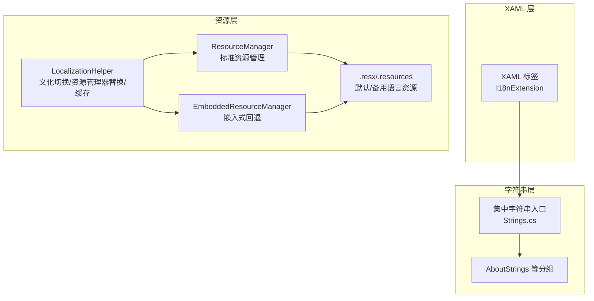
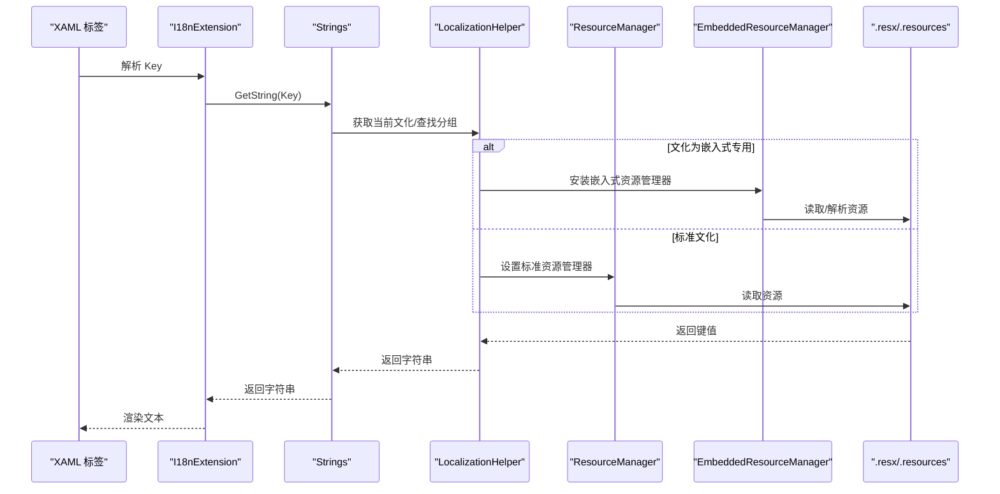
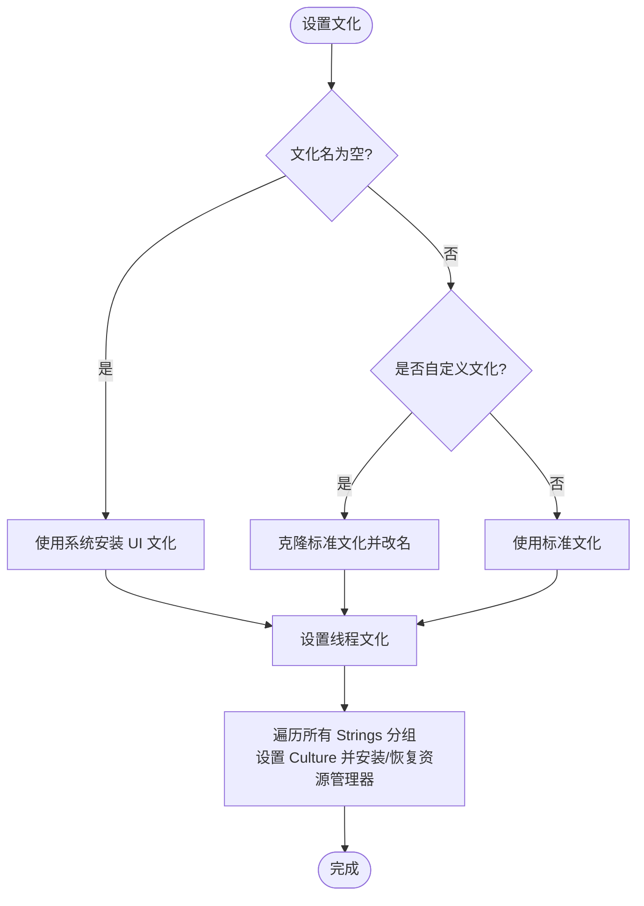
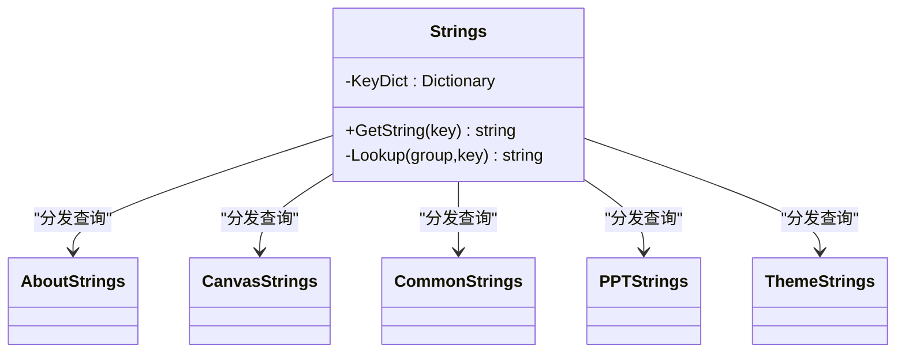
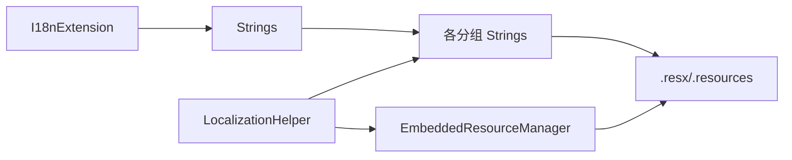
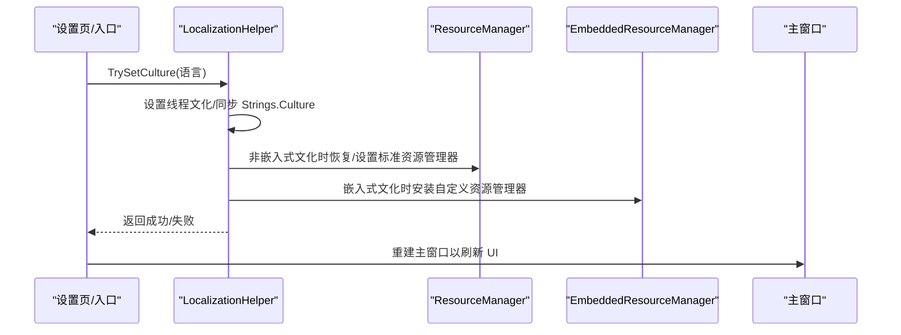

# 多语言支持

## 简介
本文件系统性梳理 InkCanvasForClass 的多语言支持体系，围绕国际化架构设计、资源文件组织、动态语言切换与文本本地化机制展开。重点覆盖以下方面：
- 字符串集中管理与资源键命名规范
- LocalizationHelper 的语言检测、资源加载与缓存机制
- .resx 资源文件的结构、默认语言与备用语言处理
- 多语言资源文件的创建与维护流程、质量保障
- RTL（从右到左）语言支持的实现考虑与本地化测试策略
- 新语言接入流程与特殊字符集编码注意事项

## 项目结构
InkCanvasForClass 的多语言能力由“集中式字符串入口 + 运行时资源管理 + XAML 标记扩展”三层构成：
- 字符串入口与分组：通过集中类统一查询，按功能模块拆分为多个 Strings 分组（如 AboutStrings、CanvasStrings 等）
- 运行时资源管理：LocalizationHelper 负责线程文化切换、资源管理器替换与嵌入式资源缓存
- XAML 标记扩展：I18nExtension 提供标记语法，简化在 XAML 中的本地化绑定

## 核心组件
- 集中式字符串入口：集中类负责将逻辑键映射到具体分组的键值，统一对外提供 GetString 查询接口
- 运行时资源管理：LocalizationHelper 负责线程文化切换、资源管理器替换、嵌入式资源缓存与回退
- XAML 标记扩展：I18nExtension 将 Key 映射为本地化文本，支持空键回退与占位提示

## 架构总览
下图展示了从 XAML 到资源文件的完整调用链路，以及文化切换时的资源管理器替换与嵌入式回退策略。

## 详细组件分析

### 组件一：LocalizationHelper（语言检测、资源加载与缓存）
- 语言检测与切换
  - 支持从系统安装 UI 文化、自定义文化名称与标准文化名称三种路径设置当前文化
  - 自定义文化通过克隆标准文化并修改内部名称字段实现，兼容非标准区域性
- 资源管理器替换
  - 针对嵌入式专用文化（如 en-US、zh-ME），安装自定义 EmbeddedResourceManager，优先从嵌入式字典返回，回退至原始 ResourceManager
  - 非嵌入式文化则恢复原始 ResourceManager 或移除自定义包装
- 资源加载与缓存
  - 优先从程序集内置 .resources 加载；若失败，尝试解析 .resx 并缓存；最后回退到磁盘上的 .resx 文件
  - 使用字典缓存已解析的键值对，避免重复 IO 与解析

### 组件二：Strings（字符串管理与键映射）
- 键映射表
  - 内部维护键到“分组名 + 键名”的映射字典，统一由集中类进行查询
  - 查询失败时返回占位提示，便于定位缺失键
- 分组访问
  - 通过 switch 分发到各 Strings 分组（如 AboutStrings、CanvasStrings 等），由各分组的 ResourceManager 提供实际值
- 文化传播
  - 在文化切换时，集中类会同步设置各分组的 Culture，确保跨分组一致性

### 组件三：I18nExtension（XAML 标记扩展）
- 作用
  - 在 XAML 中以简洁语法绑定本地化文本，Key 缺失时返回占位提示
- 使用场景
  - 设置页、菜单项、按钮文本等静态文案的本地化

### 组件四：.resx 资源文件与嵌入式加载
- 结构与内容
  - .resx 采用标准 ResXSchema，包含 metadata、assembly、data 等节点
  - 默认语言与备用语言分别提供不同语言的 data 条目
- 加载策略
  - 优先从程序集内置 .resources 加载；若不存在，解析 .resx 并缓存；最后尝试磁盘上的 .resx
- 示例文件
  - 默认语言：AboutStrings.resx
  - 英文语言：AboutStrings.en-US.resx
  - 嵌入式专用语言：AboutStrings.zh-ME.resx

### 组件五：动态语言切换与应用入口
- 应用启动
  - 从配置中读取首选语言并调用 LocalizationHelper 设置文化
- 设置页切换
  - AppearancePage 中保存语言设置并调用 LocalizationHelper，随后重建主窗口以应用新语言
- 主窗口事件
  - MainWindow 与设置加载流程中也存在语言切换触发点

## 依赖关系分析
- 组件耦合
  - I18nExtension 仅依赖 Strings，耦合度低，便于在 XAML 中广泛使用
  - Strings 依赖各分组 Strings 类与其 ResourceManager，形成清晰的分层
  - LocalizationHelper 与 ResourceManager/EmbeddedResourceManager 强耦合，承担资源加载与缓存职责
- 外部依赖
  - .resx/.resources 文件作为资源存储介质，LocalizationHelper 提供解析与缓存
  - 程序集元数据与反射用于动态发现与替换资源管理器

## 性能考量
- 缓存策略
  - 嵌入式资源解析结果按“(分组名, 文化)”键缓存，避免重复 IO 与 XML 解析
- 资源管理器替换
  - 仅在文化变化时进行替换，减少频繁反射与实例化
- 字符串查询
  - 键到分组的映射为常量字典，查询为 O(1)，跨分组一致性通过集中类 Culture 同步保证

## 故障排查指南
- 文本未本地化或显示占位
  - 检查键是否存在且拼写正确；缺失键将返回带键名的占位提示
- 语言切换无效
  - 确认已调用 LocalizationHelper.TrySetCulture 并正确设置线程文化
  - 对于嵌入式专用文化，确认资源文件存在且可被解析
- XAML 文本未更新
  - 确保使用 I18nExtension 并在语言切换后重建主窗口以刷新 UI
- 资源文件加载失败
  - 检查 .resx/.resources 是否存在于程序集或磁盘；确认命名与文化一致

## 结论
InkCanvasForClass 的多语言体系以集中式字符串入口为核心，结合运行时资源管理器替换与嵌入式缓存，实现了灵活、可扩展的语言切换与资源加载。通过标准化的 .resx 管理与键映射机制，既保证了开发效率，又为后续新增语言与 RTL 支持预留了空间。

## 附录

### 字符串管理与键命名规范
- 命名建议
  - 使用“模块名_功能描述_状态/属性”风格，保持层级清晰
  - 语义化键名，避免仅使用数字或缩写
- 占位符与复数
  - 占位符建议采用位置占位（如 {0}、{1}）而非命名占位，便于不同语言调整顺序
  - 复数形式建议通过资源键区分（如 Item_One、Item_Few、Item_Many），或在调用端根据数值选择对应键
- 键映射与迁移
  - 使用 key_mapping.json 统一记录键变更与归属分组，便于迁移与审计

### .resx 文件结构与管理
- 结构要点
  - data 节点包含 name 与 value，支持注释 comment
  - resheader 包含版本、读写器等元信息
- 默认语言与备用语言
  - 默认语言文件提供基础键值；备用语言文件提供对应翻译
  - 嵌入式专用文化（如 zh-ME）可独立维护，避免与标准文化冲突

### 动态语言切换流程

### RTL（从右到左）语言支持实现考虑
- 文本方向
  - 通过 WPF FlowDirection 属性控制（如 RightToLeft），在语言切换时同步设置
- 布局适配
  - 菜单、按钮排列与图标方向需镜像；间距与对齐应适配 RTL 阅读习惯
- 字体与字符集
  - 确保字体支持目标语言字符集；阿拉伯语、希伯来语等需注意连写与字符形状
- 测试策略
  - 使用模拟 RTL 文本与真实 RTL 语言进行 UI 布局验证
  - 关注滚动条、输入法与文本选择行为

[本节为概念性指导，不直接分析具体文件，故无章节来源]

### 多语言资源文件创建与维护指南
- 创建步骤
  - 在 Properties 下新建与现有 .resx 同名的 .resx 文件（不含文化后缀）
  - 为新语言创建同名 .resx 文件（如 AboutStrings.fr-FR.resx）
  - 使用 ResXResourceWriter 写入键值，或在 IDE 中编辑
- 翻译工作流
  - 使用 key_mapping.json 统一追踪键归属与变更
  - 采用双人校对与自动化检查（如键缺失、占位符数量匹配）
- 质量保证
  - 保持占位符与注释一致性
  - 对比默认语言与目标语言的键集合，确保无遗漏
  - 在设置页中提供语言切换预览与快速回退

### 新语言接入流程
- 准备资源
  - 复制默认语言 .resx 为新文化 .resx
  - 填充翻译，确保占位符与注释齐全
- 注册文化
  - 若为标准文化，直接使用标准文化名；若为嵌入式专用文化，纳入 EmbeddedOnlyCultures 列表
- 验证与回归
  - 在设置页切换语言，验证 UI 文本与布局
  - 回归测试关键路径（菜单、对话框、通知）

### 特殊字符集与编码问题
- 编码
  - .resx 默认 UTF-8，确保包含非 ASCII 字符（如中文、日文、表情符号）
- 字体与渲染
  - 为特殊字符集准备相应字体；避免使用仅支持拉丁字符的字体
- 输入法与 IME
  - 验证输入法在不同语言下的候选词与组合行为
- 跨平台一致性
  - 在不同操作系统上对比渲染效果，必要时提供字体回退策略

[本节为通用实践建议，不直接分析具体文件，故无章节来源]
