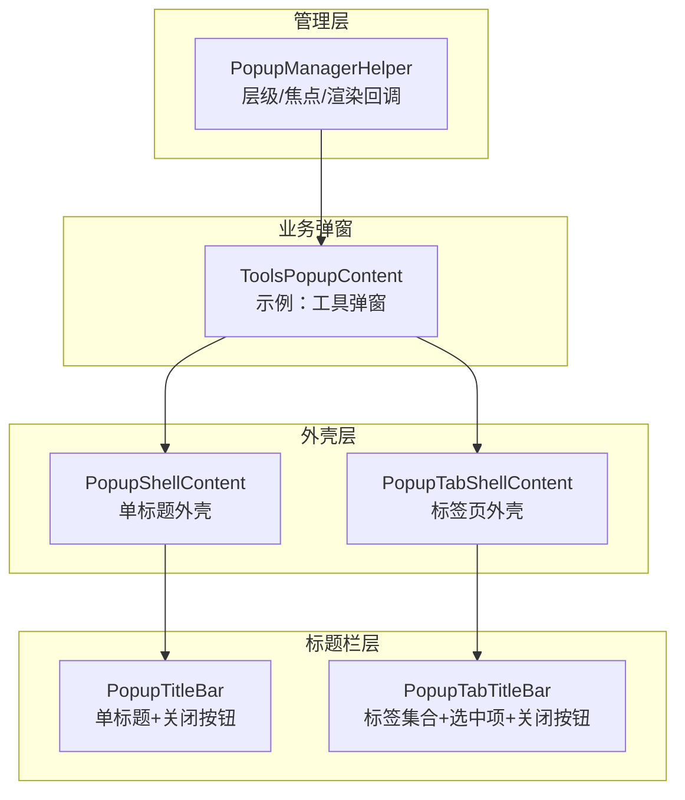
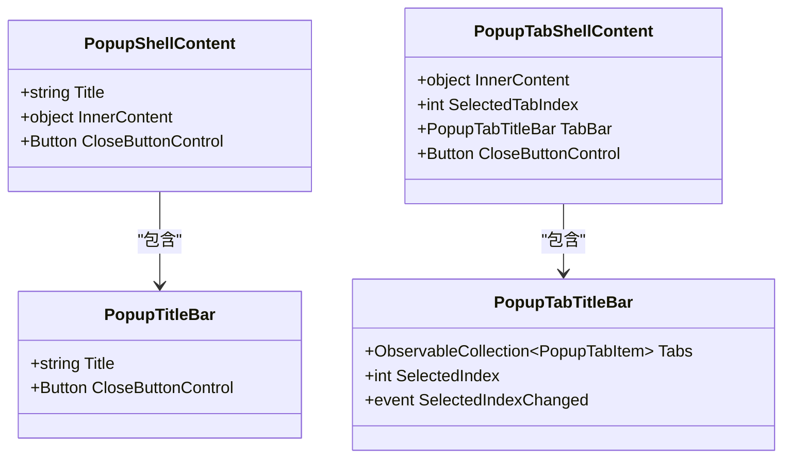
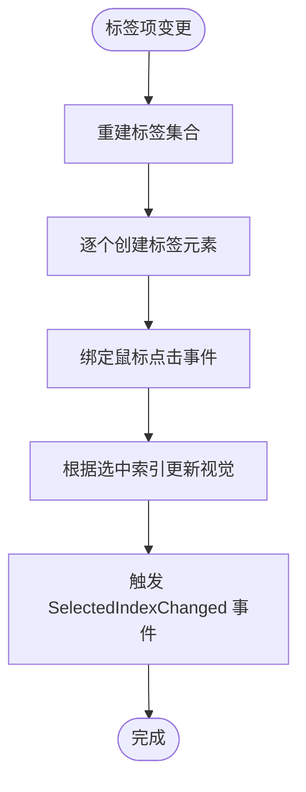
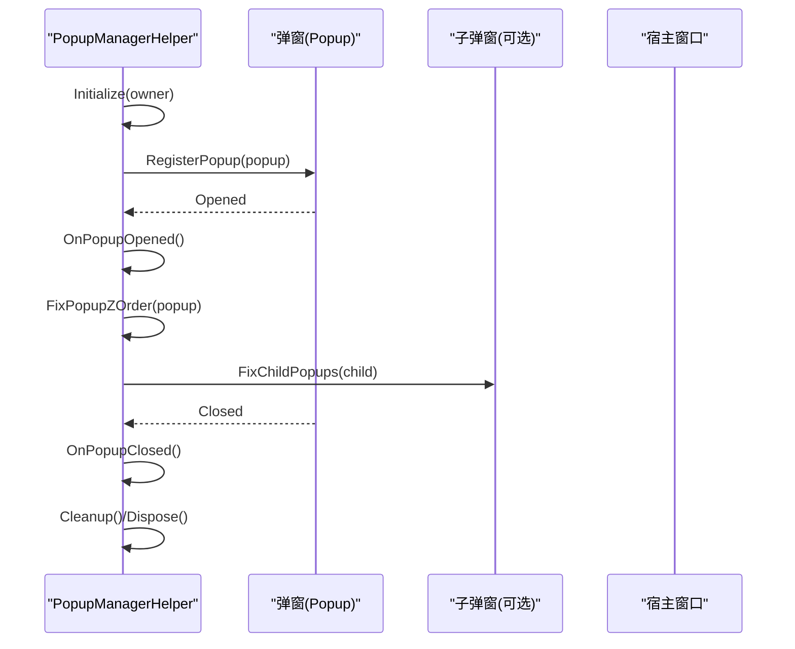
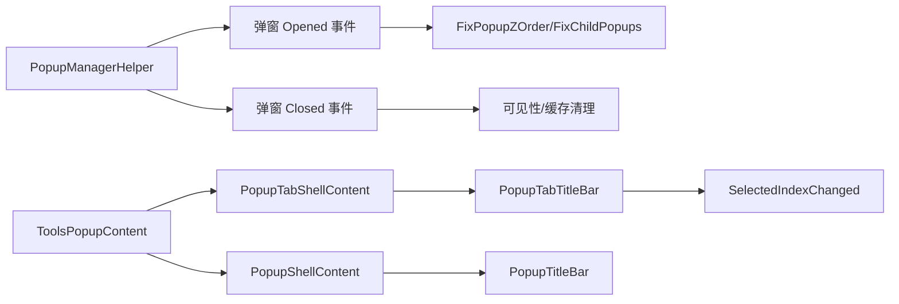

# 弹窗系统

## 简介
本文件面向 InkCanvasForClass 的弹窗系统，围绕 PopupShellContent 与 PopupTabShellContent 的架构设计、弹窗容器管理、层级控制与焦点处理机制进行深入说明；同时阐述 PopupTitleBar 与 PopupTabTitleBar 的功能差异与适用场景；并总结 PopupManagerHelper 的弹窗生命周期管理、事件传播与内存清理职责。最后提供扩展指南（自定义弹窗类型、模态对话框实现、响应式布局适配）、性能优化策略（延迟加载、虚拟化、内存池）以及在不同窗口状态（最小化、最大化、全屏）下的兼容性处理建议。

## 项目结构
弹窗系统主要由三层组成：
- 外壳层：PopupShellContent 与 PopupTabShellContent，负责统一外观、边框、内边距与内容承载。
- 标题栏层：PopupTitleBar 与 PopupTabTitleBar，分别提供单标题与多标签页的标题区与关闭按钮。
- 管理层：PopupManagerHelper，负责弹窗层级、焦点与渲染周期内的稳定性维护。



## 核心组件
- PopupShellContent：单标题弹窗外壳，支持 Title 绑定与 InnerContent 依赖属性，内部通过 ContentPresenter 承载内容。
- PopupTabShellContent：带标签页的弹窗外壳，内部通过 PopupTabTitleBar 管理多个标签页，支持 SelectedTabIndex 与 InnerContent。
- PopupTitleBar：单标题栏，包含标题文本与关闭按钮，提供 CloseButtonControl 暴露以供外部绑定事件。
- PopupTabTitleBar：标签页标题栏，支持动态添加标签项、选中项变更事件与视觉高亮指示。
- PopupManagerHelper：弹窗生命周期与层级管理，负责弹窗打开/关闭事件处理、Z-Order 置顶、渲染回调与内存清理。

## 架构总览
弹窗系统采用“外壳 + 标题栏 + 内容”的分层设计，业务弹窗通过 InnerContentHost 与外壳组合，实现设计期可预览与运行时可替换内容。管理层通过渲染回调与 Win32 层级 API，确保弹窗在不同窗口状态与交互下保持正确的层级与焦点。

```mermaid
sequenceDiagram
participant Host as "业务弹窗(示例)"
participant Shell as "外壳(PopupShell/TabShell)"
participant Title as "标题栏(PopupTitleBar/TabTitleBar)"
participant Manager as "PopupManagerHelper"
Host->>Shell : 设置 InnerContent
Shell->>Title : 绑定 Title/关闭按钮
Host->>Manager : 注册弹窗/初始化
Manager->>Manager : 订阅弹窗 Opened/Closed 事件
Manager->>Manager : 渲染回调中维持 Z-Order
Manager-->>Host : 置顶/恢复层级
```

## 组件详解

### PopupShellContent 与 PopupTabShellContent
- 设计要点
  - 外观：统一圆角边框、描边与背景色，内部再包裹一层边框与背景，形成嵌套的视觉层次。
  - 内容承载：通过 InnerContent 依赖属性与 ContentPresenter 实现内容注入，支持运行时替换。
  - 关闭按钮：外壳提供 CloseButtonControl 暴露，便于业务侧直接绑定关闭逻辑。
- PopupTabShellContent 特性
  - 通过 PopupTabTitleBar 管理标签集合与选中项，支持 SelectedTabIndex 读写。
  - 内容区域与单外壳一致，仍由 InnerContent 承载。



### PopupTitleBar 与 PopupTabTitleBar
- PopupTitleBar
  - 单标题 + 关闭按钮，标题通过绑定显示，关闭按钮通过 CloseButtonControl 暴露。
- PopupTabTitleBar
  - 支持动态构建标签项集合，每个标签项包含图标与文本；选中项变更时触发 SelectedIndexChanged 事件，并更新标签视觉状态（背景色、加粗、底部指示线）。



### PopupManagerHelper：弹窗生命周期与层级控制
- 生命周期管理
  - 注册/注销弹窗：RegisterPopup/UnregisterPopup，订阅 Opened/Closed 事件。
  - 打开/关闭回调：OnPopupOpened/OnPopupClosed，负责可见性与缓存维护。
- 层级控制与焦点处理
  - FixPopupZOrder：基于 Win32 SetWindowPos 将弹窗置顶或取消置顶，必要时将宿主窗口置于弹窗之下。
  - FixChildPopups：递归查找子弹窗并置顶，保证嵌套弹窗的一致性。
  - ShouldBeTopmost：通过委托判断是否需要置顶，支持动态切换。
- 渲染周期与位置更新
  - OnRendering：定时检查并修复层级；当标记需要更新时对已打开弹窗执行微调偏移以刷新布局。
  - UpdatePosition：对已打开且有 PlacementTarget 的弹窗进行微小偏移以强制重绘。
- 内存清理
  - Cleanup/Dispose：解绑渲染事件、注销弹窗事件、清空缓存与集合，避免内存泄漏。



### 业务弹窗示例：ToolsPopupContent
- 结构模式
  - 使用 Grid 布局，外层 Shell 作为外壳，InnerContentHost 作为可设计时预览的内容容器。
  - 在构造函数中将 InnerContentHost 的内容赋给 Shell.InnerContent，实现“外壳 + 内容”的组合。
- 交互与扩展
  - 通过暴露按钮等控件的访问器，便于 MainWindow 或其他组件绑定事件。
  - 可按需切换内容可见性（例如在特定模式下隐藏某些按钮）。

## 依赖关系分析
- 组件耦合
  - PopupShellContent/PopupTabShellContent 与 PopupTitleBar/PopupTabTitleBar 存在组合关系，外壳持有标题栏实例。
  - 业务弹窗（如 ToolsPopupContent）依赖外壳与标题栏，通过 InnerContentHost 与外壳组合。
- 外部依赖
  - PopupManagerHelper 依赖 WPF 渲染管线（CompositionTarget.Rendering）与 Win32 API（SetWindowPos、GetWindowLong、SetWindowLong）。
- 事件传播
  - 弹窗打开/关闭事件由 PopupManagerHelper 统一订阅与处理，再向子弹窗传播置顶逻辑。
  - PopupTabTitleBar 的 SelectedIndexChanged 事件由外壳持有者订阅，用于切换内容或执行业务逻辑。



## 性能考量
- 延迟加载
  - 利用 InnerContent 的延迟设置，仅在弹窗打开时才构建复杂内容，减少启动时开销。
- 虚拟化
  - 对于长列表内容，可在 InnerContent 中采用虚拟化容器（如 VirtualizingStackPanel），降低可视树节点数量。
- 内存池与对象复用
  - 对频繁创建/销毁的弹窗内容，可考虑对象池缓存，避免 GC 抖动。
- 渲染优化
  - PopupManagerHelper 的渲染回调按固定频率检查层级，避免每帧高频操作；必要时使用微小偏移触发重绘而非强制刷新。
- 资源与样式
  - 统一使用动态资源与样式键，减少重复定义与主题切换成本。

## 故障排查指南
- 弹窗层级异常
  - 症状：弹窗被遮挡或无法置顶。
  - 排查：确认 ShouldBeTopmost 返回值；检查宿主窗口句柄有效性；验证 FixPopupZOrder 是否成功调用。
- 弹窗关闭后残留
  - 症状：关闭后仍占用内存或继续参与渲染。
  - 排查：确认 UnregisterPopup/Dispose/Cleanup 是否执行；检查事件是否正确解绑。
- 子弹窗未置顶
  - 症状：嵌套弹窗层级不正确。
  - 排查：确认 FixChildPopups 是否遍历到子弹窗；检查子弹窗是否已打开且存在有效 Hwnd。
- 渲染抖动或闪烁
  - 症状：弹窗位置或层级频繁变化导致闪烁。
  - 排查：检查 UpdatePosition 的微调是否过度；确认渲染回调频率与触发条件。

## 结论
该弹窗系统通过外壳与标题栏的清晰分层、业务弹窗与外壳的松耦合组合，以及 PopupManagerHelper 的生命周期与层级管理，实现了稳定、可扩展且易于维护的弹窗体系。配合延迟加载、虚拟化与资源复用等策略，可在复杂场景下保持良好的性能与用户体验。

## 附录

### 扩展指南
- 自定义弹窗类型
  - 使用 PopupShellContent 或 PopupTabShellContent 作为外壳，InnerContentHost 承载内容，构造函数中将 InnerContentHost 内容赋给外壳。
  - 如需标签页，使用 PopupTabShellContent 并通过 PopupTabTitleBar 的 Tabs 集合与 SelectedIndex 控制标签切换。
- 模态对话框实现
  - 在弹窗打开前设置宿主窗口的禁用状态，弹窗关闭后恢复；结合 PopupManagerHelper 的层级控制，确保模态期间弹窗始终置顶。
- 响应式布局适配
  - 在 InnerContent 中使用自适应布局（如 AutoFontSizeHelper、网格列宽自适应），并在窗口尺寸变化时触发 UpdatePosition 以刷新布局。
- 国际化与主题
  - 使用 i18n 资源与动态资源键，确保多语言与深浅主题下的视觉一致性。

### 窗口状态兼容性
- 最小化/恢复
  - 在最小化期间避免频繁层级修复；恢复后通过 OnOwnerActivated/NotifyTopmostMaintained 触发一次集中修复。
- 最大化/全屏
  - 置顶策略与宿主窗口状态联动，确保弹窗在最大化/全屏下仍处于正确层级；必要时对子弹窗递归置顶。
- 多显示器/缩放
  - 通过微小偏移触发重绘，避免因 DPI 或多屏导致的位置漂移；在布局变化时调用 UpdatePosition。

章节来源
