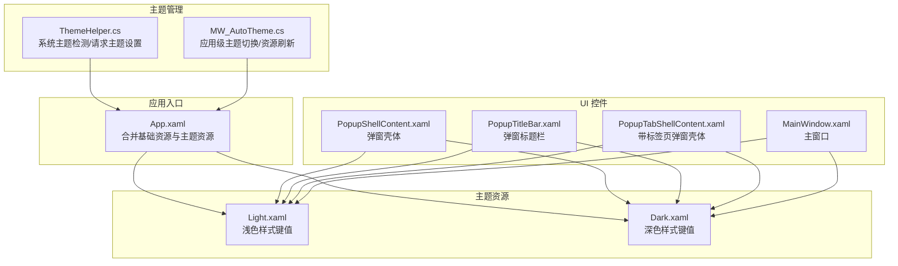
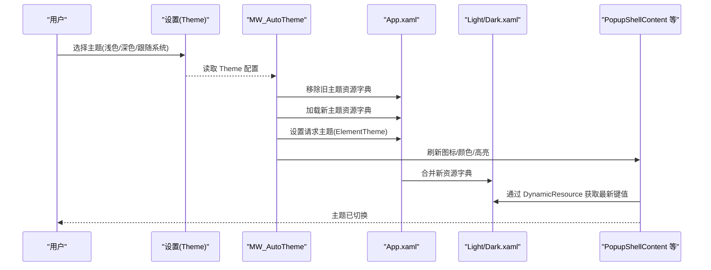
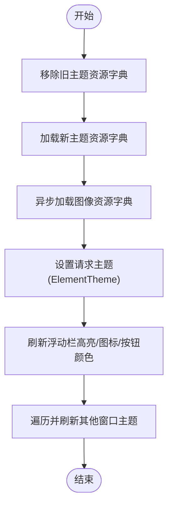
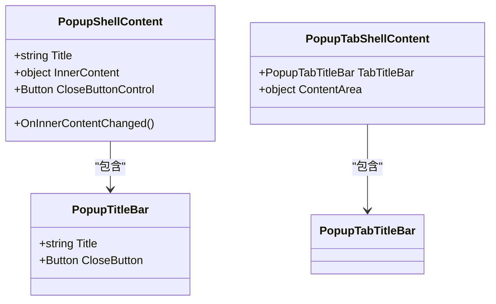
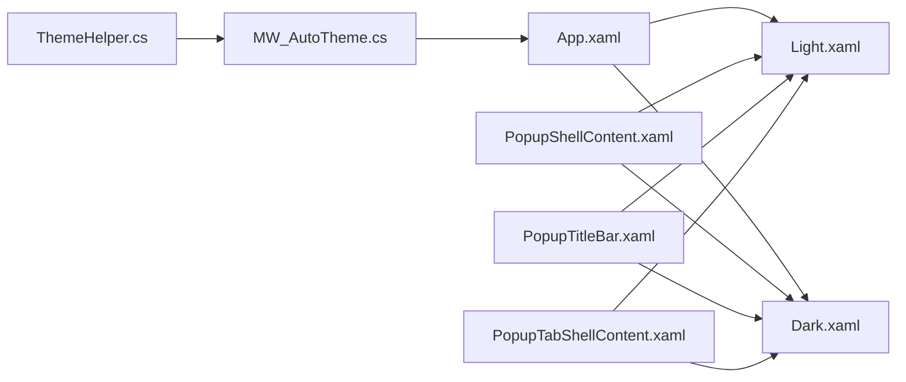

# 主题系统

## 简介
本文件系统性阐述 InkCanvasForClass 的主题系统，重点覆盖深色与浅色主题的实现架构、样式资源管理、动态主题切换机制、主题状态持久化、关键控件（如 PopupShellContent）的主题适配、自定义主题创建指南、用户体验设计（平滑过渡与状态保持）、以及在不同屏幕尺寸与高 DPI 环境下的适配策略。目标是帮助开发者与产品人员快速理解并扩展主题体系。

## 项目结构
主题系统围绕“资源字典 + 动态切换 + 统一主题管理”展开，核心文件分布如下：
- 资源字典：浅色与深色样式分别位于 Resources/Styles/Light.xaml 与 Dark.xaml
- 主题辅助：ThemeHelper 提供系统主题检测与请求主题设置；MW_AutoTheme 负责应用级主题切换与资源刷新
- 应用入口：App.xaml 合并基础资源与主题资源
- 弹窗壳体：PopupShellContent 等控件通过 DynamicResource 引用主题键值，实现主题联动
- 设置持久化：Settings.cs 中的 Theme 字段用于保存用户选择的主题模式

图示来源

## 核心组件
- 资源字典（浅色/深色）
  - 定义大量主题键值，如浮窗背景、内层背景、边框、前景色、图标资源等，覆盖弹窗、浮动栏、选择工具条、窗口等 UI 元素
- ThemeHelper
  - 提供系统主题判断、请求主题设置、主题应用回调等能力
- MW_AutoTheme
  - 实现应用级主题切换：移除旧主题字典、加载新主题字典、异步加载图像资源字典、设置请求主题、刷新浮动栏高亮色、图标与按钮颜色、其他窗口主题
- App.xaml
  - 合并基础资源与主题资源，确保全局可用
- 弹窗壳体控件
  - PopupShellContent、PopupTitleBar、PopupTabShellContent 通过 DynamicResource 引用主题键值，实现主题联动

## 架构总览
主题系统采用“资源字典 + 动态替换 + 请求主题”的三层架构：
- 资源层：Light.xaml 与 Dark.xaml 提供完整的样式键值集合
- 切换层：MW_AutoTheme 负责移除旧资源、加载新资源、设置请求主题、刷新图标与颜色
- 使用层：各控件通过 DynamicResource 引用主题键值，随资源字典切换而自动更新

图示来源

## 详细组件分析

### 资源字典组织与样式继承
- 键值命名规范
  - 浮窗相关：ToolsPopupBackground、ToolsPopupInnerBackground、ToolsPopupInnerBorderBrush、ToolsPopupTitleForeground
  - 浮动栏相关：FloatBarBackground、FloatBarBorderBrush、FloatBarForeground、FloatBarForegroundColor
  - 白板模式：BoardFloatBarBackground、BoardFloatBarBorderBrush、BoardFloatBarSelected* 等
  - 窗口与按钮：QuickDrawWindow*、SettingsPage*、RandWindow*、TimerWindow*、OperatingGuideWindow* 等
  - 图标资源：各类 BitmapImage 键值，区分浅色/深色主题
- 样式继承与复用
  - 通过统一键值命名，控件可跨主题复用同一样式键，减少重复定义
  - 弹窗壳体使用 DynamicResource，自动跟随当前资源字典中的键值变化

### 动态主题切换机制
- 切换流程
  - 移除现有 Light/Dark 资源字典
  - 根据设置加载新主题资源字典
  - 异步延迟后加载图像资源字典，避免阻塞主线程
  - 设置请求主题（ElementTheme），触发控件主题刷新
  - 刷新浮动栏高亮色、图标、按钮颜色等
  - 遍历其他窗口并刷新其主题
- 系统主题监听
  - 监听系统偏好变更事件，按设置策略自动切换主题

图示来源

### 主题状态持久化
- 设置项
  - Settings.cs 中的 Theme 字段用于保存用户选择的主题模式（0=浅色、1=深色、2=跟随系统）
- 应用入口
  - App.xaml 合并基础资源与主题资源，确保全局可用
- 主题字符串
  - ThemeStrings 提供主题相关本地化文案，便于设置页面展示

### 关键控件的主题适配：PopupShellContent 等
- PopupShellContent
  - 外层边框背景使用 DynamicResource ToolsPopupBackground
  - 内层边框背景与边框使用 DynamicResource ToolsPopupInnerBackground 与 ToolsPopupInnerBorderBrush
  - 通过 TitleBar 传递标题，内部 ContentPresenter 承载内容
- PopupTitleBar
  - 标题文字使用 DynamicResource ToolsPopupTitleForeground
  - 关闭按钮模板在悬停/按下时使用主题色
- PopupTabShellContent
  - 结构与 PopupShellContent 类似，支持标签页场景

图示来源

### 自定义主题创建指南
- 新增主题资源字典
  - 在 Resources/Styles 下新增 MyTheme.xaml，定义与 Light/Dark 相同的键值集合
- 注册与切换
  - 在 MW_AutoTheme 中新增主题常量与路径映射
  - 在 SetTheme 中根据新主题加载对应资源字典
- 图标与图像
  - 为新主题准备对应的 BitmapImage 资源字典，并在异步加载流程中合并
- 一致性校验
  - 确保所有控件使用的 DynamicResource 键值在新主题中均有定义，避免运行时缺失导致渲染异常

### 用户体验设计：平滑过渡与状态保持
- 平滑过渡
  - 通过异步延迟加载图像资源字典，避免主题切换瞬间卡顿
  - 设置请求主题后立即刷新浮动栏高亮色与按钮颜色，保证视觉连贯
- 状态保持
  - 切换主题后重新初始化浮动栏前景色、刷新快捷面板图标、选择工具条图标、手势按钮图标与高亮颜色
  - 遍历其他窗口并刷新其主题，确保多窗口一致性

### 屏幕尺寸与高 DPI 适配策略
- DPI 变更处理
  - MainWindow.xaml 中声明 DpiChanged 事件，可在 DPI 变化时进行布局与字体大小调整
- 字体与布局
  - 通过 AutoFontSizeHelper 等机制，使文本在不同 DPI 下自动缩放，避免截断
- 边框与阴影
  - 弹窗与浮动栏边框与阴影在不同主题下保持一致的视觉权重，避免因 DPI 放大导致的视觉不一致

## 依赖关系分析
- 资源依赖
  - App.xaml 合并基础资源与主题资源，确保全局可用
  - Light/Dark 资源字典被 MW_AutoTheme 动态加载与替换
- 控件依赖
  - PopupShellContent 等控件通过 DynamicResource 依赖资源字典中的键值
- 主题管理依赖
  - ThemeHelper 提供系统主题检测与请求主题设置，MW_AutoTheme 调用其能力

图示来源

## 性能考量
- 资源加载优化
  - 将图像资源字典异步加载，降低主题切换时的主线程阻塞
- 主题切换成本
  - 仅替换资源字典与设置请求主题，避免重建控件树
- 视觉一致性
  - 通过统一键值命名与 DynamicResource，减少重复样式定义，提升维护效率

## 故障排查指南
- 主题切换无效
  - 检查是否正确调用 ThemeHelper.ApplyTheme 或 MW_AutoTheme.SetTheme
  - 确认资源字典路径与键值存在
- 控件未随主题变化
  - 确认控件使用 DynamicResource 引用主题键值
  - 检查是否遗漏刷新该控件的图标或颜色
- 系统主题监听未生效
  - 检查系统偏好变更事件绑定与设置策略

## 结论
InkCanvasForClass 的主题系统以资源字典为核心，结合 ThemeHelper 与 MW_AutoTheme 实现了灵活、可扩展且高性能的主题切换。通过统一的键值命名与 DynamicResource 使用，实现了控件与资源的松耦合；通过异步加载与状态刷新，保障了用户体验的流畅性。该体系为后续自定义主题与多平台适配提供了坚实基础。

## 附录
- 主题键值参考
  - 浮窗：ToolsPopupBackground、ToolsPopupInnerBackground、ToolsPopupInnerBorderBrush、ToolsPopupTitleForeground
  - 浮动栏：FloatBarBackground、FloatBarBorderBrush、FloatBarForeground、FloatBarForegroundColor
  - 白板模式：BoardFloatBarBackground、BoardFloatBarBorderBrush、BoardFloatBarSelected*
  - 窗口与按钮：QuickDrawWindow*、SettingsPage*、RandWindow*、TimerWindow*、OperatingGuideWindow*
  - 图标资源：各类 BitmapImage 键值，区分浅色/深色主题

章节来源
