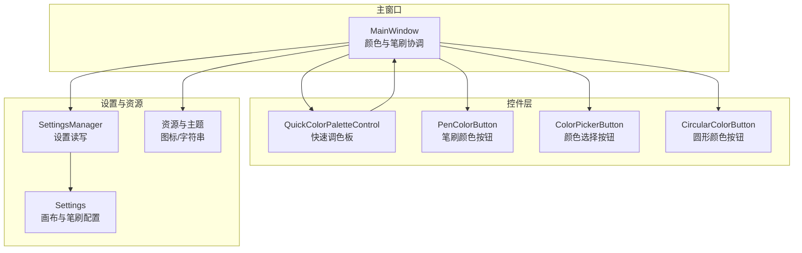
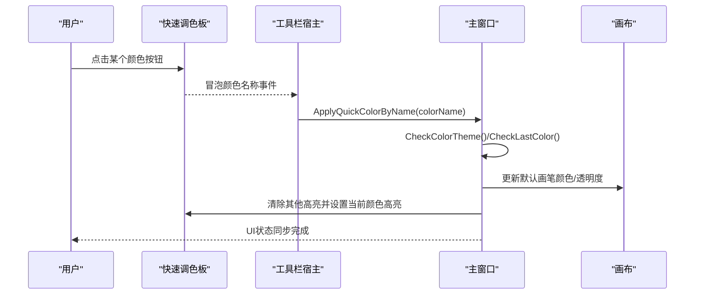
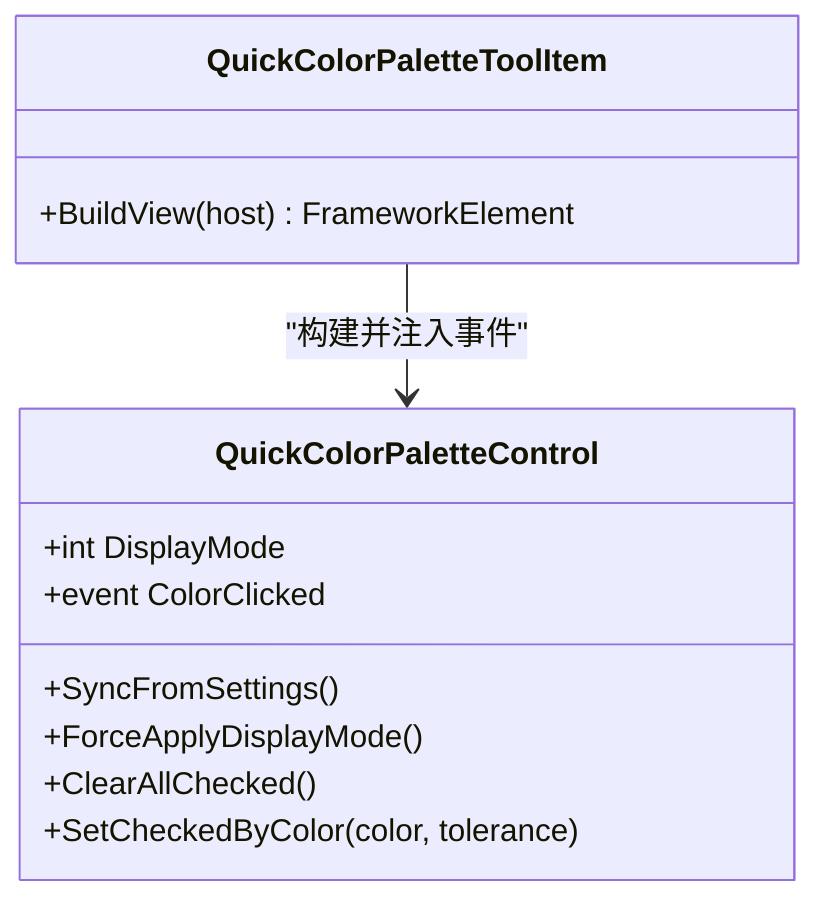
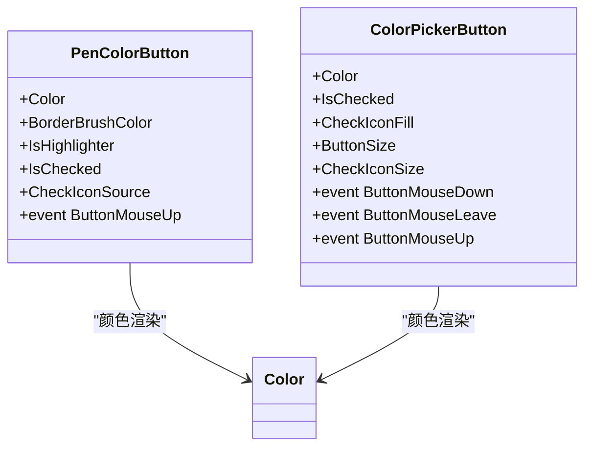
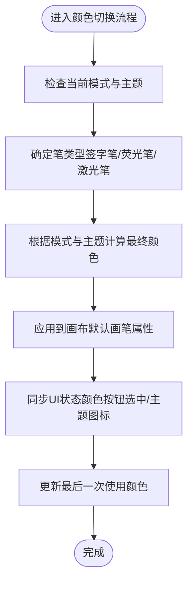
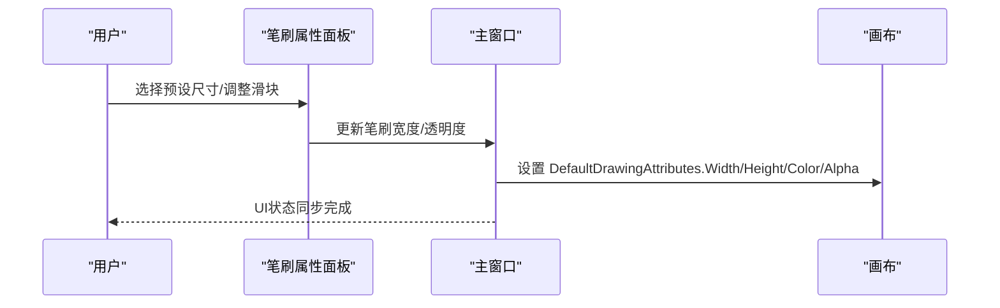
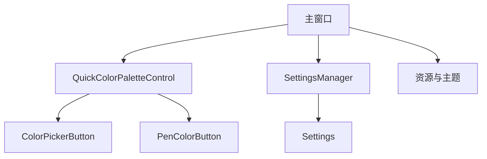

# 颜色和笔刷管理系统

## 简介
本文件面向颜色与笔刷管理系统，系统覆盖颜色选择器、笔刷类型与属性管理、颜色主题与用户偏好持久化、以及跨平台兼容性等维度。重点解析以下方面：
- 颜色选择器实现：快速调色板、颜色按钮控件、颜色主题切换与同步。
- 笔刷管理器：笔刷类型（签字笔、荧光笔、激光笔）、尺寸与透明度控制、笔尖形状与特效。
- PenColorButton 与 ColorPickerButton：颜色预览、选择交互、状态管理与事件传播。
- 自定义笔刷效果：纹理、渐变与特殊效果的实现思路与扩展点。
- 颜色主题系统、用户偏好存储与跨平台兼容性。

## 项目结构
系统围绕“主窗口逻辑 + 控件层 + 设置与资源”组织，颜色与笔刷相关模块分布如下：
- 主窗口逻辑：负责颜色主题、笔刷类型切换、画笔属性同步与UI状态管理。
- 控件层：提供颜色按钮、快速调色板、圆形颜色按钮等可复用UI组件。
- 设置与资源：用户偏好持久化、画布配置、主题图标与字符串资源。

## 核心组件
- 快速调色板控件：提供常用颜色集合，支持双排/单排显示模式切换、颜色高亮与事件冒泡。
- 颜色按钮控件族：PenColorButton（带透明网格与选中勾选）、ColorPickerButton（小尺寸颜色选择）、CircularColorButton（圆形预览与透明度）。
- 主窗口颜色协调器：统一管理颜色主题、笔刷类型、画笔属性（宽、高、透明度、笔尖形状），并同步UI状态。
- 设置与资源：SettingsManager 负责设置读写，Settings 定义画布与笔刷配置项，资源提供主题图标与字符串。

## 架构总览
颜色与笔刷系统采用“主窗口协调 + 控件渲染 + 设置持久化”的分层架构：
- 主窗口负责业务逻辑与状态同步，包括颜色主题、笔刷类型、画笔属性与UI状态。
- 控件层通过依赖属性与事件实现颜色预览、交互与状态切换。
- 设置层通过 SettingsManager 与 Settings 实现用户偏好的读取与保存。

## 详细组件分析

### 快速调色板 QuickColorPaletteControl
- 功能要点
  - 提供多组常用颜色按钮（黑、白、红、橙、黄、绿、蓝、紫）。
  - 支持双排/单排显示模式，依据设置动态切换。
  - 提供颜色高亮与清除高亮能力，用于指示当前选中颜色。
  - 通过 ColorClicked 事件向宿主传递颜色名称，便于主窗口应用颜色。
- 关键实现
  - 依赖属性 DisplayMode 控制显示模式，加载后应用。
  - 颜色高亮基于近似匹配算法，容忍度可配置。
  - 事件冒泡使用 routed event，便于工具栏宿主捕获。

### 颜色按钮 PenColorButton 与 ColorPickerButton
- PenColorButton
  - 属性：Color、BorderBrushColor、IsHighlighter、IsChecked、CheckIconSource。
  - 特性：当 IsHighlighter 为真时显示透明网格背景并降低不透明度；选中态显示勾选图标。
  - 事件：ButtonMouseUp 用于上层捕获点击。
- ColorPickerButton
  - 属性：Color、IsChecked、CheckIconFill、ButtonSize、CheckIconSize。
  - 特性：鼠标悬停时边框加粗；选中态显示勾选路径并按 Fill 填充。
  - 事件：ButtonMouseDown、ButtonMouseLeave、ButtonMouseUp。

### 圆形颜色按钮 CircularColorButton
- 属性：Color、ColorOpacity、IsChecked、ButtonSize、BorderBrushColor、CheckIconSource。
- 特性：圆形外观，支持透明网格背景、颜色覆盖层与勾选视图盒。
- 应用场景：适合在弹出面板或紧凑布局中展示颜色与选中状态。

### 主窗口颜色协调器 MW_Colors
- 颜色主题与笔刷类型
  - 根据当前模式（桌面/白板）与主题（亮/暗）计算最终颜色。
  - 支持签字笔、荧光笔、激光笔三类笔型，分别映射不同颜色集与透明度。
- 画笔属性同步
  - 统一设置 DefaultDrawingAttributes 的 Color、Width、Height、StylusTip、IsHighlighter。
  - 同步 UI 状态（颜色按钮选中、主题图标与文本）。
- 最后一次使用颜色
  - 记录桌面/白板模式下的最后一次颜色，便于下次打开恢复。

### 笔刷类型与尺寸/透明度控制
- 笔刷类型
  - 签字笔：支持宽度、透明度、笔尖形状（椭圆）。
  - 荧光笔：支持宽度、透明度、重叠开关。
  - 激光笔：支持宽度、透明度、淡入淡出与速度。
- 预设尺寸
  - 弹出面板提供常见尺寸预设（如 1、2.5、5、10、17.5 对应的椭圆半径）。
- 配置项
  - Settings 中包含 InkWidth、InkAlpha、HighlighterWidth、HighlighterAlpha、LaserPenWidth、LaserPenAlpha 等。

### 自定义笔刷效果实现思路
- 纹理笔刷
  - 思路：通过画笔的 DrawingAttributes 图案或自定义笔尖贴图实现纹理效果；结合透明度与混合模式增强视觉层次。
  - 扩展点：在主窗口设置 DefaultDrawingAttributes 的笔尖或图案资源。
- 渐变笔刷
  - 思路：利用渐变画刷作为笔触填充，结合颜色插值与透明度曲线实现平滑过渡。
  - 扩展点：在资源中定义渐变定义，在主窗口应用到画笔属性。
- 特殊效果笔刷
  - 思路：通过组合多种笔刷参数（宽度、透明度、笔尖形状、混合模式）与外部图像资源实现特殊效果。
  - 扩展点：在弹出面板增加效果选项，主窗口根据选择更新画笔属性。

[本节为概念性说明，不直接分析具体文件，故无章节来源]

### 颜色主题系统与用户偏好存储
- 颜色主题
  - 亮/暗主题切换影响颜色按钮的边框与图标；主窗口根据 isUselightThemeColor 与 isDesktopUselightThemeColor 决定最终颜色。
  - 主题图标随主题切换而变化，文本提示也相应本地化。
- 用户偏好存储
  - SettingsManager 负责 Settings 的序列化与持久化，Settings 定义画布与笔刷相关配置项。
  - 快速调色板显示模式等偏好由设置驱动。

### 跨平台兼容性考虑
- 颜色空间与模型
  - 系统使用 RGB 颜色模型进行颜色表示与计算；HSL 转换示例见启动画面中的 HSL→RGB 转换逻辑，可用于渐变或主题生成。
- 平台差异
  - WPF 环境下的颜色渲染与透明度处理需关注 DPI 与硬件加速差异；建议在高 DPI 下统一缩放策略与位图缩放模式。
- 资源与图标
  - 图标与资源路径采用相对路径，注意不同部署环境下的路径解析一致性。

## 依赖关系分析
- 控件依赖
  - QuickColorPaletteControl 依赖 ColorPickerButton 进行颜色选择与高亮。
  - PenColorButton 与 ColorPickerButton 均依赖 WPF 依赖属性与事件机制实现状态与交互。
- 主窗口依赖
  - 主窗口依赖 SettingsManager 与 Settings 获取用户偏好；依赖控件提供的事件与状态进行统一协调。
- 资源依赖
  - 主题图标与字符串资源由 Properties 与资源字典提供，保证跨语言与主题一致。

## 性能考量
- 颜色计算与主题切换
  - 颜色主题切换涉及大量 UI 元素状态更新，建议在批量更新时避免频繁触发布局与绘制，必要时使用延迟或批处理策略。
- 透明度与混合
  - 荧光笔与激光笔的透明度与混合模式可能影响渲染性能，建议在高密度笔触场景下适当降低透明度或启用硬件加速。
- 依赖属性与事件
  - 控件层广泛使用依赖属性与事件，注意避免过度绑定与循环更新，保持属性变更的原子性。

[本节为通用指导，不直接分析具体文件，故无章节来源]

## 故障排查指南
- 快速调色板未显示或高亮异常
  - 检查 DisplayMode 设置与 ApplyDisplayMode 是否正确执行；确认颜色近似匹配的容差是否合理。
- 颜色主题切换后图标/文字未更新
  - 检查 CheckColorTheme 中的主题标志位与图标资源路径；确认本地化字符串是否正确加载。
- 笔刷属性未生效
  - 检查主窗口是否正确设置 DefaultDrawingAttributes；确认笔类型切换逻辑与滑块值同步。
- 设置无法保存
  - 检查 SettingsManager 的保存路径与权限；确认异常捕获与日志输出。

## 结论
本系统通过清晰的分层设计实现了颜色与笔刷的统一管理：控件层提供丰富的颜色选择与状态反馈，主窗口负责业务逻辑与状态同步，设置层保障用户偏好的持久化与跨平台一致性。未来可在自定义笔刷效果、颜色空间转换与性能优化方面进一步扩展。

## 附录
- 相关配置项
  - 画布与笔刷：InkWidth、InkAlpha、HighlighterWidth、HighlighterAlpha、LaserPenWidth、LaserPenAlpha、EnableInkFade、InkFadeTime、InkFadeSpeedMultiplier 等。
- 常用颜色命名
  - 黑、白、红、绿、蓝、黄、紫、粉、青、橙等，按亮/暗主题映射不同 RGB 值。

章节来源
