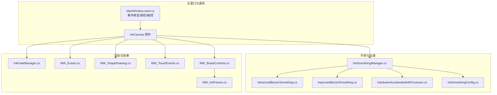
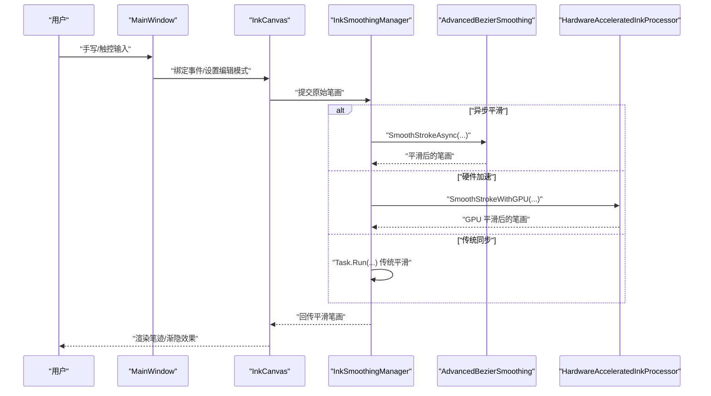
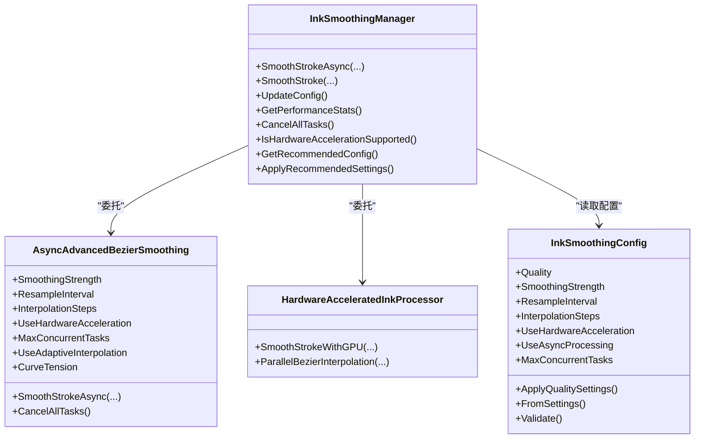
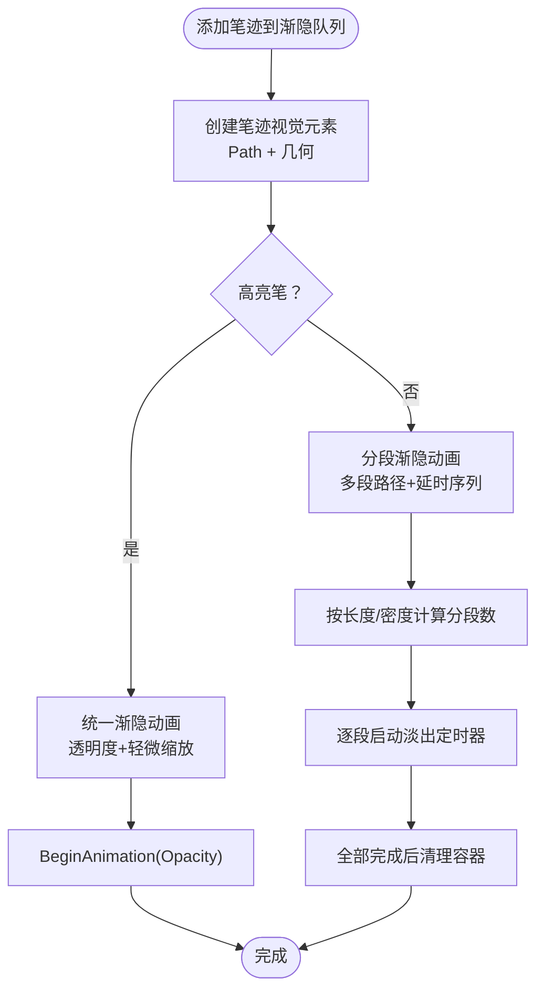
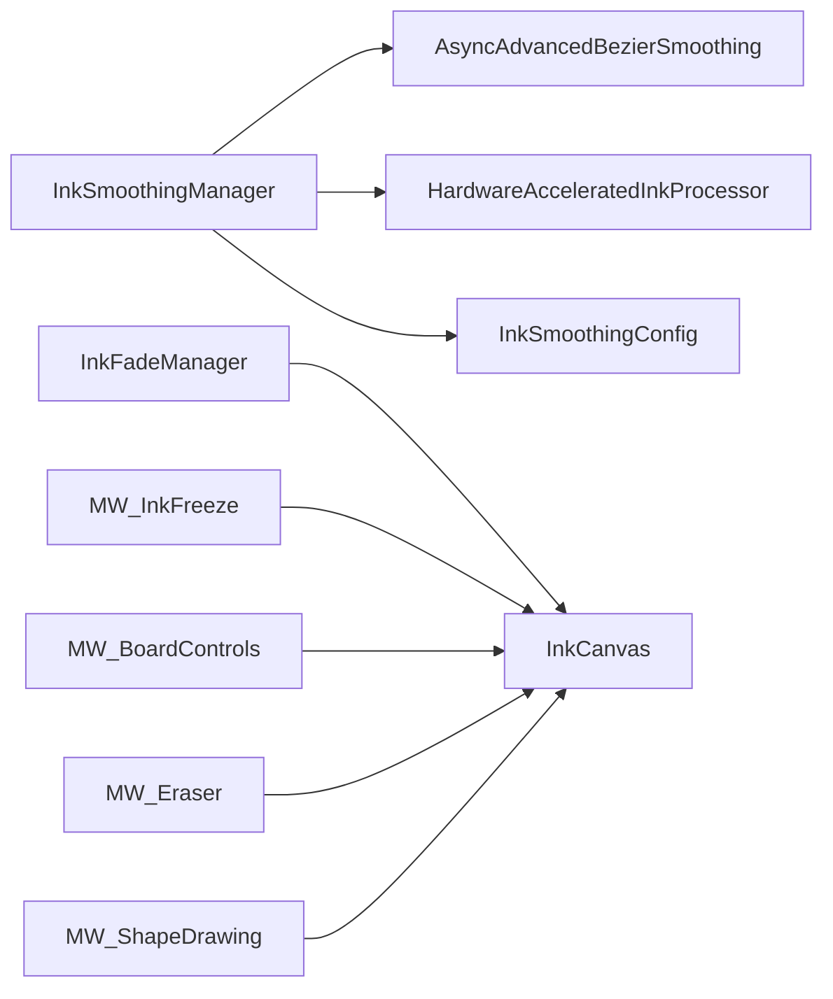

# 白板书写系统

## 简介
本文件面向 InkCanvasForClass 的白板书写系统，围绕 InkCanvas 控件的使用、笔迹数据采集与存储、平滑算法、硬件加速处理器、墨迹渐隐效果、渲染与视觉反馈、颜色与笔刷大小/透明度控制等方面进行系统化技术说明。文档旨在帮助开发者快速理解并扩展系统的书写体验与性能表现。

## 项目结构
- 核心书写与渲染：MainWindow.xaml.cs 及其子模块负责 InkCanvas 的事件绑定、实时预览、多指触控、颜色与笔刷属性设置等。
- 平滑与加速：Helpers 目录下的 InkSmoothingManager、AdvancedBezierSmoothing、ImprovedBezierSmoothing、HardwareAcceleratedInkProcessor、InkSmoothingConfig 提供异步平滑、贝塞尔曲线拟合、GPU 加速、配置管理等能力。
- 渐隐与冻结：InkFadeManager 实现笔迹渐隐动画与视觉管理；MW_InkFreeze 提供页面冻结/解冻与不可编辑保护。
- 工具与交互：MW_Eraser、MW_ShapeDrawing、MW_TouchEvents、MW_BoardControls 等模块分别负责橡皮擦、图形绘制、触控事件、白板页面管理等。

## 核心组件
- InkCanvas 控件：承载笔迹输入、实时预览、笔触渲染与 UI 事件交互。
- InkSmoothingManager：统一调度异步平滑、硬件加速与传统处理路径，支持配置热更新与性能监控。
- AdvancedBezierSmoothing / ImprovedBezierSmoothing：提供贝塞尔曲线拟合、自适应插值、重采样与压力值插值。
- HardwareAcceleratedInkProcessor：基于 GPU 的路径几何平滑与并行贝塞尔计算。
- InkFadeManager：管理笔迹渐隐动画、分段渲染与视觉容器，支持高亮笔特殊效果。
- MW_InkFreeze：页面级冻结/解冻，保护已写内容不可编辑。
- MW_Eraser / MW_ShapeDrawing / MW_TouchEvents：橡皮擦几何命中、图形绘制与触控实时笔尖状态。

## 架构总览
系统采用“事件驱动 + 平滑管线 + 渲染与效果”的分层设计：
- 事件层：MainWindow 绑定 InkCanvas 的 StylusDown/Move/Up 与触控事件，按需切换编辑模式与实时笔尖状态。
- 平滑层：InkSmoothingManager 根据配置选择 AsyncAdvancedBezierSmoothing、HardwareAcceleratedInkProcessor 或传统路径；支持并发任务与取消。
- 渲染层：InkCanvas 内部渲染笔迹；InkFadeManager 为笔迹附加视觉层，实现渐隐与分段动画。
- 工具层：MW_Eraser 提供几何/笔画两种擦除；MW_ShapeDrawing 提供图形绘制预览；MW_InkFreeze 提供页面冻结保护。

## 详细组件分析

### InkCanvas 控件与事件绑定
- MainWindow 将 InkCanvas 的 StylusDown/Move/Up 事件绑定到处理函数，按需切换编辑模式（如 None/Ink/EraseByPoint/EraseByStroke/Select），并处理触控输入与多指状态。
- 通过 EditingMode 与 DefaultDrawingAttributes 控制笔触外观与行为；实时预览通过临时笔画与节流更新减少闪烁。

### 笔迹数据采集与存储
- 笔迹以 Stroke 与 StylusPointCollection 表示，包含位置与压感信息；InkCanvas.Strokes 集合保存所有笔迹。
- 页面级管理：MW_BoardControls 维护每页 StrokeCollection 与历史 TimeMachineHistories，支持切换/新增/删除页面并持久化。
- 冻结保护：MW_InkFreeze 为冻结页面的笔迹添加属性标记，防止误操作修改。

### InkSmoothingManager 与平滑算法
- 统一入口 SmoothStrokeAsync/SmoothStroke，依据配置选择 AsyncAdvancedBezierSmoothing、HardwareAcceleratedInkProcessor 或传统路径。
- AsyncAdvancedBezierSmoothing 使用 5 次贝塞尔滑动窗口拟合、自适应插值步数、指数平滑与等距重采样，兼顾质量与性能。
- HardwareAcceleratedInkProcessor 使用 PathGeometry 与并行贝塞尔计算，保持压感信息，适合 GPU 加速场景。
- InkSmoothingConfig 提供质量等级（Performance/Balanced/Quality）与参数映射，支持从设置加载与校验。

### 硬件加速的 Ink 处理器
- 使用 RenderTargetBitmap 与 DrawingVisual，配合 RenderOptions 设置提升 GPU 渲染质量。
- 通过 PathGeometry 生成平滑曲线，再转换回 StylusPoint 集合，保持压感信息。
- 并行贝塞尔插值使用 Parallel.For，显著提升多段曲线的计算效率。

### 墨迹渐隐效果
- InkFadeManager 为每条笔迹创建 Path 视觉元素，支持统一/渐进两种动画策略。
- 高亮笔采用特殊混合与轻微缩放，增强“蒸发”视觉；普通笔迹按分段渲染，保证短笔迹也能完整展示。
- 支持按笔迹时长与全局速度倍数动态计算动画时长，提供统一的渐隐生命周期管理。

### 渲染与视觉反馈
- 实时预览：MW_ShapeDrawing 使用节流更新（约 60fps）减少 UI 抖动；先添加新笔画再删除旧笔画，避免闪烁。
- 压感视觉：MultiTouchInput 将压感映射到笔触粗细，提升书写真实感。
- 笔触效果：InkFadeManager 为高亮笔设置圆角/扁平端帽与轻微模糊，增强视觉层次。

### 颜色管理、笔刷大小与透明度
- 颜色：MW_Colors 根据主题与笔类型设置 InkCanvas.DefaultDrawingAttributes.Color，并维护最近使用的颜色索引。
- 笔刷大小：设置 Width/Height 与 StylusTip；激光笔模式独立配置。
- 透明度：通过 DrawingAttributes.Color 的 Alpha 通道与滑块联动，支持笔触半透明效果。

### 橡皮擦与图形绘制
- 几何擦除：MW_Eraser 使用 InkCanvas.Strokes.GetIncrementalStrokeHitTester 与 StylusShape（椭圆/矩形）进行命中测试，支持实时反馈与替换/删除。
- 笔画擦除：过滤冻结笔迹后直接移除。
- 图形绘制：MW_ShapeDrawing 在临时笔画上生成几何点集，提交后加入 InkCanvas.Strokes。

## 依赖关系分析
- InkSmoothingManager 依赖 AsyncAdvancedBezierSmoothing、HardwareAcceleratedInkProcessor 与 InkSmoothingConfig，形成可插拔的平滑策略。
- InkFadeManager 依赖 InkCanvas.Children 与 Dispatcher，独立管理视觉层，避免与核心笔迹数据耦合。
- MW_BoardControls 与 TimeMachineHistories 协作，实现页面级笔迹持久化与恢复。
- MW_Eraser 与 InkCanvas.Strokes/EraserShape 紧密耦合，确保擦除命中与性能。

## 性能考量
- 并发与限流：AsyncAdvancedBezierSmoothing 使用信号量限制并发任务数，避免 CPU/GPU 过载。
- 自适应插值：根据曲线长度与曲率动态调整插值步数，平衡质量与速度。
- 等距重采样：在点数过多时进行重采样，控制输出点数上限，减少渲染负担。
- GPU 加速：HardwareAcceleratedInkProcessor 使用 PathGeometry 与并行计算，适合大批量笔迹的平滑。
- 渐隐优化：InkFadeManager 分段渲染与延时序列，避免一次性创建大量 UI 元素导致卡顿。

## 故障排查指南
- 平滑失败回退：InkSmoothingManager 捕获异常并回退到原始笔画，避免中断书写流程。
- 超时保护：同步平滑提供超时保护，超时后记录日志并返回原始笔画。
- 渐隐异常：InkFadeManager 在各阶段捕获异常并清理资源，保证 UI 状态一致。
- 擦除失效：MW_Eraser 在几何擦除中过滤冻结笔迹，避免误删；结束时提交历史记录。

## 结论
本系统通过“事件驱动 + 可插拔平滑策略 + GPU 加速 + 渐隐视觉”的组合，实现了高质量、低延迟的白板书写体验。InkSmoothingManager 提供灵活的配置与性能监控；HardwareAcceleratedInkProcessor 与 AdvancedBezierSmoothing 在质量与性能之间取得良好平衡；InkFadeManager 与 MW_Eraser/MW_ShapeDrawing 等模块共同构建完整的书写生态。开发者可基于现有接口扩展自定义笔触效果与渲染策略。

## 附录
- 推荐实践
  - 使用 InkSmoothingManager.GetRecommendedConfig() 自动适配设备性能。
  - 高亮笔建议开启 InkFadeManager 的高亮笔特殊效果。
  - 大量笔迹场景优先启用硬件加速与异步平滑。
  - 通过 InkSmoothingConfig 调整 SmoothingStrength/ResampleInterval/InterpolationSteps 以匹配目标质量等级。
- 扩展方向
  - 自定义笔触效果：在 InkFadeManager 中扩展 Path 效果与动画曲线。
  - 自定义平滑算法：实现类似 AdvancedBezierSmoothing 的接口，接入 InkSmoothingManager。
  - 多设备协同：结合 TimeMachineHistories 与 MW_BoardControls，实现跨页面/跨设备的笔迹同步。
