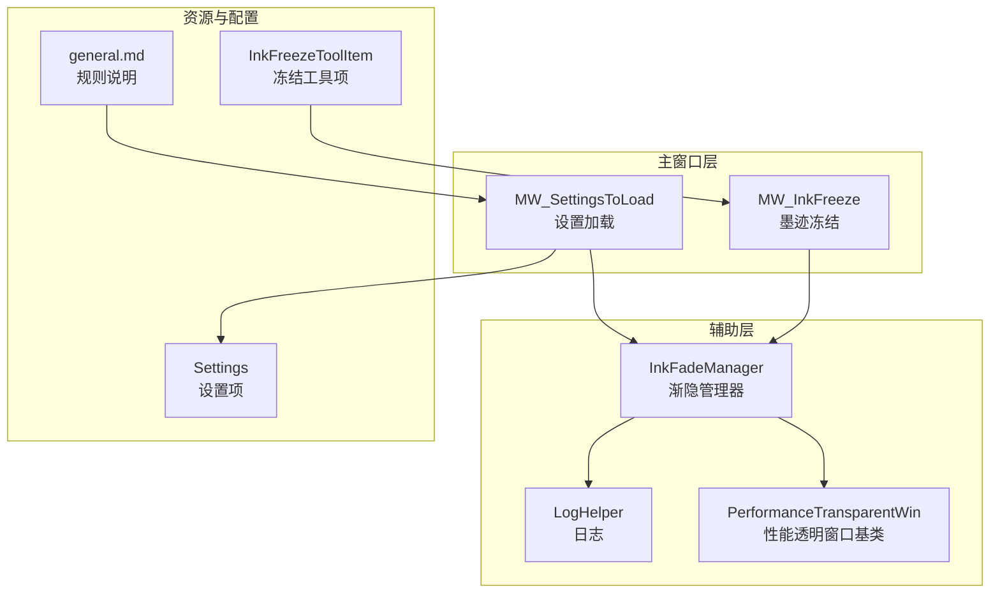
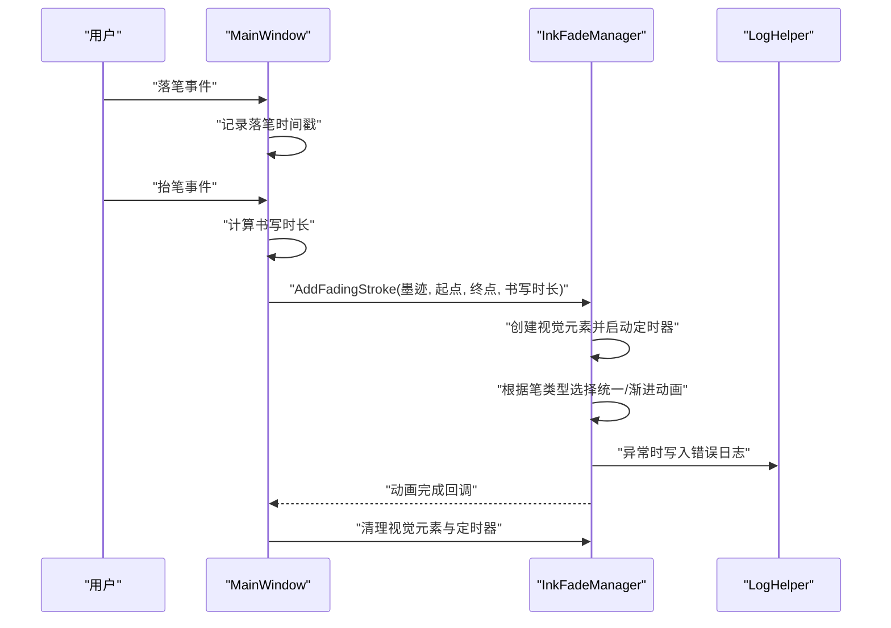
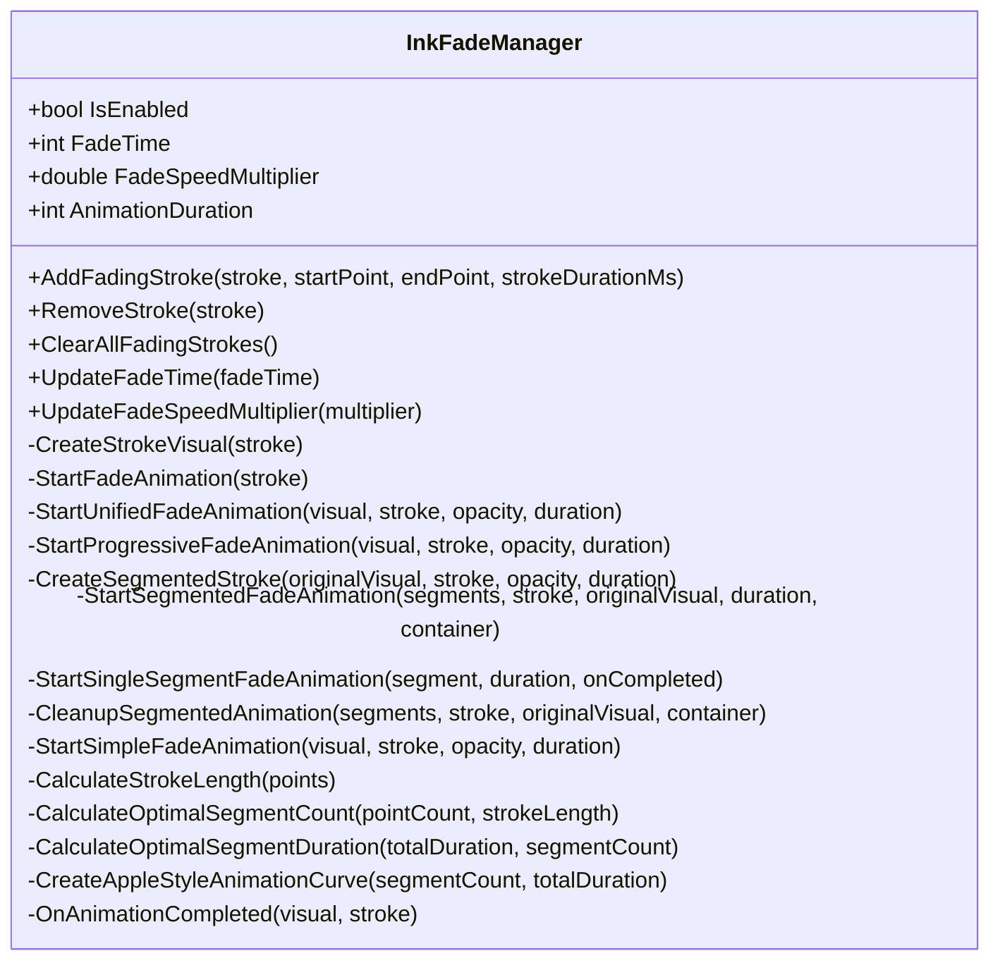
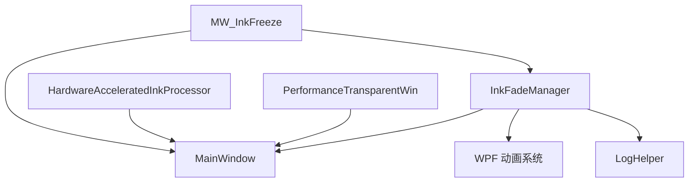

# 墨迹渐隐效果系统

## 简介
本文件为墨迹渐隐效果系统的深度技术文档，围绕 InkFadeManager 的实现原理展开，涵盖渐隐算法、时间控制机制、视觉效果管理、触发条件与配置方式、与 InkFreeze 功能的协作机制、自定义选项以及性能影响分析。文档旨在帮助开发者与高级用户全面理解该系统的运行机制与优化策略。

## 项目结构
墨迹渐隐效果系统主要分布在以下模块：
- 辅助层：InkFadeManager（渐隐管理）、LogHelper（日志）、PerformanceTransparentWin（窗口性能基类）
- 主窗口层：MW_InkFreeze（冻结功能）、MW_SettingsToLoad（设置加载）
- 资源与配置：Settings（设置项）、general.md（规则说明）
- 工具栏集成：InkFreezeToolItem（冻结工具项）

## 核心组件
- InkFadeManager：负责墨迹渐隐的生命周期管理，包括添加、动画启动、分段处理、统一处理、清理等。
- MW_InkFreeze：负责页面级墨迹冻结状态的维护与工具模式切换，为渐隐系统提供冻结协作。
- MW_SettingsToLoad：负责从设置加载渐隐参数并初始化滑块。
- Settings：提供 EnableInkFade、InkFadeTime、InkFadeSpeedMultiplier 等配置项。
- general.md：定义激光笔渐隐规则与书写时长记录流程。
- LogHelper：提供统一错误日志记录，便于定位问题。
- PerformanceTransparentWin：窗口性能基类，间接影响渲染性能。
- HardwareAcceleratedInkProcessor：硬件加速墨迹处理，与渐隐系统共同影响整体性能。

## 架构概览
墨迹渐隐系统采用“管理器 + 主窗口协作 + 设置驱动”的架构：
- 管理器层：InkFadeManager 统一调度渐隐生命周期，创建视觉元素并启动动画。
- 主窗口层：MW_InkFreeze 提供冻结状态与工具模式切换，避免在冻结状态下产生新墨迹。
- 配置层：Settings 与 MW_SettingsToLoad 提供可调参数与滑块绑定。
- 规则层：general.md 定义激光笔渐隐行为与书写时长记录流程。

## 详细组件分析

### InkFadeManager 实现原理
- 触发条件与时间控制
  - 触发条件：当启用且非空时，接收来自主窗口的 AddFadingStroke 调用。
  - 时间控制：FadeTime 控制显示时长；AnimationDuration 与 FadeSpeedMultiplier 共同决定动画时长；若传入 strokeDurationMs 则按 strokeDurationMs/FadeSpeedMultiplier 计算。
  - 定时器：为每条墨迹创建 DispatcherTimer，在 FadeTime 到期后启动渐隐动画并停止自身。
- 视觉效果管理
  - 统一渐隐：高亮笔使用统一透明度动画并配合轻微缩放，提升自然感。
  - 渐进式分段：普通笔将墨迹按长度与点密度分段，逐段启动淡出，形成“波浪”式消失效果。
  - 视觉元素：基于 Stroke 几何创建 Path，保留原笔属性（颜色、宽度、端帽、连接方式），高亮笔额外应用轻微模糊与增宽策略。
- 动画曲线与性能
  - Apple 风格曲线：通过 CreateAppleStyleAnimationCurve 生成分段延迟序列，保证视觉连贯性。
  - 分段时长约束：CalculateOptimalSegmentDuration 在总时长与分段数间折中，避免过短导致卡顿。
  - 安全超时：为分段动画设置安全超时，防止异常阻塞。
- 清理与回收
  - OnAnimationCompleted 统一移除视觉元素并清理字典，避免内存泄漏。
  - ClearAllFadingStrokes 批量清理，确保状态一致性。

## 依赖关系分析
- 组件耦合
  - InkFadeManager 依赖 MainWindow 的 inkCanvas 与 Dispatcher，确保 UI 线程安全与坐标系统正确。
  - MW_InkFreeze 与 InkFadeManager 通过主窗口协调，冻结状态影响渐隐触发时机。
- 外部依赖
  - WPF 动画系统（DoubleAnimation、EasingFunction、DispatcherTimer）。
  - 日志系统（LogHelper）用于异常追踪。
  - 硬件加速（HardwareAcceleratedInkProcessor）与窗口性能（PerformanceTransparentWin）间接影响整体渲染性能。

## 性能考虑
- 渲染与内存
  - 每条墨迹创建独立 Path 视觉元素，分段时会临时创建容器与多个子元素，需注意内存峰值。
  - OnAnimationCompleted 统一清理，避免长期持有引用。
- 动画策略
  - 分段动画采用多定时器与安全超时，平衡视觉效果与稳定性。
  - Apple 风格曲线减少首尾突兀，提升观感。
- 系统资源
  - HardwareAcceleratedInkProcessor 与窗口性能基类（PerformanceTransparentWin）共同影响渲染效率。
  - 建议在低端设备上调低分段数与动画时长，避免卡顿。

## 故障排除指南
- 常见问题
  - 添加视觉元素失败：检查 inkCanvas 父容器是否存在，必要时回退到 inkCanvas.Children。
  - 渐隐动画未触发：确认 IsEnabled 为真，FadeTime 设置合理，且传入 Stroke 非空。
  - 动画异常中断：查看日志，系统会在失败时回退到简单动画并清理资源。
- 日志定位
  - 使用 LogHelper 记录错误堆栈与调用者信息，便于快速定位问题。
- 设置校验
  - 通过 MW_SettingsToLoad 校验设置加载是否成功，滑块值范围是否合理。

## 结论
InkFadeManager 通过统一与渐进两种动画策略，结合高亮笔与普通笔的不同处理方式，实现了自然流畅的墨迹渐隐效果。其与 MW_InkFreeze 的协作确保了冻结状态下的行为一致性，而设置驱动与滑块绑定提供了灵活的可定制性。在性能方面，系统通过分段动画与安全超时保障稳定性，并建议在低端设备上适度降低复杂度以维持流畅体验。

## 附录
- 配置项一览
  - EnableInkFade：是否启用渐隐。
  - InkFadeTime：显示时长（毫秒）。
  - InkFadeSpeedMultiplier：动画速度倍率。
- 规则要点
  - 激光笔渐隐：显示时长由 InkFadeTime 固定，动画时长由书写时长/倍速动态计算。
  - 书写时长记录：在落笔与抬笔事件中记录与计算，传递给渐隐管理器。