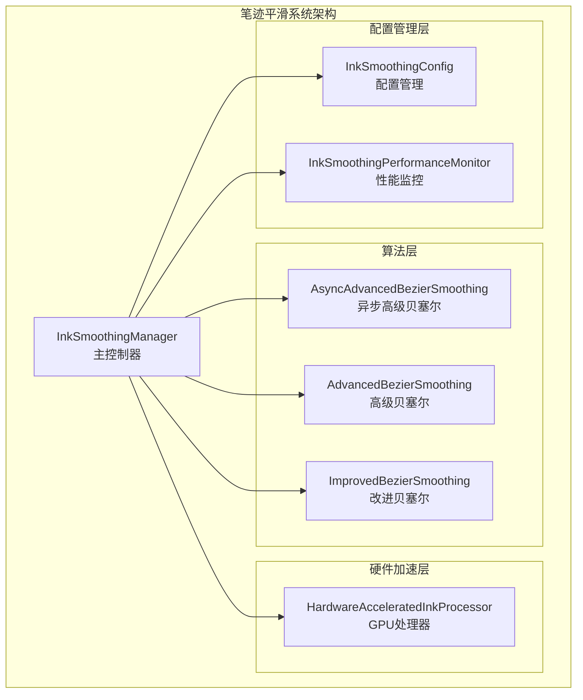
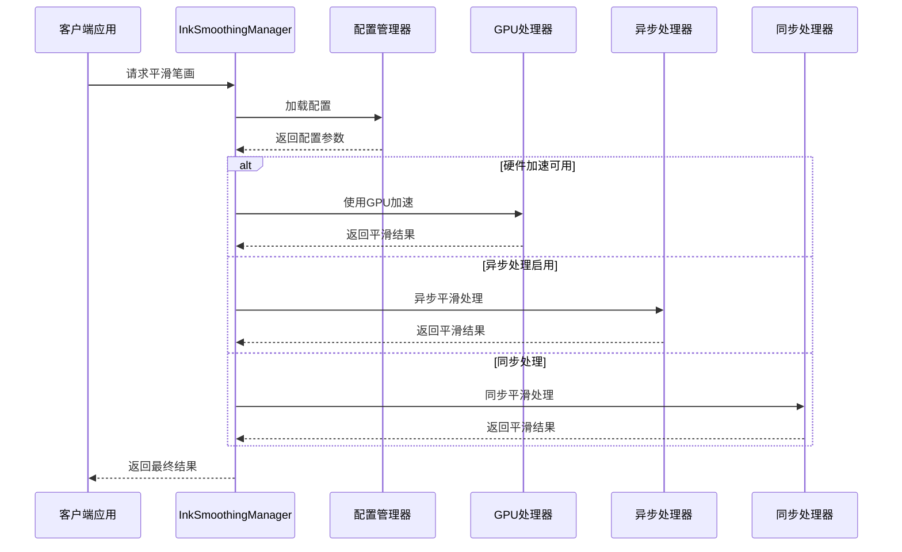
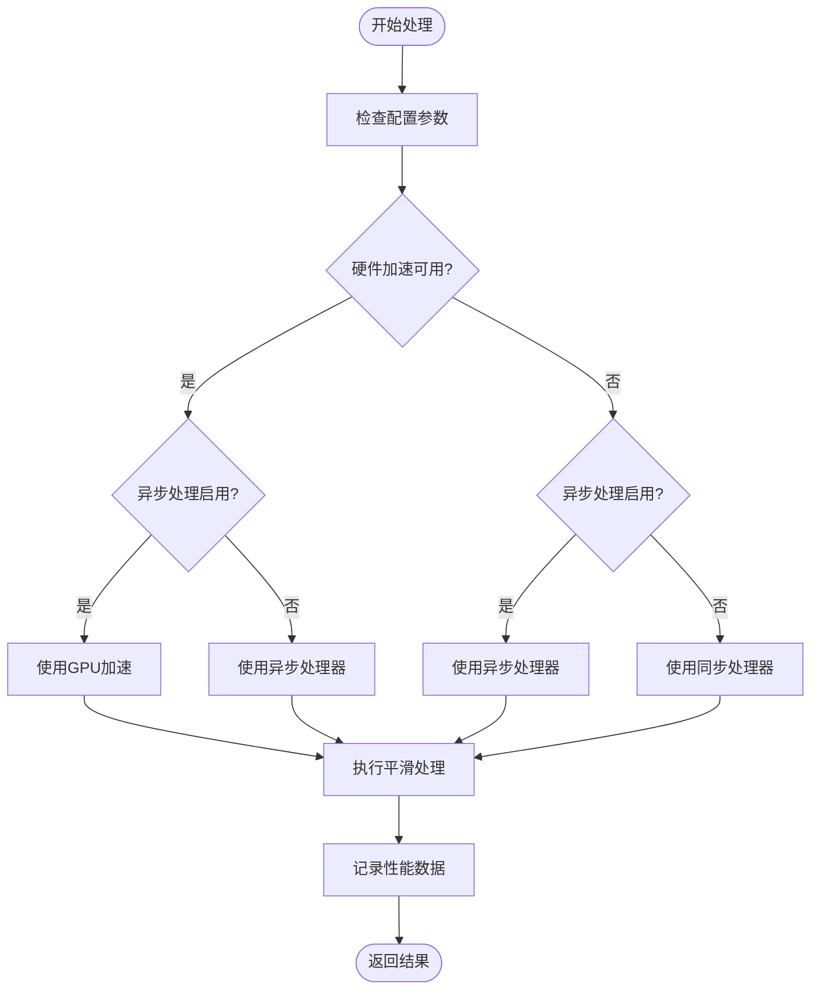
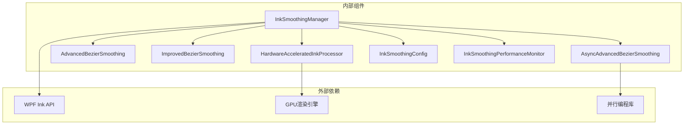

# 笔迹平滑处理系统

## 简介

笔迹平滑处理系统是一个专为数字墨迹绘制设计的高性能算法框架，旨在提供流畅、自然的书写体验。该系统通过多种平滑算法的智能组合，实现了在不同硬件配置和输入设备下的自适应优化。

系统的核心优势包括：
- 多算法融合的平滑处理机制
- 智能的硬件加速检测和配置
- 实时性能监控和自适应调节
- 针对不同输入设备的优化策略
- 完善的错误处理和资源管理

## 项目结构

笔迹平滑处理系统位于 Ink Canvas 项目的 Helpers 目录下，采用模块化设计，每个组件都有明确的职责分工：

## 核心组件

### InkSmoothingManager - 主控制器

InkSmoothingManager 是整个系统的中枢控制器，负责协调各个组件的工作流程。其主要功能包括：

- **算法选择与调度**：根据配置自动选择最适合的平滑算法
- **异步处理管理**：提供非阻塞的平滑处理能力
- **硬件加速检测**：自动检测并启用硬件加速功能
- **性能监控**：实时跟踪处理性能并提供统计信息
- **资源管理**：统一管理内存和计算资源

### 算法组件

系统提供了三种不同的平滑算法，每种都有其特定的应用场景：

1. **AsyncAdvancedBezierSmoothing**：异步高级贝塞尔算法，适用于高性能需求
2. **AdvancedBezierSmoothing**：传统高级贝塞尔算法，保持向后兼容
3. **ImprovedBezierSmoothing**：改进的贝塞尔算法，专注于质量优化

### 配置管理

InkSmoothingConfig 提供了全面的配置选项，包括：
- 平滑强度和响应时间参数
- 贝塞尔曲线张力和插值步数
- 硬件加速和异步处理开关
- 性能质量等级设置

## 架构概览

系统采用分层架构设计，实现了算法、硬件加速和配置管理的有效分离：

## 详细组件分析

### InkSmoothingManager 工作原理

InkSmoothingManager 通过智能决策机制选择最适合的平滑算法：

## 依赖关系分析

系统采用了清晰的依赖层次结构：

## 性能考虑

### 算法性能对比

系统提供了多种算法以满足不同的性能需求：

#### 时间复杂度分析

| 算法类型 | 时间复杂度 | 空间复杂度 | 适用场景 |
|---------|-----------|-----------|----------|
| 异步高级贝塞尔 | O(n*k) | O(n+k) | 高性能需求，多线程环境 |
| 改进贝塞尔 | O(n*k) | O(n+k) | 质量优先，单线程环境 |
| 传统高级贝塞尔 | O(n*k) | O(n+k) | 向后兼容，稳定环境 |

#### 内存占用分析

系统通过以下机制优化内存使用：

- **流式处理**：避免一次性加载大量数据
- **对象池**：复用临时对象减少 GC 压力
- **延迟计算**：按需计算避免不必要的中间结果

### 用户体验优化

系统实现了多项用户体验优化策略：

#### 响应时间优化

- **异步处理**：避免阻塞 UI 线程
- **进度反馈**：提供实时处理状态
- **取消支持**：允许用户中断长时间操作

#### 适应性配置

系统能够根据设备特性自动调整配置参数，确保在各种硬件环境下都能提供良好的用户体验。

## 故障排除指南

### 常见问题及解决方案

#### 硬件加速问题

**问题**：GPU 加速无法正常工作
**解决方案**：
1. 检查系统是否支持硬件加速
2. 确认 GPU 驱动程序更新
3. 尝试禁用硬件加速进行降级测试

#### 性能问题

**问题**：平滑处理速度过慢
**解决方案**：
1. 调整平滑强度参数
2. 减少插值步数
3. 关闭自适应插值功能
4. 降低并发任务数

#### 内存问题

**问题**：内存使用过高
**解决方案**：
1. 设置合理的最大点数限制
2. 优化重采样间隔
3. 启用内存回收机制

### 调试工具

系统提供了完善的调试和监控功能：

- **性能统计**：实时显示处理时间和资源使用情况
- **配置验证**：检查参数设置的合理性
- **错误日志**：记录详细的错误信息和堆栈跟踪

## 结论

笔迹平滑处理系统通过精心设计的多算法融合架构，实现了在不同硬件配置和使用场景下的自适应优化。系统的主要优势包括：

1. **智能算法选择**：根据硬件能力和使用场景自动选择最优算法
2. **高性能实现**：通过并行计算和硬件加速确保流畅的用户体验
3. **灵活配置管理**：提供全面的参数调节选项满足不同需求
4. **完善的监控机制**：实时跟踪性能指标并提供优化建议

该系统为数字墨迹应用提供了坚实的基础设施，能够有效提升用户的书写体验。

## 附录

### 设备类型优化建议

#### 压感笔设备

- **推荐配置**：高质量模式，启用硬件加速
- **关键参数**：适当的平滑强度，适中的插值步数
- **优化要点**：保持压感信息的完整性，优化响应时间

#### 鼠标设备

- **推荐配置**：平衡模式，启用异步处理
- **关键参数**：较高的平滑强度，适中的重采样间隔
- **优化要点**：补偿鼠标输入的不连续性，优化轨迹平滑

#### 触摸屏设备

- **推荐配置**：高性能模式，启用硬件加速
- **关键参数**：较低的平滑强度，较大的重采样间隔
- **优化要点**：减少触摸输入的延迟，优化多点触控响应

### 参数调优指南

#### 平滑强度调优

- **低强度**：适合快速书写，减少延迟
- **中等强度**：平衡流畅性和响应性
- **高强度**：适合精细绘制，最大化平滑效果

#### 响应时间优化

- **实时模式**：最小化处理延迟
- **缓冲模式**：平衡流畅性和准确性
- **批处理模式**：最大化处理效率

#### 平滑质量平衡

系统通过质量等级配置实现了性能与质量的最佳平衡，用户可以根据具体需求进行微调。