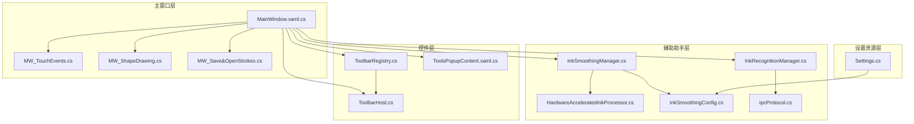
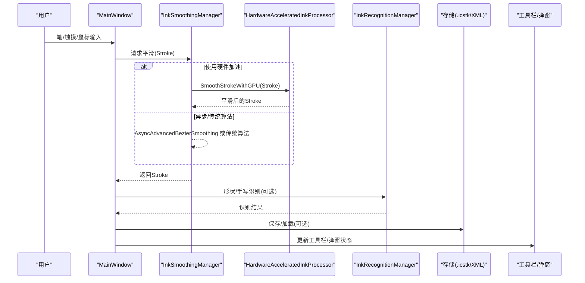
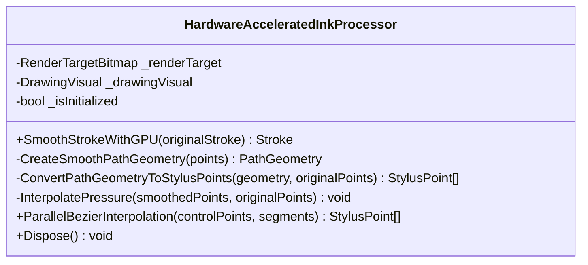
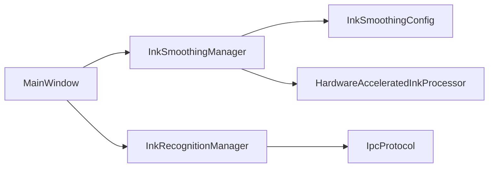

# InkCanvas 核心组件

## 简介
本文件面向 InkCanvas 核心组件，系统性阐述其架构设计与实现原理，覆盖笔迹数据采集机制、实时渲染管线、事件处理系统、硬件加速 Ink 处理器（GPU 加速渲染、内存管理与性能优化）、笔迹数据存储格式与序列化机制、数据完整性保障，以及与工具栏、弹窗系统、设置管理器等组件的集成方式。同时提供性能调优建议、内存使用优化与常见问题排查指引。

## 项目结构
InkCanvas 采用“主窗口 + 辅助助手 + 控件层 + 设置资源”的分层组织方式：
- 主窗口层：负责事件路由、工具栏与弹窗交互、页面与画布管理、多点触控与手写输入处理。
- 辅助助手层：提供平滑、识别、IPC、硬件加速等能力封装。
- 控件层：工具栏、弹窗、快速面板等 UI 组件。
- 设置资源层：统一的 JSON 配置模型与本地持久化。

## 核心组件
- 硬件加速 Ink 处理器：基于 WPF RenderTargetBitmap 与 DrawingVisual，通过 PathGeometry 贝塞尔曲线拟合与并行插值实现 GPU 加速平滑与渲染。
- 墨迹平滑管理器：统一调度异步平滑、硬件加速与传统算法，提供性能监控与配置推荐。
- 墨迹识别管理器：统一形状识别与手写体美化流程，支持 WinRT 与 IPC 辅助进程两种后端。
- 事件与输入处理：主窗口集中处理笔输入、触摸输入、鼠标输入与图形绘制模式切换。
- 存储与序列化：支持 .icstk（WPF StrokeCollection 内置格式）与自定义 XML（含笔迹与元素元数据）。
- 工具栏与弹窗：通过 ToolbarHost/Registry 注入 UI 组件，弹窗内容通过依赖属性与事件绑定与主窗口交互。
- 设置与配置：Settings 资源模型承载 Canvas/Advanced 等配置，InkSmoothingConfig 提供质量等级与参数映射。

## 架构总览
InkCanvas 的核心运行时由“输入采集 → 平滑处理 → 渲染展示 → 识别/存储 → UI 交互”构成闭环。主窗口承担输入事件与 UI 状态协调，平滑与识别通过助手类完成，存储采用内置格式与扩展 XML 两种方案。

## 详细组件分析

### 硬件加速 Ink 处理器（GPU 加速渲染与平滑）
- 渲染目标与可视化：使用 RenderTargetBitmap 与 DrawingVisual，启用高质量缩放与边缘模式以提升渲染质量。
- 曲线平滑与插值：通过 PathGeometry 与 BezierSegment 构建平滑路径，再将几何折线化回 StylusPoint 集合并插值压感，保证视觉与压感一致性。
- 并行贝塞尔：对控制点分段并行计算，显著提升大笔画的插值效率。
- 资源生命周期：提供 Dispose 标记，便于统一回收。

## 依赖关系分析
- 组件耦合：主窗口依赖平滑与识别助手；平滑管理器依赖配置与硬件处理器；识别管理器依赖 IPC 协议与 WinRT 能力。
- 外部依赖：WPF Ink、WinRT 识别 API、IPC 共享内存协议。
- 循环依赖：未发现循环引用；各层职责清晰，接口契约明确。

## 性能考量
- 硬件加速：优先启用 RenderCapability Tier 对应的硬件加速路径，减少 CPU 压力。
- 异步与并发：异步平滑与并行贝塞尔插值结合，合理设置最大并发任务数，避免过度抢占。
- 参数调优：根据设备性能自动推荐配置，质量优先场景适当放宽插值步数与重采样间隔。
- 输入路径优化：多点触控实时插值与可视化重绘需在 UI 线程外进行，避免阻塞主线程。
- 存储与上传：.icstk 保存与 XML 生成采用异步上传，避免阻塞 UI。

[本节为通用指导，不直接分析具体文件]

## 故障排除指南
- 平滑失败回退：当异步或硬件加速失败时，自动回退到传统算法并记录日志。
- 超时保护：同步等待硬件加速时设置超时，超时则返回原始笔画并记录警告。
- 识别不可用：WinRT 不可用时自动回退 IPC 或本地 IACore，若仍失败则返回空结果并记录错误。
- 存储失败：保存 .icstk/XML 失败时弹出通知并记录日志，定位异常文件路径。
- 配置验证：InkSmoothingConfig 提供参数范围校验，异常参数将被拒绝并记录。

## 结论
InkCanvas 通过“主窗口事件中枢 + 助手类能力封装 + UI 组件解耦”的架构，实现了从输入采集到渲染展示、识别与存储的完整链路。硬件加速与异步处理有效提升了实时性与稳定性，配置驱动的质量策略适配不同设备性能。通过标准化的存储格式与扩展元数据，兼顾了互操作性与可读性。建议在部署时结合设备能力自动应用推荐配置，并持续监控平滑与识别性能指标以优化体验。

[本节为总结性内容，不直接分析具体文件]

## 附录
- 关键流程参考路径

[本节为索引性内容，不直接分析具体文件]