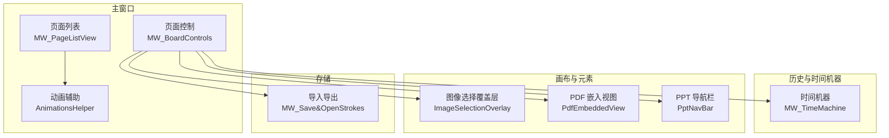
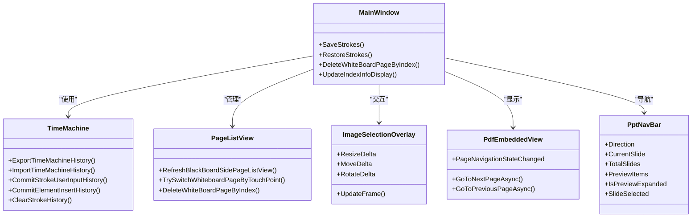
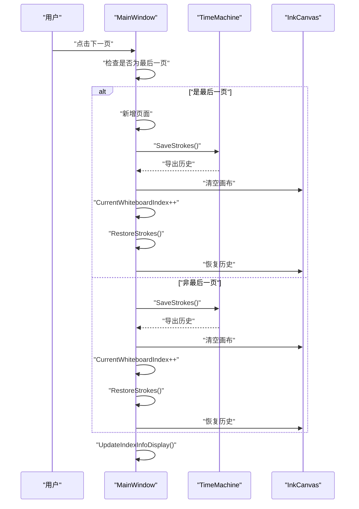
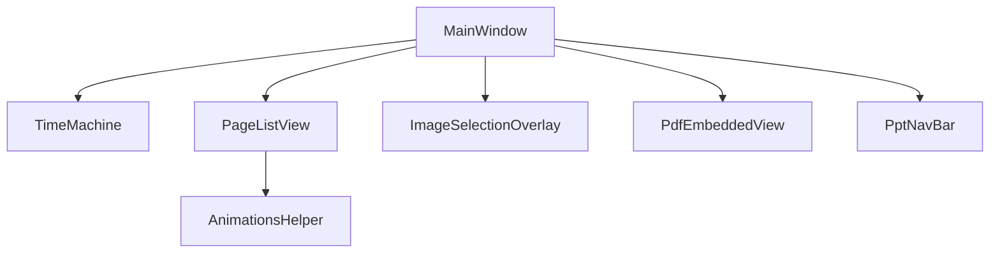

# 页面和画布管理系统

## 简介
本项目是一个基于 WPF 的页面和画布管理系统，支持多页面架构、页面切换、动画效果、状态保存与内存优化。系统围绕 InkCanvas 控件构建，提供完整的页面生命周期管理、历史记录与撤销重做、页面缩略图列表、图像选择覆盖层、PDF 嵌入视图以及 PPT 导航栏等功能。

## 项目结构
系统主要分为以下模块：
- 主窗口与页面控制：负责页面索引、增删改、切换与状态显示
- 时间机器与历史管理：负责笔迹与元素的历史记录、撤销重做与内存优化
- 页面列表与缩略图：负责生成缩略图、拖拽排序与批量操作
- 图像选择覆盖层：负责图片的移动、缩放、旋转与交互
- PDF 嵌入视图：负责 PDF 页面渲染与导航
- 动画辅助：负责页面列表与弹窗的动画效果
- 存储与导入导出：负责页面数据的序列化与版本兼容处理

## 核心组件
- InkCanvas：主画布，承载笔迹与图片/媒体元素
- TimeMachine：历史记录引擎，支持撤销/重做与内存优化
- PageListView：页面缩略图列表，支持点击切换与删除
- ImageSelectionOverlay：图片选择覆盖层，支持移动、缩放、旋转
- PdfEmbeddedView：PDF 嵌入视图，仅显示当前页，由主窗口控制翻页
- PptNavBar：PPT 翻页与增强预览一体化控件
- AnimationsHelper：统一的动画效果封装

## 架构概览
系统采用分层架构：
- 表现层：MainWindow 及其控件（PageListView、PptNavBar、ImageSelectionOverlay 等）
- 业务逻辑层：页面控制（MW_BoardControls）、历史管理（MW_TimeMachine）
- 数据持久化层：导入导出（MW_Save&OpenStrokes）

## 详细组件分析

### 页面与画布生命周期管理
- 页面创建：在达到最大页数（99）之前，通过插入空白页面并清空历史记录实现
- 页面切换：保存当前页面状态 → 清空画布 → 切换索引 → 恢复目标页面
- 页面删除：删除指定页并向前填充，同时扁平化历史以优化性能
- 状态保存：将画布上的笔迹与元素提交到时间机器历史，保存多指书写模式状态

## 依赖关系分析
- MainWindow 依赖 TimeMachine 进行历史管理
- PageListView 依赖 AnimationsHelper 实现动画效果
- ImageSelectionOverlay 与 InkCanvas 元素交互
- PdfEmbeddedView 与主窗口的 PDF 侧栏联动
- PptNavBar 与主窗口的 PPT 模式集成

## 性能考虑
- 历史扁平化：删除页面前将历史扁平化为“仅最终状态”，减少后续翻页卡顿
- 批量元素处理：恢复页面后统一处理图片/媒体元素的位置与事件绑定，降低布局更新次数
- 内存优化：清空画布与历史记录，及时释放资源
- 图像压缩：对大图进行压缩，平衡质量与性能
- 动画轻量化：使用缓动函数与最小动画时长，保证流畅度

## 故障排除指南
- 页面切换异常：检查异常捕获逻辑，确保切换过程不中断
- 缩略图不更新：确认集合长度判断与重建分支
- 图片选择工具栏不消失：检查取消选中流程与编辑模式恢复
- PDF 翻页无效：确认当前页索引与忙碌状态判断
- 导入模式不匹配：查看日志输出与用户提示

## 结论
本系统通过清晰的分层设计与完善的生命周期管理，实现了稳定高效的多页面画布系统。时间机器与历史扁平化策略有效提升了性能，页面列表与动画增强了交互体验，图像选择覆盖层提供了直观的元素操控能力。存储与导入导出模块确保了数据的可移植性与版本兼容性。

## 附录
- 最佳实践
  - 在页面切换前统一保存状态，切换后统一恢复
  - 对大图进行压缩，避免内存峰值过高
  - 使用历史扁平化减少冗长历史带来的卡顿
  - 批量处理元素事件绑定，减少布局抖动
- 性能优化建议
  - 合理使用动画时长，避免影响响应速度
  - 在恢复页面时延迟处理复杂元素，提升首帧渲染
  - 定期清理不需要的历史记录，控制内存占用