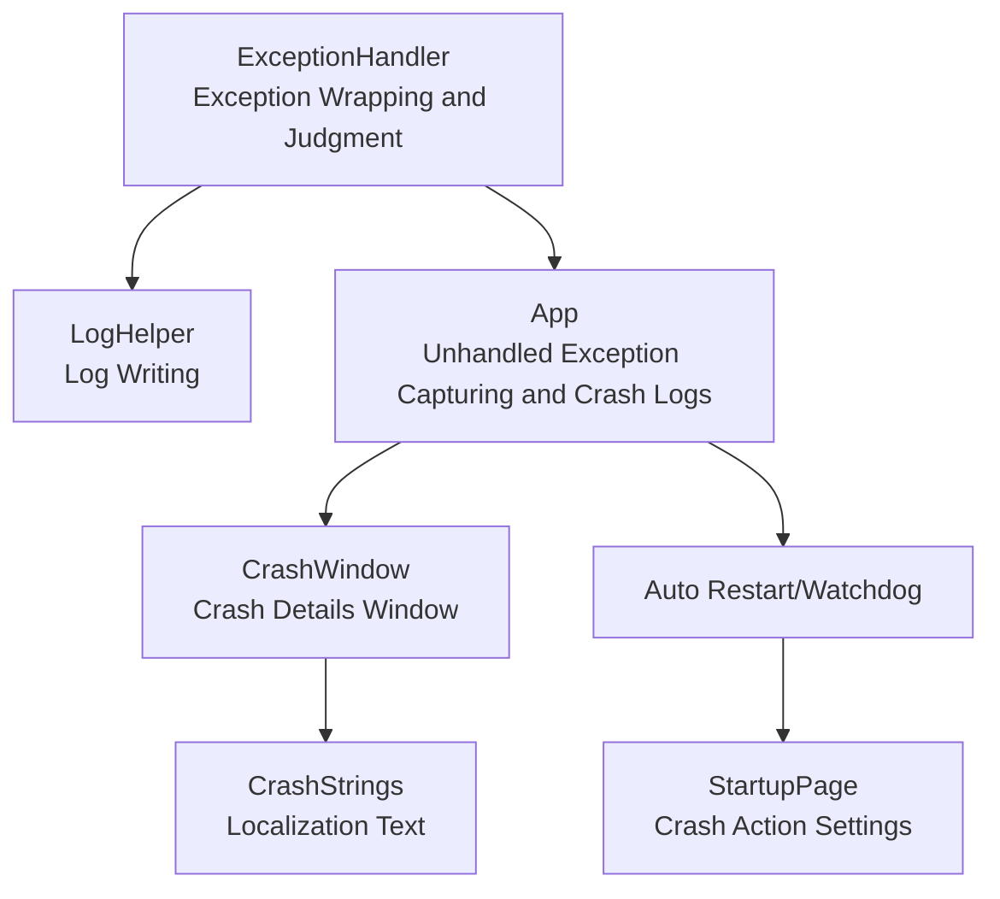
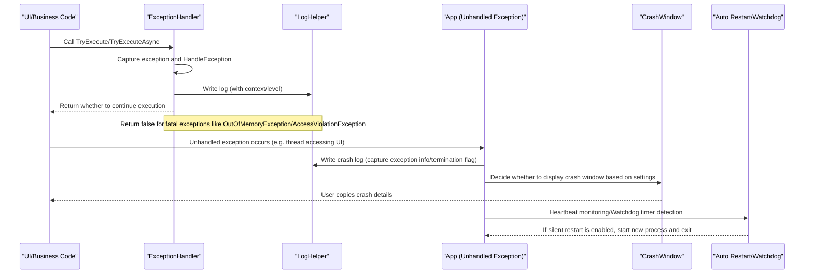
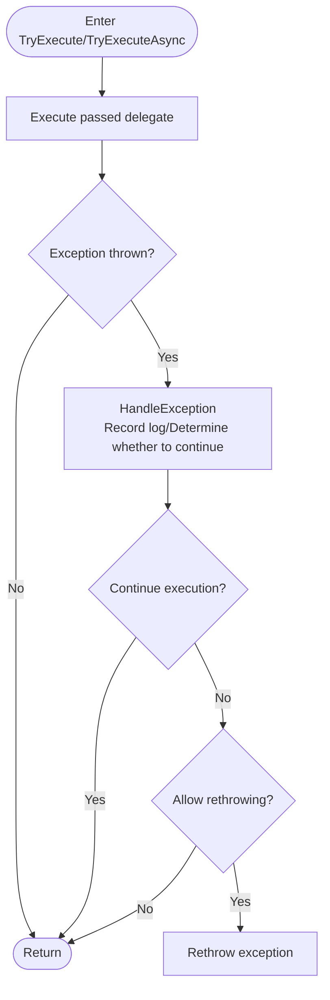
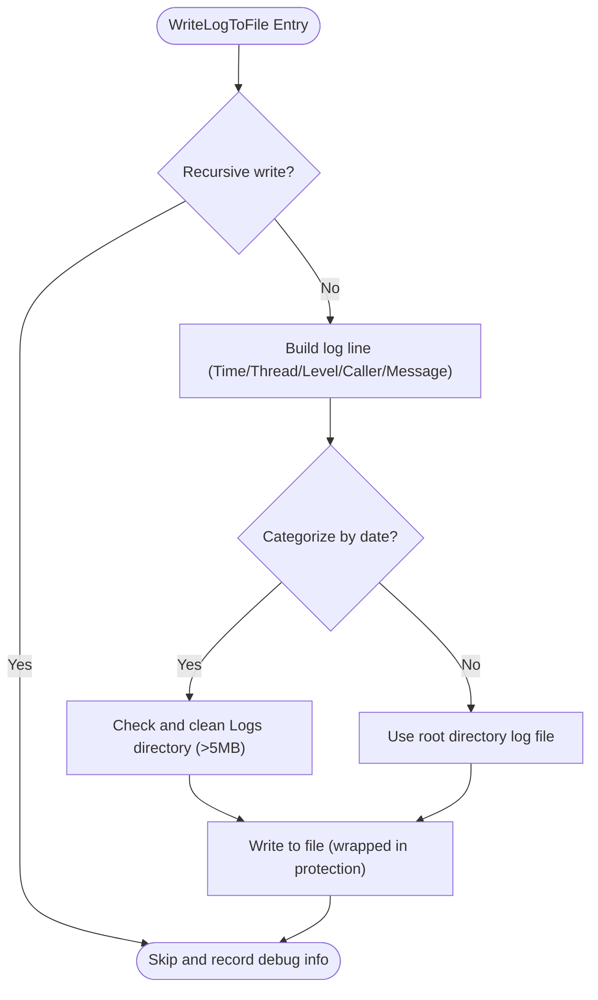
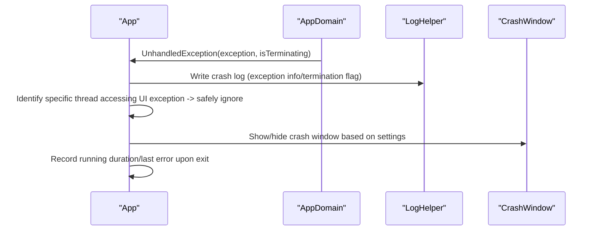
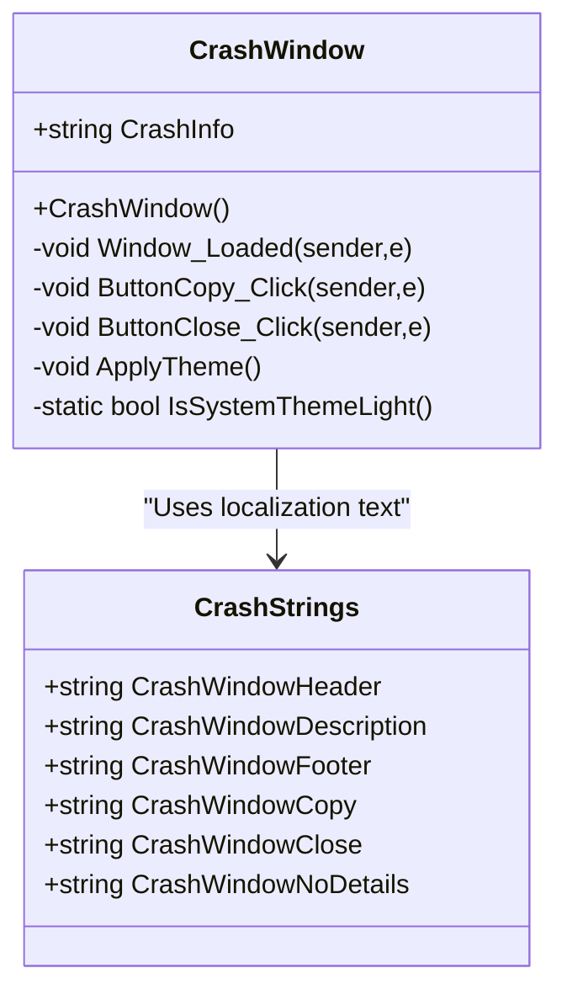
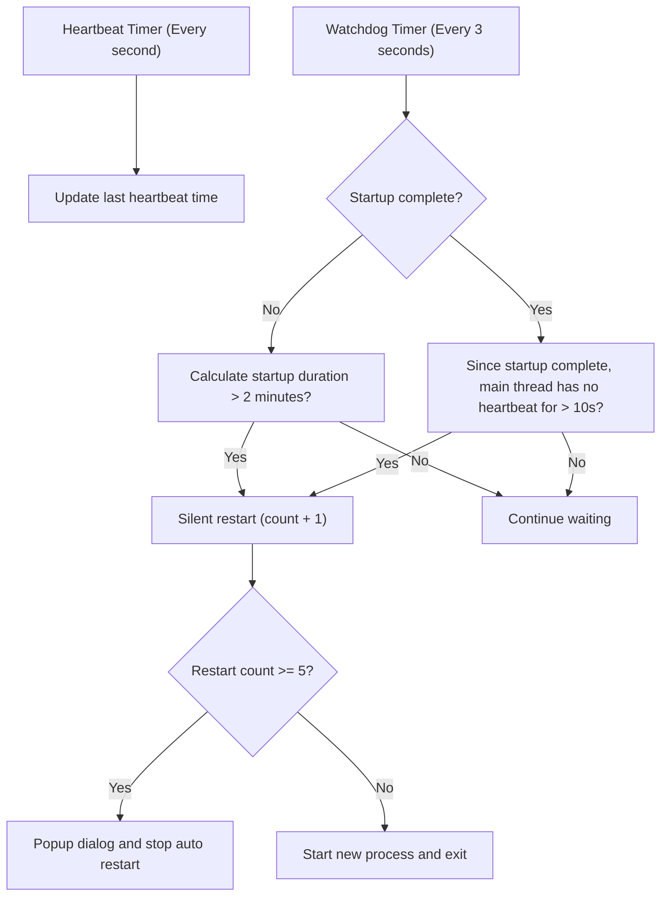
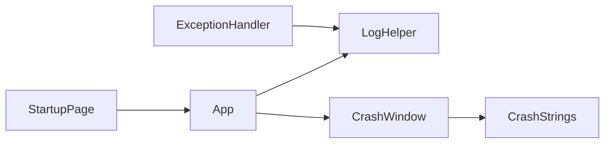

# Exception Handling and Crash Recovery

## Introduction
This document focuses on the exception handling and crash recovery system of InkCanvasForClass, systematically organizing the exception capturing mechanisms, error classification and handling strategies, crash monitoring and fatal exception detection, automatic restart mechanisms, error report generation and logging, as well as best practices and troubleshooting recommendations. The goal is to help developers and testers quickly understand and effectively maintain the stability and serviceability of the system.

## Project Structure
The key files surrounding exception handling and crash recovery are distributed as follows:
- Exception Handling and Wrapper: Helpers/ExceptionHandler.cs
- Logging and Error Reporting: Helpers/LogHelper.cs, Crash log writing in App.xaml.cs
- Crash Window and User Interaction: Windows/CrashWindow.xaml, CrashWindow.xaml.cs, Properties/CrashStrings.*
- Automatic Restart and Daemon: Heartbeat monitoring, watchdog, and restart logic in App.xaml.cs
- User Settings Entry: SettingsViews/Pages/StartupPage.xaml

## Core Components
- Exception Wrapper and Determiner: Provides unified exception capturing, logging, and decision on "whether to continue execution", supporting synchronous and asynchronous execution wrapping.
- Log System: Centralized log writing with timestamps, thread IDs, caller information, recursion protection, filing by startup time, and size-based cleanup.
- Crash Monitoring and Logging: Captures unhandled exceptions, records crash logs, distinguishes terminating exceptions, identifies specific thread UI access exceptions, and safely ignores them.
- Crash Window and User Feedback: Displays crash details, copies logs, adapts to themes, and provides localized texts.
- Auto-Restart and Watchdog: Heartbeat monitoring, daemon timers, continuous restart thresholds, watchdog processes, and signal files.
- User Settings: Choice of crash actions (silent restart, do nothing, show crash window).

## Architecture Overview
The diagram below shows the overall workflow from exception occurrence to user feedback and auto-restart.

## Component Details

### Exception Wrapper and Determiner (ExceptionHandler)
- Key Features
  - HandleException: Records exception messages and inner exceptions, outputs by log levels; determines whether to continue execution based on exception type.
  - TryExecute/TryExecuteAsync: Provides synchronous and asynchronous try-catch wrapping, supporting the "whether to rethrow on non-fatal exceptions" option.
  - Fatal Exception Determination: Returns false directly for OutOfMemoryException, AccessViolationException, etc., to avoid further corruption.
- Design Principles
  - Unified entry to avoid scattered try-catch blocks.
  - Clear boundaries between "recoverable/unrecoverable" to prevent data corruption or resource leaks caused by misjudgment.
- Usage Recommendations
  - All potentially risky operations should be wrapped with TryExecute/TryExecuteAsync.
  - Prioritize asynchronous wrapping for critical paths (I/O, IPC, rendering) to avoid blocking the UI thread.

### Log System (LogHelper)
- Key Features
  - Write Log: Unified format containing timestamps, thread IDs, log levels, and caller information.
  - Recursion Protection: Avoids recursive calls during log writing through atomic flags.
  - Filing and Cleanup: Supports naming log files by startup time; cleans up the log directory when it exceeds limits.
  - Exception Logging: Supports direct logging of Exceptions, including type, message, stack trace, and inner exceptions.
- Performance and Reliability
  - Employs mutual exclusion during writing to avoid concurrency conflicts.
  - Directory and file writing are encapsulated by protectors to lower failures caused by permission issues.
- Output Locations
  - Defaults to the root directory log file; writes to Logs/Log_YYYY-MM-dd-HH-mm-ss.txt when filing by date is enabled.

### Crash Monitoring and Logging (App.xaml.cs)
- Unhandled Exception Capturing
  - Captures unhandled exceptions on both UI and background threads, recording crash logs; marks terminating exceptions specifically.
  - Safe Ignorance in Specific Scenarios: Identifies known WPF InkCanvas DynamicRenderer thread UI access issues, records warnings, and lets them pass.
- Crash Log Writing
  - Names crash log files by application startup time to ensure independent logs for each run.
- Exit and Cleanup
  - Records execution duration, last error message, device identification, etc., upon process exit.
- Termination Monitoring
  - Monitors main window destruction via Windows event hooks, cooperating with watchdogs for robust crash detection.

### Crash Details Window and User Feedback (CrashWindow)
- Key Features
  - Displays crash details text, supporting copying to the clipboard.
  - Theme Adaptation: Applies Modern theme based on settings or system theme.
  - Localized Texts: Titles, descriptions, and button texts are sourced from resource files.
- Error Handling
  - Both copy failures and theme application failures are logged as warnings to avoid affecting window presentation.

### Automatic Restart and Watchdog (App.xaml.cs)
- Heartbeat Monitoring and Daemons
  - Starts a heartbeat timer and a watchdog timer to detect startup freezes and main thread unresponsiveness.
  - Triggers silent restart if startup fails to complete within 2 minutes or the main thread shows no heartbeat for more than 10 seconds.
- Continuous Restart Protection
  - Prompts with a dialog and stops automatic restarts when the continuous restart count reaches a threshold (default: 5) to prevent infinite loops.
- Watchdog Process
  - Starts the watchdog via the command line argument --watchdog, monitoring the main process lifecycle and exit signal files.
  - Triggers restart or exits directly upon receiving an exit signal or detecting abnormal termination of the main process.
- Restart Conditions and Exit Signals
  - Writes an exit signal file and notifies the watchdog when the user actively exits to avoid accidental restarts.

### User Settings Entry (StartupPage.xaml)
- Crash Action Settings: Silent restart, do nothing, show crash window.
- Bound with localized resources to ensure consistent texts.

## Dependency Analysis
- ExceptionHandler relies on LogHelper for logging; handles short-circuit determinations for fatal exception types.
- App serves as the global exception capture and crash logging center, coordinating CrashWindow and auto-restarts.
- CrashWindow relies on CrashStrings for localized texts and theme application.
- StartupPage provides the user configuration entry, affecting crash action behaviors.

## Performance Considerations
- Mutual exclusion and recursion protection in log writing avoid extra overhead and deadlock risks in the exception chain.
- The heartbeat and watchdog timer frequencies are reasonable, avoiding frequent I/O and process creation.
- Continuous restart limits prevent resource exhaustion and user experience degradation.
- Window and theme exceptions are downgraded to warnings, not affecting the main flow.

## Troubleshooting Guide
- Symptom: Application auto-restarts frequently
  - Action: Check if the continuous restart count has reached the threshold; inspect crash logs to locate the root cause; verify if it is a startup freeze or main thread unresponsiveness.
- Symptom: Crash details window is not displayed
  - Action: Confirm if the crash action in settings is set to "Show crash window"; check if the exception was determined as "fatal" and terminated immediately.
- Symptom: Log files are too large or unwritable
  - Action: Check if the Logs directory exceeds limits and was cleaned; verify write permissions and disk space; check if recursive log protection is triggered.
- Symptom: Failed to copy crash details
  - Action: Check clipboard access permissions; inspect logs for warning records.

## Conclusion
This system implements robust handling of common and fatal exceptions through a closed loop of "exception wrapping & determination + centralized logging + crash monitoring + auto-restart + user feedback". It is recommended to uniformly wrap high-risk operations with ExceptionHandler in new modules, locate issues using logs and crash logs, and flexibly adjust crash actions through the settings page to balance stability and user experience.

## Appendix
- Best Practice Checklist
  - Wrap all potential exception paths with TryExecute/TryExecuteAsync.
  - Do not swallow fatal exceptions like OutOfMemoryException or AccessViolationException; let the OS handle them.
  - Wrap exception blocks at critical resource release locations to ensure cleanup is not interrupted.
  - Prioritize using TryExecuteAsync in asynchronous tasks to avoid UI blocking.
  - Log records should contain context and caller info to facilitate backtracing.
  - The crash details window is intended only for non-fatal exceptions or scenarios requiring user feedback.
  - Set continuous restart limits to prevent infinite restarts from exhausting resources.
  - Use watchdogs and exit signal files to ensure graceful exits and correct restarts.
