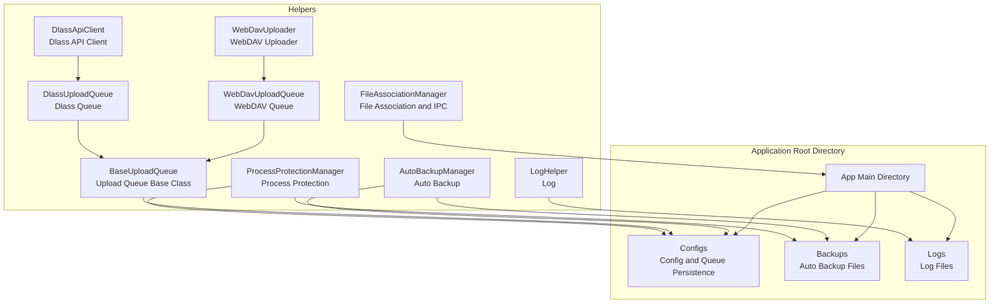
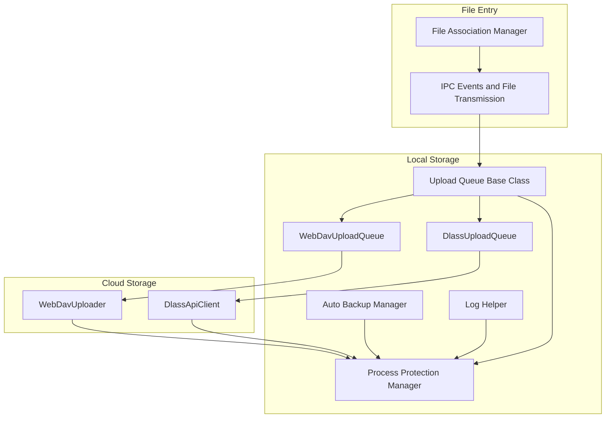
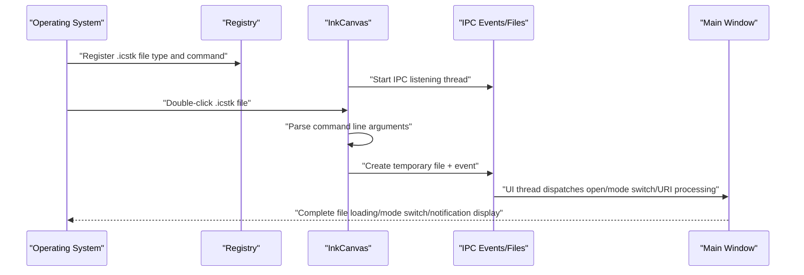
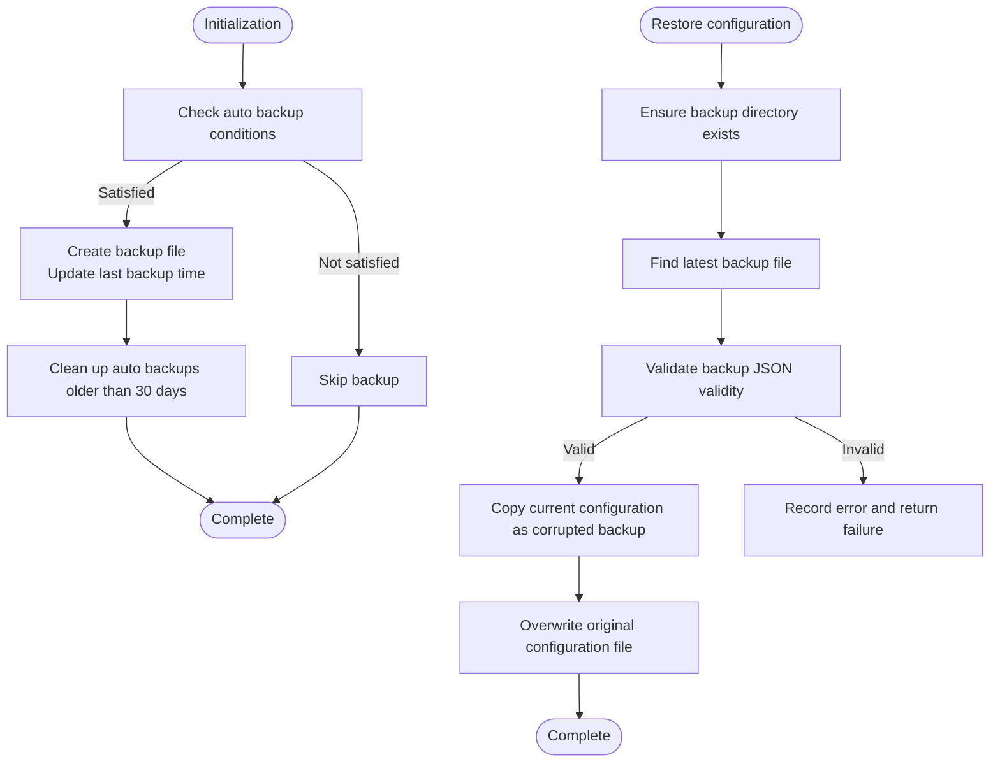
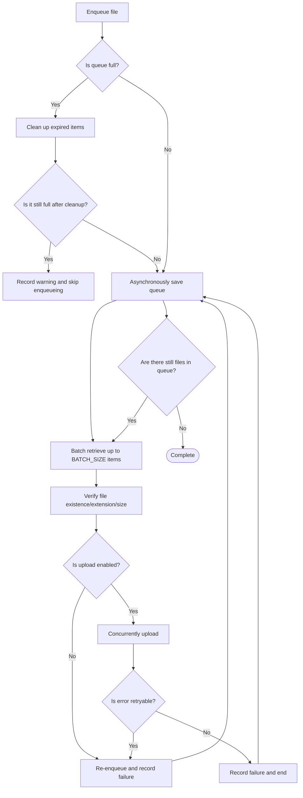
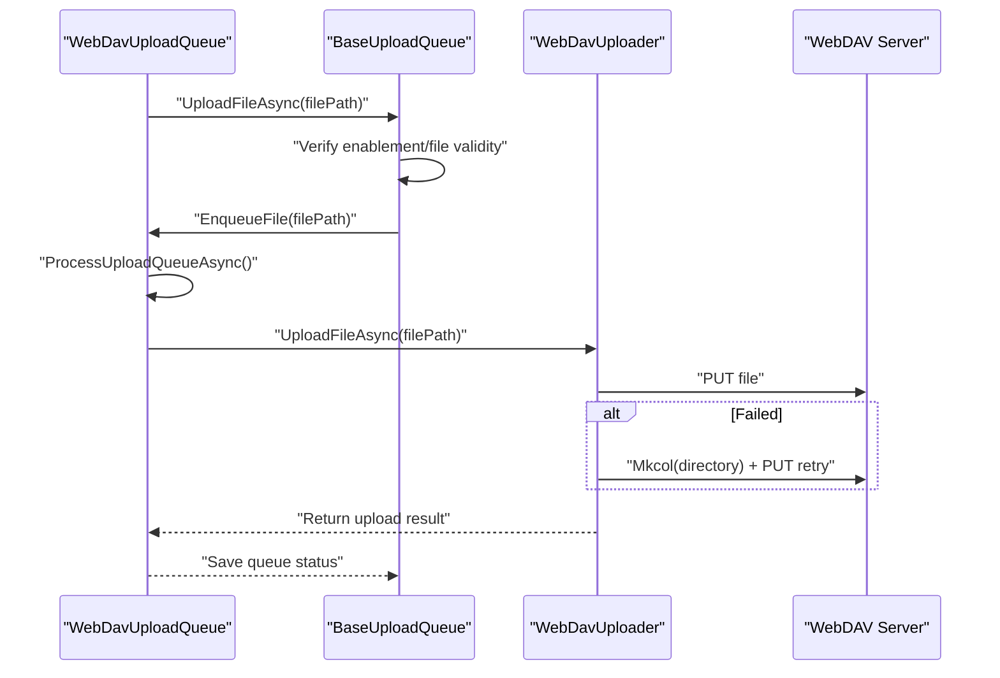
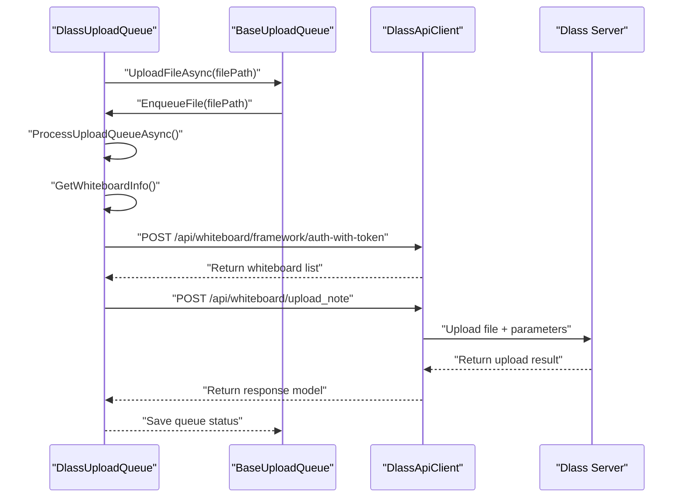
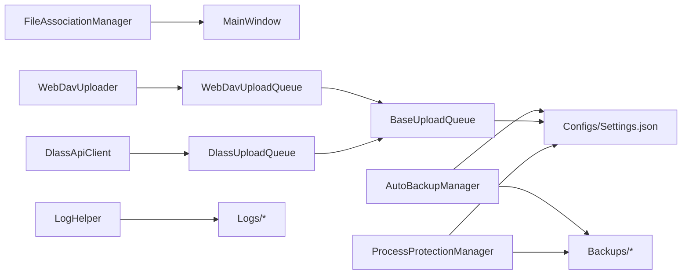

# File Management and Storage

## Introduction
This document focuses on the file management and storage system of InkCanvasForClass, revolving around the following topics:
- File Association Manager: File type registration, default program setting, protocol handling, and IPC interaction.
- Automatic Backup System: Backup strategies, storage location management, version control, and recovery.
- Upload Queue Management: Task scheduling, retry logic, progress tracking, and persistence.
- Cloud Storage Integration: Implementation and collaboration of WebDAV and Dlass upload queues.
- File Operation Best Practices: File locking, concurrent access, error recovery, and configuration recommendations.

## Project Structure
This section focuses on the organization and responsibilities of core files related to file management, storage, and uploads:
- Helpers Layer: Concentrates common capabilities such as file association, auto-backups, upload queues, cloud storage clients, process protection, and logging.
- Storage Location Conventions: Configurations and backups are uniformly located in the Configs and Backups subdirectories under the application root directory. Logs can be filed by date to the Logs subdirectory.

## Core Components
- File Association Manager: Responsible for .icstk file type registration, command-line parameter parsing, IPC events and file transmission, command forwarding for whiteboard and display modes, and URI command handling and listening.
- Auto Backup Manager: Determines whether to perform backups based on settings, generates timestamped backup files, cleans up expired backups, and restores configurations from the latest backup.
- Upload Queue Base Class: Abstracts common capabilities of the upload queue, including queue persistence, concurrency control, batch processing, retry strategies, expired item cleanup, file validation, and size limits.
- WebDAV Upload Queue and Uploader: Wraps the WebDAV upload workflow, supporting directory creation and retries.
- Dlass Upload Queue and API Client: Wraps Dlass server interfaces, supporting whiteboard authentication, note uploading, and tag/description building.
- Process Protection Manager: Locks critical directories and files in high-security scenarios to prevent them from being occupied or modified by external processes, providing write gating and degraded writing capabilities.
- Log Helper: Unifies log outputs, supports date filing, cleans up logs exceeding size limits, and protects against recursive logging.

## Architecture Overview
The overall architecture consists of the "File Association Layer", "Backup Layer", "Upload Queue Layer", "Cloud Storage Client Layer", and "Process Protection and Logging Layer", forming a closed loop from file entry, local persistence, and cloud upload to security protection.

## Detailed Component Analysis

### File Association Manager
- Key Features
  - Registers/unregisters the .icstk file type along with default icons and open commands.
  - Parses command-line parameters to identify .icstk file paths.
  - IPC Events and File Transmission: Notifies running instances to open files, switch whiteboard modes, expand the floating bar, and process URI commands via temporary files and event handles.
  - Refreshes system file association caches.
- Critical Workflows
  - Registration Flow: Creates registry items for file types and extensions, sets default icons and commands, and refreshes the cache.
  - IPC Listening: Background threads wait for events, scan temporary files, and dispatch actions to the UI thread.
  - Command Line Entry: Parses parameters, locates .icstk files, attempts IPC transmission, or directly loads if no running instance is found.

### Auto Backup System
- Key Features
  - Determines whether to execute backups based on settings (enabled switch, last backup time, interval in days).
  - Generates timestamped backup files, saving them to the Backups directory.
  - Restores configuration from the latest backup. If the original configuration exists, copies it as a "corrupted backup" first.
  - Cleans up auto-backup files older than 30 days.
- Critical Workflows
  - Initialization: Checks conditions, performs backups, and cleans up expired backups.
  - Recovery: Validates the backup JSON's validity, copies the current configuration as a "corrupted backup", and overwrites the original configuration.

### Upload Queue Management Mechanism
- Design Points
  - The abstract base class provides common queue capabilities: concurrent queues, batch processing, retry strategies, expired item cleanup, file validation/size limits, and queue persistence.
  - Validation before uploading: extension whitelist, file size limits, file existence, and file validity.
  - Retry Strategy: Determines whether an error is retryable, restricts maximum retry counts, and re-enqueues on failure.
  - Persistence: Serializes queue items into standalone JSON files under Configs, employing temporary files and atomic replacements to avoid write conflicts.
- Critical Workflows
  - Enqueue: Checks queue capacity and expired items, enqueues, and saves asynchronously.
  - Processing: Retrieves up to BATCH_SIZE items in batch, checks enablement and validity, uploads concurrently and asynchronously, and retries failures according to rules.
  - Saving: Asynchronously saves queue states after uploads are complete.

### WebDAV Upload Queue and Uploader
- WebDAV Upload Queue
  - Inherits from the base class, defines queue filenames, and checks if uploads are enabled (relying on WebDavUploader's enablement check).
  - Internal Uploading: Re-validates file existence and enablement, calling WebDavUploader to execute the upload.
- WebDAV Uploader
  - Reads settings (URL, username, password, root directory) and constructs the target path.
  - Directly uploads, attempting to create directories level-by-level and retrying on failure.
  - Enablement Check: Validates URL connectivity.

### Dlass Upload Queue and API Client
- Dlass Upload Queue
  - Inherits from the base class, defines queue filenames, and checks if uploads are enabled (relying on the auto-upload switch in settings).
  - Internal Uploading: Obtains whiteboard information (authenticating and matching classes), prepares upload parameters (title, description, tags), and calls DlassApiClient to upload notes.
  - Whiteboard Information Retrieval: Authenticates via user token and application credentials, querying whiteboard lists and matching class names.
- Dlass API Client
  - Supports obtaining Access Tokens (using application credentials or user tokens), automatically managing renewal and expiration.
  - Provides generic GET/POST/PUT/DELETE methods, supporting authentication header injection.
  - Note Upload: Constructs multipart/form-data, adding files and optional parameters, and returns response models.

### Process Protection and Logging
- Process Protection Manager
  - Recursively locks critical files and directories in the application root directory when enabled, preventing external processes from occupying them.
  - Provides write gating (write latches) and degraded writing: when a latch cannot be obtained, it temporarily releases target locks, executes writes, and restores locks.
  - Supports enabling/disabling on demand, releasing all resources uniformly upon application exit.
- Log Helper
  - Unifies log formatting (timestamp, thread ID, log type, caller), supporting date filing and size limit cleanups.
  - Combines with process protection to ensure stable and reliable log writing.

## Dependency Analysis
- Component Coupling
  - The upload queue base class and concrete queues (WebDav, Dlass) are loosely coupled, extending upload logic through abstract methods.
  - Both WebDav and Dlass uploads rely on process protection and log helpers, ensuring writing and observability.
  - The file association manager interacts with the main window, dispatching operations via the UI thread to avoid cross-thread UI access.
- External Dependencies
  - WebDAV client libraries for HTTP/DAV transport.
  - JSON serialization for queue persistence and backup restoration.
  - Registry APIs for file type registration and status checks.

## Performance Considerations
- Concurrency and Locking
  - Queue processing and saving control concurrency via semaphores, avoiding race conditions and blocking.
  - Writing employs temporary files and atomic replacements, lowering write conflict probabilities.
- Batching and Rate Limiting
  - Batch size limits (BATCH_SIZE) avoid blocking caused by processing too many files at once.
  - Maximum queue lengths and expired item cleanups prevent accumulation of memory and disk pressures.
- I/O and Network
  - Creates directories level-by-level and retries on WebDAV upload failure, reducing failure rates.
  - The Dlass API client has built-in timeout and authentication header management, enhancing stability.
- Process Protection
  - Locks file/directory handles in high-security scenarios, preventing interference from external processes, but note the impact on writing performance.

## Troubleshooting Guide
- File Association Issues
  - Registration Failed: Check permissions and exception logs, verifying successful registry writing and cache refreshing.
  - IPC Not Responding: Check event handle creation, temporary file cleanup, and UI thread dispatching.
- Auto Backup Issues
  - Backup Not Executed: Check the settings switch and interval days, verifying condition check results in logs.
  - Recovery Failed: Verify that backup files are valid JSON, checking "corrupted backup" generation and overwrite flows.
- Upload Queue Issues
  - Queue Stuck: Check if the maximum queue length is reached or if expired items are not cleaned; inspect save lock waiting and concurrent processing states.
  - Retries Ineffective: Verify if error types are determined as retryable, checking maximum retry counts and enablement states.
- WebDAV Issues
  - Upload Failed: Check URLs, credentials, and root directories; inspect directory creation and retry logic.
- Dlass Issues
  - Whiteboard Authentication Failed: Check user tokens, application credentials, and class selections, verifying whiteboard list returns and matches.
- Process Protection and Logging
  - Write Failed: Enable degraded writing paths, checking latch timeouts and directory chain release logic; check log limit cleanups and date filing.

## Conclusion
The file management and storage system of InkCanvasForClass is structured around the pipeline of "file association - local backup - upload queue - cloud storage - process protection - logging," achieving a complete closed loop from file entry to local persistence, cloud uploads, and security protection. Through decoupling abstract base classes from concrete implementations, concurrency control, persistence guarantees, and retry/expired cleanup strategies, the system maintains good stability and serviceability under complex scenarios. It is recommended to enable process protection in production environments along with security policies, configuring appropriate backup and upload strategies to balance reliability and performance.

## Appendix
- Configuration Examples and Storage Strategy Recommendations
  - Auto Backup
    - Switch: Enable auto-backup in settings.
    - Interval in Days: 7/14/30 days recommended, adjusted by data change frequency.
    - Storage Location: Backups directory, automatically cleaning backups older than 30 days.
  - Upload Queue
    - Extension Whitelist: .png/.icstk/.xml/.zip.
    - File Size Limit: 50MB for zip, 10MB for others.
    - Batch Size: Default is 10, adjustable by network conditions.
    - Max Retry Count: Default is 3, determined by error types.
  - WebDAV
    - URL and Credentials: Ensure URL is reachable and credentials are correct.
    - Directory Creation: Automatically created level-by-level on failure.
  - Dlass
    - User Token and App Credentials: User token prioritized.
    - Whiteboard Authentication: Ensure class selection matches the whiteboard key.
  - Process Protection
    - Enablement Condition: Enabled in high-security scenarios or when conflicting with antivirus software.
    - Write Gating: Pay attention to writing performance and latch timeouts.
  - Logs
    - Filing by Date: Avoids single files becoming too large.
    - Size Limit: 5MB recommended, auto-cleaned when exceeded.
