# Advanced Functional Modules

## Introduction
This document focuses on the advanced functional modules of InkCanvasForClass, systematically organizing and explaining the following capabilities:
- Exception Handling and Crash Recovery: Crash monitoring, auto-restart strategies, and error report generation.
- Internationalization and Localization: Multi-language resource management, dynamic language switching, and text formatting.
- File Management and Storage: File association management, auto-backups, and cloud storage (WebDAV) integration.
- Performance Monitoring and Telemetry: Telemetry data collection, user behavior analysis, and data reporting.
- Security Mechanisms: Access control, data encryption, and access auditing.
- Advanced Configuration and Debugging: Debug console, log rotation, and upload queue management.

## Project Structure
The key code for advanced functional modules is distributed as follows:
- Helpers: Exception handling, localization, telemetry, security, file association, restarting, logging, WebDAV, upload queues, etc.
- Windows: Crash window (UI display)
- Properties: Centralized string key tables supporting localization

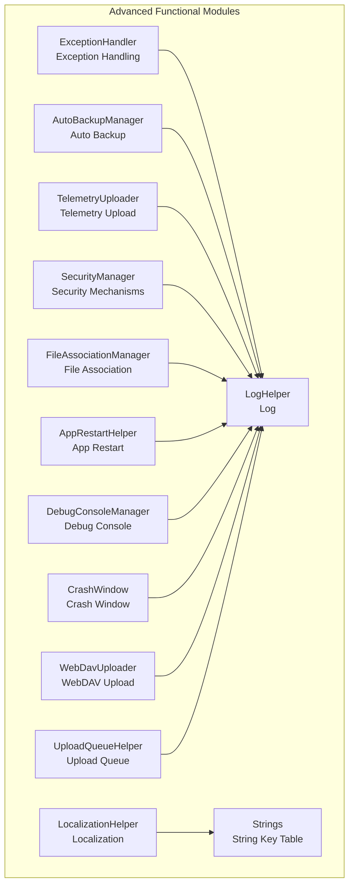

## Core Components
- Exception Handling and Crash Recovery: Provides unified exception capturing, logging, execution strategy control, and crash window displays.
- Internationalization and Localization: Centralized culture switching, embedded resource management, and custom culture support.
- File Association and IPC: .icstk file associations, IPC events and file transmission, and existing instance takeovers.
- Auto Backup: Periodic checks, backup creation, corrupted file protection, and expired file cleanup.
- Telemetry and Logging: Device identification, sensitive information desensitization, Sentry reporting, log rotation, and concurrency safety.
- Security Mechanisms: Password and TOTP dual factors, constant-time comparisons, dialog validations, and compatibility with UI focusless modes.
- Cloud Storage and Uploads: WebDAV uploads, automatic directory creation, and unified management of upload queues.
- App Restart: Switch restarts between Administrator and Standard user modes, and restarts in UIA topmost mode.
- Debugging and Diagnosis: Standalone debug console, log outputs, and crash detail windows.

## Architecture Overview
The advanced functional modules are organized around the architecture of "unified entries + component collaboration", with key interactions as follows:

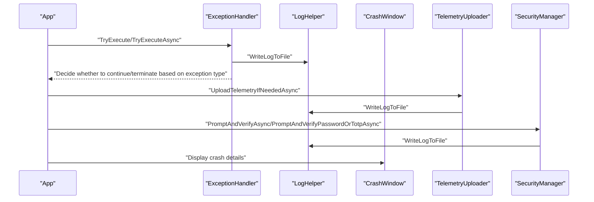

## Detailed Component Analysis

### Exception Handling and Crash Recovery
- Unified Exception Capturing: Provides synchronous/asynchronous execution wrapping, logging errors, and deciding whether to continue execution based on exception types.
- Crash Monitoring: Combines logging and telemetry to automatically collect crash and execution logs (desensitized).
- Crash Window: Displays crash details at the UI layer, supporting copying and theme adaptation.
- Auto Restart: Supports switching restarts between Administrator and Standard user modes, as well as restarts in UIA topmost mode.

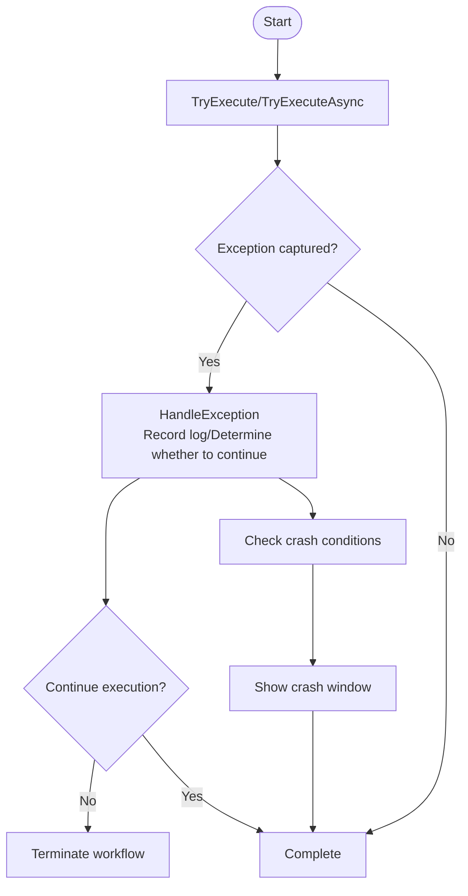

### Internationalization and Localization System
- Culture Switching: Supports standard cultures and custom cultures (such as en-US, zh-ME), dynamically setting UI thread cultures.
- Resource Management: Centralized string key tables searchable by groups; embedded resource and external resource fallbacks.
- String Retrieval: Mediated through Strings, supporting multi-language resource loading and caching.

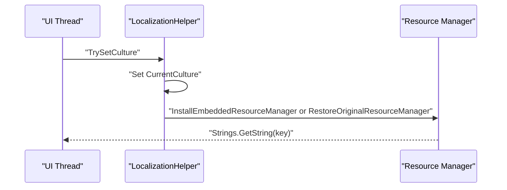

### File Association and IPC
- File Association: Registers the .icstk extension, default icons, and open commands, refreshing system caches.
- IPC Communication: Event notifications + temporary file transmissions, supporting file opening, whiteboard mode switching, floating bar expansion, and URI commands.
- Existing Instance Takeover: Forwards external requests to the running instance via IPC.

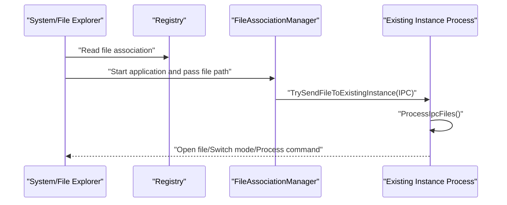

### Auto Backup and Recovery
- Condition Checking: Determines whether to backup based on settings switches and interval days.
- Backup Creation: Copies the main configuration to the backup directory, updating the last backup time.
- Recovery Mechanism: Validates backup validity, saves corrupted files separately, and overwrites the main configuration.
- Expired File Cleanup: Cleans up old backup files based on a 30-day threshold.

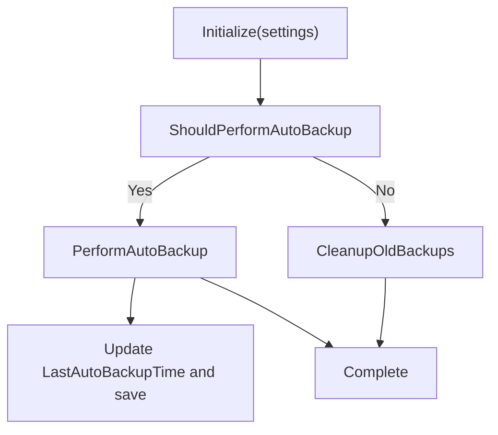

### Telemetry and Logging
- Telemetry Collection: Decides whether to report based on settings levels, using Basic/Extended to distinguish log attachments.
- Sensitive Info Desensitization: Replaces emails, phones, IPs, paths, keys, URL parameters, etc., via regular expressions.
- Reporting Channel: Sentry event reporting, carrying tags like device ID, application version, system version, etc.
- Log System: Filing by startup time, concurrency mutual exclusion, size limit cleanups, and console outputs.

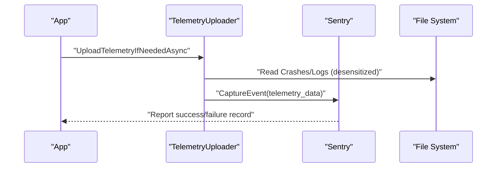

### Security Mechanisms
- Password Security: PBKDF2 derivation, randomized salt generation, and constant-time comparisons to prevent timing attacks.
- TOTP Dual Factor: Base32 key, 30-second stepping window, tolerance ±1 step.
- Dialog Validation: Unified popup prompting for input, supporting password or TOTP, compatible with focusless modes.
- Access Control: Access control based on configuration settings for various scenarios (exiting, entering settings, resetting configurations, changing name lists).

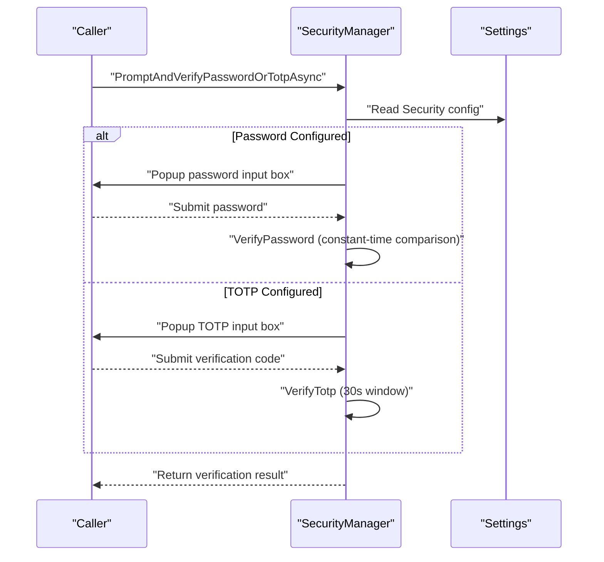

### Cloud Storage and Upload Queue
- WebDAV Upload: Automatically detects missing directories and creates them level-by-level, supporting cancellation tokens.
- Upload Queue: Unified registration and initialization, ensuring each queue is available throughout the application lifecycle.
- Settings Integration: Configuration items for WebDavUrl, username, password, root directory, etc.

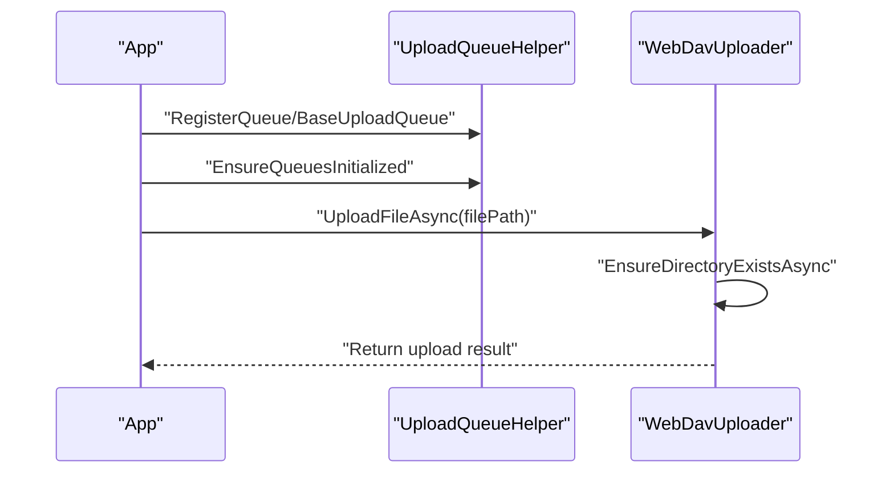

### App Restart and Debugging
- Restart Strategies: Switching between Administrator and Standard user modes, restarting in UIA topmost mode, and releasing mutexes.
- Debug Console: Allocates/hides the console, removes the close menu, outputs in UTF-8, and writes only when visible.

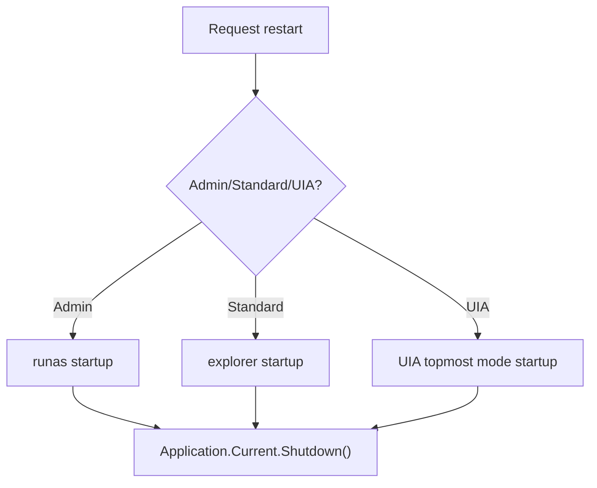

## Dependency Analysis
- Component Coupling: Most advanced functions route logs through LogHelper uniformly, facilitating tracking and troubleshooting.
- External Dependencies: Sentry for telemetry reporting; WebDAV client libraries for cloud storage.
- Key Interfaces: BaseUploadQueue abstracts upload queues; UploadQueueHelper handles unified registration and initialization.

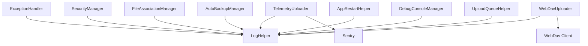

## Performance Considerations
- Concurrency Safety: Log writing uses mutual exclusion flags to avoid deadlocks caused by recursive writing.
- I/O Optimization: Attempts to create directories before retrying WebDAV uploads on failure, reducing redundant network round trips.
- Resource Management: Cleans up IPC files timely after use to avoid disk occupancy.
- UI Response: Crash windows and dialogs are scheduled on the UI thread, ensuring consistent interactions.

## Troubleshooting Guide
- Log Location: Enable date-categorized logs, check Logs/Log_{StartupTime}.txt, and focus on [Cleanup] tags.
- Telemetry Issues: Verify TelemetryUploadLevel and privacy consent status, checking device ID validity.
- File Association: Use status check methods, re-register if necessary, and pay attention to permissions and system cache refreshes.
- Backup Recovery: Verify backup directory existence and permissions, validate backup file validity, and pay attention to corrupted file protection.
- Security Verification: Check password/TOTP configurations, ensuring that constant-time comparison logic is not misused.
- Upload Failures: Verify WebDAV settings, ensure directory hierarchies can be created, and use cancellation tokens to interrupt long-running blocked tasks.

## Conclusion
This module builds a stable, observable, and maintainable advanced function system through unified logging, security, and exception handling frameworks, combined with localization, file association, auto-backup, telemetry reporting, and cloud storage capabilities. Recommendations for production environments:
- Clarify telemetry levels and privacy compliance.
- Clean up logs and backups periodically to control disk usage.
- Manage security configurations strictly, rotating keys and tokens regularly.
- Use upload queues and IPC mechanisms to improve user experience and reliability.

## Appendix
- Key Advanced Configurations
  - Telemetry Level: None/Basic/Extended, requiring privacy consent.
  - Logging Policy: Filing by date, size limits, and concurrency mutual exclusion.
  - Backup Policy: Periodic backups, expired cleanups, and corruption protection.
  - Security Policy: Password and TOTP dual factors, constant-time comparisons, and compatibility with focusless modes.
- Debugging Tools
  - Debug Console: Immediate log output, UTF-8 encoded, non-closable.
  - Crash Details Window: Copies crash details, with theme matching the OS.
- Best Practices
  - Wrap potentially exceptional code with TryExecute/TryExecuteAsync.
  - Check settings and network status before uploading; use cancellation tokens reasonably.
  - IPC events and file cleanups must handle exceptions and race conditions robustly.
