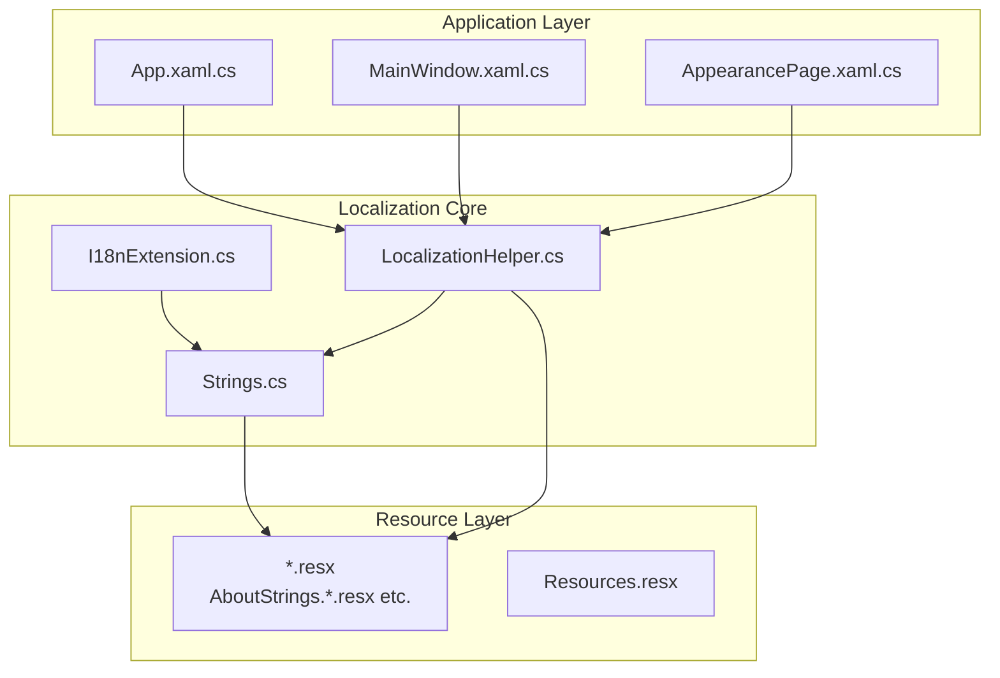
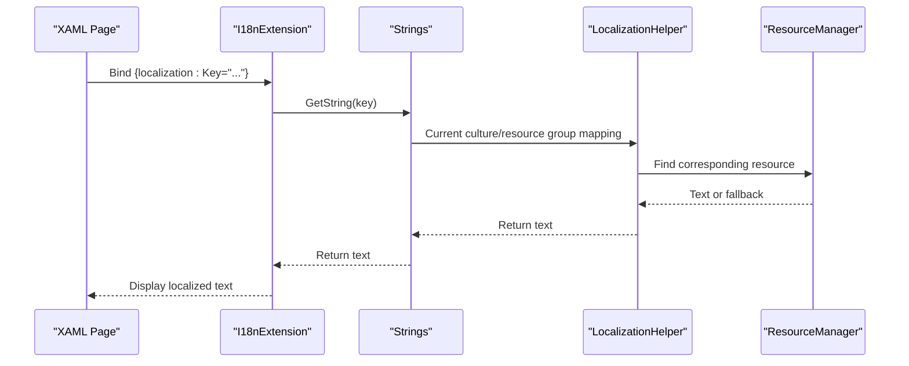
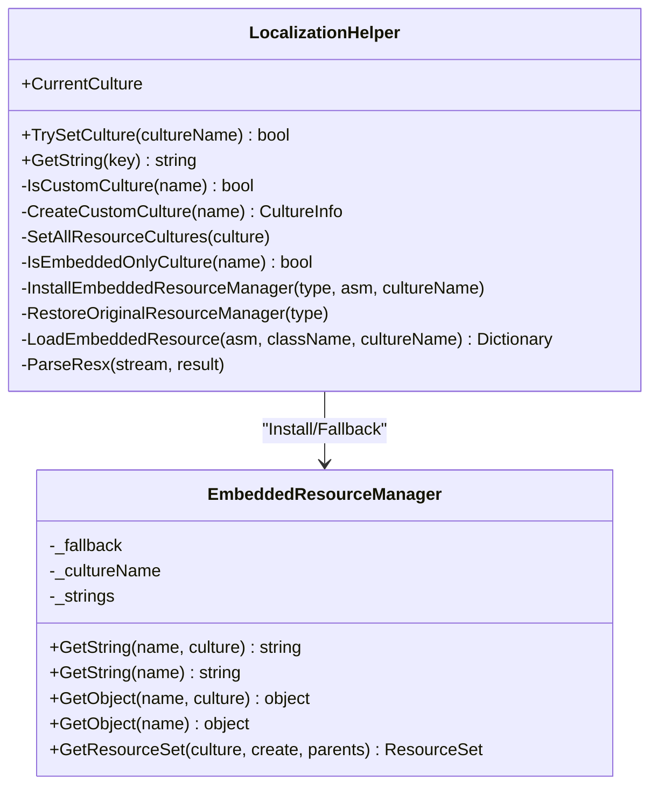
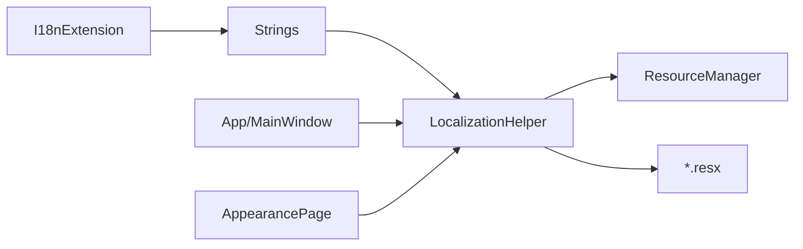

# Internationalization and Localization

## Introduction
This document focuses on the internationalization and localization system of InkCanvasForClass, systematically explaining the multi-language support architecture, resource file management, dynamic language switching, text formatting and placeholder handling, the implementation mechanism of the localization helper (language detection, resource loading, and fallback strategies), string resource organization and naming conventions, and the usage of the localization extension I18nExtension in XAML. It also provides best practices for multi-language development and guidelines for creating language packs.

## Project Structure
The localization system of InkCanvasForClass is primarily composed of the following parts:
- Resource Files: .resx files split by module (e.g. AboutStrings.*.resx, CommonStrings.*.resx, etc.), uniformly placed in the Properties directory.
- Central String Entry: The Strings class is responsible for mapping and looking up resource keys to specific resource groups.
- Localization Helper: LocalizationHelper provides language switching, culture settings, embedded resource manager replacement, and fallback logic.
- XAML Localization Extension: I18nExtension is used to bind localized text declaratively in XAML.
- Application Layer Integration: App and MainWindow invoke the localization helper to complete language switching and resource refreshing during startup and settings changes.

## Core Components
- Localization Helper (LocalizationHelper)
  - Provides setting and retrieving the current culture (CurrentCulture).
  - Supports creating and switching standard cultures and custom cultures (e.g., zh-ME).
  - Dynamically replaces the ResourceManager of each resource class, enabling seamless switching between "embedded resources" and "external resources".
  - Maintains embedded resource caches, parsing .resources or .resx files and falling back to the original ResourceManager.
- Central String Entry (Strings)
  - Maintains mapping dictionaries from keys to resource groups and keys, providing a unified GetString interface.
  - Serves as the query entry for I18nExtension.
- XAML Localization Extension (I18nExtension)
  - Used in XAML as a MarkupExtension, providing the Key property.
  - ProvideValue returns localized text for the corresponding key, returning a placeholder format if missing.
- Resource Files
  - Modular .resx files containing multi-language variants (e.g., zh-CN, en-US, zh-ME).
  - Resources.resx is used to store binary resource references (such as audio files).

## Architecture Overview
The localization system adopts an architecture of "centralized key mapping + resource group separation + dynamic resource manager replacement", achieving:
- Centralized mapping of keys to resource groups, making it easy to maintain and search.
- Runtime dynamic culture switching, supporting seamless fallbacks between embedded and external resources.
- Declarative localization in XAML via I18nExtension.

## Detailed Component Analysis

### Localization Helper (LocalizationHelper)
- Culture Setting and Thread Context
  - The CurrentCulture property sets both UI culture and non-UI culture, synchronizing with Strings.Culture.
- Custom Culture Support
  - IsCustomCulture identifies specific custom culture names (e.g., zh-ME).
  - CreateCustomCulture creates custom culture objects by cloning standard cultures and modifying internal name fields.
- Resource Manager Replacement and Fallback
  - SetAllResourceCultures traverses all Properties.*Strings classes, setting Culture, and installs EmbeddedResourceManager or restores the original ResourceManager depending on whether it is an embedded-only culture.
  - EmbeddedResourceManager prioritizes returning values from the custom culture dictionary, otherwise falling back to the original ResourceManager.
- Embedded Resource Loading and Caching
  - LoadEmbeddedResource tries .resources, .resx, and .resx on disk in turn, parsing and caching results to enhance subsequent access performance.
- Key Points
  - Accesses static fields and properties via reflection, ensuring it takes effect on all resource classes.
  - Suppresses exceptions to guarantee robustness during the switching process.

## Dependency Analysis
- Component Coupling
  - I18nExtension depends on Strings.
  - Strings depends on the culture and resource management capabilities of LocalizationHelper.
  - App/MainWindow depends on LocalizationHelper to complete language switching.
- Resource Dependency
  - All modular .resx files serve as data sources for Strings.
  - EmbeddedResourceManager depends on the original ResourceManager for fallback operations.
- External Dependencies
  - System.Resources, System.Globalization, System.Reflection.

## Performance Considerations
- Embedded Resource Caching
  - LocalizationHelper caches parsed embedded resources to avoid repeated parsing and I/O.
- Dictionary Lookup
  - Strings' key-to-resource-group mapping is an O(1) lookup, reducing reflection and resource manager invocation frequencies.
- Culture Switching Cost
  - Switching culture requires traversing and replacing the ResourceManager of all resource classes. It is recommended to batch switch on the settings page and prompt the user.

## Troubleshooting Guide
- Text Not Updated After Switching Language
  - Verify that LocalizationHelper.TrySetCulture was called and CurrentCulture was set.
  - Confirm that Strings.Culture is synchronized with the thread culture.
- Placeholders Displayed in XAML
  - Indicates missing resource keys. Check key mappings in Strings.cs or verify if the corresponding .resx contains the key.
- Custom Culture (e.g., zh-ME) Not Taking Effect
  - Verify that the logic of IsCustomCulture and CreateCustomCulture correctly creates and sets the culture object.
- Embedded Resource Loading Failed
  - Check if the resource filenames and paths comply with the convention (ClassName.Culture.resources), and verify cache hit status.

## Conclusion
The localization system of InkCanvasForClass implements flexible and extensible multi-language support through modular resources, centralized key mapping, and dynamic resource manager replacement. Combined with I18nExtension, developers can quickly implement localization declaratively in XAML, while executing dynamic language switching through settings interfaces like AppearancePage. It is recommended to strictly follow naming conventions and key mapping rules when adding new modules, and to perform thorough localization regression tests before release.

## Appendix

### String Resource Organization and Naming Conventions
- Resource Group Naming
  - Named after functional modules, e.g., AboutStrings, CommonStrings, CanvasStrings, etc.
- Resource Key Naming
  - Adopts a hierarchical naming format of "Module_Subitem" or "Module_Description", e.g., About_Title, Canvas_GroupTitle.
- Culture Variants
  - The default language uses .resx; other languages use .LanguageCode.resx, e.g., .en-US.resx, .zh-ME.resx.
- Key Mapping
  - Maps keys to resource groups and keys in Strings.cs to ensure a unified query entry.
