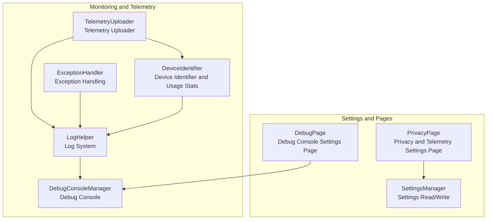
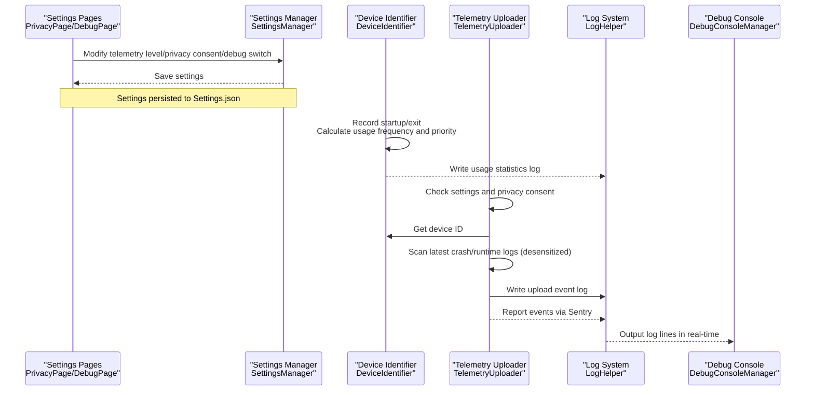
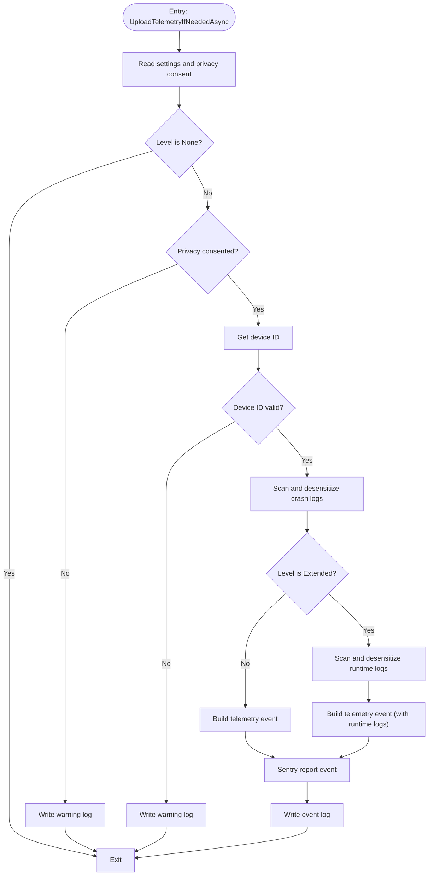
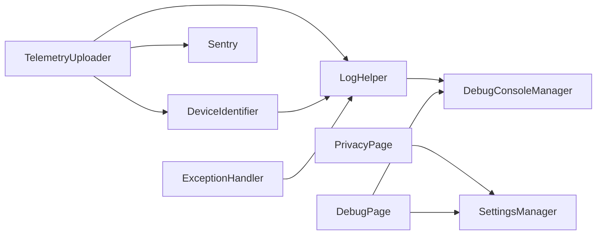

# Performance Monitoring and Telemetry

## Introduction
This document focuses on the performance monitoring and telemetry system of InkCanvasForClass, systematically explaining:
- Telemetry Data Collection Mechanisms: Performance index collection, user behavior tracking, and system state monitoring.
- Telemetry Uploader Implementation: Data serialization, transmission protocols, and error handling.
- Log System Architecture: Log levels, output targets, and rotation strategies.
- Debug Console Manager: Real-time log display, command interaction, and performance analysis tools.
- Monitoring Best Practices: Critical index definitions, alarm threshold settings, and performance optimization suggestions.
- Specific monitoring configurations and data analysis methods.

## Project Structure
The key files surrounding monitoring and telemetry are distributed as follows:
- Telemetry and Device Identification: TelemetryUploader, DeviceIdentifier under Helpers
- Logging and Debugging: LogHelper, DebugConsoleManager, ExceptionHandler
- Settings and Pages: PrivacyPage, DebugPage, SettingsManager
- Configuration Persistence: SettingsManager's read/write operations on Settings.json

## Core Components
- Telemetry Uploader: Responsible for collecting and reporting telemetry events when conditions are met, including crash logs and execution logs (desensitized).
- Device Identifier and Usage Statistics: Generates device IDs, records startups/exits, calculates usage frequencies, and updates priorities.
- Log System: Unified logging, supporting filing by startup time, rotation cleanups, and concurrency safety.
- Debug Console: Dynamically allocates/releases console windows, shields the close menu, and outputs logs in real-time.
- Exception Handling: Catches and determines exception types uniformly, deciding whether to continue execution.
- Settings and Pages: Provides telemetry level choices, privacy consents, and debug console switches.

## Architecture Overview
The overall workflow of telemetry and logging is as follows:

## Component Details

### Telemetry Uploader (TelemetryUploader)
Responsibilities and Workflows:
- Condition Check: Reads telemetry levels and privacy consent flags in settings; terminates if the level is "None" or privacy is not consented.
- Device ID Validation: Retrieves device IDs via DeviceIdentifier; terminates if the length or format is invalid.
- Data Collection:
  - Crash Logs: Scans the Crashes directory for the latest crash logs, desensitizes them, and uploads them as attachments.
  - Execution Logs (Extended Level): Scans the Logs directory for the latest execution logs, desensitizes them, and uploads them as attachments.
- Telemetry Data Wrapping: Includes telemetry level, device ID, update channel, application version, system version, existence of crash/execution logs, etc.
- Reporting and Logging: Sends events via Sentry, recording upload results in the local log.

Desensitization Rules (Regular Expressions):
- Replaces emails, phone numbers, IPv4, Windows paths, UNC paths, URL parameters, key-value keys, and sensitive fields in JSON values with placeholders.

## Dependency Analysis
- TelemetryUploader depends on DeviceIdentifier to get device IDs, depends on LogHelper to write logs, and depends on Sentry for reporting.
- DeviceIdentifier depends on LogHelper to write logs, depends on system information and registry/WMI queries for hardware fingerprints.
- LogHelper depends on DebugConsoleManager for real-time output, depends on the write permission protection of SettingsManager.
- DebugPage/PrivacyPage depends on SettingsManager to read and write settings, indirectly affecting the behavior of TelemetryUploader.
- ExceptionHandler serves as the global exception fallback, ensuring the stability of logging and upload flows.

## Performance Considerations
- Asynchronous Uploads: Telemetry uploads are executed in background tasks, avoiding blocking the main thread.
- Desensitization Cost: Regular expression replacements occur after I/O, keeping the overall overhead manageable; CPU usage should be monitored when log volumes are large.
- Log Rotation: Filing logs by startup time reduces single-file sizes; the Logs folder is cleaned when the total size exceeds limits, lowering disk pressure.
- Console Output: Written only when visible, avoiding meaningless I/O; shielding the close menu reduces accidental operations.
- Device Statistics: Employs cache and weekly reset mechanisms to reduce frequent I/O; rating calculations are purely memory-based operations.

## Troubleshooting Guide
Common Issues and Localization Methods:
- Telemetry Not Uploaded
  - Verify if privacy consent is granted and telemetry level settings are not "None".
  - Check local logs for warnings like "Privacy not consented statement" or "Invalid device ID".
  - Verify that crash/runtime logs exist and are readable.
- Logs Not Output to Console
  - Verify that the debug console switch is turned on.
  - Check if the console was accidentally closed or hidden.
- Log Files Too Large or Unwritable
  - Check if the total size of the Logs folder exceeds the threshold, confirming if cleanup was performed.
  - Check write permissions and disk space in the application root directory.
- Flow Interrupted by Exceptions
  - Utilize the unified handling capability of ExceptionHandler, inspecting exception stacks in logs.
  - Fatal exceptions (such as out-of-memory, access violations) must avoid continuing execution.

## Conclusion
This monitoring and telemetry system implements observability of user behaviors, system states, and exception events through the combination of "device identification + usage stats + logging + telemetry uploading". Coordinated with settings pages and the debug console, it ensures both user experience and powerful operations/diagnostics capabilities. It is recommended to set warning thresholds based on business indicators in production environments, continuing to optimize logs and upload policies to balance performance and observability.

## Appendix

### Monitoring Configuration Checklist
- Telemetry Level
  - None, Basic, Extended
  - Basic: Uploads crash logs only (desensitized)
  - Extended: Uploads runtime logs additionally (desensitized)
- Privacy Consent
  - Uploads are allowed only after agreeing to privacy terms
- Debug Console
  - Can be turned on/off in the settings page
- Log Configurations
  - Whether to enable logging
  - Whether to file by date
  - Logs folder size limit and cleanup policies
