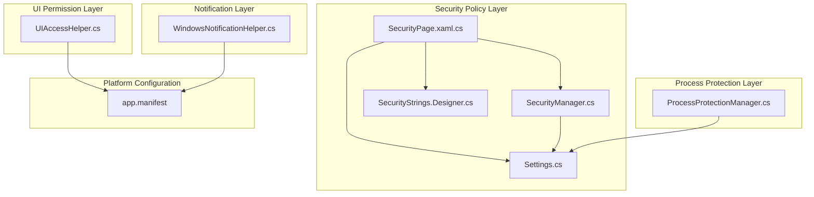
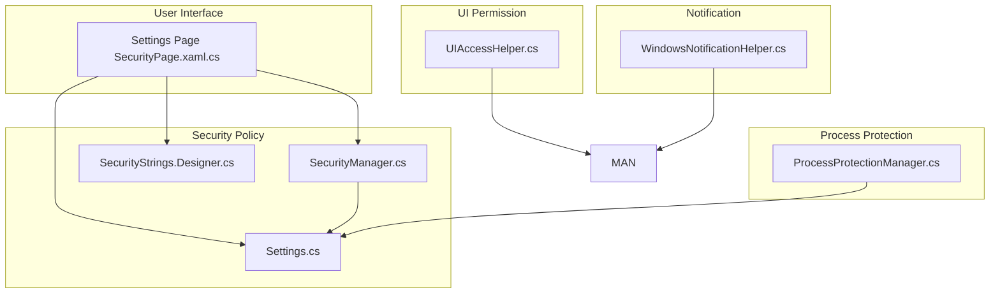
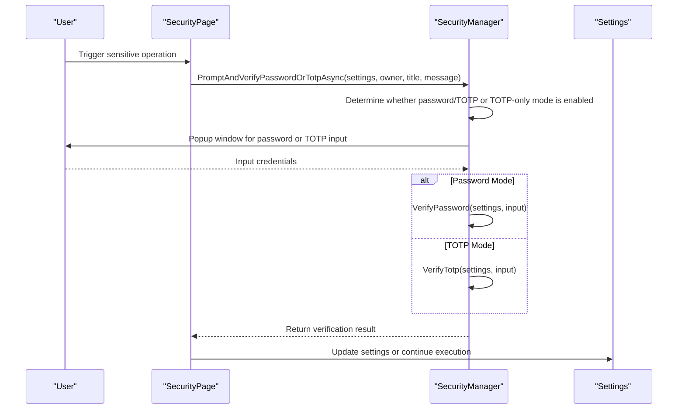
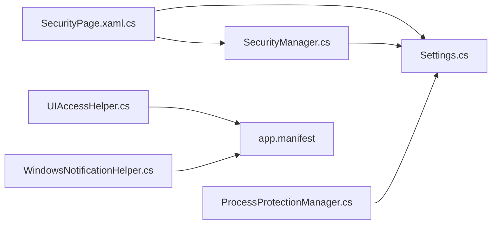

# Security Mechanisms

## Introduction
This document systematically outlines the security mechanisms of InkCanvasForClass, covering the following aspects:
- Security Manager: Configuration, verification, and interaction workflows for passwords and Time-based One-time Passwords (TOTP), designed with least privilege and timing-attack mitigation.
- Process Protection Manager: Process isolation and write gating based on file handles and directory handles to lower tampering risks.
- UIAccess Helper: Obtains UIAccess permissions and maintains security contexts through Winlogon token emulation and token info configurations.
- Windows Notification Helper: Cross-version notification displays and privacy considerations.
- Security Best Practices: Least privilege, secure coding specifications, and mitigation of common threats.
- Security configuration examples and threat analyses.

## Project Structure
The core security-related files are distributed as follows:
- Security Policy and Interaction: SecurityManager.cs, SecurityPage.xaml.cs, SecurityStrings.Designer.cs, Settings.cs
- Process Protection: ProcessProtectionManager.cs
- UIAccess Permissions: UIAccessHelper.cs
- Notifications: WindowsNotificationHelper.cs
- Manifest and Execution Level: app.manifest

## Core Components
- Security Manager (SecurityManager)
  - Configuration, verification, and interactions for passwords and TOTP, supporting "TOTP only" mode or "Password or TOTP" alternatives.
  - Derives keys using PBKDF2-HMACSHA256 (configurable iteration counts) and compares hashes in constant time to resist timing attacks.
  - Intercepts and requests double confirmations for sensitive operations (such as exiting, entering settings, resetting configurations, and modifying/clearing roll-call name lists).
- Process Protection Manager (ProcessProtectionManager)
  - "Read-only locks" based on file and directory handles protect critical files (including name lists), executables, dynamic libraries, configurations, etc.
  - Write gating and "degraded release-restore" strategies prevent write blockages caused by holding locks too long.
  - Supports on-demand rescans and excluded directories (such as configurations, saves, backups, logs, and automatic updates).
- UIAccess Helper (UIAccessHelper)
  - Grants UIAccess to the current process or new processes through Winlogon token emulation and token info configurations.
  - Supports restarting with UIAccess under standard user permissions, or restarting with UIAccess under administrator privileges.
- Windows Notification Helper (WindowsNotificationHelper)
  - Displays notifications across Windows versions (Win7 balloon notifications and modern Windows toast notifications).
  - Note: Notification contents should not contain sensitive information to avoid leaks to the system tray or notification center.

## Architecture Overview
The diagram below shows the interactions and responsibility boundaries between security-related modules:

## Detailed Component Analysis

### Security Manager (SecurityManager)
- Key Features
  - Enables/disables, configures, and verifies passwords and TOTP.
  - Double confirmation policies for different scenarios (exiting, entering settings, resetting configurations, modifying/clearing roll-call name lists).
  - Constant-time comparisons to prevent side-channel attacks.
- Critical Workflow (Password or TOTP Double Confirmation)

## Dependency Analysis
- The Security fields in the settings model (Settings.cs) carry security policies, which are read/written by SecurityManager and SecurityPage.
- SecurityPage serves as the UI entry point, mapping user actions to configuration changes, and invoking SecurityManager and ProcessProtectionManager.
- UIAccessHelper works with app.manifest: the former grants UIAccess at runtime, while the latter declares the default execution level.
- WindowsNotificationHelper integrates with the system notification framework, paying attention to privacy and information minimization.

## Performance Considerations
- Password and TOTP Verification
  - The PBKDF2 iteration count is high. Verification time is proportional to security; running on background threads and providing progress feedback is recommended.
  - Constant-time comparison avoids branch prediction attacks without causing major performance bottlenecks.
- Process Protection
  - Recursive scanning and opening handles during initialization may bring I/O overhead. Performing this once during application startup is recommended.
  - Write gating and degraded release policies balance safety and usability, avoiding long-term blockages.
- UIAccess
  - Token copying and permission adjustment are one-off operations that take effect after restarts, avoiding performance and security risks associated with continuous high privileges.
- Notifications
  - Toast notifications are lightweight asynchronous displays. Avoid frequent popups to prevent user disruption.

## Troubleshooting Guide
- Password/TOTP Cannot Be Verified
  - Verify that salts, hashes, TOTP keys, and enabled states are correctly configured in settings.
  - Verify input lengths and formats (password length, TOTP contains exactly 6 digits).
  - Inspect log outputs (SecurityManager utilizes log helper records internally).
- Process Protection Causes Write Failures
  - Verify if write paths are outside excluded directories.
  - Wrap write logic with WithWriteAccess, avoiding holding locks for a long time.
  - Check write-gate timeout logs, extending timeouts or optimizing batch writes if necessary.
- UIAccess Cannot Be Obtained
  - Verify that the current process has administrator privileges (required by UIAccess).
  - Inspect logs of Winlogon token retrieval and emulation processes, verifying session matching and successful privilege adjustments.
  - Ensure command-line arguments are passed correctly to avoid blockages caused by single-instance mutexes.
- Notifications Not Displayed
  - Check system versions and notification framework availabilities, ensuring balloon notification paths are used on older systems.
  - Avoid containing sensitive information in notifications, ensuring system policies allow displays.

## Conclusion
The security mechanisms of InkCanvasForClass implement protection for user data and system resources through multi-layer designs:
- Access control centered on passwords and TOTP, combined with constant-time comparisons and least privilege policies, effectively lowers authentication risks.
- The process protection manager locks file/directory handles and applies write gating, significantly lowering the probability of critical file tampering.
- The UIAccess helper strictly adheres to session isolation and downgraded startup principles under functional requirements, ensuring the minimized usage of UI privileges.
- The notification helper balances compatibility and privacy, avoiding sensitive information leaks.

Suggestions for subsequent versions:
- Make PBKDF2 iterations and algorithm parameters configurable, supporting dynamic adjustments based on hardware capabilities.
- Implement finer configuration controls for locking ranges and exclusion rules in process protection.
- Add more detailed error rollback and retry strategies in UIAccess workflows.

## Appendix

### Security Configuration Examples (Based on Current Implementations)
- Enabling Password Features
  - Check "Enable Password" on the settings page. The system will prompt to set a new password, persisting the salt and hash.
  - Strategies such as "Require password on exit," "Require password to enter settings," "Require password to reset configuration," and "Require password to modify/clear name list" can be configured.
- Enabling TOTP Features
  - Check "Enable TOTP" on the settings page. The system generates keys automatically, which can be regenerated by confirming with the current password or TOTP.
  - "TOTP Only Mode" can be enabled, allowing only TOTP verification.
- Enabling Process Protection
  - Check "Process Protection" on the settings page. The system runs file/directory locks in the background, employing gating and degraded release policies during writing.
- UIAccess Permissions
  - After running with administrator privileges, choose to restart with UIAccess, or restart with standard user privileges carrying UIAccess.
  - The manifest file declares asInvoker by default, and UIAccess is implemented via runtime token settings.
