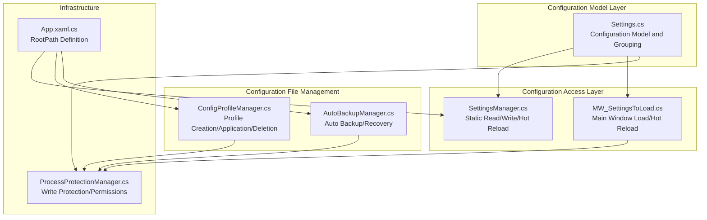
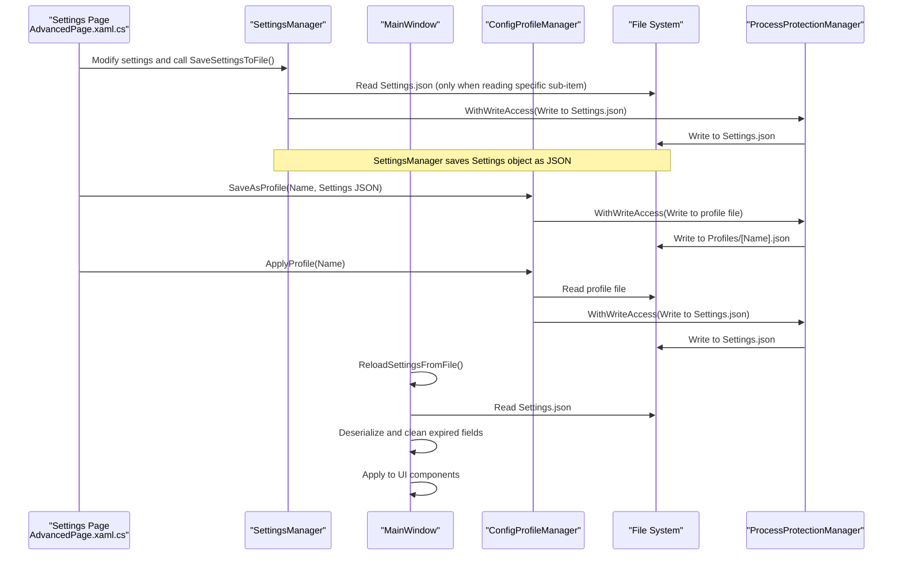
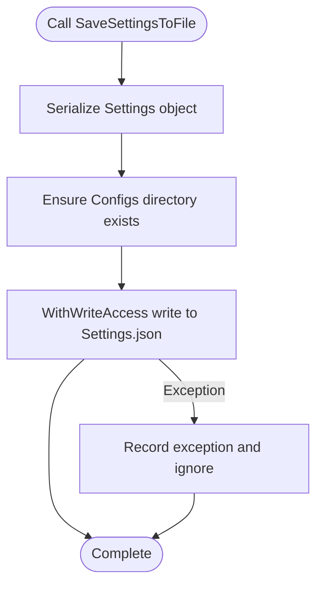
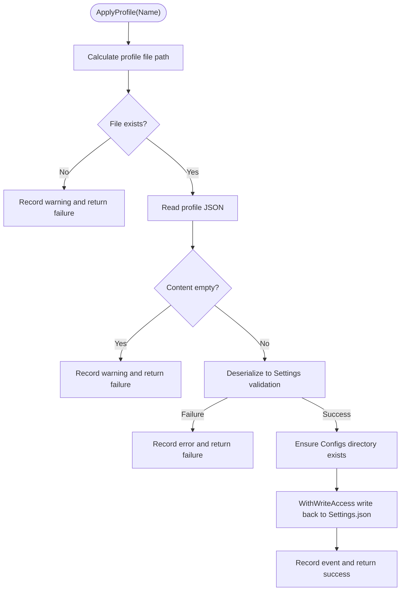
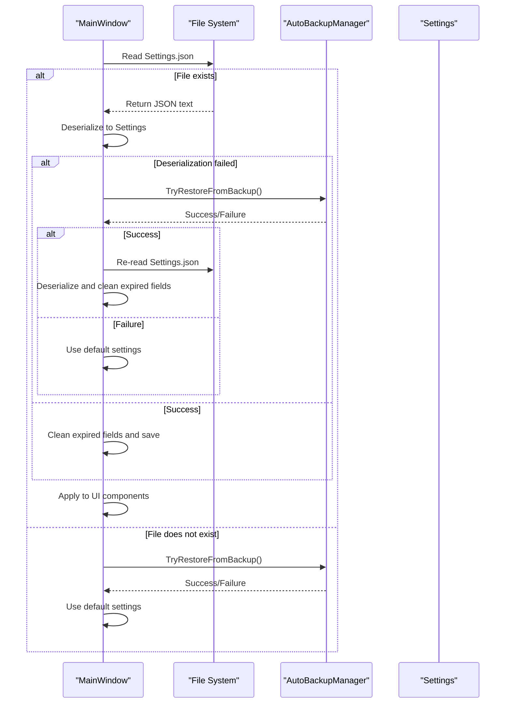
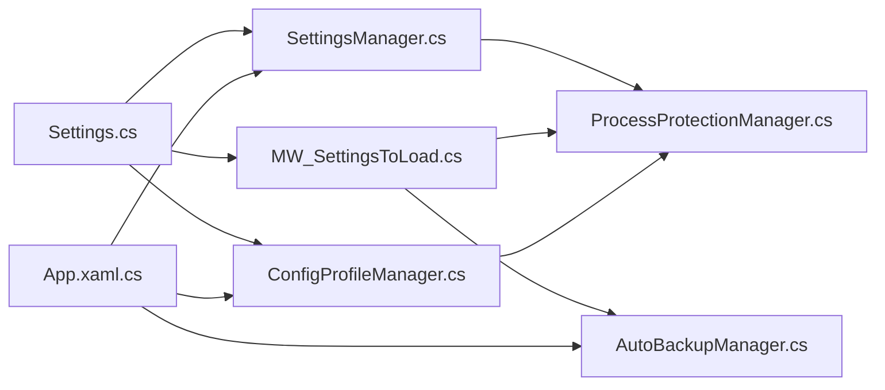
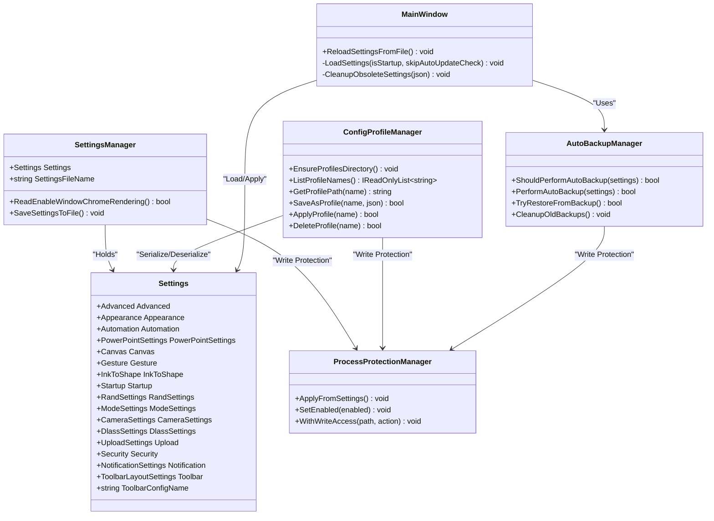

# Configuration API

## Introduction
This document systematically outlines the configuration API of Ink Canvas. Focusing on the configuration management capabilities of SettingsManager and ConfigProfileManager, it completely covers the following topics:
- Configuration reading, writing, validation, and persistence mechanisms.
- Configuration file structure specifications (JSON Schema, field constraints, default values).
- Configuration file management (creation, duplication, import, export).
- Configuration categorization (user preferences, system configurations, temporary states).
- Configuration validation rules and error handling.
- Complete usage examples (reading, updating, listening to changes).
- Version compatibility and migration strategies.
- Performance optimization suggestions (lazy loading, caching, batch updates).

## Project Structure
The core configuration-related code is distributed as follows:
- Configuration Model and Grouping: Resources/Settings.cs
- Configuration Read/Write and Hot Reload: Windows/SettingsViews/helpers/SettingsManager.cs, MainWindow_cs/MW_SettingsToLoad.cs
- Configuration Profile Management: Helpers/ConfigProfileManager.cs
- Backup and Recovery: Helpers/AutoBackupManager.cs
- File Permissions and Write Protection: Helpers/ProcessProtectionManager.cs
- Application Entry and Root Path: App.xaml.cs

## Core Components
- SettingsManager: Provides global static configuration instances and persistent writes, supporting reading specific sub-items (such as window rendering toggles) from disk as well as overall serialization saves.
- ConfigProfileManager: Provides creation, application, deletion, and enumeration of configuration profiles, supporting saving the current Settings JSON as a standalone profile file and writing profile contents back to the main configuration file to trigger hot reloads.
- Settings: The configuration model, grouped by functional domains (such as startup, appearance, canvas, automation, etc.), with each group containing several fields and their default values.
- MainWindow Settings Loading and Hot Reload: Responsible for deserializing Settings from disk, performing expired field cleanups and backup recovery fallbacks, and ultimately applying configurations to the UI.
- AutoBackupManager: Auto backup and recovery, ensuring recovery capability when configuration files are corrupted.
- ProcessProtectionManager: Write protection and access control, ensuring safe file/directory writing under protected mode.

## Architecture Overview
Typical workflow of the configuration API:
- Reading: SettingsManager reads Settings.json or specific sub-items from disk; MainWindow deserializes and applies them via LoadSettings.
- Writing: SettingsManager.SaveSettingsToFile serializes Settings entirely to disk; ConfigProfileManager.SaveAsProfile saves the current Settings JSON as a profile file.
- Application: ConfigProfileManager.ApplyProfile writes profile contents back to Settings.json, after which MainWindow.ReloadSettingsFromFile triggers a hot reload.
- Validation and Fallback: MainWindow attempts to restore from backups on load failure, reverting to default settings if it still fails; CleanupObsoleteSettings cleans up expired fields and saves.
- Secure Writing: All writes are wrapped in ProcessProtectionManager.WithWriteAccess, temporarily releasing locks when necessary to avoid deadlocks.

## Detailed Component Analysis

### SettingsManager Component
- Responsibilities
  - Provides the global Settings instance and filename constants.
  - Reads specific sub-items (such as window rendering toggles).
  - Serializes Settings entirely and writes them to disk.
- Critical Behaviors
  - Reading Specific Sub-items: Parses JSON and returns a boolean value, falling back to memory defaults on failure.
  - Writing: Serializes Settings, ensures the Configs directory exists, and executes writes using write protection.
- Error Handling
  - Catches and logs exceptions, ensuring the flow is not interrupted on failure.
- Usage Scenarios
  - Quickly reading single toggle items.
  - Batch saving settings.

### ConfigProfileManager Component
- Responsibilities
  - Ensures the Profiles directory exists.
  - Enumerates profile names (removes extensions, sorted).
  - Saves as profiles (writes Settings JSON to `Profiles/[Name].json`).
  - Applies profiles (writes profile contents back to Settings.json, triggering hot reloads).
  - Deletes profiles.
- Critical Behaviors
  - Name Sanitization: Removes illegal characters, mapping empty names to default names.
  - Validation: Deserializes to Settings to validate validity before applying profiles.
  - Write Protection: All file operations are executed via WithWriteAccess.
- Usage Scenarios
  - User saves current configuration as a profile.
  - Switching between multiple presets.
  - Importing/exporting configuration files.

### Settings Model and JSON Structure
- Grouping and Fields
  - advanced, appearance, automation, PowerPointSettings, canvas, gesture, inkToShape, startup, randSettings, modeSettings, camera, dlass, upload, security, notification, toolbar, etc.
- Default Values
  - Each field provides a default value in the class constructor, ensuring a reasonable initial state after deserialization.
- Field Constraints
  - Value range constraints (such as slider ranges, time thresholds).
  - Enum types (such as UpdateChannel, TelemetryUploadLevel).
  - Lists and nested objects (such as custom icon lists, notification durations, etc.).
- JSON Mapping
  - Uses JsonProperty to annotate field names, ensuring consistency with Settings.json keys.

### MainWindow Configuration Loading and Hot Reload
- Loading Workflow
  - Reads Settings.json, deserializing it into Settings.
  - On failure, attempts to restore from backups; uses default settings if it still fails.
  - Cleans up expired fields and saves.
  - Applies configurations to the UI (appearance, canvas, gestures, PPT, automation, etc.).
- Hot Reload
  - ReloadSettingsFromFile skips auto-update checks, applying configurations directly to the interface.

### Configuration Validation and Error Handling
- Configuration Validation
  - Deserializes to Settings to validate validity before applying profiles.
  - CleanupObsoleteSettings recursively compares default configurations with user configurations, deleting extra keys.
- Error Handling
  - Catches and logs exceptions during reading/writing.
  - Reverts to default settings when backup recovery fails.
  - Degrades write protection to direct execution writes upon timing out.

### Configuration Examples and Usage
- Reading Configuration Values
  - Direct access to groups and fields via SettingsManager.Settings.
  - Reads specific sub-items via SettingsManager.ReadEnableWindowChromeRendering.
- Updating Settings Items
  - Modifies corresponding fields in SettingsManager.Settings.
  - Invokes SettingsManager.SaveSettingsToFile for persistence.
- Listening to Configuration Changes
  - Binds UI controls with Settings fields in settings pages.
  - Saves immediately and triggers hot reloads upon modification (e.g., event handling in AdvancedPage).

### Configuration Categorization
- User Preferences
  - appearance, gesture, randSettings, toolbar (toolbar layout)
- System Configurations
  - startup, advanced, security, upload, dlass (third-party integration)
- Temporary State Data
  - canvas (canvas states), notification (notification states), modeSettings (mode settings)

### Version Compatibility and Migration Strategies
- Expired Field Cleanup
  - CleanupObsoleteSettings recursively compares default configurations with user configurations, deleting extra keys and saving.
- Backup Recovery
  - AutoBackupManager handles automatic backups and recoveries, preventing configuration corruption from rendering the application unusable.
- Fallback Strategy
  - Uses default settings on load failure to ensure application availability.

## Dependency Analysis
- Component Coupling
  - SettingsManager depends on the Settings model and App.RootPath.
  - MainWindow depends on SettingsManager and AutoBackupManager.
  - ConfigProfileManager depends on the Settings model and ProcessProtectionManager.
  - ProcessProtectionManager provides unified protection for all writes.
- External Dependencies
  - Newtonsoft.Json for serialization/deserialization.
  - Windows File System APIs for directory and file operations.

## Performance Considerations
- Lazy Loading
  - Reads Settings.json only when necessary, avoiding frequent I/O.
- Caching Strategy
  - SettingsManager.Settings serves as an in-memory cache, reducing repeated deserializations.
- Batch Updates
  - Saves once after UI modifications, avoiding multiple writes.
- Write Protection
  - Employs WithWriteAccess to unify writes, temporarily releasing locks when necessary to avoid deadlocks.

## Troubleshooting Guide
- Configuration File Read Failed
  - Check file existence and permissions.
  - Inspect logs for recovery records in AutoBackupManager.
- Configuration File Corrupted
  - Restore using AutoBackupManager.TryRestoreFromBackup.
  - The application falls back to default settings if no backup is available.
- Write Failed
  - Check ProcessProtectionManager states and write protection timeout logs.
  - Verify directory and file permissions.

## Conclusion
This Configuration API provides comprehensive config read, write, validation, and persistence capabilities through SettingsManager and ConfigProfileManager. Combined with MainWindow's hot reload and AutoBackupManager's backup recovery mechanisms, it ensures configuration changes are safe and stable. Through reasonable grouping, default values, and field constraints, cooperating with write protection and error fallbacks, it meets configuration management needs under complex scenarios.

## Appendix
- Configuration File Paths
  - Main Config: Configs/Settings.json
  - Profile Directory: Configs/Profiles/
  - Backup Directory: Backups/
- Key Class Diagram

Graph Source
