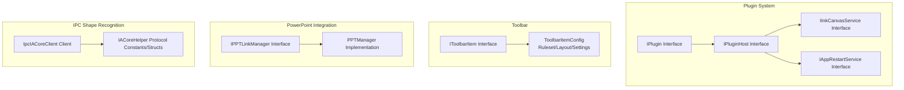
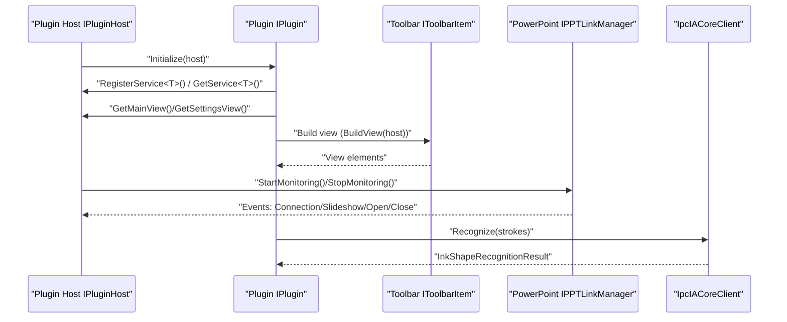
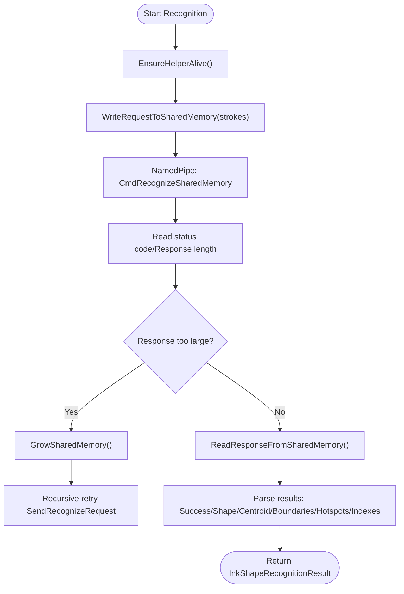
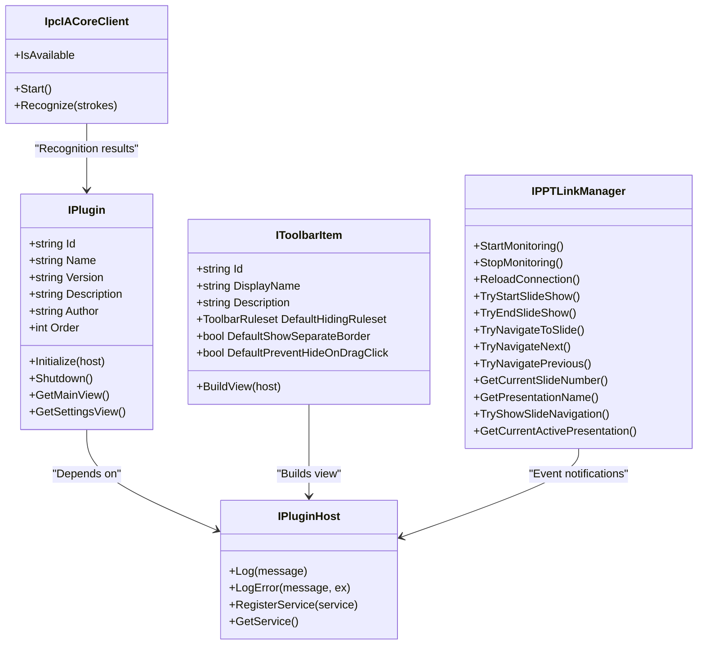

# API Reference

## Introduction
This document serves as the API reference for InkCanvasForClass, covering the following topics:
- Plugin System API: IPlugin interface, plugin host IPluginHost, service registration, and lifecycles.
- Toolbar API: IToolbarItem interface and toolbar item configuration models.
- PowerPoint Integration API: IPPTLinkManager interface and PPTManager implementations.
- IPC Communication Protocol: IpcIACoreClient and IACoreHelper protocol constants and message formats.
- Configuration API: Toolbar layouts and hiding rules, component settings keys.
- Usage examples, parameter combinations, and exception handling recommendations.

## Project Structure
APIs are organized around four dimensions: "Plugins", "Toolbar", "PowerPoint Integration", and "IPC Shape Recognition".



## Core Components
- Plugin Interface IPlugin: Defines plugin identity, metadata, initialization, and view export capabilities.
- Plugin Host IPluginHost: Provides logging, service registration/retrieval, and plugin lifecycle management.
- Toolbar Interface IToolbarItem: Defines toolbar item identities, display names, descriptions, default hiding rules, and view building.
- PowerPoint Integration Interface IPPTLinkManager: Unifies connections, events, slideshow controls, and navigations.
- IPC Shape Recognition Client IpcIACoreClient: Sends recognition requests and parses responses via named pipes and shared memory.

## Architecture Overview
The diagram below shows the interaction relationships between plugins, toolbars, PowerPoint integration, and IPC.



## Detailed Component Analysis

### Plugin API (IPlugin and IPluginHost)
- IPlugin
  - Key Properties: Identity Id, Name, Version, Description, Author, Order.
  - Key Methods: Initialize(host), Shutdown(), GetMainView(), GetSettingsView().
  - Purpose: Declares plugin meta-information and lifecycle hooks, exporting main views and settings views.
- IPluginHost
  - Logging: Log(message), LogError(message, ex=null).
  - Services: RegisterService&lt;T&gt;(service), GetService&lt;T&gt;().
  - Role: Provides runtime context and service containers for plugins.

Usage Examples (Step-by-step)
- Initialization: The plugin registers custom services via host.RegisterService in Initialize(host), and subsequently obtains host services via host.GetService.
- Lifecycle: Shutdown is called when the application exits to release resources.
- View Export: GetMainView returns the main panel control, and GetSettingsView returns the settings panel control.

Exception Handling Recommendations
- Catch host service registration failures in Initialize, log errors, and degrade gracefully.
- Avoid duplicate releases and COM object disposal exceptions in Shutdown.

### Plugin Host Service API (IInkCanvasService and IAppRestartService)
- IInkCanvasService
  - OpenWhiteboard(): Opens the canvas.
  - CloseWhiteboard(): Closes the canvas.
  - OpenWhiteboardAsync(delayMilliseconds=0): Asynchronously opens the canvas, supporting delays.
- IAppRestartService
  - IsRunningAsAdmin: Whether the app is running with administrator privileges.
  - RestartApp(asAdmin)/RestartWithCurrentPrivileges()
  - RestartAsAdmin()/RestartAsNormal()
  - SwitchToUIATopMostAndRestart()/SwitchToNormalTopMostAndRestart()

Usage Examples (Step-by-step)
- Retrieve the canvas service via IPluginHost.GetService&lt;IInkCanvasService&gt;() and invoke open/close as needed.
- Switch privileges or restart the application via IAppRestartService, suitable for scenarios requiring privilege elevations.

Exception Handling Recommendations
- Retry or fall back to synchronous opening on asynchronous open failures.
- Prompt the user and log errors on privilege switching failures.

### Toolbar API (IToolbarItem and ToolbarItemConfig)
- IToolbarItem
  - Identity and Display: Id, DisplayName, Description.
  - Default Behaviors: DefaultHidingRuleset, DefaultShowSeparateBorder, DefaultPreventHideOnDragClick.
  - View Building: BuildView(host) returns FrameworkElement.
- ToolbarItemConfig
  - Rule Models: ToolbarRule, ToolbarRuleGroup, ToolbarRuleset.
  - Built-in Rules: AlwaysShow, AnnotationOnly, PptOnly, PptAnnotationOnly, WithHideOnCollapsed, WithPreventHideOnCollapsed.
  - Layout and Settings: ToolbarComponentEntry (containing Settings dictionary), ToolbarLayoutSettings.
  - Settings Keys: min/max/fixed width/height, fontSize, iconSize, HorizontalAlignment, VerticalAlignment, marginLeft/top/right/bottom, paddingLeft/top/right/bottom, opacity, useRedStyle, displayMode, etc.

Usage Examples (Step-by-step)
- Implement IToolbarItem: Return custom controls in BuildView, setting Id and DisplayName.
- Configure Hiding Rules: Build condition groups via ToolbarRuleset, controlling display combined with logical modes Or/And.
- Layout Settings: Write key-values into ToolbarComponentEntry.Settings, reading via GetSettingXxx helper methods.

Exception Handling Recommendations
- Fall back to AlwaysShow on rule parsing failures.
- Execute safe conversions or use default values when setting key-value types mismatch.

### PowerPoint Integration API (IPPTLinkManager and PPTManager)
- IPPTLinkManager
  - Events: SlideShowBegin/NextSlide/End, PresentationOpen/Close, PPTConnectionChanged, SlideShowStateChanged.
  - Properties: IsConnected, IsInSlideShow, IsSupportWPS, SkipAnimationsWhenNavigating, SlidesCount.
  - Methods: StartMonitoring()/StopMonitoring()/ReloadConnection().
  - Navigation and Control: TryStartSlideShow()/TryEndSlideShow(), TryNavigateToSlide/Next/Previous.
  - Queries: GetCurrentSlideNumber()/GetPresentationName()/TryShowSlideNavigation()/GetCurrentActivePresentation().

- PPTManager (Implementation)
  - Connection Management: Timer polling, TryConnectToPowerPoint/TryConnectToWPS, ConnectToPPT/DisconnectFromPPT.
  - State Maintenance: Caches IsConnected/IsInSlideShow, event dispatching.
  - COM Object Safe Release: SafeReleaseComObject, avoiding leaks.
  - WPS Support: Optionally enabled, process detection, and state synchronization.

Usage Examples (Step-by-step)
- Subscribe to Events: Subscribe to desired events after StartMonitoring, handling slideshow starts, turn-pages, and slideshow ends.
- Navigation Control: Call TryNavigateNext/Previous or TryNavigateToSlide.
- Connection Rebuilding: Call ReloadConnection when exceptions occur, triggering reconnection and event refreshing.

Exception Handling Recommendations
- Catch COM exceptions and disconnect, avoiding hanging handles.
- Fall back to an empty state and trigger PPTConnectionChanged(false) on connection failures.

```mermaid
sequenceDiagram
participant App as "App"
participant Link as "IPPTLinkManager"
participant Impl as "PPTManager"
participant PP as "PowerPoint/WPS"
App->>Link : "StartMonitoring()"
Link->>Impl : "Start timer/Connection check"
Impl->>PP : "TryConnectToPowerPoint()/TryConnectToWPS()"
PP-->>Impl : "Return Application"
Impl->>Impl : "ConnectToPPT()<br/>Register events"
Impl-->>Link : "PPTConnectionChanged(true)"
PP-->>Impl : "SlideShowBegin/NextSlide/End"
Impl-->>Link : "Dispatch events"
App->>Link : "TryNavigateNext()"
Link->>PP : "Execute navigation"
PP-->>Link : "Status changes"
Link-->>App : "SlideShowStateChanged"
```

### IPC Communication Protocol (IpcIACoreClient and IACoreHelper Protocol)
- IpcIACoreClient
  - Singleton: Instance, lazily launching the helper process InkCanvas.IACoreHelper.exe.
  - Named Pipes: PipeNameFormat, client connection timeout IpcTimeoutMs.
  - Shared Memory: SharedMemoryNameFormat, fixed header size containing magic number, version, length, and state.
  - Request Workflow: EnsureHelperAlive -> WriteRequestToSharedMemory -> NamedPipe sends command -> Read response.
  - Error Handling: Auto-grows shared memory if response is too large; KillHelper and release shared memory on exceptions.

- IACoreHelper Protocol Constants and Structures
  - Constants: Pipe name, shared memory name, protocol version, timeout, magic number, command code, status code.
  - Structs: StylusPointDto, StrokeDto, RecognizeRequest, RecognizeResponse.

Message Formats (Shared Memory + Named Pipes)
- Request Header (First 24 bytes in shared memory): Magic number, version, request length, response offset, response length, state.
- Request Body (Shared Memory): Stroke count + point count for each stroke + X/Y/Pressure floating-point sequence.
- Named Pipe Command: CmdRecognizeSharedMemory (0x02), after which read status code and response length.
- Response Body (Shared Memory): Success, ShapeName, centroid, width, height, hotspot point set, selected stroke index arrays.



## Dependency Analysis
- Plugins rely on services and logging capabilities provided by IPluginHost.
- Toolbar items rely on IToolbarHost (interface defined in ToolbarHost.cs) to build views.
- PowerPoint integration is abstracted via IPPTLinkManager, with PPTManager providing concrete implementations.
- IPC recognition is completed by the coordination between IpcIACoreClient and the IACoreHelper protocol.



## Performance Considerations
- IPC Recognition
  - Shared memory capacity is expanded on demand, avoiding frequent allocations.
  - Binary streams are adopted for requests/responses, reducing serialization overheads.
  - Timeout controls and exception recoveries prevent lockups.
- PowerPoint Integration
  - Timed checks are layered (connections/slideshows/WPS) to reduce CPU usages.
  - COM objects are released timely to prevent handle leaks.
- Toolbar Configuration
  - Rulesets and layouts are JSON-serialized. Caching parsed results is recommended.

## Troubleshooting Guide
- Plugins Failed to Load
  - Verify that IPluginHost.GetService returns expected services.
  - Confirm the Initialize/Shutdown invocation sequence is correct.
- IPC Recognition Failed
  - Verify that the helper process executable exists and Start() returns true.
  - KillHelper and release shared memory on exceptions, waiting for auto-restarts.
- PowerPoint Not Responding
  - Catch COM exceptions and disconnect, triggering PPTConnectionChanged(false).
  - Use ReloadConnection to rebuild connections.
- Toolbar Items Not Displayed
  - Validate ToolbarRuleset logics and conditions, falling back to AlwaysShow if necessary.

## Conclusion
This document systematically outlines the plugin, toolbar, PowerPoint integration, and IPC shape recognition APIs of InkCanvasForClass, providing interface definitions, usage examples, and exception handling recommendations. Developers can use this to quickly integrate plugins, customize toolbars, connect to PowerPoint, and utilize IPC for efficient shape recognitions.

## Appendix
- Configuration API Reference (Toolbar)
  - Hiding Rules: AlwaysShow, AnnotationOnly, PptOnly, PptAnnotationOnly, WithHideOnCollapsed, WithPreventHideOnCollapsed.
  - Layout Setting Keys: minWidth/maxWidth/fixedWidth, minHeight/maxHeight/fixedHeight, fontSize, iconSize, HorizontalAlignment, VerticalAlignment, marginLeft/top/right/bottom, paddingLeft/top/right/bottom, opacity, useRedStyle, displayMode.
  - Reading Component Settings: GetSettingDouble/GetSettingString/GetSettingBool/SetSetting.
