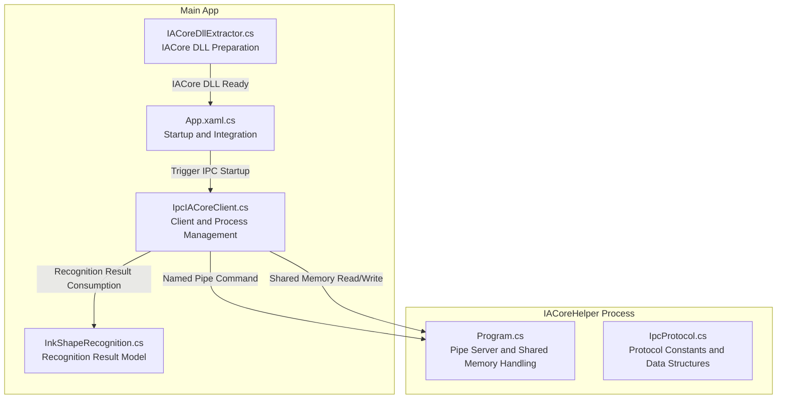
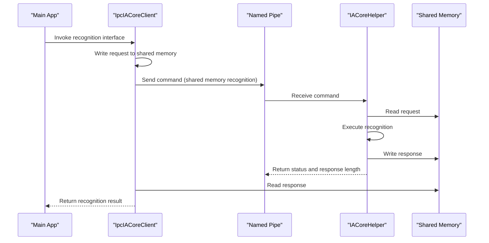
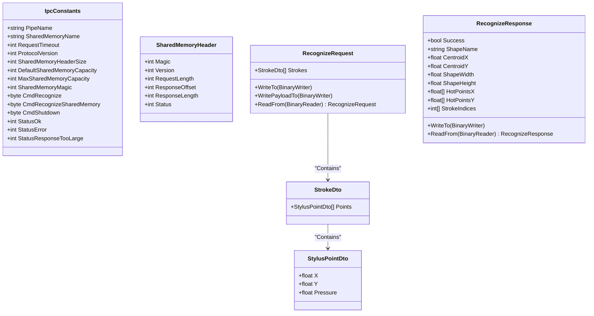
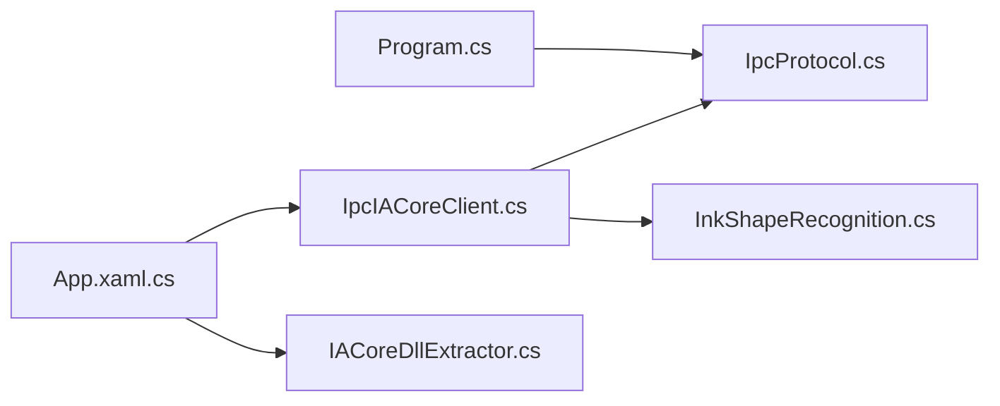

# IPC Communication API

## Introduction
This document systematically outlines the IPC communication API in the InkCanvas project, focusing on the communication protocol specifications of the IACore helper process, message formats and data type encodings, protocol version management, message handling mechanisms, client implementations and error reconnection strategies, security mechanisms, communication examples, performance and concurrency controls, and troubleshooting guides. The goal is to help developers quickly understand and correctly use IPC channels to complete cross-process communications for handwriting stroke shape recognition.

## Project Structure
IPC communication involves three key locations:
- Client Side: Located in the Helpers directory of the main application, responsible for launching the helper process, named pipe communications, shared memory read/writes, and result parsing.
- Protocol and Data Models: Located in the IACoreHelper project, defining constants, shared memory header layouts, request/response data structures, and serialization/deserialization.
- Helper Process: A standalone executable program that listens for named pipe commands, processes recognition requests, and returns results through shared memory.

## Core Components
- IpcProtocol: Defines protocol constants, shared memory header field offsets, request/response data structures, and binary encoding/decoding.
- Program: The main program of IACoreHelper, serving as the pipe server and shared memory writer, processing recognition requests and writing results back.
- IpcIACoreClient: The client on the main application side, responsible for process lifecycles, named pipe communications, shared memory read/writes, and result parsing.
- InkShapeRecognitionResult: Unified recognition result abstraction consumed by the upper layers.
- IACoreDllExtractor and App: Responsible for IACore DLL preparation and IPC launch timing.

## Architecture Overview
IPC adopts a hybrid method of "named pipes + shared memory":
- Named pipes are used for lightweight commands and state exchanges (such as triggering shared memory recognition, shutdown commands).
- Shared memory is used for highly efficient transmission of large volumes of data (stroke point sets) and result call-backs, cooperating with fixed-size shared memory headers describing request/response boundaries and states.

## Detailed Component Analysis

### IpcProtocol Protocol Specification
- Protocol Constants
  - Pipe name templates and shared memory name templates.
  - Request timeouts, protocol versions, shared memory header sizes, default/maximum capacities, and magic numbers.
  - Command Codes: Recognize, RecognizeSharedMemory, Shutdown.
  - Status Codes: Success, Error, ResponseTooLarge.
- Shared Memory Header Field Offsets
  - Magic number, version, request length, response offset, response length, and state.
- Data Structures
  - StylusPointDto: Single point coordinate and pressure.
  - StrokeDto: A set of points.
  - RecognizeRequest: Ink collections (array).
  - RecognizeResponse: Recognition results (boolean, shape name, centroid, size, hotspot point sets, participating stroke indexes).

## Dependency Analysis
- IpcIACoreClient relies on definitions of constants and data structures in IpcProtocol to construct requests and parse responses.
- IpcProtocol and Program define the shared memory header layout and read/write protocols, which must remain consistent.
- App and IACoreDllExtractor are responsible for IPC launch pre-conditions (DLL ready and process available).

## Performance Considerations
- Message Queues and Concurrency
  - The current implementation is a single-connection single-request model. The client guarantees concurrency safety through locks, preventing race conditions caused by multiple threads writing to shared memory simultaneously.
- Buffer Management
  - Shared memory capacity expands exponentially on demand to avoid frequent reallocations. Default capacities and maximum capacity limits prevent excessive memory occupancies.
  - Request length estimations employ precise calculations, reserving minimum response spaces to reduce the probability of secondary expansions.
- I/O and Serialization
  - Uses binary readers/writers for compact encoding, reducing serialization overheads. Shared memory headers contain only necessary fields, lowering synchronization costs.
- Timeout and Robustness
  - Connection and detection on named pipes set timeouts to enhance launch robustness. Exception capturing and resource releases guarantee process stabilities.

## Troubleshooting Guide
- Connection Issues
  - Pipe Unavailable: Check if the helper process has launched and if the pipe name matches the current process ID. The client provides detection and wait logic.
  - Process Exits Prematurely: Registers exit events and releases shared memory, triggering automatic retries.
- Message Loss and Responses Too Large
  - If the server returns "response too large", the client will automatically expand shared memory and retry. If it still fails, check request sizes and maximum capacity limits.
- Communication Interrupt Recovery
  - The client will terminate the helper process and release shared memory upon encountering exceptions, subsequently restarting the process and rebuilding shared memory.
- DLL and Environment
  - Ensure the IACore DLL has been extracted to the application directory; otherwise, recognition features are unavailable. The application attempts extraction and records logs during the startup phase.

## Conclusion
This IPC communication scheme implements high-throughput, low-copy handwriting recognition data transmissions through "named pipes + shared memory". Protocols are strictly separated from implementations, client and server responsibilities are clear, and the system offers good extensibility and stability. It is recommended to continuously monitor shared memory expansion frequencies and pipe connection success rates in production environments to further optimize performance and reliability.

## Appendix

### Communication Example
- Establishing Connections
  - Confirm the IACore DLL is ready (automatically extracted when the app starts).
  - The client launches the helper process and waits for the named pipe to become available.
- Sending and Receiving Messages
  - The client writes stroke data to shared memory and sends the shared memory recognition command.
  - The server reads the request, executes recognition, and writes the response to the tail of the shared memory.
  - The client reads the response and parses it into a unified result model.
- Asynchronous and Bi-directional Communication
  - The current implementation is a synchronous call. If asynchronous operation is required, asynchronous interfaces can be wrapped at the upper layer, maintaining independent shared memory tokens and locks inside the client.
- Error Handling
  - Catch exceptions and retry. If it fails multiple times, log errors and prompt the user.
