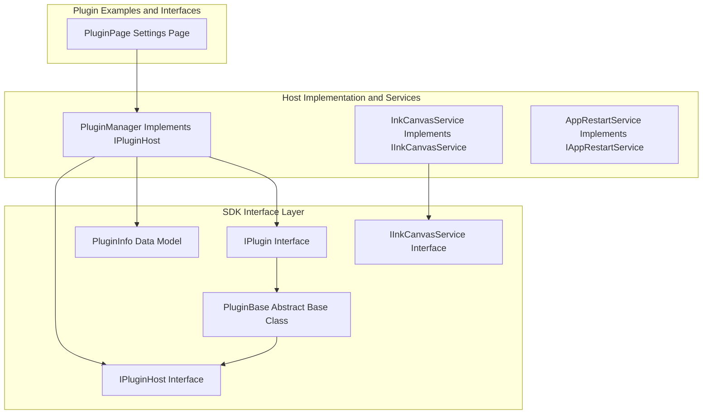
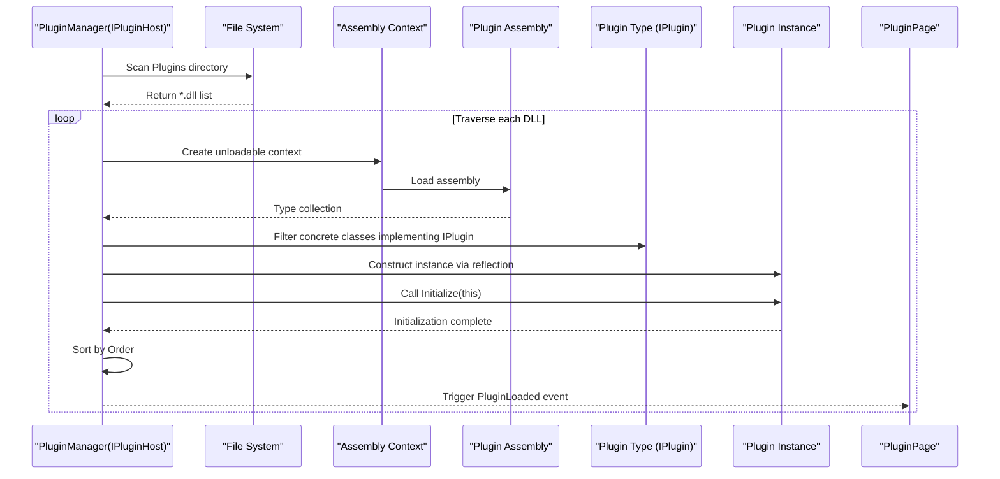
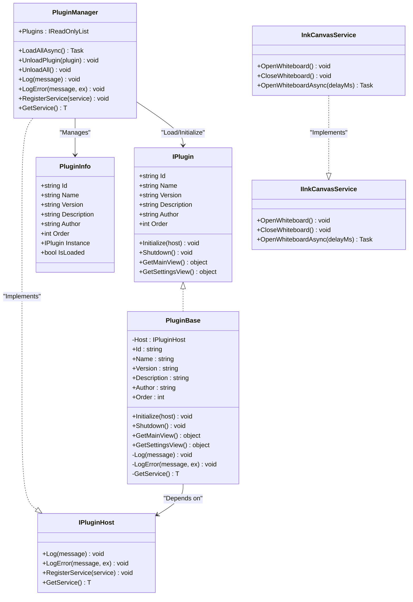
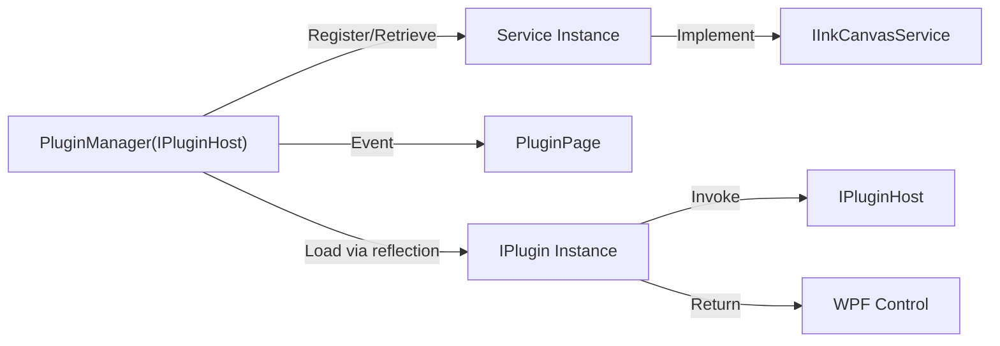

# Plugin API

## Introduction
This document systematically records the design and usage of the Ink Canvas Plugin API, covering the IPlugin interface, IPluginHost host interface, PluginBase base class, plugin lifecycle, loading and unloading workflows, service registration and discovery, as well as plugin configurations and error handling. The goal is to help developers quickly understand and correctly implement a runnable plugin.

## Project Structure
The Plugin API is located in a standalone SDK project. The plugin manager and concrete plugin implementations reside in the Plugins directory of the main Ink Canvas project, displayed and managed via the settings pages.

## Core Components
- IPlugin: Defines metadata and lifecycle methods for plugins, including Initialize, Shutdown, GetMainView, and GetSettingsView.
- IPluginHost: Defines capabilities exposed by the host to plugins, such as logging, exception logging, service registration, and retrieval.
- PluginBase: Provides a default skeletal implementation (empty implementations) of IPlugin, wrapping access and forwarding to host capabilities.
- PluginInfo: Carries metadata and instance states of loaded plugins.
- PluginManager: The plugin loader and host implementation, responsible for directory scanning, reflection loading, sorting, initialization, unloading, and event publishing.
- IInkCanvasService: Whiteboard-oriented host service interface invoked by plugins to control UI mode switching.
- InkCanvasService: Concrete implementation of IInkCanvasService, bridging plugin calls and main window operations.
- AppRestartService: Application restarting service (registered as a service by the host).
- PluginPage: UI displaying the list of loaded plugins in settings.

## Architecture Overview
The plugin system adopts an architecture of "interface definitions + host implementations + reflection loading + lifecycle management". Plugins expose metadata and behaviors via IPlugin; the host provides unified loading, initialization, service registration, and logging capabilities via PluginManager; plugins access host services or custom services via IPluginHost; and finally, loaded plugin information is displayed in settings.

## Detailed Component Analysis

### IPlugin Interface and Field Semantics
- Fields and Responsibilities
  - Id: Unique identifier for the plugin, used for de-duplication, unloading localization, and logging.
  - Name: Display name of the plugin, used for UI presentation and user identification.
  - Version: Plugin version number, facilitating tracking and compatibility checks.
  - Description: Brief description for UI display.
  - Author: Author info, facilitating tracking and support.
  - Order: Loading order weight (smaller values load first), representing dependency order.
- Lifecycle Methods
  - Initialize(host): Receives IPluginHost from the host, executing one-off initialization logic (registering services, subscribing to events, reading configurations, etc.).
  - Shutdown(): Cleanups such as releasing resources, unsubscribing from events, and closing handles.
  - GetMainView(): Returns the main view object of the plugin (usually a WPF control) for embedding in the main interface.
  - GetSettingsView(): Returns the settings view object of the plugin for embedding in settings.

### IPluginHost Interface Capabilities
- Logging Capabilities
  - Log(message): Outputs normal logs.
  - LogError(message, ex): Outputs error logs, optionally carrying exceptions.
- Service Management
  - RegisterService&lt;T&gt;(service): Registers a service instance for plugins to retrieve via GetService&lt;T&gt;().
  - GetService&lt;T&gt;(): Retrieves registered service instances from the host, with generic constraints guaranteeing non-null references.

### PluginBase Base Class
- Inheritance Requirements
  - Must implement all abstract fields and methods of IPlugin.
- Default Behaviors
  - Initialize(host): Stores the host reference, executing no other logic by default.
  - Shutdown(): Default empty implementation.
  - GetMainView()/GetSettingsView(): Defaults to returning null.
- Helper Methods
  - Log(message)/LogError(message, ex): Delegates log outputs to the host.
  - GetService&lt;T&gt;(): Delegates service retrievals to the host.
- Usage Recommendations
  - Register services or subscribe to events in Initialize.
  - Release resources and unsubscribe in Shutdown.
  - Override GetMainView/GetSettingsView to return WPF controls if UI is required.

### PluginManager (Host Implementation)
- Responsibilities
  - Scans *.dll files in the Plugins directory, traversing subdirectories hierarchically.
  - Dynamically loads assemblies using unloadable AssemblyLoadContexts.
  - Reflectively filters concrete classes implementing IPlugin, constructing instances, and invoking Initialize(this).
  - Sorts plugins in ascending order by Order, triggering the PluginLoaded event.
  - Supports unloading single plugins (invoking Shutdown, removing records, unloading contexts) and unloading all.
  - Provides logs and error logs, along with service registration and retrieval.
- Key Events
  - PluginLoaded: Triggered when a plugin loads successfully.
  - PluginUnloaded: Triggered when a plugin is unloaded.
  - LogMessage: Log output event, for UI or external listening.

### Plugin Views and Settings Pages
- PluginPage: Displays the name, version, description, and author of loaded plugins, counting them and handling loading exceptions.
- Plugin View Return Value Specifications
  - GetMainView()/GetSettingsView() should return WPF control objects so the host can add them to appropriate containers.

### Service Interfaces and Implementations
- IInkCanvasService: Provides capabilities to open/close the whiteboard (synchronously and asynchronously).
- InkCanvasService: Redirects UI operations to the UI thread based on MainWindow's Dispatcher, ensuring thread safety.
- AppRestartService: Auxiliary capabilities for app restarting and privilege switching (registered as an example service to the host).

### Class Diagram (Code-Level)

## Dependency Analysis
- Plugins to Host: Plugins access logs and services via IPluginHost; plugin instances are loaded and injected with the host via reflection by PluginManager.
- Services to Plugins: Plugins retrieve registered host services (such as IInkCanvasService) via GetService&lt;T&gt;().
- UI to Plugins: PluginPage only displays loaded plugin information without directly interacting with plugins; plugin views are provided by plugins themselves and rendered by the host.

## Performance Considerations
- Assembly Loading and Unloading
  - Employs unloadable AssemblyLoadContexts, facilitating garbage collection of memory and resources during unloading.
- I/O and Scanning
  - Recursive scanning of the Plugins directory may bring I/O overhead. Organizing plugins by directories and restricting depth is recommended.
- UI Thread Scheduling
  - UI operations should use Dispatcher.Invoke or asynchronous methods to avoid cross-thread exceptions.
- Sorting and Events
  - Sorting by Order and event dispatching should run on the main thread or in thread-safe contexts.

## Troubleshooting Guide
- Plugins Not Loaded
  - Check if the Plugins directory exists and contains *.dll; confirm that the plugin class implements IPlugin and is not abstract.
  - Check host logs and error logs to locate loading failure causes.
- Initialization Failed
  - Catch exceptions in Initialize, ensuring allocated resources are cleaned up and errors are logged on failure.
- Unloading Failed
  - Ensure Shutdown releases resources correctly; if memory footprint persists after unloading, check if external references still exist.
- UI Not Updating
  - Confirm loading logics and event subscriptions in PluginPage; verify if PluginLoaded/PluginUnloaded are triggered.
- Services Unavailable
  - Verify that the service is registered with the host; check for null values when retrieving via GetService&lt;T&gt;() in plugins.

## Conclusion
This Plugin API provides stable loading, initialization, service-orientation, and unloading mechanisms through clear interfaces and host implementations. Developers only need to implement IPlugin and follow lifecycle conventions to collaborate with the host seamlessly. High priority should be given to logging, error handling, and service registration in actual developments to ensure robustness and maintainability.

## Appendix

### Plugin Development Steps and Best Practices
- Implement IPlugin
  - Clarify constraints and values for Id, Name, Version, Description, Author, and Order.
  - Complete service registration, event subscription, and configuration reading in Initialize.
  - Release resources and unsubscribe in Shutdown.
  - Override GetMainView/GetSettingsView to return WPF controls if UI is required.
- Use PluginBase
  - Inherit from PluginBase to reuse logs and service access methods, reducing boilerplate code.
- Communicate with Host
  - Output logs via IPluginHost.Log/LogError.
  - Manage and retrieve services via RegisterService&lt;T&gt;/GetService&lt;T&gt;.
- Service Example
  - Refer to the implementation pattern of IInkCanvasService and InkCanvasService, ensuring UI operations execute on the UI thread.
- Error Handling
  - Catch and log exceptions in Initialize/Shutdown, rolling back states when necessary.
- Configuration and Display
  - Plugin information is displayed in Settings' PluginPage, ensuring fields are complete and readable.

### Plugin Loading Order and Dependencies
- Loading Order
  - PluginManager scans directories and collects all types implementing IPlugin, sorting them in ascending order by Order.
- Dependencies
  - Smaller Order values load first; plugins can implement functional coupling through service dependencies internally.
- Unloading Order
  - Shutdown is invoked first during unloading, then records are removed and assembly contexts are unloaded.

### Plugin Configuration Files and Validation Rules
- Config File Locations
  - Plugin assemblies reside in the Plugins subdirectory of the host application root, supporting top-level and subdirectory structures.
- File Formats
  - Plugins must be .NET assemblies (*.dll) containing at least one concrete class implementing IPlugin.
- Metadata Fields
  - Id, Name, Version, Description, Author, and Order must be valid and readable.
- Validation Key Points
  - Assemblies are loadable, types are instantiable, IPlugin is implemented, and Initialize succeeds.
  - Shutdown executes normally during unloading, avoiding resource leaks.
