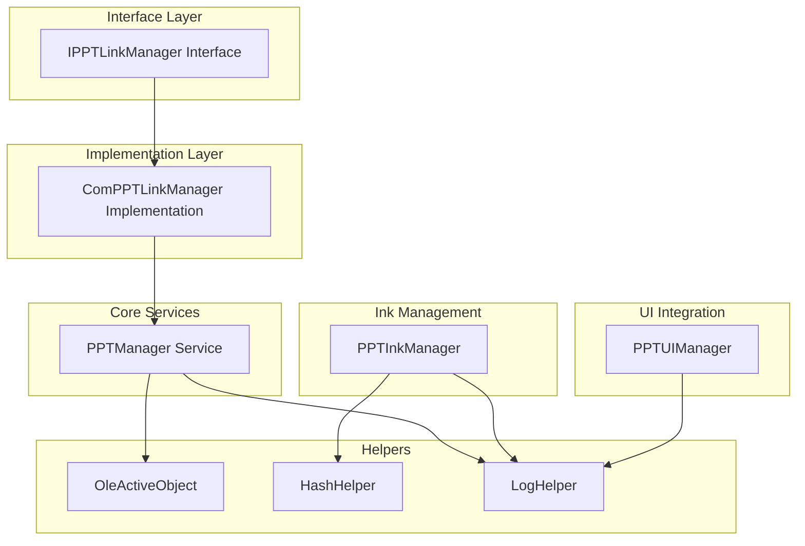
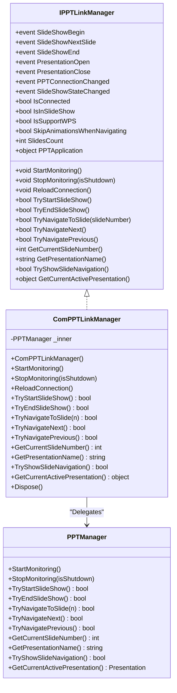
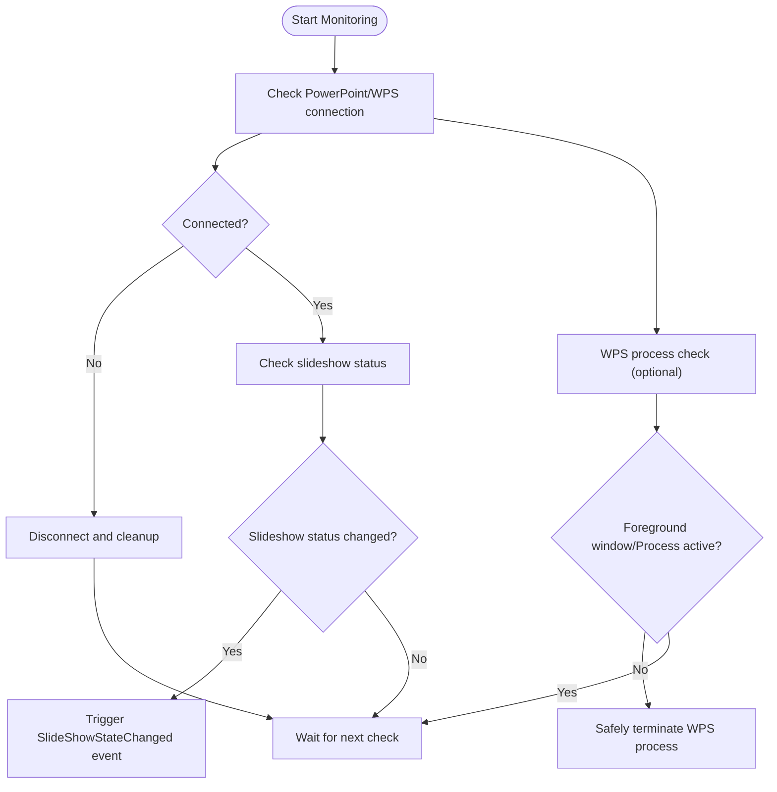
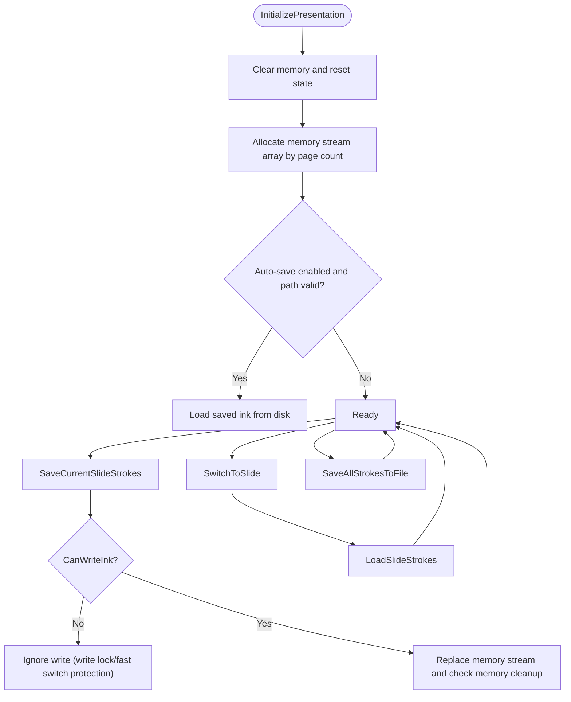
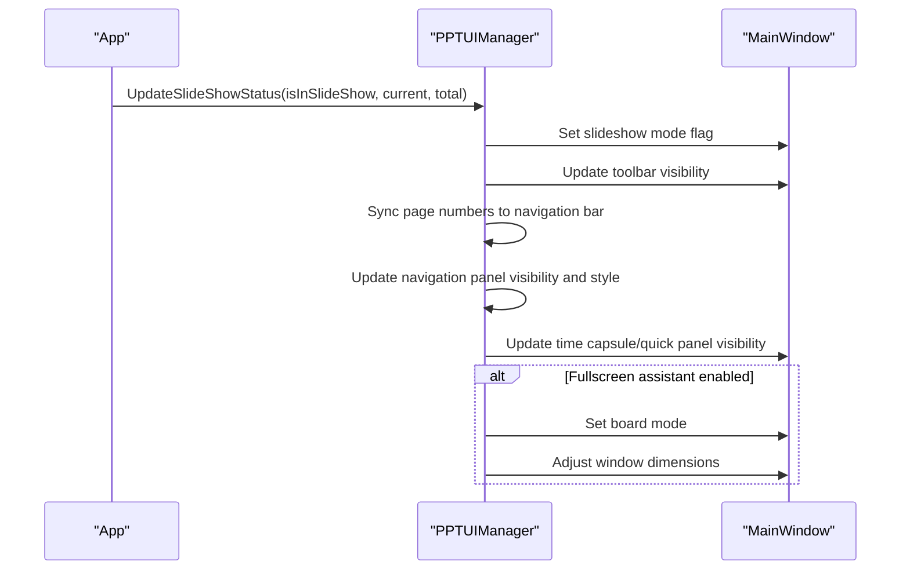
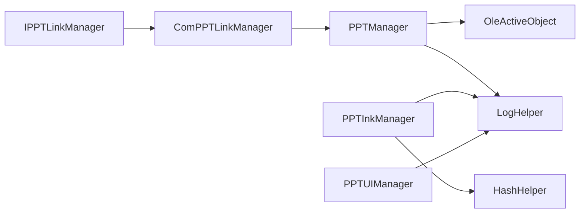

# PowerPoint Integration API

## Introduction
This document systematically outlines the design and implementation of the PowerPoint Integration API, focusing on the following goals:
- IPPTLinkManager Interface: Defines interface contracts for PowerPoint connection management, slide navigation controls, and ink synchronizations.
- PPTInkManager: Responsible for slide-by-slide ink data reception, conversion, persistence, and memory management.
- PPTManager: Unifies connection management, event listening, slideshow status tracking, and process management for PowerPoint/WPS.
- PPTUIManager: Responsible for integration with the main UI window, dynamically updating buttons, navigation panels, and fullscreen modes.
- COM Wrapping: Implements IPPTLinkManager's concrete COM implementation via ComPPTLinkManager.

This document provides method specifications, data flows, error handling strategies, disconnection recovery mechanisms, and performance optimization suggestions, along with end-to-end integration steps.

## Project Structure
The integration module is located in the Ink Canvas\Helpers directory, organized into layers: "Interface + Implementation + Helpers":
- Interface Layer: IPPTLinkManager defines the external contract.
- Implementation Layer: ComPPTLinkManager adapts to PPTManager, providing COM-based events and methods.
- Core Service: PPTManager handles connections, events, slideshow controls, and WPS process management.
- Ink Management: PPTInkManager provides page-by-page ink memory/disk access, auto-save, and memory cleanup.
- UI Integration: PPTUIManager manages button visibility, page number synchronization, navigation panel layout, and fullscreen switching.
- Helpers: OleActiveObject, HashHelper, and LogHelper provide COM object retrieval, identifier generation, and logging capabilities.



## Core Components
- IPPTLinkManager: Defines event and property contracts for connection status, slideshow status, navigation controls, and query methods.
- ComPPTLinkManager: The concrete implementation of IPPTLinkManager, bridging PPTManager's events and methods.
- PPTManager: Unifies connection management, events, slideshow status, process lifecycles, and COM object releases for PowerPoint/WPS.
- PPTInkManager: Maintains ink collections page-by-page, providing memory stream management, auto-save/load, fast switching protection, and memory cleanup.
- PPTUIManager: Dynamically updates buttons, page numbers, and navigation panels in slideshow mode, supporting fullscreen switching and opacity configurations.
- Helpers: OleActiveObject provides equivalent GetActiveObject capabilities under .NET Core/5+; HashHelper generates presentation identifiers; LogHelper provides thread-safe logging.

## Architecture Overview
PowerPoint integration adopts an architecture of "event-driven + COM object bridging + UI synchronization":
- Event-driven: PPTManager registers PowerPoint/WPS events, triggering connection, slideshow, close, and other events.
- COM Object Bridging: ComPPTLinkManager exposes PPTManager's events and methods as IPPTLinkManager.
- UI Synchronization: PPTUIManager updates buttons, page numbers, and panel layouts asynchronously on the Dispatcher.
- Ink Synchronization: PPTInkManager collaborates with PPTManager to save/load ink page-by-page, supporting auto-save and memory cleanup.

```mermaid
sequenceDiagram
participant App as "App"
participant Link as "ComPPTLinkManager"
participant PPT as "PPTManager"
participant UI as "PPTUIManager"
App->>Link : StartMonitoring()
Link->>PPT : StartMonitoring()
PPT->>PPT : Timer checks connection/slideshow status
PPT-->>Link : Trigger events (slideshow start/end/open/close/status change)
Link-->>App : Post events
App->>UI : UpdateSlideShowStatus(...)
UI->>UI : Update button/page number/panel visibility
```

## Detailed Component Analysis

### IPPTLinkManager Interface Specification
- Events
  - Slideshow: SlideShowBegin, SlideShowNextSlide, SlideShowEnd.
  - Presentation: PresentationOpen, PresentationClose.
  - Connection and State: PPTConnectionChanged, SlideShowStateChanged.
- Properties
  - IsConnected, IsInSlideShow, IsSupportWPS, SkipAnimationsWhenNavigating, SlidesCount, PPTApplication.
- Methods
  - Lifecycle: StartMonitoring, StopMonitoring, ReloadConnection.
  - Slideshow Control: TryStartSlideShow, TryEndSlideShow.
  - Navigation Control: TryNavigateToSlide, TryNavigateNext, TryNavigatePrevious.
  - Query: GetCurrentSlideNumber, GetPresentationName, TryShowSlideNavigation, GetCurrentActivePresentation.

### ComPPTLinkManager Implementation
- Adapter Responsibility: Maps PPTManager's events and properties to IPPTLinkManager.
- Lifecycle: StartMonitoring/StopMonitoring/ReloadConnection are delegated directly to PPTManager.
- Navigation and Slideshow: TryStartSlideShow/TryEndSlideShow/TryNavigateToSlide/TryNavigateNext/TryNavigatePrevious are delegated.
- Query: GetCurrentSlideNumber/GetPresentationName/TryShowSlideNavigation/GetCurrentActivePresentation are delegated.



### PPTManager: Connection, Event, and Process Management
- Connection Management
  - Obtains PowerPoint/WPS ActiveObject via OleActiveObject, registering events for PresentationOpen/Close and SlideShowBegin/NextSlide/End.
  - The timer periodically checks connection and slideshow states, supporting WPS process detection and safe termination.
- Slideshow State Tracking
  - Obtains the current slideshow state via SlideShowWindows/View, caching IsInSlideShow.
- Navigation and Slideshow Control
  - TryStartSlideShow/TryEndSlideShow/TryNavigateToSlide/TryNavigateNext/TryNavigatePrevious operate based on the COM objects View, SlideShowWindows, Slides, etc.
- Process Management (WPS)
  - Tracks the WPS process, detects foreground and taskbar windows using multiple strategies, safely releases COM objects, and terminates the process after multi-stage validation.
- COM Object Release
  - Progressively releases SlideShowWindow, Presentation, and Application via ReleaseComObject upon disconnection, forcing GC and restarting connection checks.



### PPTInkManager: Ink Processing Mechanism
- Data Model
  - Per-page Memory Streams: MemoryStream array where indexes correspond to slide numbers, dynamically expanding with the presentation page count.
  - CurrentStrokes: The current canvas's StrokeCollection.
  - Auto-save: When enabled, creates directories under AutoSaveLocation by presentation ID, saving .icstk and Position files.
- Critical Mechanisms
  - Ink Write Lock: LockInkForSlide + CanWriteInk, preventing concurrent writes during page turns.
  - Fast Switching Protection: Ignores writes when repeatedly switching to the same page within short time frames to improve stability.
  - Memory Cleanup: Clears memory streams of non-current or not-recently-switched pages when total memory exceeds limits; periodic cleanup policy.
  - Auto-save/Load: SaveAllStrokesToFile/LoadSavedStrokes, supporting disk persistence and recovery.
- Thread Safety: All public methods utilize lock objects to avoid concurrency issues.



### PPTUIManager: UI Integration Specifications
- Connection State UI: UpdateConnectionStatus controls the visibility of PowerPoint controls and slideshow mode flags.
- Slideshow State UI: UpdateSlideShowStatus displays navigation panels, updates page numbers, switches fullscreen mode, and controls animations in slideshow mode.
- Navigation Panel: UpdateNavigationPanelsVisibility determines panel visibility and animations based on display options and settings; UpdateNavigationButtonStyles applies themes and opacities.
- Page Number Sync: SetPageNumberOnAllBars synchronizes page numbers across left, right, and bottom navigation bars, compatible with legacy bound controls.
- Floating Bar and Margins: SetFloatingBarOpacity/SetMainPanelMargin support dynamically adjusting UI presentations.



### PowerPoint COM Object Wrapping
- Get ActiveObject: OleActiveObject retrieves COM objects of PowerPoint/kwpp via OLE APIs.
- Event Registration/Unregistration: Registers/unregisters events on the Dispatcher, avoiding thread context issues.
- Safe Release: SafeReleaseComObject releases SlideShowWindow, Presentation, and Application level-by-level, collaborating with GC and FinalRelease.

## Dependency Analysis
- Interfaces and Implementations
  - An implementation relationship exists between IPPTLinkManager and ComPPTLinkManager; ComPPTLinkManager depends on PPTManager.
- Services and Helpers
  - PPTManager depends on OleActiveObject to retrieve COM objects and on LogHelper to record logs.
  - PPTInkManager depends on HashHelper to generate presentation identifiers and on LogHelper to record logs.
  - PPTUIManager depends on MainWindow's Dispatcher and UI components.
- External Dependencies
  - Microsoft.Office.Interop.PowerPoint for COM operations.
  - Windows APIs for WPS window detection and process management.



## Performance Considerations
- Connection Check Frequency: Timers check connection/slideshow/WPS states at different intervals to avoid frequent COM access.
- Memory Management: PPTInkManager restricts memory limits and periodically cleans up inactive pages, lowering memory peaks.
- Fast Switching Protection: Prevents write jitters caused by repeated page switches in short intervals.
- UI Update Asynchrony: PPTUIManager employs Dispatcher.InvokeAsync, avoiding blocking the UI thread.
- COM Object Release: Progressively releases COM objects and forces GC upon disconnections, reducing resource leakage risks.

## Troubleshooting Guide
- Connection Failed
  - Symptom: IsConnected is false, events do not trigger.
  - Action: Verify if PowerPoint/WPS is running and if OleActiveObject can retrieve COM objects; inspect logs for connection check exceptions.
- Slideshow State Abnormal
  - Symptom: IsInSlideShow cache is inconsistent with actual state.
  - Action: Check SlideShowWindows/View retrieval flows, focusing on COM exception HR values; invoke ReloadConnection if necessary.
- Navigation Failed
  - Symptom: TryNavigateToSlide/TryNavigateNext/TryNavigatePrevious returns false.
  - Action: Verify that the app is currently in a slideshow state and COM objects are valid; check HRESULTs in logs and disconnect if necessary.
- WPS Process Not Exited
  - Symptom: Foreground window disappears but the process persists.
  - Action: Check multi-stage validation logics and safe termination workflows; force-terminate the process and clean up COM objects if necessary.
- Ink Lost or Memory Overflow
  - Symptom: Ink is lost when switching pages or memory grows too fast.
  - Action: Verify that write locks and fast switching protections are working; check if memory cleanup policies are triggered; check auto-save path permissions.

## Conclusion
This integration scheme provides connection management, slideshow state tracking, navigation control, and UI synchronization for PowerPoint/WPS through clear interface contracts and robust COM wrapping. PPTInkManager delivers reliable slide-by-slide ink persistence and memory management. Combined with logging and disconnection recovery strategies, it satisfies high reliability requirements in teaching and presentation scenarios. Recommended in production:
- Enable auto-save and configure a proper AutoSaveLocation.
- Set SkipAnimationsWhenNavigating reasonably to improve navigation fluency.
- Monitor log outputs, checking and handling COM exceptions and memory pressures timely.

## Appendix

### Integration Example Steps (End-to-End)
- Establish Connection
  - Instantiate ComPPTLinkManager, invoking StartMonitoring to start monitoring.
  - Subscribe to PPTConnectionChanged and SlideShowStateChanged events, handling connection and slideshow status changes.
- Sync Presentation Content
  - When the slideshow begins, call GetCurrentSlideNumber and SlidesCount to synchronize UI page numbers.
  - Use TryShowSlideNavigation to display slide navigation (if supported).
- Handle Presentation Events
  - Update UI and ink states during SlideShowBegin/NextSlide/End events.
  - Clean up or initialize the ink manager during PresentationOpen/Close.
- Ink Synchronization
  - Call SwitchToSlide to retrieve ink collections when switching pages.
  - Call SaveCurrentSlideStrokes during page writes, or ForceSaveSlideStrokes to force-save when necessary.
  - Call SaveAllStrokesToFile before the slideshow ends to ensure persistence.
