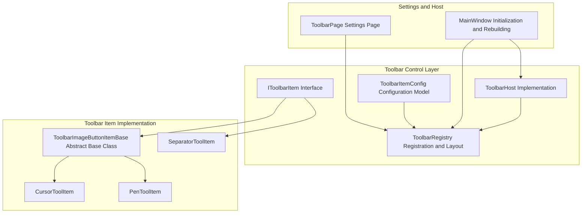
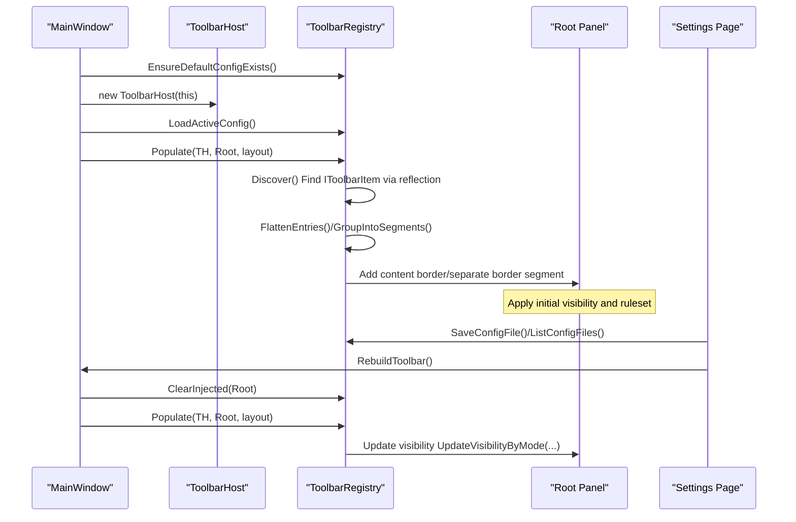
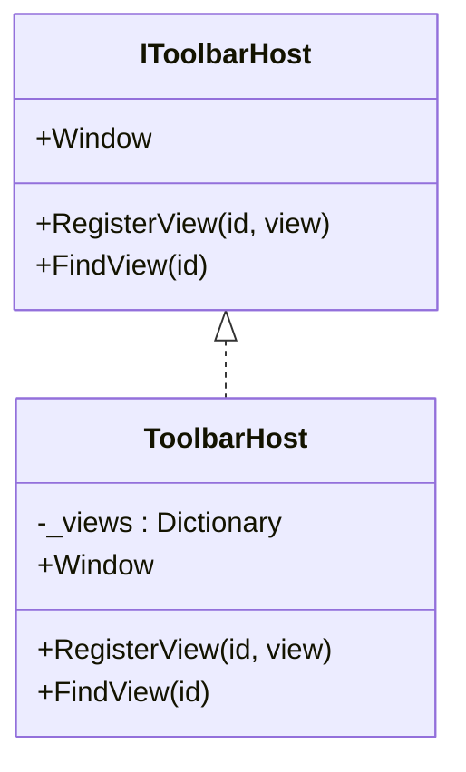
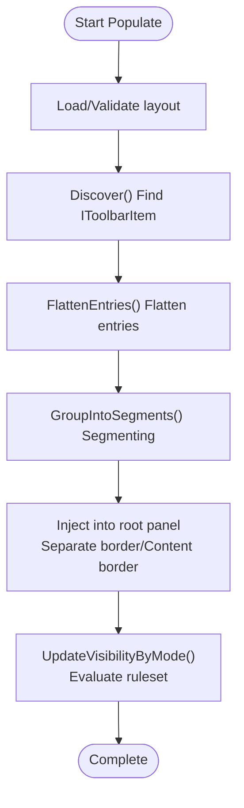
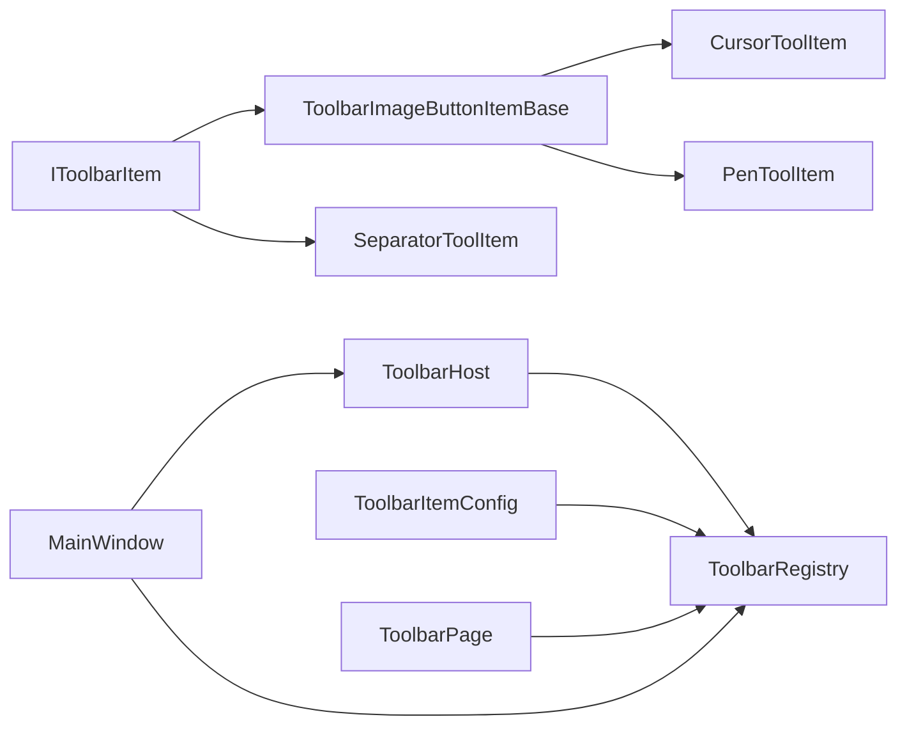

# Toolbar API

## Introduction
This document systematically outlines and explains the design and implementation of the Toolbar API, covering:
- Design specifications of the IToolbarItem interface: property definitions, event handling mechanisms, and state management methods.
- Toolbar building workflows, layout algorithms, and interaction logics of the ToolbarHost class.
- ToolbarRegistry's toolbar item registration mechanisms, configuration management, and dynamic loading.
- IToolbarHost interface service capabilities: adding, removing, and sorting toolbar items.
- Toolbar customization guides: how to create custom toolbar items, configure layouts, and handle user interactions.
- Toolbar configuration file formats, serialization mechanisms, and persistence strategies.
- Best practices for toolbar expansions and performance optimization suggestions.

## Project Structure
Toolbar-related code is primarily located in Ink Canvas/Controls/Toolbar and its subdirectories, cooperating with the settings pages and main window initialization workflows.

## Core Components
- IToolbarItem: The toolbar item contract, defining unique identifiers, display names, descriptions, default hiding rules, separate borders, whether to prevent hiding on drag click, and methods to build views.
- IToolbarHost: The bridge interface between the toolbar and the host (main window), providing access to the main window and view registration/retrieval capabilities.
- ToolbarHost: Implementation of IToolbarHost, holding main window references and maintaining a dictionary to register/find views.
- ToolbarRegistry: The core class for toolbar item registration, discovery, layout assembly, visibility evaluation, and configuration file read/writes.
- ToolbarItemConfig: Configuration models and serialization definitions for rulesets, rule groups, rules, component entries, and layout settings.
- ToolbarImageButtonItemBase: Abstract base class for image button-based toolbar items, unifying icons, labels, click events, and building flows.
- Concrete Toolbar Items: Such as CursorToolItem, PenToolItem, SeparatorToolItem, etc., embodying different features and interactions.
- ToolbarPage: The toolbar configuration page, responsible for CRUD operations on configuration files, layout editing, ruleset editing, and real-time rebuilding.
- MainWindow Initialization and Rebuilding: Responsible for loading default configurations, building toolbars, and updating visibility and highlight states.

## Architecture Overview
The runtime workflow of the Toolbar API is as follows:
- During main window initialization, a ToolbarHost is created and the active configuration is loaded. ToolbarRegistry.Populate is called to inject toolbar items into the root panel.
- ToolbarRegistry discovers all IToolbarItem implementations via reflection, constructing views and applying rulesets to determine initial visibilities.
- After users modify layouts, rulesets, or config files in settings, saving and rebuilding are triggered, and the main window calls RebuildToolbar to re-assemble.
- ToolbarRegistry dynamically evaluates rulesets and updates visibility based on context (annotation mode, PPT mode, user collapsed state).

## Detailed Component Analysis

### IToolbarItem Interface Design Specifications
- Property Definitions
  - Id: Unique identifier for the toolbar item, used to map to concrete implementations and configurations.
  - DisplayName/Description: Display names and descriptions, used for UI presentation and help guides.
  - DefaultHidingRuleset: Default hiding ruleset, which can be overridden by concrete items.
  - DefaultShowSeparateBorder/DefaultPreventHideOnDragClick: Default separate borders and whether to prevent hiding on drag clicks.
- View Building
  - BuildView(host): Receives IToolbarHost and returns a WPF FrameworkElement view; events and resources are usually bound here.
- Event Handling Mechanisms
  - Unifies binding ButtonMouseUp events via ToolbarImageButtonItemBase, dispatching to OnClick methods of subclasses.
  - Subclasses can attach additional host callbacks (such as hooking views to specific main window controls) in AfterBuild.
- State Management
  - Default rulesets can be combined via WithHideOnCollapsed/WithPreventHideOnCollapsed, affecting visibility evaluations.

### ToolbarHost and IToolbarHost Services
- Capabilities Provided by IToolbarHost
  - Window: Accesses main window instances, facilitating interactions between toolbar items and the main window.
  - RegisterView(id, view)/FindView(id): Registers and finds views, supporting cross-component lookups and linkings.
- ToolbarHost Implementation Key Points
  - Maintains mappings from IDs to views using dictionaries, avoiding null values and empty string keys.
  - Provides coarse-grained access for plugins (which will be narrowed in subsequent phases).

### ToolbarRegistry: Registration, Layout, and Visibility
- Registration and Discovery
  - Discover() scans assemblies via reflection for IToolbarItem implementations on the first call, instantiating and caching them.
- Configuration File System
  - Supports listing, loading, saving, and deleting configuration files; automatic backups and rollbacks; default configurations are generated on the first startup.
- Layout Assembly
  - Populate() receives layout settings, clears old injected elements, flattens entries into display items, and assembles them into content borders or separate borders by segments.
  - Segmenting Algorithm: Forms a separate segment upon encountering separate border tags; otherwise, groups continuous items into the same horizontal StackPanel.
- Visibility Evaluation
  - UpdateVisibilityByMode() recursively updates visibility by evaluating rulesets based on annotation modes, PPT modes, and user collapsed states.
  - Ruleset Evaluation: Supports And/Or, inversions, empty group handling, and state flags.

### IToolbarHost Service Capabilities (Add/Remove/Sort)
- Add: Drag IToolbarItem or add ToolbarComponentEntry directly in settings, write to layout and save configuration, then rebuild the toolbar.
- Remove: Remove ToolbarComponentEntry from AddedComponents or child items within groups, save and rebuild.
- Sort: Supports drag-sorting in AddedComponents and child items within groups, rebuilding after saving.
- Rulesets: Rulesets and rules can be configured for each entry to control show/hide logics.

### Toolbar Customization Guide
- Creating Custom Toolbar Items
  - Create a new class implementing IToolbarItem or inheriting from ToolbarImageButtonItemBase, setting Id, DisplayName, DefaultHidingRuleset, OnClick, and AfterBuild.
  - Examples: CursorToolItem, PenToolItem, SeparatorToolItem.
- Configuring Toolbar Layouts
  - Choose available items and drag them to "Added Components" in settings, configuring separate borders, rulesets, and component settings (width, height, font size, opacity, alignment, etc.).
- Handling User Interaction Events
  - Invoke corresponding methods on host.Window in OnClick, and hook views to main window controls in AfterBuild.

### Toolbar Configuration File Formats, Serialization, and Persistence
- File Locations and Naming
  - Configuration Directory: Configs/ToolbarConfigs under the application root path.
  - Filenames: Any valid filename (*.json), defaulting to "default".
- Data Models
  - ToolbarLayoutSettings: Contains the components list.
  - ToolbarComponentEntry: Contains id, instanceId, hidingRule, hidingRuleset, showSeparateBorder, preventHideOnDragClick, settings, children.
  - ToolbarRuleset/ToolbarRuleGroup/ToolbarRule: Supports And/Or, inversions, enabled states, and condition sets.
- Serialization and Deserialization
  - Uses Newtonsoft.Json for serialization and deserialization.
- Persistence Strategies
  - Copies the main file as a backup before saving, allowing rollbacks on exceptions.
  - Supports deletion and resetting to default layouts.

### Main Window Integration and Visibility Updates
- Initialization
  - EnsureDefaultConfigExists(), new ToolbarHost(this), LoadActiveConfig(), Populate(), UpdateToolbarComponentVisibility().
- Rebuild
  - ClearInjected() clears old injected elements, and Populate() is called again to refresh highlights and colors.
- Visibility
  - UpdateVisibilityByMode() evaluates rulesets based on annotation modes, PPT modes, and user collapsed states.

## Dependency Analysis
- Component Coupling
  - An inheritance relationship exists between IToolbarItem and ToolbarImageButtonItemBase, unifying button-based toolbar item building and event handling.
  - ToolbarRegistry depends on IToolbarItem discovery and assembly, and on ToolbarItemConfig for ruleset and layout parsing.
  - ToolbarPage, as the configuration entry, depends on ToolbarRegistry for file management and layout saving.
  - MainWindow, as the host, depends on ToolbarRegistry for assembly and visibility updates.
- External Dependencies
  - Newtonsoft.Json for configuration file serialization/deserialization.
  - WPF control systems for view building and layouts.

## Performance Considerations
- Reflection Discovery Cost
  - Discover() performs reflection scans and caches results on the first invocation, avoiding repetitive overhead.
- Ruleset Evaluation
  - Ruleset evaluation employs short-circuit logic (And/Or) to reduce unnecessary checks; empty groups and rules compute results directly.
- Visibility Updates
  - UpdateVisibilityByMode() recursively traverses injected elements. Keeping the number of injected elements reasonable and avoiding deep nesting is recommended.
- Configuration File I/O
  - Backs up before saving and rolls back on failure; saving once after batch modifications is recommended to reduce I/O frequencies.
- View Registration
  - ToolbarHost uses dictionaries to store views. Lookup complexity is O(1), but avoid duplicate registrations and empty keys.

## Troubleshooting Guide
- Toolbar Items Not Displayed
  - Check if DefaultHidingRuleset causes it to be hidden; adjust rulesets or disable rules in settings.
  - Verify if Populate() successfully injected elements; logs should contain "Populate complete".
- Configuration File Load Failed
  - Check logs for "config file does not exist/corrupted/backup restored"; verify file existence and JSON structure validity.
- Rulesets Ineffective
  - Verify ruleset Mode, IsReversed, and Groups/Rules; check if condition IDs align with context.
- View Misalignment After Rebuilding
  - Ensure modifications are saved in settings before rebuilding; check if ClearInjected() cleared old elements.

## Conclusion
The Toolbar API implements pluggable toolbar items, configurable layouts, and programmable visibility controls through clear interfaces and modular designs. Leveraging ToolbarRegistry's rulesets and configuration systems, users can flexibly customize toolbar appearances and behaviors. With ToolbarHost and ToolbarPage, developers can easily extend new toolbar items and integrate them into the main window. Following existing base classes and ruleset conventions when extending new toolbar items is recommended to ensure a consistent user experience and maintainability.

## Appendix
- Development Specification References: Floating toolbar development specifications and button type lists.
