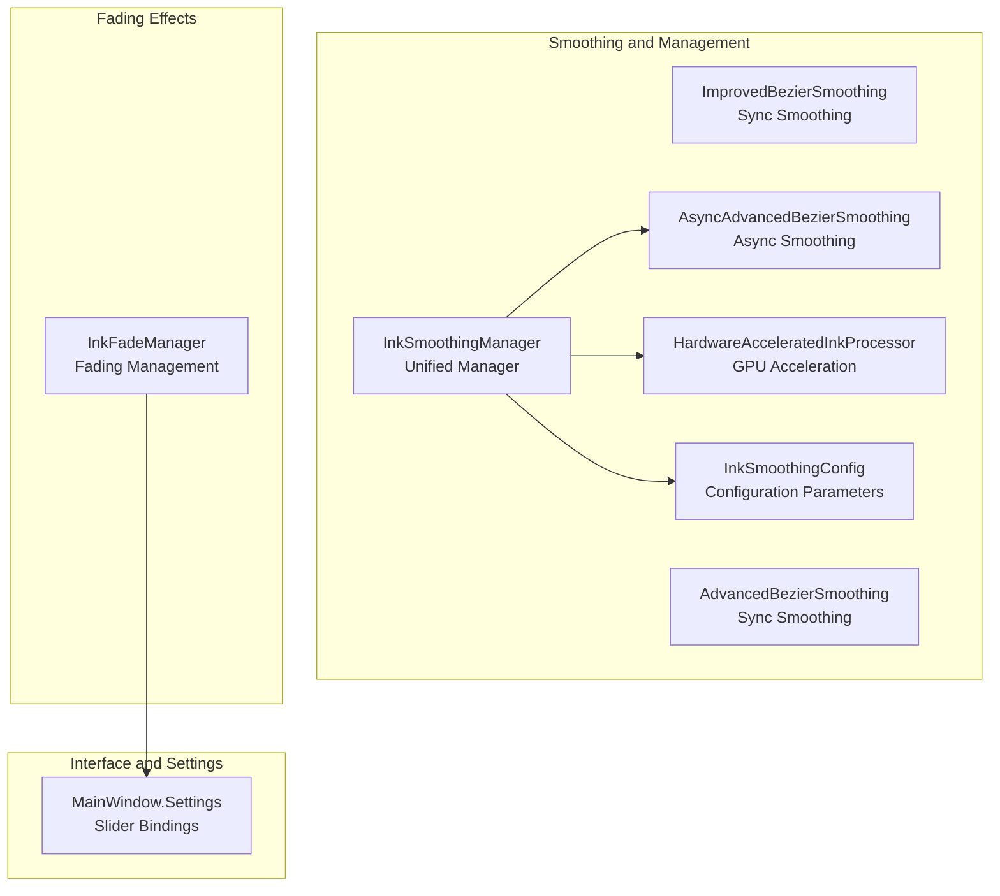
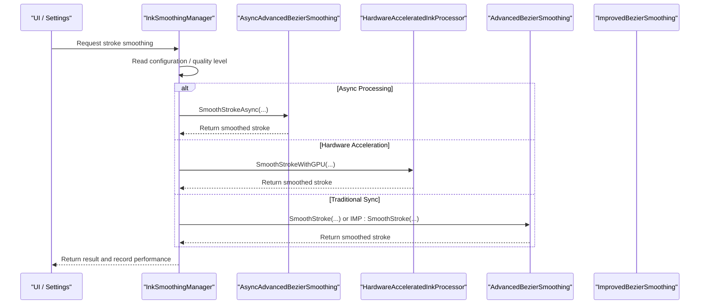
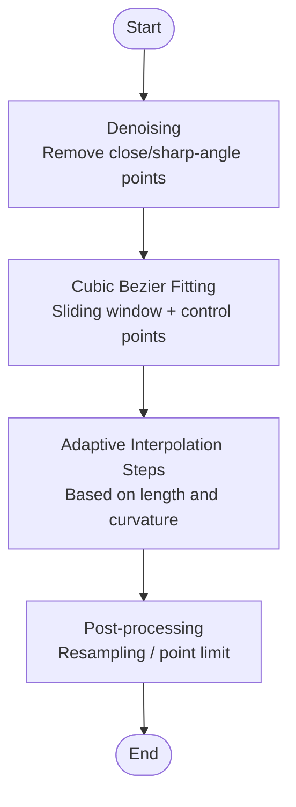
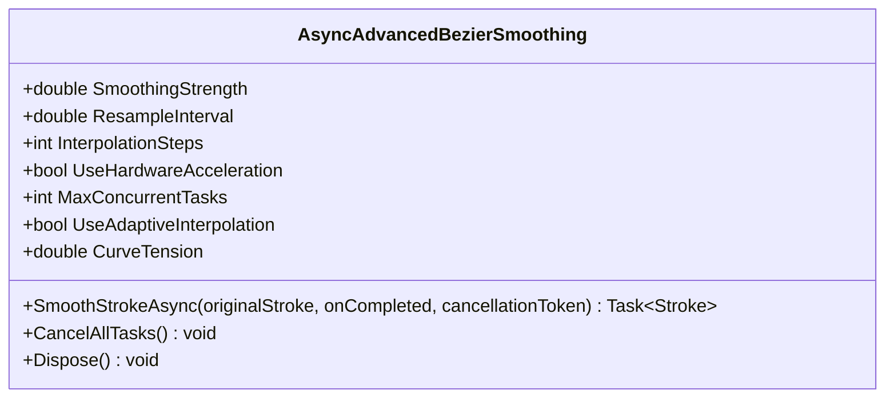
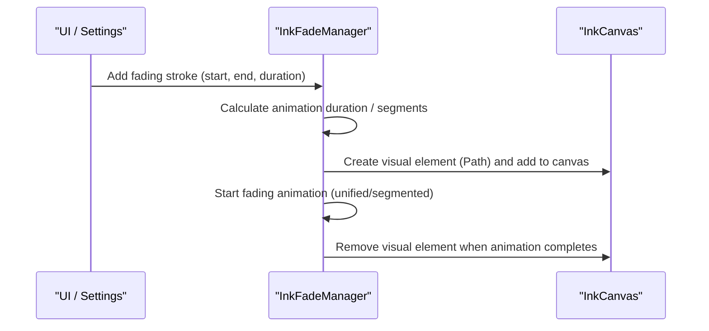
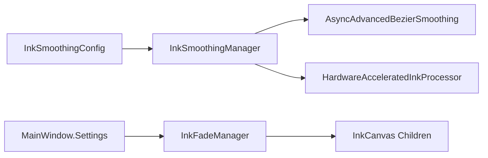

# Brush Effect Adjustment

## Introduction
This technical document focuses on the brush effect adjustment system of InkCanvasForClass. It systematically analyzes:
- Brush Smoothing Algorithm Implementation: Differences and performance characteristics between ImprovedBezierSmoothing and AdvancedBezierSmoothing.
- Brush Fading Mechanism: Workflow and visual control of InkFadeManager.
- Brush Configuration Parameter Management: Configurable options and tuning strategies of InkSmoothingConfig.
- Real-time Preview and Performance Optimization: GPU acceleration, memory management, and asynchronous processing.
- Customization and Extension: Dynamic adjustment of effect parameters and user interface interactions.

## Project Structure
Code related to brush effect adjustment is mainly located in the Helpers directory and MainWindow settings logic:
- Smoothing Algorithms and Management: ImprovedBezierSmoothing, AdvancedBezierSmoothing, InkSmoothingManager, HardwareAcceleratedInkProcessor, and InkSmoothingConfig.
- Fading Effects: InkFadeManager.
- User Interface and Settings: MainWindow settings page and slider bindings.

## Core Components
- ImprovedBezierSmoothing: Improved cubic Bezier curve smoothing for synchronous scenarios, including denoising, adaptive interpolation, resampling, and post-processing.
- AdvancedBezierSmoothing: Synchronous cubic Bezier curve smoothing, providing more conservative windowing and interpolation strategies.
- AsyncAdvancedBezierSmoothing: Asynchronous hardware-accelerated smoothing, supporting concurrent tasks, adaptive interpolation, vectorized exponential smoothing, and parallel Bezier fitting.
- HardwareAcceleratedInkProcessor: Path geometry smoothing and parallel Bezier interpolation based on WPF GPU.
- InkSmoothingManager: Unified scheduler that selects asynchronous, hardware-accelerated, or traditional synchronous paths based on configuration, and logs performance.
- InkSmoothingConfig: Smoothing configuration parameters and quality level mappings, supporting loading from and saving to settings.
- InkFadeManager: Ink stroke fading management, creating visual elements based on the start/end points of the stroke and executing segmented/unified animations.

## Architecture Overview
InkSmoothingManager determines the smoothing path, choosing based on InkSmoothingConfig quality and hardware capabilities:
- Asynchronous Mode: AsyncAdvancedBezierSmoothing
- Hardware Acceleration: HardwareAcceleratedInkProcessor
- Traditional Synchronous: AdvancedBezierSmoothing or ImprovedBezierSmoothing

Brush fading is driven by InkFadeManager based on slider parameters configured in MainWindow, achieving control over fading time and speed multiplier.

## Detailed Component Analysis

### ImprovedBezierSmoothing (Sync Smoothing)
- Pre-processing: Denoising (based on angle and distance thresholds between adjacent points).
- Curve Fitting: Cubic Bezier sliding window, with adaptive interpolation steps and curvature.
- Post-processing: Resampling and point count limit controls.
- Pressure Interpolation: Interpolates pressure sensitivity along the curve to ensure visual consistency.

### AdvancedBezierSmoothing (Sync Smoothing)
- Provides traditional cubic Bezier smoothing, with window size and step size adjusted dynamically based on the number of points.
- Point inflation threshold protection: Falls back to the original stroke if the point count exceeds a certain multiplier.
- Suitable for low-overhead, high-stability scenarios.

### AsyncAdvancedBezierSmoothing (Async Hardware-Accelerated Smoothing)
- Asynchronous Processing: Semaphore controls concurrency, cancellation token supports cancellation.
- Parameters: Smoothing strength, resampling interval, interpolation steps, curve tension, adaptive interpolation, hardware acceleration switch.
- Optimizations: Vectorized exponential smoothing, parallel Bezier fitting, relaxed point limits, and resampling strategies.
- Cancellation and Disposal: Supports canceling all tasks and releasing resources.

### HardwareAcceleratedInkProcessor (GPU Acceleration)
- Uses PathGeometry and RenderTargetBitmap for GPU-accelerated curve fitting.
- Parallel Bezier interpolation, optimizing cubic Bezier calculations.
- Pressure interpolation maintains the pressure sensitivity characteristics of the original stroke.

### InkSmoothingManager (Unified Manager)
- Selects asynchronous, hardware-accelerated, or traditional paths based on configuration.
- Performance Monitoring: Logs processing time and provides statistics.
- Recommended Configuration: Recommends quality levels and concurrency automatically based on CPU cores and hardware capabilities.

### InkSmoothingConfig (Configuration Parameters)
- Basic Smoothing Parameters: Strength, resampling interval, interpolation steps.
- Bezier Parameters: Adaptive interpolation, curve tension, curvature threshold.
- Performance Parameters: Hardware acceleration, async processing, concurrent task count, point count limit.
- Quality Levels: Performance-first, Balanced, Quality-first, mapped to specific parameters.
- Save/Load Settings: Loads from and saves to MainWindow.Settings.Canvas.

### InkFadeManager (Brush Fading)
- Add Fading: Records start/end points, creates visual elements (Path), and adds them to the canvas.
- Fading Animation: Highlighter uses unified fading + slight scaling, and standard pens use segmented fading.
- Segmentation Strategy: Calculates segments based on length and point density, using an Apple-style delay curve.
- Control Parameters: Fading time, speed multiplier, animation duration, supporting run-time updates.

## Dependency Analysis
- InkSmoothingManager depends on InkSmoothingConfig, AsyncAdvancedBezierSmoothing, and HardwareAcceleratedInkProcessor.
- AsyncAdvancedBezierSmoothing depends on the parameters in InkSmoothingConfig.
- InkFadeManager depends on MainWindow settings (sliders) and manipulates children of InkCanvas.
- The UI layer interacts with InkFadeManager and InkSmoothingManager through MainWindow.Settings.

## Performance Considerations
- Asynchronous and Concurrent: AsyncAdvancedBezierSmoothing uses semaphores to limit concurrency, avoiding CPU overload.
- Hardware Acceleration: HardwareAcceleratedInkProcessor utilizes WPF GPU rendering capabilities to improve curve fitting efficiency.
- Adaptive Interpolation: Dynamically adjusts interpolation steps based on curve length and curvature, balancing quality and performance.
- Resampling and Point Count Limit: Controls memory and rendering costs by preventing point explosion.
- Performance Monitoring: InkSmoothingManager logs processing time to facilitate tuning and diagnostics.

## Troubleshooting Guide
- Smoothing Fallback: Falls back to the original stroke when asynchronous/hardware-accelerated processes fail or are canceled.
- Fading Exceptions: Catches exceptions and cleans up visual elements to avoid residues.
- Configuration Validation: InkSmoothingConfig.Validate provides parameter range checks.
- Performance Statistics: Inspect average/maximum processing times and sample counts via InkSmoothingManager.GetPerformanceStats.

## Conclusion
This brush effect adjustment system coordinates a unified manager with multiple smoothing strategies, integrating hardware acceleration and asynchronous processing to balance visual quality with performance and stability. InkFadeManager provides a natural fading experience for strokes, with real-time adjustments via UI sliders. The quality levels and parameter mappings in InkSmoothingConfig ensure that users on various hardware setups receive a suitable experience.

## Appendix
- UI Interaction Key Points
  - Laser pen fading time: Slider value multiplied by 1000 milliseconds is written to Settings.Canvas.InkFadeTime, and InkFadeManager.UpdateFadeTime takes effect in real time.
  - Fading speed multiplier: Slider value is written to Settings.Canvas.InkFadeSpeedMultiplier, and InkFadeManager.UpdateFadeSpeedMultiplier takes effect in real time.
  - Smoothing quality and hardware: InkSmoothingManager.GetRecommendedConfig and ApplyRecommendedSettings recommend settings automatically based on system capabilities.
