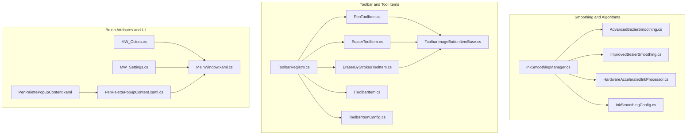
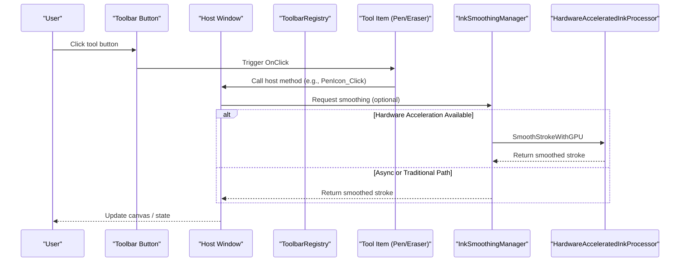
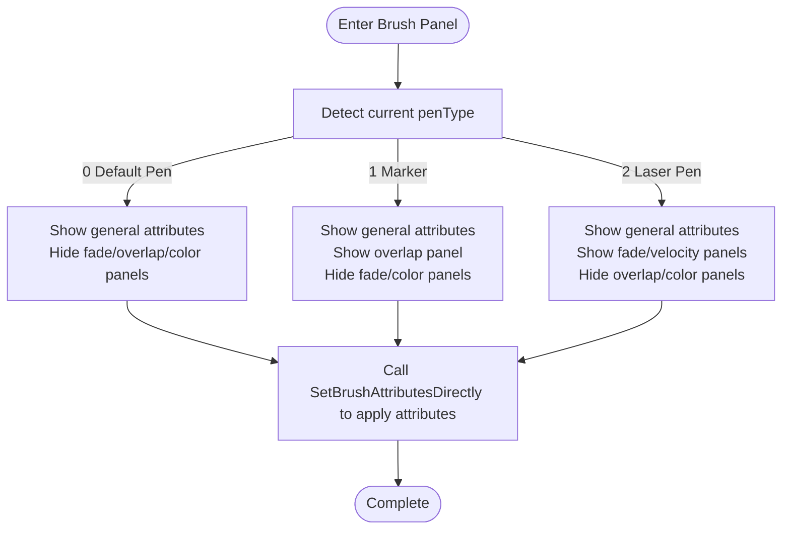
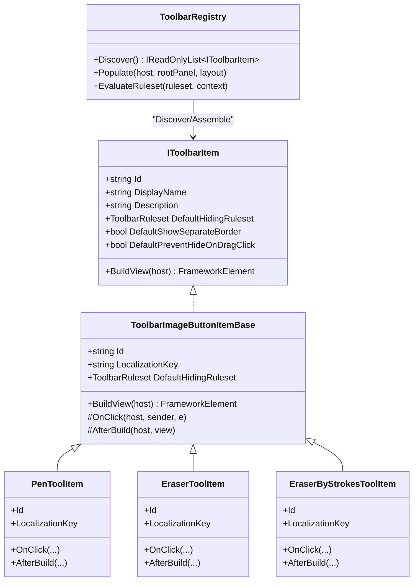
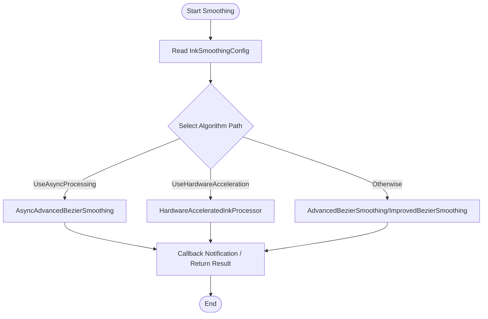
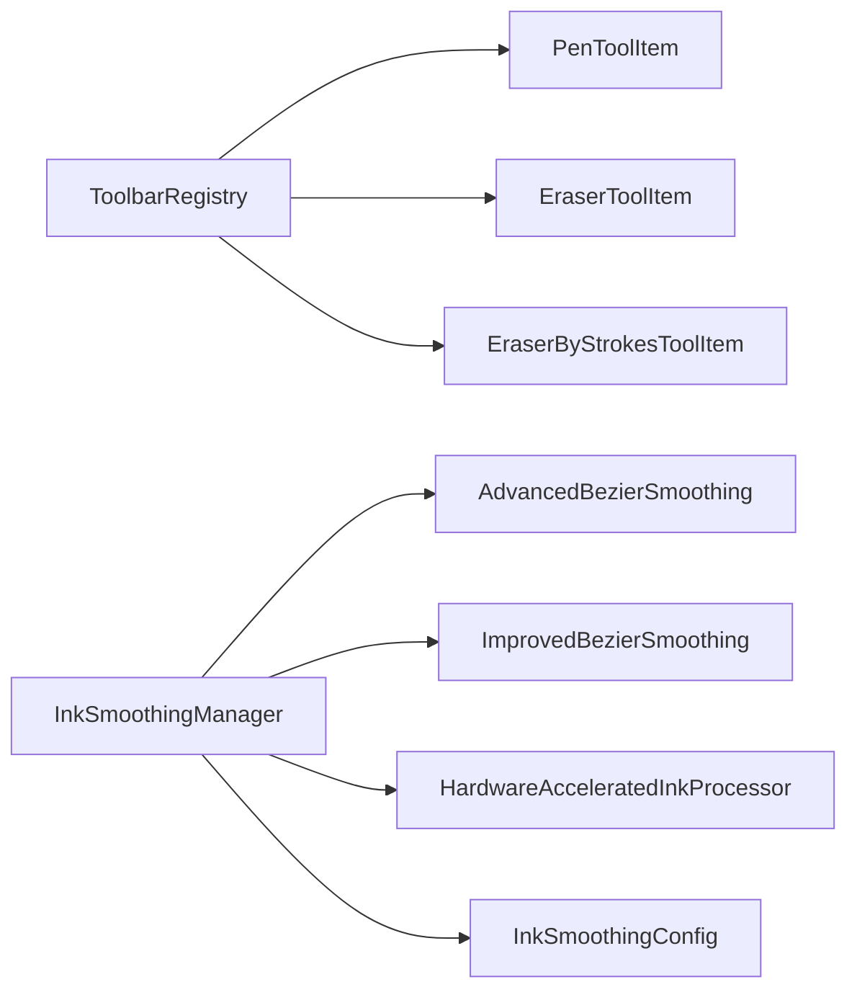

# Brush Type Management

## Introduction
This document is oriented towards the brush type management system of InkCanvasForClass. It systematically outlines:
- Brush Type Classification and Characteristics: Implementation differences and applicable scenarios for default pens, markers (highlighters), laser pens, etc.
- Tool Item Registration and Management Mechanism: Implementation principles and lifecycle of tool items such as PenToolItem and EraserToolItem.
- Brush Shape and Style Configuration: Configurable options for tip shape, edge effects, and texture applications.
- Smoothing Algorithm Implementation: Work principles, configuration parameters, and performance strategies of InkSmoothingManager.
- UI Interaction Design: Toolbar button state management and user action feedback.

## Project Structure
The key directories and files centered around "Brush Type Management" are distributed as follows:
- Smoothing and Algorithms: InkSmoothingManager, InkSmoothingConfig, AdvancedBezierSmoothing, ImprovedBezierSmoothing, and HardwareAcceleratedInkProcessor under the Helpers directory.
- Toolbar and Tool Items: PenToolItem, EraserToolItem, EraserByStrokesToolItem, ToolbarImageButtonItemBase, ToolbarRegistry, IToolbarItem, and ToolbarItemConfig under Controls/Toolbar/Items.
- Brush Attributes and UI: MW_Colors, MW_Settings, and MainWindow.xaml.cs under MainWindow_cs; PenPalettePopupContent.xaml and .cs under Controls/Popups.

## Core Components
- Smoothing Manager InkSmoothingManager: Uniformly schedules asynchronous smoothing, hardware acceleration, and traditional algorithms, providing configuration updates, performance monitoring, and task cancellation.
- Smoothing Config InkSmoothingConfig: Defines parameters such as smoothing strength, resampling interval, interpolation steps, adaptive interpolation, curve tension, concurrent task count, and quality level.
- Smoothing Algorithm Implementations:
  - AsyncAdvancedBezierSmoothing: Asynchronous advanced cubic Bezier smoothing, supporting concurrency and hardware-accelerated paths.
  - ImprovedBezierSmoothing: Improved cubic Bezier smoothing, including denoising, adaptive interpolation, and resampling.
  - HardwareAcceleratedInkProcessor: Path geometry smoothing and parallel Bezier interpolation based on WPF GPU.
- Tool Items and Registration:
  - PenToolItem, EraserToolItem, EraserByStrokesToolItem: Built-in tool items, bound to host window events.
  - ToolbarImageButtonItemBase: Base class for tool items, responsible for building UI buttons and binding events.
  - ToolbarRegistry: Discovers, assembles, and lays out tool items, supporting ruleset evaluation and visibility control.
  - IToolbarItem: Interface contract for tool items.
  - ToolbarItemConfig: Ruleset configuration for tool items (AlwaysShow, AnnotationOnly, PptOnly, PptAnnotationOnly).

## Architecture Overview
The diagram below shows the high-level interactions of brush type management: Tool items are registered and laid out via ToolbarRegistry, and click events are delegated to the host window; smoothing is coordinated by InkSmoothingManager, which selects the algorithm path based on configuration.

## Detailed Component Analysis

### Brush Type and Style Configuration
- Types and Switching
  - Default Pen: penType=0, elliptical tip, not a highlighter, ink fading disabled.
  - Marker (Highlighter): penType=1, rectangular tip, configurable overlap switch, width and height applied according to settings.
  - Laser Pen: penType=2, elliptical tip, ink fading enabled, suitable for high-contrast presentations.
- Colors and Attributes
  - Directly apply colors, width, and height to the current drawing attributes and default attributes via SetBrushAttributesDirectly.
  - Persist InkWidth/HighlighterWidth/LaserPenWidth and Alpha separately for different brush types.
- UI Panel and Visibility
  - PenPalettePopupContent dynamically shows/hides panels (General Attributes, Fade, Overlap, Color Panel) based on the current penType.
  - Color button events map to corresponding handlers in MW_Colors, updating penType and refreshing the UI state.

### Tool Item Registration and Management Mechanism
- Tool Item Interface and Base Class
  - IToolbarItem: Defines Id, DisplayName, Description, default hiding rules, and view construction.
  - ToolbarImageButtonItemBase: Implements common button construction, icon/label resource binding, and click event forwarding.
- Built-in Tool Items
  - PenToolItem: Bound to host window's PenIcon_Click and AttachPenIconView.
  - EraserToolItem: Bound to EraserIcon_Click and AttachEraserIcon.
  - EraserByStrokesToolItem: Bound to EraserIconByStrokes_Click and AttachEraserByStrokesIcon.
- Registration and Layout
  - ToolbarRegistry.Discover: Scans for IToolbarItem implementations via reflection and instantiates them.
  - ToolbarRegistry.Populate: Assembles tool items according to layout configurations, applying rulesets and visibility.
  - ToolbarItemConfig: Provides ruleset factory methods such as AlwaysShow, AnnotationOnly, PptOnly, and PptAnnotationOnly.

### Smoothing Algorithm Implementation and Configuration
- InkSmoothingManager
  - Unified Entry: SmoothStrokeAsync/SmoothStroke, selecting asynchronous, hardware-accelerated, or traditional paths based on configuration.
  - Performance Monitoring: Records processing elapsed time, providing statistics strings.
  - Recommended Configuration: Automatically recommends quality level and concurrency based on CPU core count and hardware acceleration capability.
  - Resource Management: CancelAllTasks, Dispose.
- InkSmoothingConfig
  - Parameters: Smoothing strength, resampling interval, interpolation steps, adaptive interpolation, curve tension, concurrent task count, quality level.
  - Quality Mapping: Performance/Balanced/Quality correspond to different parameter combinations.
  - Validation and Summary: Validate, GetSummary.
- Algorithm Implementations
  - AsyncAdvancedBezierSmoothing: Asynchronous advanced cubic Bezier, supporting concurrency semaphores, cancellation tokens, adaptive interpolation, and resampling.
  - ImprovedBezierSmoothing: Improved cubic Bezier, including denoising, outlier removal, adaptive interpolation, and resampling.
  - HardwareAcceleratedInkProcessor: GPU-accelerated path smoothing and parallel Bezier interpolation based on PathGeometry.

### UI Interaction Design and State Management
- Toolbar Button States
  - ToolbarRegistry.EvaluateRuleset evaluates rulesets based on context (annotation mode, PPT mode, whether collapsed) to determine show/hide.
  - ToolbarItemConfig provides common ruleset factory methods, making it easy for tool items to declare default hiding strategies.
- User Action Feedback
  - PenPalettePopupContent dynamically switches panels based on penType, providing instant visual feedback.
  - Color button events in MW_Colors update penType and refresh the UI state, ensuring a clear response to user actions.

## Dependency Analysis
- Component Coupling
  - Tool items depend on ToolbarImageButtonItemBase and the IToolbarItem interface, assembled uniformly via ToolbarRegistry.
  - The smoothing manager depends on various algorithm implementations and configurations, forming a "Strategy + Configuration" pattern.
- External Dependencies
  - WPF Ink and Rendering (RenderTargetBitmap, PathGeometry) are used for hardware-accelerated paths.
  - Dispatcher and concurrency primitives (SemaphoreSlim, CancellationTokenSource) are used for asynchronous and thread-safe operations.

## Performance Considerations
- Hardware Acceleration First: Prefer GPU paths when RenderCapability.Tier meets the requirements.
- Asynchronous and Concurrent: AsyncAdvancedBezierSmoothing uses semaphores to limit concurrency, avoiding excessive CPU/GPU utilization.
- Adaptive Interpolation: Dynamically adjusts interpolation steps based on curve length and curvature to balance quality and performance.
- Resampling Strategy: Resamples when the number of points is too large, preventing performance degradation caused by output bloat.
- Recommended Configuration: Automatically selects quality levels and concurrency based on CPU cores and hardware capabilities.

## Troubleshooting Guide
- Smoothing Fails or Times Out
  - Check exceptions and log output of InkSmoothingManager to confirm if it falls back to the original stroke due to cancellation or exceptions.
  - Adjust the concurrency and quality levels in InkSmoothingConfig to avoid insufficient system resources.
- Hardware Acceleration Unavailable
  - Detect via IsHardwareAccelerationSupported and fall back to asynchronous or traditional paths.
- Tool Item Not Displaying
  - Check the context (annotation mode / PPT mode / collapsed state) of ToolbarRegistry.EvaluateRuleset to confirm ruleset matches.
- Abnormal Brush Style
  - Verify the penType switching logic in MW_Colors and the application order of SetBrushAttributesDirectly in MainWindow.xaml.cs.

## Conclusion
This system achieves unified management and efficient rendering of multiple brush types through an architecture of "tool item registration + smoothing algorithm strategy + configuration driven". Tool items use declarative rules to control visibility, the smoothing module adaptively selects the optimal path based on configuration and hardware capabilities, and visual panels provide intuitive state feedback. This design balances usability, performance, and extensibility.

## Appendix
- Key Processes Reference
