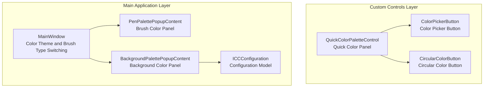
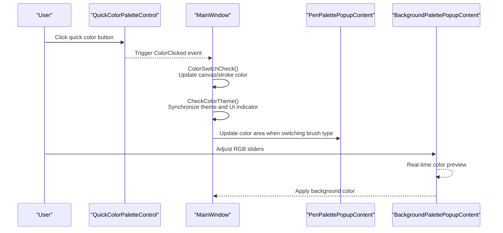
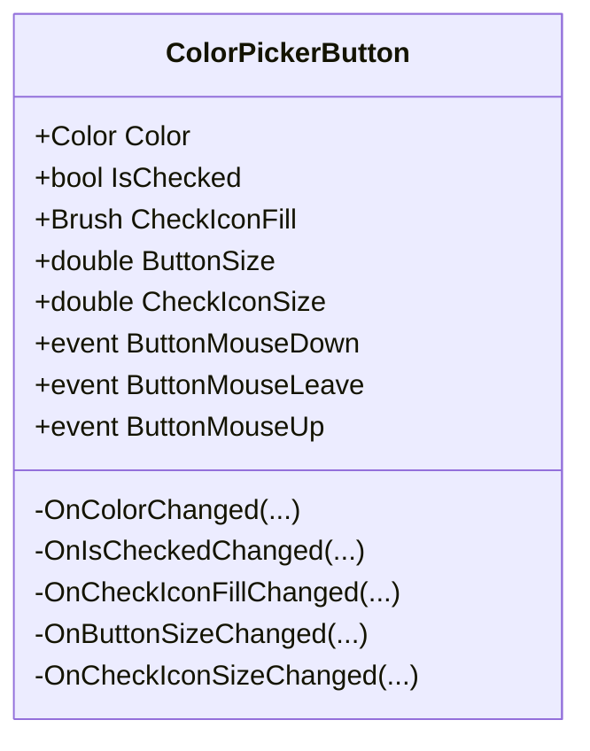
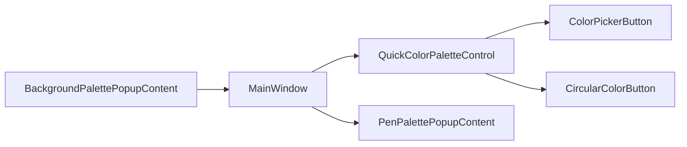

# Color Picker

## Introduction
This file systematically documents the color picker functionality of InkCanvasForClass, focusing on the following aspects:
- UI Component Structure of Color Picker: Responsibilities, properties, and interactions of controls like ColorPickerButton, CircularColorButton, and QuickColorPaletteControl.
- Quick Color Palette and Color History/Recently Used Colors Management: Layout and checked state synchronization of the quick color panel.
- Custom Color Input and Preview: RGB inputs and real-time previews in the background palette.
- Coordination of Color Themes and Brush Types: Color application and theme switching across three types of brushes: Pen, Highlighter, and Laser Pen.
- ICC Configuration and Color Space: ICC configuration model at the resource layer and its scope of influence on interface elements.

## Project Structure
Core files related to the color picker are distributed across two sub-projects:
- InkCanvas.Controls: Custom controls layer containing ColorPickerButton, CircularColorButton, QuickColorPaletteControl, etc.
- Ink Canvas: Main application layer containing color themes, brush type switching logic, popup panel integration, etc.

## Core Components
- ColorPickerButton: Square color button used in the quick color panel, supporting color fills, check icons, sizes, and check icon size controls.
- CircularColorButton: Used for richer color displays (such as background colors), supporting circular clipping, checkerboard transparency patterns, opacity overlays, and checked states.
- QuickColorPaletteControl: Container for the quick color panel, supporting both two-row and single-row display modes, and providing color click events and "recently used" status synchronization.
- PenPalettePopupContent: Brush color palette panel, hosting color selection areas for the three types of brushes: Pen, Highlighter, and Laser Pen.
- BackgroundPalettePopupContent: Background color palette panel, providing RGB sliders and real-time preview.
- ICCConfiguration: Appearance and behavior configuration model for interface elements (such as floating bars, corner radii, snapping regions, etc.), providing unified style constraints for the color UI.

## Architecture Overview
The position and interaction flow of the color picker in the application are shown below:

## Detailed Component Analysis

### ColorPickerButton Component
- Functional Role: Square color button in the quick color panel, supporting checked status icon, color fill, size, and check icon size control.
- Key Dependency Properties:
  - Color: Color fill
  - IsChecked: Checked status
  - CheckIconFill: Check icon fill color
  - ButtonSize, CheckIconSize: Sizes of the button and check icon
- Events:
  - ButtonMouseDown, ButtonMouseLeave, ButtonMouseUp: Mouse interaction events
- Design Considerations:
  - Driven by dependency properties to update UI, avoiding direct operations on the visual tree.
  - Check icon visibility and fill color are automatically synchronized when properties change.

## Dependency Analysis
- QuickColorPaletteControl depends on ColorPickerButton and CircularColorButton for color display and interaction.
- MainWindow acts as the color hub, responsible for:
  - Color switching checks and drawing attribute history submission
  - Theme and brush type coordination, synchronizing UI indicators
  - Applying colors to DefaultDrawingAttributes of InkCanvas
- BackgroundPalettePopupContent and PenPalettePopupContent interact with the main window through events and methods.

## Performance Considerations
- UI updates driven by dependency properties avoid frequent operations on the visual tree; it is recommended to maintain this pattern for high-frequency color switching scenarios.
- The circular clipping and checkerboard transparency rendering of CircularColorButton use high-quality bitmap scaling; pay attention to GPU overhead during high-frequency preview scenarios.
- The two-row/single-row layout switching of the quick color panel is achieved by toggling Panel visibility, avoiding control tree reconstruction and maintaining low performance overhead.

## Troubleshooting Guide
- Color Not Taking Effect:
  - Check if ColorSwitchCheck() is called, and verify the current mode and brush settings.
  - Confirm that inkCanvas.DefaultDrawingAttributes.Color has been updated.
- Quick Color Panel Not Displaying:
  - Check the DisplayMode property and the timing of ApplyDisplayMode().
  - Verify that the panel container visibility is set to Visible.
- Checked State Out of Sync:
  - Use SetCheckedByColor() with a reasonable tolerance to avoid color matching failures.
  - Call ClearAllChecked() to clear the old state before setting the new checked status.
- Background Color Preview Issues:
  - Verify that RGB slider values match text block bindings.
  - Check if the apply button event triggers the background color settings correctly.

## Conclusion
This color picker system relies on custom controls combined with the quick color panel, background color panel, and main window color coordination logic to implement a complete cycle from quick selection to custom input. Decoupling between UI and business logic is well-maintained via dependency properties and event-driven patterns. Coordination between brush types and themes ensures color consistency across different scenes. It is recommended to introduce ICC profile loading and color space calibration services in the resource layer in the future to further enhance color accuracy and cross-device consistency.

## Appendix
- Color Space Conversion and ICC Calibration Suggestions:
  - Add an ICCProfileLoader service responsible for loading ICC configuration files and establishing color space mappings.
  - Convert RGB values to the target device's color space before applying colors to drawing attributes.
  - Provide color accuracy validation and fallback strategies to ensure usable colors are still provided when no ICC file is available.
