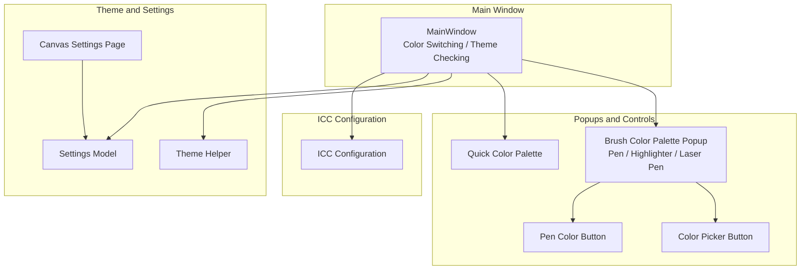
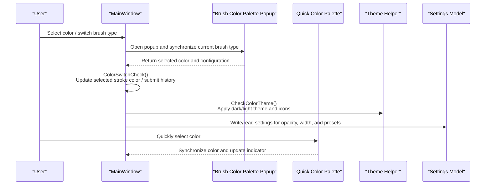
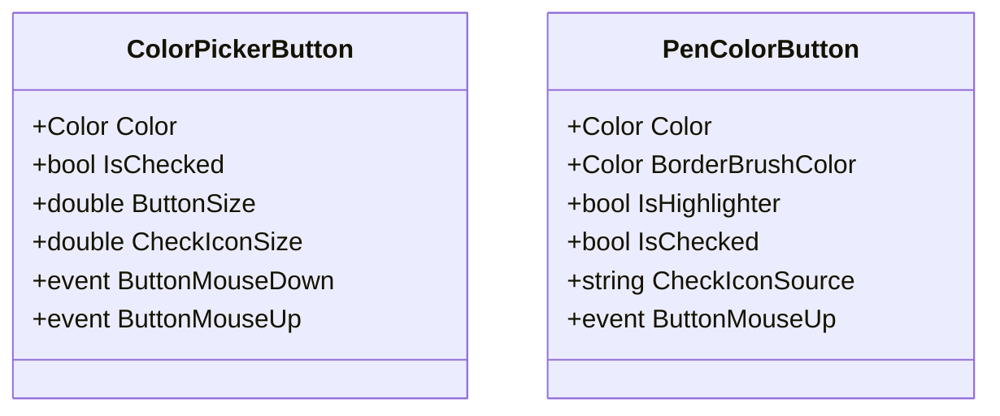
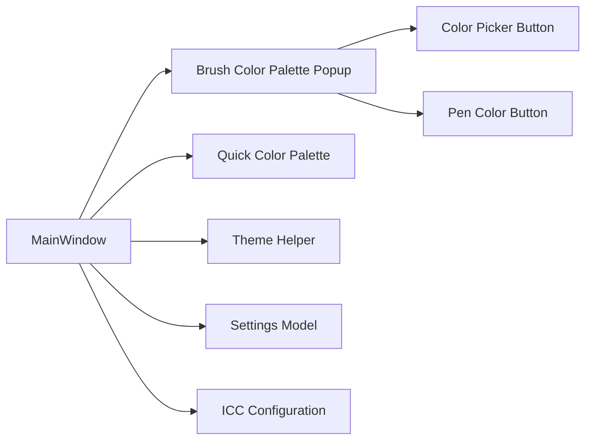

# Color Brush Management System

## Introduction
This document is oriented towards the "Color Brush Management System" of InkCanvasForClass. It systematically outlines the color picker, brush types and configurations, size/opacity/effect adjustment, theme system, brush presets and import/export, as well as color space and ICC color management best practices. Through code-level analysis and visual diagrams, this document helps developers and users quickly understand and efficiently utilize the system.

## Project Structure
The key modules centered around color and brush management are distributed as follows:
- Main Window and Color Theme Control: Color switching and theme checking logic of MainWindow
- Brush Color Palette Popup: Unified entry for multiple brush types (Pen/Highlighter/Laser Pen)
- Quick Color Palette: Convenient color selection and synchronization
- Custom Color Button: Generic controls for color picker and brush color buttons
- Theme Helper: Theme detection and application for system/user preferences
- Settings and Presets: Canvas settings, brush auto-recovery, preset import and export
- ICC Configuration: Visual and interactive configuration of floating bars and UI elements

## Core Components
- Color Switching and Theme Checking: Responsible for color changes, transparent background handling, selected stroke color synchronization, history submission, tool mode switching, theme switching, and UI synchronization.
- Brush Types and Configurations: Attribute differences and UI display controls for three types of brushes: Pen, Highlighter, and Laser Pen.
- Color Picker and Buttons: Generic color picker and brush color button controls, supporting checked states and highlight brush opacity.
- Quick Color Palette: Color similarity matching and checked state synchronization.
- Theme System: System theme detection and application, dark/light theme switching, and icon/text synchronization.
- Settings and Presets: Canvas settings, brush auto-recovery, preset import and export.
- ICC Configuration: Visual and interactive configurations such as corner radius, snapping, and translucency of floating bars and interface elements.

## Architecture Overview
Color brush management is composed of "Main Window Coordination + Popup Configuration + Control Rendering + Theme and Settings Support". The main window is responsible for the global state of colors and themes, popups provide configuration entries for multiple brush types, controls handle color selection and presentation, and themes and settings provide systematic configuration and persistence.

## Detailed Component Analysis

### Color Picker and Button Controls
- Color Picker Button (ColorPickerButton): Supports dependency properties such as Color, checked state (IsChecked), button size, and check icon size, driven by mouse event interactions.
- Brush Color Button (PenColorButton): Supports Color, border brush color (BorderBrushColor), whether it is a highlighter (IsHighlighter), checked state (IsChecked), and check icon source (CheckIconSource), used in popups and the quick color palette.

## Dependency Analysis
- The main window depends on popups and controls for color and configuration interactions.
- The theme helper provides system theme detection capability for color theme checks.
- The settings model spans across popups, pages, and the main window, acting as the data source and persistence medium.
- ICC Configuration provides unified visual and interactive specifications for interface elements.

## Performance Considerations
- Color switching and theme checking involve updates to a large number of UI elements; repetitive calculations in high-frequency events should be avoided.
- Color matching in the quick color palette uses simple tolerance comparisons; it is recommended to reduce unnecessary UI updates during bulk matching.
- The lifecycle of the brush auto-recovery timer needs to be managed carefully to prevent memory leaks and redundant starts.

## Troubleshooting Guide
- Color Theme Not Taking Effect: Check if the Theme Helper is correctly applied and verify registry read permissions for the system theme.
- Color History Not Submitted: Verify if drawing attribute history exists, and check the submission process and exception handling.
- Presets Not Restored: Check the brush auto-recovery switch and timer status, and verify if the settings model write was successful.

## Conclusion
The color brush management system achieves differentiated configuration and unified management of the Pen, Highlighter, and Laser Pen through the collaboration of main window coordination, popup configurations, control rendering, and theme settings. Combined with ICC configuration and color management recommendations, it maintains a consistent visual experience across different devices and themes. The presets and auto-recovery mechanisms further enhance usability and efficiency.

## Appendix
- Key Settings Reference: Laser pen width/opacity, brush auto-recovery delay and count, auto-recovery color, width/opacity.
- Best Practices: Uniformly use Color objects, set tolerances reasonably, and combine with ICC calibration when necessary.
