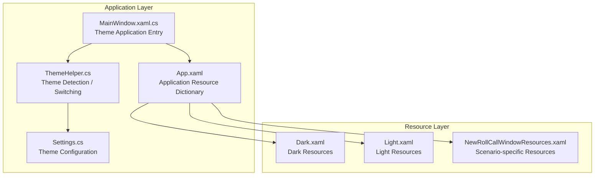
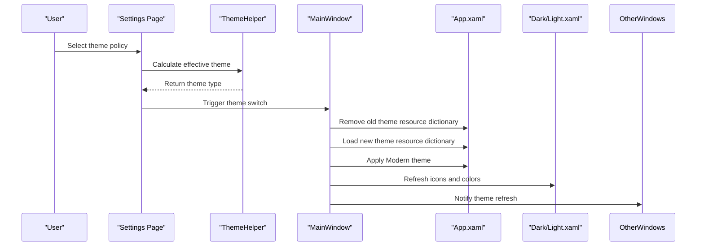
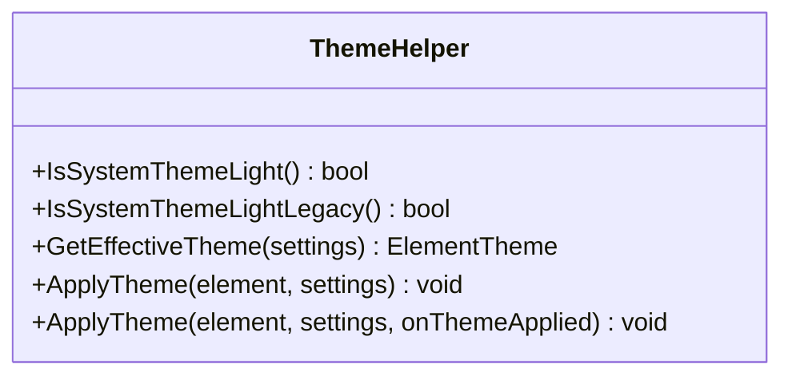
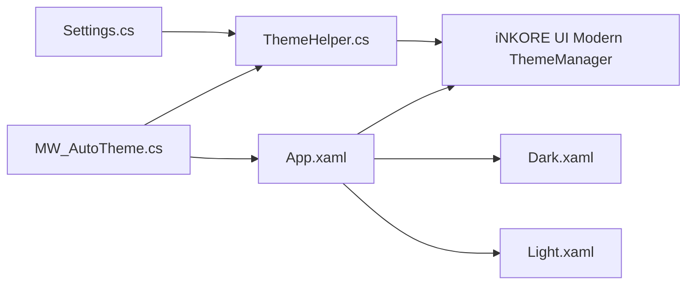

# Theme Color System

## Introduction
This document systematically outlines the theme color system of InkCanvasForClass, covering dark and light theme implementation mechanisms, style resource organization, theme switching logic, theme management capabilities of ThemeHelper, color variable systems, resource dictionary merging and priorities, and guidelines for custom theme development and compatibility assurance. The goal is to help developers quickly understand and extend the theme system, ensuring consistency and maintainability across windows and controls.

## Project Structure
The theme system is mainly distributed across the following locations:
- Application-level Resources and Theme Entry: App.xaml
- Theme Resource Dictionaries: Dark.xaml, Light.xaml
- Theme Manager: ThemeHelper.cs
- Automatic Theme Switching and Resource Loading: MW_AutoTheme.cs
- Settings and Theme Configuration: Settings.cs
- Theme Application Examples in Other Windows: MainWindow.xaml.cs, MainWindowSettingsHelper.cs
- Scenario-specific Theme Resources: NewRollCallWindowResources.xaml

## Core Components
- ThemeHelper: Provides system theme detection, effective theme calculation, theme application, and callback notifications.
- Resource Dictionaries (Dark/Light): Centralize resource keys for colors, brushes, and icons of controls and windows.
- App.xaml: Merges application-level resource dictionaries, importing iNKORE UI Modern theme resources and icon resource dictionaries.
- MW_AutoTheme: Responsible for removing old theme resources, loading new theme resources, applying Modern themes, refreshing icons and highlight colors, and notifying other windows to refresh their themes.
- Settings: The theme configuration item (Appearance.Theme) determines the theme policy chosen by the user.

## Architecture Overview
The theme system uses a three-tier architecture of "Configuration Driven + Resource Dictionary + Modern Theme Management":
- Configuration Layer: Settings.Appearance.Theme determines the theme policy (Light/Dark/Follow System).
- Resource Layer: Dark/Light resource dictionaries are merged into the application resource dictionary as needed, providing color and icon resources.
- Management Layer: ThemeHelper and MW_AutoTheme collaborate to handle theme detection, switching, and resource refreshing.

## Detailed Component Analysis

### ThemeHelper Theme Manager
- Functional Responsibilities
  - System Theme Detection: Reads the registry to determine system light/dark preference, compatible with both old and new registry keys.
  - Effective Theme Calculation: Returns light, dark, or follow system based on Settings.Appearance.Theme.
  - Theme Application: Calls ThemeManager.SetRequestedTheme of iNKORE UI Modern to apply the theme to specified elements.
  - Callback Notification: Optional callback returns the current theme string, facilitating logging or UI coordination.

- Key Behaviors
  - Registry Access: Reads theme preferences through the Themes\Personalize key under CurrentUser.
  - Exception Handling: Catches exceptions and logs them to avoid affecting the main thread.
  - Integration with Modern Themes: Uniformly uses ElementTheme.Light/Dark and SetRequestedTheme.

## Dependency Analysis
- ThemeHelper depends on Settings and iNKORE UI Modern ThemeManager.
- MW_AutoTheme depends on the resource dictionary merging mechanism of App.xaml and ThemeHelper.
- App.xaml depends on Modern theme resources and icon resource dictionaries.
- Each window refreshes its theme through the notification mechanism of ThemeHelper or MW_AutoTheme.

## Performance Considerations
- Resource Dictionary Toggling
  - Asynchronously loads image resource dictionaries to avoid blocking the UI thread.
- Theme Application
  - Removes the old dictionary and adds the new dictionary only when necessary, minimizing resource jitter.
- Logging and Exceptions
  - Logs exceptions when theme application fails, without impacting the stability of the main thread.

[This section contains general advice, no specific file references needed]

## Troubleshooting Guide
- Symptom: Theme switching does not take effect
  - Check if Settings.Appearance.Theme is saved correctly.
  - Verify if App.xaml successfully merged the new theme resource dictionary.
  - Inspect the exception logs of ThemeHelper.ApplyTheme.
- Symptom: Icon colors do not match
  - Confirm whether the corresponding key names (light/dark icon paths) exist in the resource dictionary.
  - Check if MW_AutoTheme calls the icon refresh method.
- Symptom: Abnormalities when following the system theme
  - Check if registry key values are read successfully.
  - Confirm the compatibility logic of IsSystemThemeLightLegacy and IsSystemThemeLight.

## Conclusion
The theme system of InkCanvasForClass implements stable and extensible theme switching and resource application through a combination of configuration driving, resource dictionaries, and modern theme management. The Dark and Light resource dictionaries follow a unified naming convention and collaborate with the resource refresh and notification mechanisms of MW_AutoTheme to ensure consistency across windows. ThemeHelper provides reliable system theme detection and application capabilities with fallback and logging support to satisfy production-level stability requirements.

[This section is a summary, no specific file references needed]

## Appendix

### Custom Theme Development Guide
- Create New Theme Resources
  - Create MyTheme.xaml under Resources/Styles, defining color and icon resources consistent with existing key names.
  - Keep key names consistent with existing resources for seamless replacement.
- Register Theme
  - Add the new theme resource dictionary to MergedDictionaries in App.xaml.
  - Add a new policy value (e.g., 3=Custom) in Settings.Appearance.Theme.
- Apply Theme
  - Add a new policy branch in MW_AutoTheme.SetTheme to load the corresponding resource dictionary.
  - Call ThemeManager.SetRequestedTheme to apply the Modern theme.
- Package and Publish
  - Package the new theme resources along with icon resources into the installation package.
  - Provide theme selection items on the settings page, mapping to Settings.Appearance.Theme.

[This section is a general guide, no specific file references needed]
